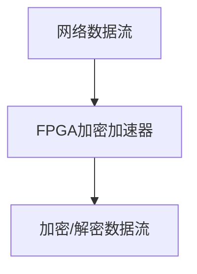
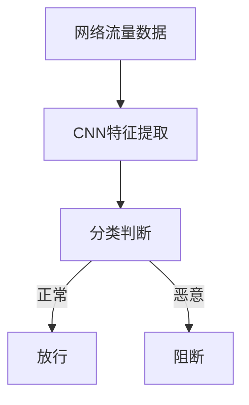

# 新兴硬件防御GhostNet:TPU与FPGA的安全优势

## 1.背景介绍

### 1.1 网络安全威胁的严峻形势

在当今数字时代,网络安全威胁愈加严峻,各种恶意软件、勒索病毒、网络钓鱼等攻击手段层出不穷。其中,一种名为GhostNet的网络间谍活动尤为引人注目。GhostNet是一个由不明身份的黑客组织所控制的庞大僵尸网络,通过植入恶意代码远程控制受害者计算机,窃取敏感数据和监视用户行为。它曾感染过全球103个国家和地区的数千台计算机系统,包括政府机构、大使馆、石油公司等重要目标。

### 1.2 传统防御方案的不足

面对如此棘手的网络威胁,传统的软件防御方案如防火墙、入侵检测系统、反病毒软件等已显得力有未逮。这些软件安全措施大多依赖于已知的攻击特征和漏洞特征码,难以应对未知的新型攻击。同时,软件本身也可能存在安全漏洞,被黑客利用实施攻击。因此,亟需探索新型硬件防御技术,为网络系统提供更加可靠的安全保障。

## 2.核心概念与联系

### 2.1 TPU与FPGA简介

#### 2.1.1 TPU(Tensor Processing Unit)

TPU是谷歌开发的专用于机器学习加速的芯片,擅长处理张量(Tensor)计算。它采用定制的矩阵乘法单元,可高效执行深度神经网络中的卷积和矩阵乘法等密集计算。相较于CPU和GPU,TPU在能耗、性能和成本方面具有明显优势,被广泛应用于谷歌的人工智能服务中。

#### 2.1.2 FPGA(Field Programmable Gate Array)

FPGA是一种可编程硬件逻辑器件,由可编程的逻辑单元和可重构的互连资源组成。与专用集成电路(ASIC)不同,FPGA在生产后可通过编程实现不同的逻辑功能。FPGA擅长处理并行计算和位级运算,具有高度灵活性和可重构性,广泛应用于数字信号处理、网络通信等领域。

### 2.2 TPU与FPGA在网络安全中的作用

TPU和FPGA这两种新兴硬件技术在网络安全防御领域展现出巨大潜力:

- **硬件加固**:TPU和FPGA均采用硅芯片实现,不同于软件,其硬件本质决定了更高的可靠性和安全性。即使遭受黑客攻击,也不会像软件那样轻易被植入恶意代码。
- **并行处理能力**:TPU和FPGA擅长并行计算,可高效处理大规模数据流和复杂的加密解密算法,满足网络安全对实时性和吞吐量的苛刻要求。
- **可重构灵活性**:FPGA具有可编程的硬件逻辑,可根据需求动态部署不同的安全算法和协议,快速响应新型攻击。
- **深度学习加速**:TPU可为基于深度学习的网络入侵检测、恶意软件检测等安全应用提供强大的计算加速能力。

TPU和FPGA作为硬件防御层,可与软件防御层形成多重防护体系,全方位提升网络系统的安全性和可靠性。

## 3.核心算法原理具体操作步骤

TPU和FPGA在网络安全防御中可应用多种算法原理,本文重点介绍两种核心算法:基于FPGA的加密算法加速和基于TPU的深度包检测算法。

### 3.1 基于FPGA的加密算法加速

加密算法是网络安全的基石,但由于其复杂的运算过程,在软件实现中往往效率低下。利用FPGA的并行处理能力,可以极大加速加密算法的执行速度。

#### 3.1.1 算法流程

1. 将加密算法通过硬件描述语言(如Verilog或VHDL)描述为硬件电路。
2. 将电路综合并布局布线,生成可在FPGA上实现的配置文件。
3. 将配置文件下载至FPGA芯片,实现硬件加密加速器。
4. 网络数据流经FPGA进行实时加密或解密,大幅提高加密性能。



#### 3.1.2 优化策略

- **并行化**:充分利用FPGA的并行计算资源,将加密算法拆分为多个并行任务同时执行。
- **流水线**:将加密算法划分为多个阶段,构建硬件流水线结构,提高吞吐率。
- **指令级并行**:在算法级别实现指令级并行,多条指令同时执行。
- **查找表**:对于某些算法,使用查找表代替复杂的计算逻辑,提升效率。
- **位级优化**:在位级层面优化关键路径,减小延迟。

通过上述优化手段,FPGA可以比软件实现提速数十甚至数百倍,满足高吞吐量的网络安全场景需求。

### 3.2 基于TPU的深度包检测算法

传统的入侵检测方法大多基于已知特征码匹配,难以发现未知威胁。深度学习技术可以自动从大量网络流量数据中学习特征模式,实现高效的网络入侵检测。

#### 3.2.1 算法原理

1. 构建训练数据集,包含正常和恶意网络流量样本。
2. 使用卷积神经网络(CNN)对网络数据包进行特征提取和模式识别。
3. 对提取的特征进行分类,判断是否为恶意流量。
4. 在TPU上部署训练好的模型,对实时网络流量进行在线检测。



#### 3.2.2 TPU加速策略

- **张量核心**:TPU采用定制的张量核心,可高效执行卷积神经网络中的矩阵乘法和卷积运算。
- **硬件流水线**:TPU内部构建了多级流水线,实现指令级并行,加速神经网络推理。
- **大容量高带宽存储**:TPU配备大容量高带宽存储器,满足深度模型对存储和带宽的大量需求。
- **批量处理**:TPU支持批量处理多个样本,提高吞吐量。
- **量化技术**:通过量化技术压缩模型大小,降低内存占用,提升性能。

借助TPU的强大并行计算能力,可实现实时高吞吐的深度包检测,快速发现和阻断恶意网络流量。

## 4.数学模型和公式详细讲解举例说明

网络安全算法中涉及大量数学模型和公式,本节将详细讲解两个核心部分:卷积神经网络模型和RSA加密算法公式。

### 4.1 卷积神经网络模型

卷积神经网络(Convolutional Neural Network, CNN)是一种常用于计算机视觉和模式识别的深度学习模型。在网络入侵检测中,CNN可以从原始网络数据包中自动学习特征模式,实现对恶意流量的检测。

CNN模型主要由卷积层(Convolution Layer)和池化层(Pooling Layer)构成。卷积层通过滑动卷积核(Kernel)在输入数据上进行卷积运算,提取局部特征;池化层则对卷积结果进行下采样,降低特征维度。多个卷积层和池化层交替堆叠,可以逐层提取高层次的抽象特征,最终将这些特征输入全连接层(Fully Connected Layer)进行分类。

卷积运算的数学公式如下:

$$
y_{ij} = \sum\limits_{m}\sum\limits_{n}x_{m+i,n+j}w_{mn} + b
$$

其中:
- $x$为输入数据
- $w$为卷积核权重
- $b$为偏置项
- $y$为卷积输出特征图

池化运算通常采用最大池化(Max Pooling)或平均池化(Average Pooling),其公式如下:

最大池化:
$$
y_{ij} = \max\limits_{(m,n)\in R_{ij}}x_{mn}
$$

平均池化:
$$
y_{ij} = \frac{1}{|R_{ij}|}\sum\limits_{(m,n)\in R_{ij}}x_{mn}
$$

其中$R_{ij}$表示池化窗口区域。

通过反向传播算法对CNN模型进行训练,可以自动学习出最优的卷积核权重和偏置,从而提取出有效的特征模式,实现对网络流量的精准分类。

### 4.2 RSA加密算法

RSA是一种广泛应用的非对称加密算法,可用于数据加密、数字签名等多种安全应用场景。FPGA可以高效加速RSA算法,满足高吞吐量的网络安全需求。

RSA算法的数学原理基于一个简单的事实:将两个大质数相乘很容易,但想要对其乘积进行因式分解却极其困难。

加密过程如下:

1. 选择两个不同的大质数$p$和$q$,计算$n=pq$
2. 计算$\varphi(n)=(p-1)(q-1)$
3. 选择一个与$\varphi(n)$互质的整数$e$,作为公钥指数
4. 计算$d$,使得$(d\cdot e)\bmod\varphi(n)=1$,作为私钥指数
5. 公钥为$(n,e)$,私钥为$(n,d)$

加密计算公式:
$$
c = m^e \bmod n
$$

解密计算公式:
$$
m = c^d \bmod n
$$

其中:
- $m$为明文
- $c$为密文
- $e$为公钥指数
- $d$为私钥指数
- $n$为两个质数的乘积

RSA算法的安全性依赖于大整数的因式分解的困难性。选择足够大的质数(如1024位或更高),可以使得暴力破解变得极其困难。FPGA可以通过硬件加速大数模运算等关键步骤,实现高效的RSA加解密,为网络通信提供可靠的保护。

## 5.项目实践:代码实例和详细解释说明

为了更好地理解TPU和FPGA在网络安全中的应用,本节将提供两个实际项目的代码示例和详细解释。

### 5.1 基于FPGA的AES加密加速器

AES(Advanced Encryption Standard)是一种广泛使用的对称加密算法。下面是使用Verilog HDL在FPGA上实现AES加速器的代码示例:

```verilog
module aes_accelerator(
    input clk,
    input rst,
    input [127:0] plaintext,
    input [127:0] key,
    output [127:0] ciphertext,
    output done
);

    // AES核心模块
    aes_core core(
        .clk(clk),
        .rst(rst),
        .plaintext(plaintext),
        .key(key),
        .ciphertext(ciphertext),
        .done(done)
    );

endmodule

module aes_core(
    input clk,
    input rst,
    input [127:0] plaintext,
    input [127:0] key,
    output [127:0] ciphertext,
    output done
);

    // 状态寄存器
    reg [127:0] state;
    reg [127:0] round_key;

    // AES轮函数
    function [127:0] round(input [127:0] data, input [127:0] rkey);
        // ...
    endfunction

    // AES密钥扩展
    function [127:0] key_expansion(input [127:0] key, input [7:0] round);
        // ...
    endfunction

    // AES加密过程
    integer i;
    always @(posedge clk or posedge rst) begin
        if (rst) begin
            state <= 0;
            round_key <= 0;
            done <= 0;
        end else begin
            state <= plaintext;
            round_key <= key;
            for (i = 0; i < 10; i = i + 1) begin
                state <= round(state, round_key);
                round_key <= key_expansion(key, i);
            end
            ciphertext <= state;
            done <= 1;
        end
    end

endmodule
```

上述代码实现了一个基于FPGA的AES