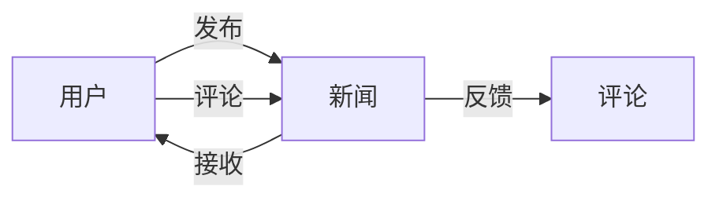

## 1.背景介绍

在信息化社会中，新闻管理系统的需求日益突出。新闻管理系统不仅需要实现新闻的发布、修改、删除等基本功能，还需要具备用户管理、评论管理等复杂功能。本文将详细介绍新闻管理系统的设计与具体代码实现。

## 2.核心概念与联系

新闻管理系统涉及的核心概念包括新闻、用户、评论等。新闻是信息的主体，用户是信息的发布者和接收者，评论是用户对新闻的反馈。这些核心概念之间的联系构成了新闻管理系统的基本框架。



## 3.核心算法原理具体操作步骤

新闻管理系统的核心算法主要涉及新闻的发布、修改、删除、查询等操作。这些操作的具体步骤如下：

1. 发布新闻：用户登录系统后，可以选择发布新闻，输入新闻标题、内容等信息，点击发布按钮，系统将新闻信息存入数据库。
2. 修改新闻：用户可以对已发布的新闻进行修改，修改后的新闻信息将替换原来的信息。
3. 删除新闻：用户可以删除已发布的新闻，系统将从数据库中删除对应的新闻信息。
4. 查询新闻：用户可以通过关键词搜索新闻，系统将从数据库中检索出符合条件的新闻信息。

## 4.数学模型和公式详细讲解举例说明

在新闻管理系统中，我们可以将新闻、用户、评论等核心概念抽象为数学模型。例如，我们可以将新闻抽象为一个元组 $N=(t,c)$，其中 $t$ 表示新闻标题，$c$ 表示新闻内容。用户可以抽象为一个元组 $U=(u,p)$，其中 $u$ 表示用户名，$p$ 表示密码。评论可以抽象为一个元组 $C=(u,n,c)$，其中 $u$ 表示评论用户，$n$ 表示评论的新闻，$c$ 表示评论内容。

## 5.项目实践：代码实例和详细解释说明

下面以 Java 语言为例，简单介绍新闻发布功能的代码实现。

```java
public class News {
    private String title;
    private String content;

    public News(String title, String content) {
        this.title = title;
        this.content = content;
    }

    public void publish() {
        // 将新闻信息存入数据库的代码
    }
}

public class User {
    private String username;
    private String password;

    public User(String username, String password) {
        this.username = username;
        this.password = password;
    }

    public void publishNews(String title, String content) {
        News news = new News(title, content);
        news.publish();
    }
}
```

## 6.实际应用场景

新闻管理系统广泛应用于新闻网站、社区论坛、企业内部信息发布等场景。例如，新浪新闻、知乎、微博等平台都有自己的新闻管理系统。

## 7.工具和资源推荐

开发新闻管理系统推荐使用如下工具和资源：

- 开发语言：Java、Python、JavaScript等
- 开发框架：Spring、Django、Vue.js等
- 数据库：MySQL、PostgreSQL、MongoDB等
- 开发工具：IntelliJ IDEA、PyCharm、Visual Studio Code等
- 学习资源：《Java 编程思想》、《Python 编程：从入门到实践》、《JavaScript 高级程序设计》等

## 8.总结：未来发展趋势与挑战

随着信息化社会的发展，新闻管理系统面临的挑战和发展趋势包括：

- 挑战：如何处理大量的新闻信息，如何保证新闻的真实性，如何保护用户的隐私。
- 发展趋势：新闻管理系统将更加个性化，更加智能化，更加社交化。

## 9.附录：常见问题与解答

Q: 新闻管理系统的核心功能是什么？
A: 新闻管理系统的核心功能是实现新闻的发布、修改、删除、查询等操作。

Q: 如何保证新闻管理系统的安全性？
A: 可以通过用户认证、权限控制、数据加密等方式保证新闻管理系统的安全性。

Q: 如何提高新闻管理系统的性能？
A: 可以通过数据库优化、缓存技术、负载均衡等方式提高新闻管理系统的性能。

作者：禅与计算机程序设计艺术 / Zen and the Art of Computer Programming