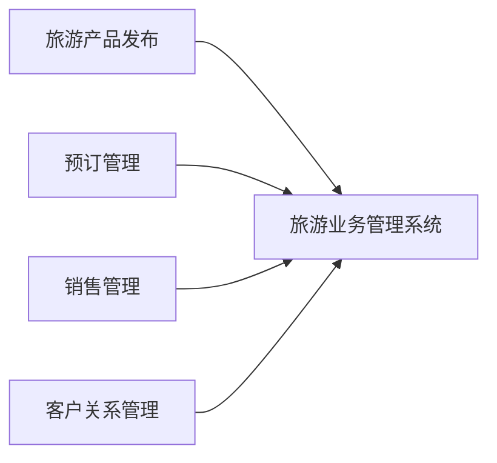

## 1.背景介绍

在当今的信息化时代，旅游业作为全球最大的产业之一，已经逐渐从传统的人工服务模式转向现代的信息化、智能化服务模式。在这个过程中，旅游业务管理系统作为一种信息化管理工具，为旅游业的信息化建设提供了强有力的支持。本文将深入探讨旅游业务管理系统的详细设计与具体代码实现。

## 2.核心概念与联系

旅游业务管理系统是一个涵盖了旅游业务运营的各个环节，包括旅游产品的发布、预订、销售、客户关系管理等功能的综合性信息管理系统。



## 3.核心算法原理具体操作步骤

在旅游业务管理系统中，涉及到的核心算法主要有两个：旅游产品推荐算法和旅游产品价格优化算法。

1. 旅游产品推荐算法：此算法主要利用用户的历史行为数据，通过协同过滤算法，为用户推荐他可能感兴趣的旅游产品。

2. 旅游产品价格优化算法：此算法主要利用历史销售数据，通过数据挖掘和机器学习技术，预测旅游产品的未来销售情况，从而优化旅游产品的价格。

## 4.数学模型和公式详细讲解举例说明

1. 旅游产品推荐算法：协同过滤算法的数学模型可以用矩阵分解的方式来表示。假设我们有一个用户-产品评分矩阵$R$，我们的目标是找到两个矩阵$P$和$Q$，使得$PQ^T$尽可能接近$R$。这可以用最小化以下目标函数来实现：

$$
min_{P,Q} \sum_{(i,j)\in R} (R_{ij} - P_iQ_j^T)^2 + \lambda(||P_i||^2 + ||Q_j||^2)
$$

2. 旅游产品价格优化算法：我们可以用线性回归模型来预测旅游产品的销售情况。假设我们有$n$个特征$x_1, x_2, ..., x_n$和一个目标变量$y$，我们的目标是找到一组参数$\theta_0, \theta_1, ..., \theta_n$，使得预测值$h_\theta(x)$尽可能接近$y$。这可以用最小化以下目标函数来实现：

$$
min_\theta \frac{1}{2m}\sum_{i=1}^{m}(h_\theta(x^{(i)})-y^{(i)})^2 + \lambda\sum_{j=1}^{n}\theta_j^2
$$

## 5.项目实践：代码实例和详细解释说明

以下是一个简单的旅游产品推荐算法的Python代码实现：

```python
import numpy as np
from scipy.sparse.linalg import svds

# 用户-产品评分矩阵
R = np.array([
    [5, 3, 0, 1],
    [4, 0, 0, 1],
    [1, 1, 0, 5],
    [1, 0, 0, 4],
    [0, 1, 5, 4],
])

# 矩阵分解
U, sigma, Vt = svds(R, k=2)

# 重构评分矩阵
R_hat = np.dot(np.dot(U, np.diag(sigma)), Vt)

print(R_hat)
```

## 6.实际应用场景

旅游业务管理系统在旅游行业的各个环节都有广泛的应用。例如，在旅游产品的发布环节，可以通过系统发布旅游产品信息，包括产品的价格、行程、服务等内容；在预订管理环节，可以通过系统进行旅游产品的预订管理，包括预订的查询、修改、取消等操作；在销售管理环节，可以通过系统进行旅游产品的销售管理，包括销售的查询、统计、分析等操作；在客户关系管理环节，可以通过系统进行客户的信息管理，包括客户的查询、统计、分析等操作。

## 7.工具和资源推荐

以下是一些在设计和实现旅游业务管理系统时可能会用到的工具和资源：

1. Python：Python是一种广泛用于数据分析和机器学习的编程语言，有丰富的库和框架支持。

2. Scikit-learn：Scikit-learn是一个用Python编写的机器学习库，提供了许多机器学习算法的实现。

3. MySQL：MySQL是一种关系型数据库管理系统，用于存储和管理旅游业务管理系统的数据。

4. Django：Django是一个用Python编写的开源Web开发框架，可以用于构建旅游业务管理系统的Web界面。

## 8.总结：未来发展趋势与挑战

随着信息化和智能化技术的发展，旅游业务管理系统将面临更多的发展机遇和挑战。一方面，新的技术如大数据、人工智能、区块链等将为旅游业务管理系统提供更多的可能性；另一方面，如何保护用户隐私、如何提高系统的安全性、如何提高系统的易用性等问题也将成为旅游业务管理系统面临的挑战。

## 9.附录：常见问题与解答

以下是一些关于旅游业务管理系统的常见问题和解答：

1. 问题：旅游业务管理系统的主要功能是什么？
   答：旅游业务管理系统的主要功能包括旅游产品的发布、预订、销售、客户关系管理等。

2. 问题：旅游业务管理系统中的旅游产品推荐算法是如何工作的？
   答：旅游产品推荐算法主要利用用户的历史行为数据，通过协同过滤算法，为用户推荐他可能感兴趣的旅游产品。

3. 问题：旅游业务管理系统中的旅游产品价格优化算法是如何工作的？
   答：旅游产品价格优化算法主要利用历史销售数据，通过数据挖掘和机器学习技术，预测旅游产品的未来销售情况，从而优化旅游产品的价格。

作者：禅与计算机程序设计艺术 / Zen and the Art of Computer Programming