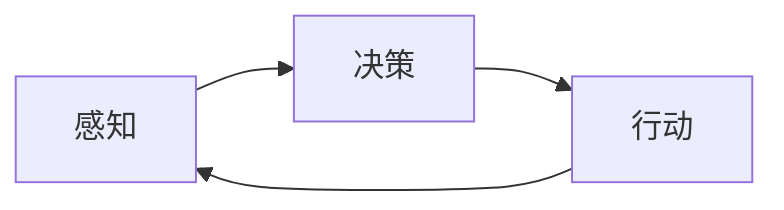

# 智能体 (Agent)

## 1. 背景介绍

在人工智能领域中,智能体(Agent)是一个非常重要且基础的概念。它是一个能够感知环境,并根据感知结果采取行动,从而实现预定目标的自主实体。随着人工智能技术的不断发展,智能体已经被广泛应用于各个领域,如自动驾驶、智能助理、推荐系统等。深入理解智能体的概念、原理和应用,对于我们掌握人工智能核心技术和把握未来发展趋势至关重要。

本文将从智能体的定义出发,系统地介绍智能体的核心概念、工作原理、关键算法、数学模型,并通过代码实例和应用场景的剖析,帮助读者全面深入地理解智能体技术。最后,我们还将展望智能体技术的发展趋势和面临的挑战。

## 2. 核心概念与联系

### 2.1 智能体的定义

智能体是一个能够感知环境并采取行动的自主实体。它具有以下关键特征:

- 自主性:智能体能够根据自身的感知和决策,自主地采取行动,而不需要人工的直接控制。
- 社会性:智能体能够与环境中的其他智能体进行交互和协作,共同完成任务。
- 反应性:智能体能够及时地感知环境的变化,并做出相应的反应。
- 主动性:智能体不仅能够被动地响应环境,还能够主动地执行任务,追求自身的目标。

### 2.2 智能体与环境

智能体总是存在于特定的环境中。环境为智能体提供了感知信息,同时也受到智能体行为的影响。智能体与环境之间存在着持续的交互:智能体感知环境状态,基于决策采取行动,行动的结果又反馈到环境中,进而影响智能体后续的感知和决策。

### 2.3 感知、决策与行动

智能体的工作流程可以概括为"感知-决策-行动"循环:

- 感知:智能体通过传感器获取环境的状态信息,如图像、文本、数值等。
- 决策:智能体基于感知信息和自身的知识,通过决策算法(如强化学习)来选择最优的行动策略。
- 行动:智能体执行决策的结果,通过执行器(如电机、语音合成器等)对环境产生影响。

下图展示了智能体的工作流程:



## 3. 核心算法原理

### 3.1 强化学习

强化学习是智能体的核心算法之一。它旨在让智能体通过与环境的交互,学习到最优的行为策略,从而获得最大的累积奖励。强化学习的基本要素包括:

- 状态(State):环境的当前状况,通常用特征向量表示。
- 行动(Action):智能体在某个状态下可以采取的动作。
- 奖励(Reward):环境对智能体行为的即时反馈,用数值表示。
- 策略(Policy):智能体的决策函数,将状态映射为行动的概率分布。
- 价值函数(Value Function):衡量某个状态或状态-行动对的长期累积奖励。

强化学习的目标是找到最优策略 $\pi^*$,使得智能体能够获得最大的期望累积奖励:

$$\pi^* = \arg\max_\pi \mathbb{E}\left[\sum_{t=0}^{\infty} \gamma^t r_t | \pi \right]$$

其中,$r_t$ 表示在时刻 $t$ 获得的奖励,$\gamma \in [0,1]$ 是折扣因子,用于平衡当前和未来奖励的重要性。

常见的强化学习算法包括:

- Q-Learning:基于价值函数的无模型算法,通过迭代更新状态-行动值函数 $Q(s,a)$ 来逼近最优策略。
- SARSA:与Q-Learning类似,但考虑了实际执行的行动序列,而非贪心策略。
- Policy Gradient:基于策略梯度的有模型算法,直接对策略函数的参数进行梯度上升,以提高期望回报。
- Actor-Critic:结合了价值函数和策略梯度,同时学习价值函数(Critic)和策略函数(Actor)。

### 3.2 基于模型的规划

除了强化学习,智能体还可以使用基于模型的规划方法来做决策。这需要智能体拥有环境的转移模型和奖励模型,即知道在某个状态下采取特定行动后,环境将如何转移到下一个状态,并且能够预测即时奖励。

有了环境模型后,智能体可以通过前瞻性地模拟和评估可能的行动序列,来选择最优决策。常见的基于模型的规划算法包括:

- 动态规划:将原问题分解为重叠子问题,通过递归或迭代的方式,自底向上地求解最优决策。
- 蒙特卡洛树搜索(MCTS):通过随机采样和仿真,不断拓展和评估搜索树,渐进式地逼近最优决策。

## 4. 数学模型

### 4.1 马尔可夫决策过程(MDP)

马尔可夫决策过程是对智能体与环境交互的数学抽象。一个MDP由以下元素组成:

- 状态空间 $\mathcal{S}$:所有可能的环境状态的集合。
- 行动空间 $\mathcal{A}$:智能体在每个状态下可以采取的行动的集合。
- 转移概率 $\mathcal{P}(s'|s,a)$:在状态 $s$ 下采取行动 $a$ 后,环境转移到状态 $s'$ 的概率。
- 奖励函数 $\mathcal{R}(s,a)$:在状态 $s$ 下采取行动 $a$ 后,智能体获得的即时奖励。
- 折扣因子 $\gamma \in [0,1]$:用于平衡当前和未来奖励的相对重要性。

MDP的目标是寻找一个最优策略 $\pi^*: \mathcal{S} \rightarrow \mathcal{A}$,使得智能体在所有状态下的期望累积奖励达到最大:

$$V^{\pi}(s) = \mathbb{E}\left[\sum_{t=0}^{\infty} \gamma^t r_t | s_0=s, \pi \right]$$

$$\pi^* = \arg\max_{\pi} V^{\pi}(s), \forall s \in \mathcal{S}$$

求解MDP的经典算法包括价值迭代(Value Iteration)和策略迭代(Policy Iteration)。

### 4.2 部分可观测马尔可夫决策过程(POMDP)

在很多实际应用中,智能体无法直接观测到环境的完整状态,而只能获得部分可观测信息。这种情况下,环境可以用部分可观测马尔可夫决策过程(POMDP)来建模。

除了MDP的基本要素外,POMDP还引入了:

- 观测空间 $\mathcal{O}$:智能体可能获得的所有观测的集合。
- 观测概率 $\mathcal{Z}(o|s,a)$:在状态 $s$ 下采取行动 $a$ 后,智能体获得观测 $o$ 的概率。

在POMDP中,智能体需要根据历史观测和行动的序列来维护一个关于当前状态的信念分布(Belief),并基于信念分布来做决策。求解POMDP的算法包括:

- 基于值迭代的算法:如QMDP、PBVI等。
- 基于策略搜索的算法:如PEGASUS、PERSEUS等。
- 基于启发式搜索的算法:如POMCP、DESPOT等。

## 5. 代码实例

下面我们通过一个简单的Python代码实例,来演示如何使用Q-Learning算法训练一个智能体玩悬崖寻路(Cliff Walking)游戏。

在悬崖寻路游戏中,智能体需要在一个网格环境中从起点走到终点,同时避免掉入悬崖。游戏环境如下图所示:

```
+-+-------------+
|S|             |
+-+             |
|               |
|               |
|               |
|               |
|               |
|       G       |
+---------------+
```

其中,'S'表示起点,'G'表示终点,中间的一行'+'表示悬崖。智能体在每个位置可以选择上、下、左、右四个方向移动,如果走出网格边界或掉入悬崖,则游戏结束。

我们使用Q-Learning算法来训练智能体。Q-Learning通过不断更新状态-行动值函数 $Q(s,a)$ 来逼近最优策略。其更新公式为:

$$Q(s_t,a_t) \leftarrow Q(s_t,a_t) + \alpha \left[r_{t+1} + \gamma \max_a Q(s_{t+1},a) - Q(s_t,a_t)\right]$$

其中,$\alpha$ 是学习率,$\gamma$ 是折扣因子。

下面是Python代码实现:

```python
import numpy as np

# 定义悬崖寻路环境
class CliffWalking:
    def __init__(self, width=12, height=4):
        self.width = width
        self.height = height
        self.action_space = ['u', 'd', 'l', 'r']
        self.reset()

    def reset(self):
        self.pos = (self.height-1, 0)
        return self.pos
    
    def step(self, action):
        i, j = self.pos
        if action == 'u':
            i = max(i-1, 0)
        elif action == 'd':
            i = min(i+1, self.height-1)
        elif action == 'l':
            j = max(j-1, 0)
        elif action == 'r':
            j = min(j+1, self.width-1)
        
        self.pos = (i, j)
        
        if i == self.height-1 and j > 0 and j < self.width-1:
            reward = -100
            done = True
        elif (i, j) == (self.height-1, self.width-1):
            reward = 0
            done = True
        else:
            reward = -1
            done = False
        
        return self.pos, reward, done

# 定义Q-Learning智能体
class QLearningAgent:
    def __init__(self, env, alpha=0.5, gamma=0.99, epsilon=0.1):
        self.env = env
        self.alpha = alpha
        self.gamma = gamma
        self.epsilon = epsilon
        self.Q = np.zeros((env.height, env.width, len(env.action_space)))
    
    def choose_action(self, state):
        if np.random.uniform() < self.epsilon:
            action = np.random.choice(self.env.action_space)
        else:
            action = self.env.action_space[np.argmax(self.Q[state])]
        return action
    
    def learn(self, state, action, reward, next_state, done):
        action_index = self.env.action_space.index(action)
        q_target = reward + self.gamma * np.max(self.Q[next_state]) * (1-done)
        self.Q[state][action_index] += self.alpha * (q_target - self.Q[state][action_index])

# 训练Q-Learning智能体
env = CliffWalking()
agent = QLearningAgent(env)

num_episodes = 500
for episode in range(num_episodes):
    state = env.reset()
    done = False
    while not done:
        action = agent.choose_action(state)
        next_state, reward, done = env.step(action)
        agent.learn(state, action, reward, next_state, done)
        state = next_state

# 测试智能体
state = env.reset()
done = False
while not done:
    action = agent.env.action_space[np.argmax(agent.Q[state])]
    next_state, reward, done = env.step(action)
    print(f"State: {state}, Action: {action}, Reward: {reward}")
    state = next_state
```

在训练阶段,我们让智能体与环境进行500轮交互,不断更新Q值函数。在测试阶段,我们让智能体根据学到的Q值函数来选择动作,可以看到智能体能够成功地避开悬崖,从起点走到终点。

## 6. 实际应用

智能体技术已经在许多领域得到了广泛应用,下面列举几个典型场景:

### 6.1 自动驾驶

自动驾驶汽车可以看作一个智能体,它需要通过传感器(如摄像头、雷达等)感知道路环境,并根据感知信息规划行驶路径和控制车辆。自动驾驶系统通常使用深度强化学习、逆强化学习等算法来训练驾驶策略,使得汽车能够在复杂多变的道路环境中安全、高效地行驶。

### 6.2 智能助