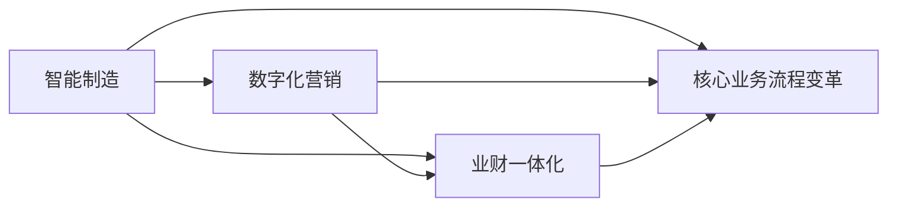

# 智能制造，数字化营销，业财一体化，核心业务流程变革（IPD LTC等）

## 1. 背景介绍
### 1.1 智能制造的兴起
#### 1.1.1 工业4.0时代的到来
#### 1.1.2 智能制造的定义与内涵  
#### 1.1.3 智能制造的发展现状

### 1.2 数字化营销的重要性
#### 1.2.1 互联网时代消费者行为的变化
#### 1.2.2 数字化营销的优势
#### 1.2.3 数字化营销的发展趋势

### 1.3 业财一体化的必要性
#### 1.3.1 传统业务与财务割裂的弊端
#### 1.3.2 业财一体化的内涵
#### 1.3.3 业财一体化的价值

### 1.4 核心业务流程变革的驱动力
#### 1.4.1 市场环境的快速变化
#### 1.4.2 新技术的不断涌现
#### 1.4.3 企业转型升级的需求

## 2. 核心概念与联系
### 2.1 智能制造的核心概念
#### 2.1.1 数字化
#### 2.1.2 网络化
#### 2.1.3 智能化

### 2.2 数字化营销的核心概念
#### 2.2.1 精准营销
#### 2.2.2 内容营销
#### 2.2.3 社交媒体营销

### 2.3 业财一体化的核心概念
#### 2.3.1 业务与财务的融合 
#### 2.3.2 实时数据共享
#### 2.3.3 全面预算管理

### 2.4 核心业务流程变革的核心概念
#### 2.4.1 IPD (集成产品开发)
#### 2.4.2 LTC (引领时间竞争)
#### 2.4.3 敏捷开发

### 2.5 四者之间的内在联系


## 3. 核心算法原理具体操作步骤
### 3.1 智能制造中的核心算法
#### 3.1.1 机器学习算法
##### 3.1.1.1 监督学习
##### 3.1.1.2 无监督学习
##### 3.1.1.3 强化学习
#### 3.1.2 深度学习算法
##### 3.1.2.1 卷积神经网络(CNN)
##### 3.1.2.2 循环神经网络(RNN)
##### 3.1.2.3 生成对抗网络(GAN)

### 3.2 数字化营销中的核心算法
#### 3.2.1 推荐算法
##### 3.2.1.1 协同过滤
##### 3.2.1.2 基于内容的推荐
##### 3.2.1.3 混合推荐
#### 3.2.2 自然语言处理算法
##### 3.2.2.1 文本分类
##### 3.2.2.2 情感分析
##### 3.2.2.3 命名实体识别

### 3.3 业财一体化中的核心算法
#### 3.3.1 预测算法
##### 3.3.1.1 时间序列预测
##### 3.3.1.2 回归分析
##### 3.3.1.3 神经网络预测
#### 3.3.2 优化算法
##### 3.3.2.1 线性规划
##### 3.3.2.2 整数规划
##### 3.3.2.3 动态规划

### 3.4 核心业务流程变革中的核心算法
#### 3.4.1 流程挖掘算法
##### 3.4.1.1 Alpha算法
##### 3.4.1.2 启发式挖掘算法
##### 3.4.1.3 遗传算法
#### 3.4.2 流程优化算法
##### 3.4.2.1 模拟退火算法
##### 3.4.2.2 蚁群算法
##### 3.4.2.3 粒子群优化算法

## 4. 数学模型和公式详细讲解举例说明
### 4.1 智能制造中的数学模型
#### 4.1.1 支持向量机(SVM)模型
$$ \min \limits_{w,b} \frac{1}{2}||w||^2 $$
$$ s.t. \quad y_i(w^Tx_i+b) \geq 1, i=1,2,...,n $$
其中，$w$为权重向量，$b$为偏置项，$x_i$为第$i$个样本，$y_i$为$x_i$的类别标签。

#### 4.1.2 卷积神经网络(CNN)模型
$$ x^{l}_{j} = f(\sum_{i \in M_{j}} x^{l-1}_{i} * k^{l}_{ij} + b^{l}_{j}) $$
其中，$l$表示当前层，$j$表示当前层的第$j$个特征图，$i$表示上一层的第$i$个特征图，$M_j$表示与当前特征图连接的上一层的特征图集合，$k$为卷积核，$b$为偏置项，$f$为激活函数，$*$表示卷积操作。

### 4.2 数字化营销中的数学模型
#### 4.2.1 协同过滤模型
$$ \hat{r}_{ui} = \bar{r}_u + \frac{\sum\limits_{v \in N^k_i(u)} s_{uv}(r_{vi} - \bar{r}_v)}{\sum\limits_{v \in N^k_i(u)} |s_{uv}|} $$
其中，$\hat{r}_{ui}$表示预测用户$u$对物品$i$的评分，$\bar{r}_u$表示用户$u$的平均评分，$N^k_i(u)$表示与用户$u$相似的$k$个用户中对物品$i$有评分的用户集合，$s_{uv}$表示用户$u$和用户$v$的相似度，$r_{vi}$表示用户$v$对物品$i$的实际评分，$\bar{r}_v$表示用户$v$的平均评分。

#### 4.2.2 潜在语义分析(LSA)模型
$$ X = USV^T $$
其中，$X$为文档-词项矩阵，$U$为文档-话题矩阵，$S$为奇异值矩阵，$V$为词项-话题矩阵。LSA通过对$X$进行奇异值分解(SVD)，得到文档和词项在潜在语义空间中的表示。

### 4.3 业财一体化中的数学模型
#### 4.3.1 时间序列预测模型
$$ y_t = \mu + \sum_{i=1}^p \phi_i y_{t-i} + \varepsilon_t $$
其中，$y_t$为时间$t$的观测值，$\mu$为常数项，$p$为自回归阶数，$\phi_i$为自回归系数，$\varepsilon_t$为时间$t$的随机误差。

#### 4.3.2 线性规划模型
$$ \max \quad z = \sum_{j=1}^n c_j x_j $$
$$ s.t. \quad \sum_{j=1}^n a_{ij} x_j \leq b_i, i=1,2,...,m $$
$$ x_j \geq 0, j=1,2,...,n $$
其中，$z$为目标函数，$c_j$为决策变量$x_j$的系数，$a_{ij}$为约束条件中$x_j$的系数，$b_i$为约束条件的右端常数。

### 4.4 核心业务流程变革中的数学模型
#### 4.4.1 Petri网模型
Petri网是一种用于建模和分析离散事件动态系统的数学工具。一个Petri网可以表示为一个五元组：
$$ PN = (P, T, F, W, M_0) $$
其中，$P$为库所集合，$T$为变迁集合，$F \subseteq (P \times T) \cup (T \times P)$为有向弧集合，$W: F \rightarrow N^+$为弧权函数，$M_0: P \rightarrow N$为初始标识。

#### 4.4.2 业务流程执行语言(BPEL)模型
BPEL是一种基于XML的标准语言，用于定义业务流程的编排和执行。BPEL模型可以表示为一个有向无环图(DAG)：
$$ G = (V, E) $$
其中，$V$为活动节点集合，$E$为活动之间的控制流关系集合。活动节点可以是基本活动(如调用服务、接收消息等)，也可以是结构化活动(如顺序、并发、选择等)。

## 5. 项目实践：代码实例和详细解释说明
### 5.1 智能制造中的项目实践
#### 5.1.1 预测性维护系统
```python
import numpy as np
from sklearn.svm import SVR

# 加载历史设备数据
X_train, y_train = load_data('train.csv') 
X_test, y_test = load_data('test.csv')

# 训练支持向量回归模型
model = SVR(kernel='rbf', C=1e3, gamma=0.1)
model.fit(X_train, y_train)

# 预测设备故障
y_pred = model.predict(X_test)

# 评估模型性能
mse = np.mean((y_pred - y_test)**2)
print('Mean Squared Error:', mse)  
```
以上代码使用支持向量回归(SVR)模型对设备的历史数据进行训练，并预测设备未来的故障情况。通过及时的预测性维护，可以大大减少设备的意外停机时间，提高生产效率。

#### 5.1.2 产品质量检测系统
```python
import cv2
import numpy as np
from keras.models import load_model

# 加载训练好的CNN模型
model = load_model('quality_model.h5')

# 读取待检测产品图像
img = cv2.imread('product.jpg') 
img = cv2.resize(img, (224, 224))
img = np.expand_dims(img, axis=0)

# 预测产品质量
pred = model.predict(img)
if pred[0][0] > 0.5:
    print('Good product')
else:
    print('Defective product')
```
以上代码使用卷积神经网络(CNN)模型对产品图像进行质量检测。通过对大量合格品和次品的图像数据进行训练，CNN模型可以自动学习到产品质量的特征，从而实现快速、准确的质量检测，减少人工检测的成本。

### 5.2 数字化营销中的项目实践
#### 5.2.1 个性化推荐系统
```python
import numpy as np
from sklearn.metrics.pairwise import cosine_similarity

# 加载用户-物品评分矩阵
ratings = np.loadtxt('ratings.csv', delimiter=',')

# 计算用户之间的相似度
user_similarity = cosine_similarity(ratings)

# 对目标用户生成推荐
user_id = 123
user_ratings = ratings[user_id]
similar_users = np.argsort(user_similarity[user_id])[::-1][1:6]
for item_id in range(len(user_ratings)):
    if user_ratings[item_id] == 0:
        pred = np.mean(ratings[similar_users, item_id])
        print(f'Item {item_id}: {pred:.2f}')
```
以上代码使用协同过滤算法为目标用户生成个性化推荐。通过计算用户之间的相似度，找到与目标用户口味相近的其他用户，并基于这些用户对物品的历史评分，预测目标用户对未评分物品的喜好程度。个性化推荐可以提高用户的满意度和忠诚度，促进销售转化。

#### 5.2.2 社交媒体情感分析
```python
import nltk
from nltk.sentiment import SentimentIntensityAnalyzer

# 加载训练好的情感分析器
sia = SentimentIntensityAnalyzer()

# 读取社交媒体评论数据
comments = [
    'This product is amazing! I love it!',
    'The service is terrible. I will never buy again.',
    'It's okay, but could be better.',
    ...
]

# 对评论进行情感分析
for comment in comments:
    scores = sia.polarity_scores(comment)
    if scores['compound'] > 0.5:
        print('Positive')
    elif scores['compound'] < -0.5:
        print('Negative') 
    else:
        print('Neutral')
```
以上代码使用NLTK库中的情感强度分析器(SentimentIntensityAnalyzer)对社交媒体评论进行情感分析。通过分析用户在社交媒体上对品牌、产品的评论情感倾向，可以及时了解用户的满意度和口碑，为营销决策提供依据。

### 5.3 业财一体化中的项目实践
#### 5.3.1 销售预测系统
```python
import numpy as np
from statsmodels.tsa.arima.model import ARIMA

# 加载历史销