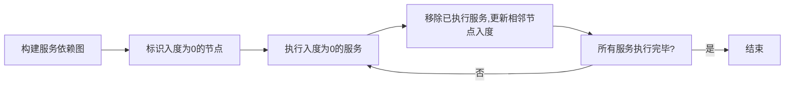
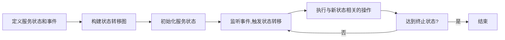
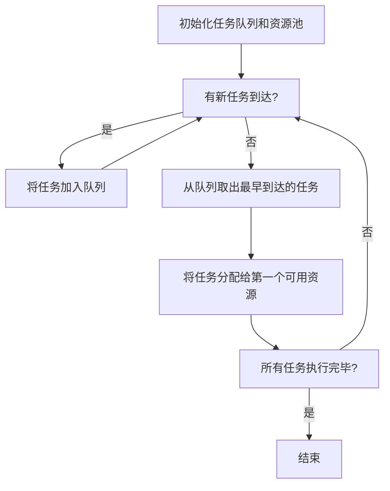
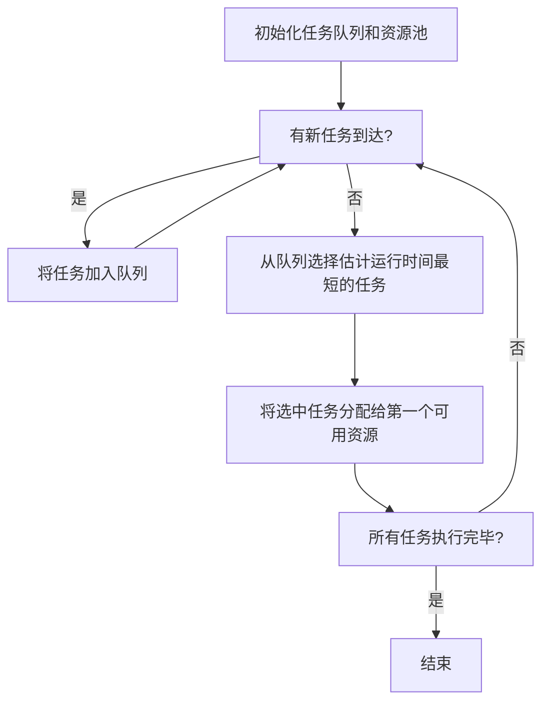

# 服务编排与任务调度原理与代码实战案例讲解

## 1.背景介绍

在现代分布式系统和云计算环境中,服务编排(Service Orchestration)和任务调度(Task Scheduling)扮演着至关重要的角色。随着微服务架构和容器技术的兴起,应用程序被拆分为多个小型、独立的服务,这些服务需要被有效地编排和调度,以确保整个系统的高效运行。

### 1.1 服务编排的重要性

服务编排负责协调和管理多个服务之间的交互和工作流程。它确保服务按照预定义的顺序和逻辑执行,并处理服务之间的依赖关系、故障恢复和并发控制等问题。有效的服务编排可以提高系统的可靠性、可维护性和灵活性。

### 1.2 任务调度的作用

任务调度则负责将计算任务分配到可用的计算资源上执行。它需要考虑资源的可用性、负载均衡、任务优先级、数据局部性等因素,以实现高效的资源利用和任务执行。合理的任务调度策略可以提高系统的吞吐量、响应时间和资源利用率。

## 2.核心概念与联系

### 2.1 服务编排的核心概念

服务编排涉及以下几个核心概念:

1. **工作流(Workflow)**: 定义服务之间的执行顺序和依赖关系。
2. **任务(Task)**: 服务中需要执行的具体操作单元。
3. **服务组合(Service Composition)**: 将多个服务组合成一个复合服务,实现更复杂的业务逻辑。
4. **事件驱动(Event-driven)**: 服务之间通过事件进行通信和协调。
5. **故障恢复(Fault Recovery)**: 处理服务执行过程中的故障和异常情况。

### 2.2 任务调度的核心概念

任务调度涉及以下几个核心概念:

1. **资源管理(Resource Management)**: 跟踪和管理可用的计算资源,如CPU、内存、存储等。
2. **任务队列(Task Queue)**: 存储待执行的任务。
3. **调度策略(Scheduling Policy)**: 决定如何将任务分配给资源,例如先到先服务(FCFS)、最短作业优先(SJF)等。
4. **负载均衡(Load Balancing)**: 将任务均匀分配到不同资源,避免资源过载。
5. **数据局部性(Data Locality)**: 将任务调度到距离所需数据最近的资源,以减少数据传输开销。

服务编排和任务调度密切相关,并且相互影响。服务编排决定了任务的执行顺序和依赖关系,而任务调度则负责将这些任务分配到合适的资源上执行。两者的协同工作对于构建高效、可靠的分布式系统至关重要。

## 3.核心算法原理具体操作步骤

### 3.1 服务编排算法

服务编排算法旨在确定服务之间的执行顺序和依赖关系,以实现预期的业务逻辑。常见的服务编排算法包括:

#### 3.1.1 有向无环图(DAG)算法

DAG算法将服务表示为有向无环图中的节点,边表示服务之间的依赖关系。算法遍历图,确定服务的执行顺序,同时处理并行执行和故障恢复。

DAG算法的具体步骤如下:

1. 构建服务依赖图
2. 标识入度为0的节点(无前置依赖的服务)
3. 执行入度为0的服务
4. 移除已执行服务,更新相邻节点的入度
5. 重复步骤3和4,直到所有服务执行完毕



#### 3.1.2 有限状态机算法

有限状态机算法将服务编排过程建模为有限个状态和状态转移。每个服务对应一个状态,事件触发状态转移,实现服务的执行和协调。

有限状态机算法的具体步骤如下:

1. 定义服务状态和事件
2. 构建状态转移图
3. 初始化服务状态
4. 监听事件,触发状态转移
5. 执行与新状态相关的操作
6. 重复步骤4和5,直到达到终止状态



### 3.2 任务调度算法

任务调度算法旨在将任务合理分配到可用资源上执行,以实现高效的资源利用和任务执行。常见的任务调度算法包括:

#### 3.2.1 先到先服务(FCFS)算法

FCFS算法按照任务到达的顺序将它们分配给可用资源。算法简单,但可能导致资源利用率低下和任务延迟增加。

FCFS算法的具体步骤如下:

1. 初始化任务队列和资源池
2. 当有新任务到达时,将其加入任务队列
3. 从任务队列中取出最早到达的任务
4. 将任务分配给第一个可用资源
5. 重复步骤2到4,直到所有任务执行完毕



#### 3.2.2 最短作业优先(SJF)算法

SJF算法优先执行估计运行时间最短的任务,以减少平均等待时间。但是,它可能导致长任务被无限期推迟执行(饥饿现象)。

SJF算法的具体步骤如下:

1. 初始化任务队列和资源池
2. 当有新任务到达时,将其加入任务队列
3. 从任务队列中选择估计运行时间最短的任务
4. 将选中的任务分配给第一个可用资源
5. 重复步骤2到4,直到所有任务执行完毕



## 4.数学模型和公式详细讲解举例说明

### 4.1 服务编排数学模型

服务编排可以建模为约束满足问题(Constraint Satisfaction Problem, CSP)。CSP由一组变量、每个变量的可取值域和一组约束条件组成。目标是找到一组变量赋值,使所有约束条件都得到满足。

对于服务编排,变量可以表示服务的执行顺序或状态,约束条件则描述服务之间的依赖关系、资源限制等。求解CSP可以得到满足所有约束的服务执行计划。

CSP可以用以下公式表示:

$$
\begin{align}
\text{minimize} \quad & f(x_1, x_2, \ldots, x_n) \\
\text{subject to} \quad & g_i(x_1, x_2, \ldots, x_n) \leq 0, \quad i = 1, 2, \ldots, m \\
& x_j \in D_j, \quad j = 1, 2, \ldots, n
\end{align}
$$

其中:

- $x_1, x_2, \ldots, x_n$ 是决策变量
- $f(x_1, x_2, \ldots, x_n)$ 是目标函数,可以表示服务执行时间、资源利用率等
- $g_i(x_1, x_2, \ldots, x_n) \leq 0$ 是约束条件,如服务依赖关系、资源限制等
- $D_j$ 是变量 $x_j$ 的可取值域

求解CSP可以使用各种约束求解算法,如回溯算法(Backtracking)、约束传播(Constraint Propagation)等。

### 4.2 任务调度数学模型

任务调度问题可以建模为机器调度问题(Machine Scheduling Problem)。给定一组任务和一组机器(资源),目标是找到一种任务到机器的分配方式,优化某些指标,如makespan(完成所有任务的总时间)、平均等待时间等。

机器调度问题可以用以下公式表示:

$$
\begin{align}
\text{minimize} \quad & C_{\max} = \max_{1 \leq j \leq m} C_j \\
\text{subject to} \quad & \sum_{j=1}^m x_{ij} = 1, \quad i = 1, 2, \ldots, n \\
& C_j = \max\left\{0, \max_{1 \leq i \leq n} \{C_i + p_{ij}x_{ij}\}\right\}, \quad j = 1, 2, \ldots, m
\end{align}
$$

其中:

- $C_{\max}$ 是makespan,即完成所有任务的最大完成时间
- $n$ 是任务数量
- $m$ 是机器数量
- $x_{ij}$ 是决策变量,表示任务 $i$ 是否分配给机器 $j$ (1表示分配,0表示不分配)
- $p_{ij}$ 是任务 $i$ 在机器 $j$ 上的执行时间
- $C_j$ 是机器 $j$ 完成所有分配给它的任务的时间

求解机器调度问题可以使用各种启发式算法,如遗传算法(Genetic Algorithm)、模拟退火(Simulated Annealing)等。

## 5.项目实践：代码实例和详细解释说明

### 5.1 服务编排示例

以下是一个使用Python和Apache Airflow实现服务编排的示例。Airflow是一个流行的工作流管理系统,可以定义、调度和监控工作流。

```python
from datetime import datetime, timedelta
from airflow import DAG
from airflow.operators.python_operator import PythonOperator

# 定义任务函数
def task_1():
    print("Task 1 executed")

def task_2():
    print("Task 2 executed")

def task_3():
    print("Task 3 executed")

def task_4():
    print("Task 4 executed")

# 定义默认参数
default_args = {
    'owner': 'airflow',
    'start_date': datetime(2023, 5, 1),
    'retries': 1,
    'retry_delay': timedelta(minutes=5)
}

# 创建DAG
with DAG('service_orchestration', default_args=default_args, schedule_interval=None) as dag:

    # 定义任务
    task_1 = PythonOperator(task_id='task_1', python_callable=task_1)
    task_2 = PythonOperator(task_id='task_2', python_callable=task_2)
    task_3 = PythonOperator(task_id='task_3', python_callable=task_3)
    task_4 = PythonOperator(task_id='task_4', python_callable=task_4)

    # 设置任务依赖关系
    task_1 >> task_2 >> task_4
    task_1 >> task_3 >> task_4
```

在这个示例中,我们定义了四个任务函数 `task_1`、`task_2`、`task_3` 和 `task_4`。然后,我们使用 Airflow 的 `DAG` 对象创建一个名为 `service_orchestration` 的工作流。在工作流中,我们定义了四个 `PythonOperator` 任务,并设置了它们之间的依赖关系。

当执行这个工作流时,Airflow 会根据定义的依赖关系自动调度和执行任务