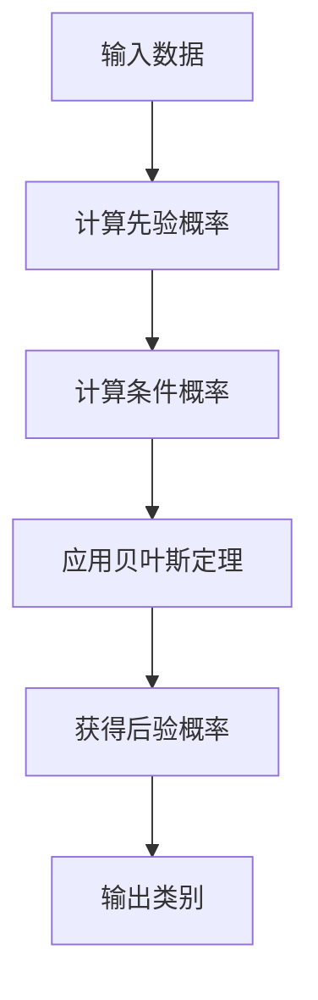

# 朴素贝叶斯(Naive Bayes) - 原理与代码实例讲解

## 1. 背景介绍

### 1.1 什么是朴素贝叶斯

朴素贝叶斯是一种基于贝叶斯定理与特征条件独立假设的简单而有效的监督学习算法。它是机器学习领域最古老、最成熟的分类算法之一,广泛应用于文本分类、垃圾邮件过滤、情感分析等领域。

### 1.2 贝叶斯定理

贝叶斯定理是朴素贝叶斯算法的基础,描述了在给定新证据的条件下,如何调整最初假设的概率。数学表达式如下:

$$P(A|B) = \frac{P(B|A)P(A)}{P(B)}$$

其中:
- $P(A|B)$ 表示在已知 $B$ 发生的情况下,事件 $A$ 发生的条件概率
- $P(B|A)$ 表示在已知 $A$ 发生的情况下,事件 $B$ 发生的条件概率
- $P(A)$ 和 $P(B)$ 分别表示 $A$ 和 $B$ 的先验概率

### 1.3 条件独立性假设

朴素贝叶斯算法基于一个简化假设:给定类别,特征之间相互独立。也就是说,每个特征对于给定的类别来说,都是条件独立的。这个假设虽然在实际情况下往往不成立,但它使得算法变得非常简单且高效。

## 2. 核心概念与联系

### 2.1 先验概率与后验概率

在朴素贝叶斯中,我们需要计算给定数据特征的情况下,不同类别的概率,即后验概率 $P(C|X)$。根据贝叶斯定理,我们可以将其表示为:

$$P(C|X) = \frac{P(X|C)P(C)}{P(X)}$$

其中:
- $P(C|X)$ 是后验概率,即在给定数据特征 $X$ 的情况下,类别 $C$ 的概率
- $P(X|C)$ 是似然,即在给定类别 $C$ 的情况下,观测到数据特征 $X$ 的概率
- $P(C)$ 是类别 $C$ 的先验概率
- $P(X)$ 是证据概率,是一个缩放常数,可以通过对所有可能的类别求和来计算

由于 $P(X)$ 对于所有类别是相同的,因此我们可以忽略它,只需要最大化 $P(X|C)P(C)$ 即可。

### 2.2 条件独立性应用

根据条件独立性假设,我们可以将 $P(X|C)$ 分解为各个特征的乘积:

$$P(X|C) = P(x_1, x_2, ..., x_n|C) = \prod_{i=1}^{n}P(x_i|C)$$

其中 $x_i$ 表示数据特征向量 $X$ 的第 $i$ 个特征。这种分解极大地简化了计算复杂度,使得朴素贝叶斯算法在实践中非常高效。

### 2.3 类别概率计算

对于离散型数据,我们可以通过计数的方式来估计 $P(x_i|C)$ 和 $P(C)$。对于连续型数据,我们通常假设数据服从高斯分布,并使用均值和方差来估计概率密度函数。

## 3. 核心算法原理具体操作步骤

朴素贝叶斯算法的核心步骤如下:



1. **计算先验概率 $P(C)$**

   对于每个类别 $C$,计算其先验概率 $P(C)$,通常使用训练数据中该类别的频率作为估计。

   $$P(C) = \frac{频数(C)}{总样本数}$$

2. **计算条件概率 $P(x_i|C)$**

   对于每个特征 $x_i$ 和每个类别 $C$,计算条件概率 $P(x_i|C)$。对于离散型数据,使用频率估计;对于连续型数据,通常假设服从高斯分布,使用均值和方差估计概率密度函数。

3. **应用贝叶斯定理**

   根据贝叶斯定理和条件独立性假设,计算后验概率:

   $$P(C|X) \propto P(X|C)P(C) = \prod_{i=1}^{n}P(x_i|C)P(C)$$

4. **选择最大后验概率对应的类别**

   对于给定的数据特征向量 $X$,选择使后验概率 $P(C|X)$ 最大的类别 $C$ 作为预测结果。

   $$C_{predicted} = \arg\max_{C} P(C|X)$$

## 4. 数学模型和公式详细讲解举例说明

### 4.1 离散型数据

对于离散型数据,我们可以使用频率估计来计算条件概率 $P(x_i|C)$。具体做法是:

1. 统计训练数据中,每个特征 $x_i$ 在每个类别 $C$ 下出现的频数
2. 将频数除以该类别的总样本数,得到条件概率估计

$$P(x_i|C) = \frac{频数(x_i, C)}{频数(C)}$$

为了避免概率为 0 的情况,通常会使用拉普拉斯平滑(Laplace smoothing)。具体做法是在每个计数上加 1,然后除以总样本数加上特征值的个数。

$$P(x_i|C) = \frac{频数(x_i, C) + 1}{频数(C) + N}$$

其中 $N$ 是特征 $x_i$ 的可能取值个数。

**示例:**
假设我们有一个天气数据集,包含 5 个特征:阳光(Sunny)、多云(Overcast)、雨天(Rain)、高温(Hot)和高湿(Humid),以及两个类别:打球(Play)和不打球(Not Play)。训练数据如下:

| 天气 | 温度 | 湿度 | 打球 |
|------|------|------|------|
| 阳光 | 高温 | 高湿 | 不打球 |
| 阳光 | 高温 | 高湿 | 不打球 |
| 多云 | 高温 | 高湿 | 打球 |
| 雨天 | 温和 | 高湿 | 打球 |
| 雨天 | 冷   | 常规 | 打球 |
| 雨天 | 冷   | 常规 | 不打球 |
| 多云 | 冷   | 常规 | 打球 |
| 阳光 | 温和 | 高湿 | 不打球 |
| 阳光 | 冷   | 常规 | 打球 |
| 雨天 | 温和 | 常规 | 打球 |
| 阳光 | 温和 | 常规 | 打球 |
| 多云 | 温和 | 高湿 | 打球 |
| 多云 | 高温 | 常规 | 打球 |
| 雨天 | 温和 | 高湿 | 不打球 |

我们可以计算出:

- $P(打球) = \frac{9}{14}$
- $P(阳光|打球) = \frac{3}{9}$
- $P(高温|打球) = \frac{2}{9}$
- ...

对于一个新的天气情况,比如阳光、高温和高湿,我们可以计算出:

$$\begin{aligned}
P(打球|阳光, 高温, 高湿) &\propto P(阳光|打球)P(高温|打球)P(高湿|打球)P(打球) \\
                          &= \frac{3}{9} \times \frac{2}{9} \times \frac{4}{9} \times \frac{9}{14} \\
                          &= 0.0156
\end{aligned}$$

$$\begin{aligned}
P(不打球|阳光, 高温, 高湿) &\propto P(阳光|不打球)P(高温|不打球)P(高湿|不打球)P(不打球) \\
                            &= \frac{2}{5} \times \frac{2}{5} \times \frac{3}{5} \times \frac{5}{14} \\
                            &= 0.0429
\end{aligned}$$

由于 $P(不打球|阳光, 高温, 高湿) > P(打球|阳光, 高温, 高湿)$,因此我们预测在这种天气情况下不打球。

### 4.2 连续型数据

对于连续型数据,我们通常假设数据服从高斯分布(正态分布),并使用均值和方差来估计概率密度函数。

对于一个连续型特征 $x_i$ 和类别 $C$,我们可以计算该特征在该类别下的均值 $\mu_{x_i|C}$ 和方差 $\sigma^2_{x_i|C}$。然后,根据高斯分布的概率密度函数计算条件概率:

$$P(x_i|C) = \frac{1}{\sqrt{2\pi\sigma^2_{x_i|C}}} \exp\left(-\frac{(x_i - \mu_{x_i|C})^2}{2\sigma^2_{x_i|C}}\right)$$

**示例:**
假设我们有一个身高和体重数据集,包含两个连续型特征:身高(Height)和体重(Weight),以及两个类别:健康(Healthy)和肥胖(Obese)。训练数据如下:

| 身高(米) | 体重(kg) | 类别 |
|----------|----------|------|
| 1.72     | 65       | 健康 |
| 1.68     | 70       | 健康 |
| 1.80     | 90       | 肥胖 |
| 1.75     | 85       | 肥胖 |
| 1.65     | 60       | 健康 |
| 1.78     | 95       | 肥胖 |

我们可以计算出:

- $\mu_{Height|Healthy} = 1.68$, $\sigma^2_{Height|Healthy} = 0.0013$
- $\mu_{Weight|Healthy} = 65$, $\sigma^2_{Weight|Healthy} = 25$
- $\mu_{Height|Obese} = 1.78$, $\sigma^2_{Height|Obese} = 0.0005$
- $\mu_{Weight|Obese} = 90$, $\sigma^2_{Weight|Obese} = 25$

对于一个新的身高和体重数据,比如身高 1.7 米,体重 80 公斤,我们可以计算出:

$$\begin{aligned}
P(Healthy|Height=1.7, Weight=80) &\propto P(Height=1.7|Healthy)P(Weight=80|Healthy)P(Healthy) \\
                                 &= \frac{1}{\sqrt{2\pi\times0.0013}}\exp\left(-\frac{(1.7-1.68)^2}{2\times0.0013}\right) \\
                                 &\quad \times \frac{1}{\sqrt{2\pi\times25}}\exp\left(-\frac{(80-65)^2}{2\times25}\right) \times P(Healthy)
\end{aligned}$$

$$\begin{aligned}
P(Obese|Height=1.7, Weight=80) &\propto P(Height=1.7|Obese)P(Weight=80|Obese)P(Obese) \\
                               &= \frac{1}{\sqrt{2\pi\times0.0005}}\exp\left(-\frac{(1.7-1.78)^2}{2\times0.0005}\right) \\
                               &\quad \times \frac{1}{\sqrt{2\pi\times25}}\exp\left(-\frac{(80-90)^2}{2\times25}\right) \times P(Obese)
\end{aligned}$$

根据计算结果,我们可以判断该身高和体重更有可能属于哪个类别。

## 5. 项目实践: 代码实例和详细解释说明

下面是一个使用 Python 和 scikit-learn 库实现朴素贝叶斯分类器的示例。我们将使用著名的鸢尾花数据集进行演示。

### 5.1 导入所需库

```python
import numpy as np
from sklearn.datasets import load_iris
from sklearn.model_selection import train_test_split
from sklearn.naive_bayes import GaussianNB
from sklearn.metrics import accuracy_score
```

### 5.2 加载数据集

```python
# 加载鸢尾花数据集
iris = load_iris()
X = iris.data  # 特征数据
y = iris.target  # 类别标签
```

### 5.3 划分训练集和测试集

```python
# 将数据集划