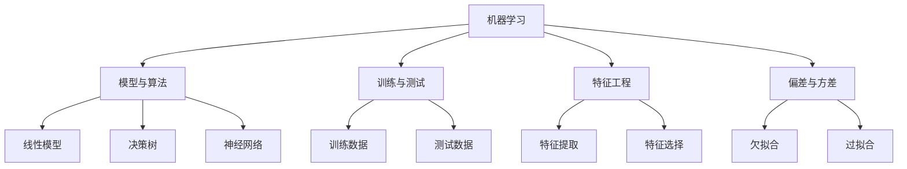

# 机器学习基础原理与代码实战案例讲解

## 1. 背景介绍

机器学习是人工智能领域的一个重要分支,旨在使计算机能够从数据中自动学习并做出预测。随着大数据时代的到来,机器学习技术得到了前所未有的发展和应用。无论是在科技、金融、医疗、零售等行业,机器学习都发挥着越来越重要的作用。

机器学习的核心思想是利用算法从大量数据中发现隐藏的规律和模式,并基于这些规律和模式对未知数据进行预测和决策。与传统的基于规则的编程方式不同,机器学习算法可以自动从数据中学习,无需人工编写复杂的规则。

机器学习技术可以分为三大类:监督学习、无监督学习和强化学习。监督学习是最常见的一种,它利用已标记的训练数据,学习输入和输出之间的映射关系。无监督学习则是从未标记的数据中发现内在结构和模式。强化学习则是通过与环境的交互,学习如何采取最优策略以获得最大回报。

## 2. 核心概念与联系

机器学习中有几个核心概念,理解这些概念对于掌握机器学习原理至关重要。

### 2.1 模型与算法

模型是机器学习的核心,它是对数据中隐藏规律的数学表示。常见的模型包括线性模型、决策树、神经网络等。算法则是用于训练模型的方法,例如线性回归、逻辑回归、支持向量机等。

### 2.2 训练与测试

机器学习算法需要在训练数据上进行训练,以学习数据中的规律。训练完成后,需要在测试数据上评估模型的性能,以防止过拟合。

### 2.3 特征工程

特征工程是机器学习中一个重要环节,它指的是从原始数据中提取有意义的特征,以供模型使用。好的特征可以极大提高模型的性能。

### 2.4 偏差与方差

偏差和方差是衡量模型性能的两个重要指标。偏差过高意味着模型过于简单,无法捕捉数据的复杂性。方差过高则意味着模型过于复杂,容易过拟合。寻求偏差和方差的平衡是机器学习的一个核心挑战。



## 3. 核心算法原理具体操作步骤

机器学习中有许多经典算法,每种算法都有其独特的原理和操作步骤。下面我们以线性回归和逻辑回归为例,介绍它们的核心原理和操作步骤。

### 3.1 线性回归

线性回归是一种常用的监督学习算法,用于解决回归问题。它试图找到一条最佳拟合直线,使得数据点到直线的距离之和最小。

1. **原理**:线性回归假设目标变量 y 和特征变量 X 之间存在线性关系,即 y = Xw + b,其中 w 和 b 是需要学习的参数。
2. **损失函数**:线性回归使用最小二乘法作为损失函数,即 $\min_{w,b} \sum_{i=1}^{n} (y_i - (Xw + b))^2$。
3. **优化方法**:常用的优化方法有梯度下降法、正规方程等。
4. **步骤**:
    1) 准备数据,划分为训练集和测试集。
    2) 初始化参数 w 和 b。
    3) 计算预测值和真实值之间的差距。
    4) 计算损失函数的梯度。
    5) 更新参数 w 和 b。
    6) 重复步骤 3-5,直到收敛。
    7) 在测试集上评估模型性能。

### 3.2 逻辑回归

逻辑回归是一种常用的监督学习算法,用于解决分类问题。它通过对数几率回归模型,将输入映射到 0 到 1 之间的概率值。

1. **原理**:逻辑回归假设目标变量 y 服从伯努利分布,即 $P(y=1|x) = \sigma(w^Tx + b)$,其中 $\sigma$ 是 Sigmoid 函数。
2. **损失函数**:逻辑回归使用交叉熵作为损失函数,即 $\min_{w,b} -\frac{1}{n} \sum_{i=1}^{n} [y_i \log \sigma(w^Tx_i + b) + (1-y_i) \log (1 - \sigma(w^Tx_i + b))]$。
3. **优化方法**:常用的优化方法有梯度下降法、牛顿法等。
4. **步骤**:
    1) 准备数据,划分为训练集和测试集。
    2) 初始化参数 w 和 b。
    3) 计算预测概率和真实标签之间的差距。
    4) 计算损失函数的梯度。
    5) 更新参数 w 和 b。
    6) 重复步骤 3-5,直到收敛。
    7) 在测试集上评估模型性能。

## 4. 数学模型和公式详细讲解举例说明

机器学习算法中涉及到许多数学概念和公式,理解这些公式对于掌握算法原理至关重要。下面我们以线性回归和逻辑回归为例,详细讲解它们的数学模型和公式。

### 4.1 线性回归

线性回归的数学模型如下:

$$y = Xw + b$$

其中:
- $y$ 是目标变量,是一个 $n \times 1$ 的向量。
- $X$ 是特征矩阵,是一个 $n \times m$ 的矩阵,每一行代表一个样本,每一列代表一个特征。
- $w$ 是权重向量,是一个 $m \times 1$ 的向量,表示每个特征的权重。
- $b$ 是偏置项,是一个标量。

线性回归的目标是找到最优的 $w$ 和 $b$,使得预测值 $\hat{y} = Xw + b$ 与真实值 $y$ 之间的差距最小。我们通常使用最小二乘法作为损失函数:

$$J(w, b) = \frac{1}{2n} \sum_{i=1}^{n} (y_i - (Xw + b))^2$$

其中 $n$ 是样本数量。我们可以使用梯度下降法来优化损失函数:

$$w := w - \alpha \frac{\partial J(w, b)}{\partial w}$$
$$b := b - \alpha \frac{\partial J(w, b)}{\partial b}$$

其中 $\alpha$ 是学习率,决定了每次更新的步长。

**示例**:假设我们有一个简单的线性回归问题,目标变量 $y$ 是房价,特征变量 $X$ 是房屋面积。我们可以使用线性回归来拟合房价和面积之间的关系。

假设我们有以下数据:

| 面积 (平方米) | 房价 (万元) |
|----------------|--------------|
| 50             | 30          |
| 100            | 50          |
| 150            | 70          |
| 200            | 90          |

我们可以将数据转换为矩阵形式:

$$X = \begin{bmatrix}
50 \\
100 \\
150 \\
200
\end{bmatrix}, \quad y = \begin{bmatrix}
30 \\
50 \\
70 \\
90
\end{bmatrix}$$

使用梯度下降法训练线性回归模型,假设初始参数为 $w = 0, b = 0$,学习率为 $\alpha = 0.01$,经过多次迭代,我们可以得到最优参数 $w = 0.4, b = 5$。这意味着房价与面积之间的关系可以用公式 $y = 0.4x + 5$ 来近似表示。

### 4.2 逻辑回归

逻辑回归的数学模型如下:

$$P(y=1|x) = \sigma(w^Tx + b)$$

其中:
- $y$ 是目标变量,是一个二元变量,取值为 0 或 1。
- $x$ 是特征向量,是一个 $m \times 1$ 的向量。
- $w$ 是权重向量,是一个 $m \times 1$ 的向量,表示每个特征的权重。
- $b$ 是偏置项,是一个标量。
- $\sigma$ 是 Sigmoid 函数,定义为 $\sigma(z) = \frac{1}{1 + e^{-z}}$。

逻辑回归的目标是找到最优的 $w$ 和 $b$,使得预测概率 $P(y=1|x)$ 与真实标签 $y$ 之间的差距最小。我们通常使用交叉熵作为损失函数:

$$J(w, b) = -\frac{1}{n} \sum_{i=1}^{n} [y_i \log \sigma(w^Tx_i + b) + (1-y_i) \log (1 - \sigma(w^Tx_i + b))]$$

同样,我们可以使用梯度下降法来优化损失函数。

**示例**:假设我们有一个二元分类问题,需要根据学生的考试成绩和家庭收入,预测该生是否能被顶尖大学录取。我们可以使用逻辑回归来建模。

假设我们有以下数据:

| 考试成绩 | 家庭收入 (万元) | 是否被录取 |
|----------|------------------|------------|
| 85       | 10               | 0          |
| 92       | 20               | 1          |
| 78       | 15               | 0          |
| 95       | 30               | 1          |

我们可以将数据转换为矩阵形式:

$$X = \begin{bmatrix}
85 & 10 \\
92 & 20 \\
78 & 15 \\
95 & 30
\end{bmatrix}, \quad y = \begin{bmatrix}
0 \\
1 \\
0 \\
1
\end{bmatrix}$$

使用梯度下降法训练逻辑回归模型,假设初始参数为 $w = [0, 0]^T, b = 0$,学习率为 $\alpha = 0.01$,经过多次迭代,我们可以得到最优参数 $w = [0.1, 0.05]^T, b = -3$。这意味着被录取的概率可以用公式 $P(y=1|x) = \sigma(0.1 \times \text{成绩} + 0.05 \times \text{收入} - 3)$ 来近似表示。

## 5. 项目实践:代码实例和详细解释说明

为了更好地理解机器学习算法的原理和实现,我们将通过实际的代码示例来演示线性回归和逻辑回归的实现过程。

### 5.1 线性回归实现

我们将使用 Python 和 Scikit-learn 库来实现线性回归。以下是一个简单的示例:

```python
import numpy as np
from sklearn.linear_model import LinearRegression

# 准备数据
X = np.array([[1], [2], [3], [4], [5]])
y = np.array([2, 4, 6, 8, 10])

# 创建线性回归模型
model = LinearRegression()

# 训练模型
model.fit(X, y)

# 预测
X_new = np.array([[3], [4], [5]])
y_pred = model.predict(X_new)

print(f"预测值: {y_pred}")
```

在这个示例中,我们首先准备了一些简单的训练数据 `X` 和 `y`。然后,我们创建了一个 `LinearRegression` 对象,并使用 `fit` 方法在训练数据上训练模型。最后,我们使用 `predict` 方法对新的输入数据 `X_new` 进行预测。

输出结果如下:

```
预测值: [ 6.  8. 10.]
```

这个简单的示例展示了如何使用 Scikit-learn 库来实现线性回归。在实际应用中,我们通常需要处理更复杂的数据,并进行特征工程和模型评估等步骤。

### 5.2 逻辑回归实现

接下来,我们将使用 Python 和 Scikit-learn 库来实现逻辑回归。以下是一个简单的示例:

```python
import numpy as np