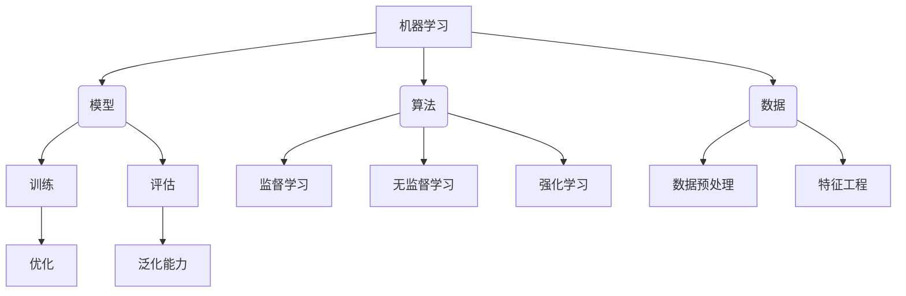

# 机器学习算法原理与代码实战案例讲解

## 1.背景介绍

机器学习是人工智能领域的一个重要分支,它赋予计算机系统从数据中自主学习和改进的能力,而无需显式编程。随着大数据时代的到来和计算能力的不断提升,机器学习技术得到了前所未有的发展和广泛应用。

机器学习算法可以从海量数据中发现隐藏的模式和规律,并基于这些规律对未知数据进行预测和决策。这种数据驱动的方法已经渗透到了科学研究、工业生产、金融服务、医疗保健等各个领域,为人类生产生活带来了巨大变革。

### 机器学习的发展历程

- 1950年,图灵提出"机器能思考吗?"这个著名的问题,奠定了人工智能研究的基础。
- 1959年,阿瑟·萨缪尔在IBM公司开发出了一款西洋棋程序,这被认为是机器学习的开端。
- 1967年,最近邻算法被正式提出,标志着机器学习理论的初步形成。
- 1986年,反向传播算法的提出,推动了神经网络的发展。
- 1997年,支持向量机算法的提出,成为监督学习领域的一个重要突破。
- 2006年,深度学习概念的提出,促进了神经网络技术的飞速发展。
- 2012年,深度神经网络在图像识别领域取得突破性成果,掀起了机器学习的新高潮。

### 机器学习的重要性

机器学习技术正在改变着人类的生产和生活方式,它的重要性主要体现在以下几个方面:

1. 数据处理能力强大,可以从海量数据中发现隐藏的规律和模式。
2. 自动化决策能力,可以替代人工进行复杂的决策和预测。
3. 持续学习和优化能力,可以根据新数据不断改进模型性能。
4. 跨领域应用广泛,如计算机视觉、自然语言处理、推荐系统等。
5. 促进人工智能技术发展,是实现通用人工智能的关键一步。

## 2.核心概念与联系

机器学习涉及了多个核心概念,这些概念相互关联、环环相扣,构成了机器学习的理论基础和技术框架。

### 模型

模型是机器学习的核心,它是对现实世界的数学抽象和概括。常见的模型有线性回归、逻辑回归、决策树、支持向量机、神经网络等。模型通过训练数据来学习,并在评估阶段对新数据进行预测或决策。

### 算法

算法是机器学习的"发动机",它提供了模型训练和优化的具体方法。常见的算法有梯度下降、随机梯度下降、贝叶斯方法、聚类算法等。算法可以分为监督学习、无监督学习和强化学习三大类。

### 数据

数据是机器学习的基础,模型和算法都依赖于高质量的数据。数据预处理和特征工程是数据准备的重要环节,直接影响模型的性能和泛化能力。

### 训练

训练是模型学习的过程,通过优化算法不断调整模型参数,使模型在训练数据上的性能达到最优。训练的目标是找到一个能很好地拟合训练数据的模型。

### 评估

评估是检验模型性能的关键步骤,通过一些评估指标(如准确率、召回率、F1分数等)来衡量模型在测试数据上的表现,评估模型的泛化能力。

### 优化

优化是提高模型性能的重要手段,包括调整模型结构、选择合适的优化算法、设置合理的超参数等。优化的目标是找到一个在训练数据和测试数据上都表现良好的模型。

上述概念相互关联、相辅相成,构成了机器学习的完整技术体系。掌握这些核心概念及其内在联系,是深入理解和应用机器学习算法的基础。

## 3.核心算法原理具体操作步骤

机器学习算法的原理和操作步骤是实现模型训练和预测的关键。本节将介绍几种常用算法的核心思想和具体实现过程。

### 线性回归

线性回归是一种基本的监督学习算法,它试图找到一个最佳拟合的线性方程来描述自变量和因变量之间的关系。

#### 原理

线性回归的目标是最小化预测值和实际值之间的均方误差:

$$J(\theta) = \frac{1}{2m}\sum_{i=1}^m(h_\theta(x^{(i)}) - y^{(i)})^2$$

其中 $h_\theta(x) = \theta_0 + \theta_1x_1 + \theta_2x_2 + ... + \theta_nx_n$ 是线性模型, $\theta$ 是需要学习的参数。

通过梯度下降算法不断更新参数 $\theta$,直到找到最小化损失函数 $J(\theta)$ 的参数值。

#### 操作步骤

1. 准备数据,进行归一化处理。
2. 初始化模型参数 $\theta$ 为0或随机值。
3. 计算当前模型在训练数据上的预测值和损失函数值。
4. 计算损失函数关于每个参数的偏导数(梯度)。
5. 根据学习率 $\alpha$ 和梯度,更新参数 $\theta$。
6. 重复步骤3-5,直到收敛或达到最大迭代次数。
7. 使用训练好的模型对新数据进行预测。

### 逻辑回归

逻辑回归是一种常用的分类算法,它可以处理二分类和多分类问题。

#### 原理

逻辑回归使用 Sigmoid 函数将线性回归的输出值映射到 (0,1) 区间,作为样本属于正例的概率估计。

$$h_\theta(x) = \frac{1}{1 + e^{-\theta^Tx}}$$

其中 $\theta$ 是需要学习的参数向量。

通过最大似然估计的方法,求解能够最大化似然函数的参数 $\theta$。

#### 操作步骤

1. 准备数据,进行特征缩放。
2. 初始化模型参数 $\theta$ 为0或随机值。
3. 计算当前模型在训练数据上的预测概率和损失函数(交叉熵损失)。
4. 计算损失函数关于每个参数的偏导数(梯度)。
5. 根据学习率 $\alpha$ 和梯度,更新参数 $\theta$。
6. 重复步骤3-5,直到收敛或达到最大迭代次数。
7. 使用训练好的模型对新数据进行分类预测。

### 决策树

决策树是一种常用的监督学习算法,它可以用于分类和回归任务。决策树通过递归地构建决策规则,将数据空间划分为互不相交的区域。

#### 原理

决策树的构建过程是一个递归的过程,每次选择一个最优特征,根据该特征的不同取值将数据集划分为多个子集,继续在子集上重复构建决策树节点的过程,直到满足停止条件。

常用的决策树构建算法有 ID3、C4.5 和 CART 等。它们的核心思想是基于信息增益或基尼指数等指标,选择最优特征进行数据集划分。

#### 操作步骤

1. 准备数据,处理缺失值等。
2. 计算每个特征的信息增益或基尼指数。
3. 选择最优特征,根据该特征的取值将数据集划分为子集。
4. 对每个子集,重复步骤2-3,构建决策树的子节点。
5. 直到满足停止条件(如子集中样本属于同一类别、没有剩余特征可供划分或达到最大深度等)。
6. 对决策树进行剪枝,防止过拟合。
7. 使用构建好的决策树对新数据进行分类或回归预测。

### 支持向量机

支持向量机(SVM)是一种有监督的机器学习算法,常用于分类和回归任务。它的基本思想是在高维空间中构建一个超平面,将不同类别的样本分开,且分隔超平面与最近样本点的距离最大化。

#### 原理

SVM 将输入空间映射到高维特征空间,在该空间中寻找一个最大间隔超平面将不同类别的样本分开。这个超平面由少数支持向量确定,其余样本点对超平面位置没有影响。

对于线性可分的情况,SVM 求解的是一个凸二次规划问题。对于线性不可分的情况,SVM 引入了核技巧和软间隔最大化等方法来处理。

#### 操作步骤

1. 准备数据,进行特征缩放。
2. 选择合适的核函数(如线性核、多项式核或高斯核等)。
3. 构造并求解二次规划问题,得到支持向量和超平面参数。
4. 对于线性不可分的情况,引入软间隔最大化等方法。
5. 使用训练好的 SVM 模型对新数据进行分类或回归预测。

### K-Means 聚类

K-Means 是一种常用的无监督学习算法,用于对数据进行聚类。它的目标是将 n 个样本数据划分为 k 个聚类,使得同一个聚类内的样本尽可能接近,不同聚类之间的样本尽可能远离。

#### 原理

K-Means 算法的核心思想是迭代优化,具体步骤如下:

1. 随机选择 k 个初始质心。
2. 计算每个样本到各个质心的距离,将样本划分到距离最近的质心所属的簇。
3. 重新计算每个簇的质心。
4. 重复步骤2-3,直到质心不再发生变化或达到最大迭代次数。

K-Means 算法的优化目标是最小化所有样本到所属簇质心的距离平方和:

$$J = \sum_{i=1}^k\sum_{x \in C_i}||x - \mu_i||^2$$

其中 $C_i$ 表示第 i 个簇, $\mu_i$ 表示第 i 个簇的质心。

#### 操作步骤

1. 准备数据,进行归一化处理。
2. 指定簇的数量 k。
3. 随机初始化 k 个质心。
4. 计算每个样本到各个质心的距离,将样本划分到最近的簇。
5. 重新计算每个簇的质心。
6. 重复步骤4-5,直到质心不再发生变化或达到最大迭代次数。
7. 根据最终的聚类结果进行后续分析或处理。

### 主成分分析

主成分分析(PCA)是一种常用的无监督学习算法,用于降维和数据可视化。它通过正交变换将原始数据投影到一个低维子空间,使得投影后的数据具有最大方差,从而达到降维和提取主要特征的目的。

#### 原理

PCA 的核心思想是找到一个正交变换矩阵 $W$,将原始数据 $X$ 投影到一个低维子空间 $Z$,使得投影后的数据具有最大方差:

$$Z = W^TX$$

其中,投影矩阵 $W$ 由原始数据的协方差矩阵的前 k 个最大特征值对应的特征向量构成。

通过最大化投影后数据的方差,PCA 实现了保留数据主要特征信息的目的。

#### 操作步骤

1. 准备数据,进行归一化处理。
2. 计算数据矩阵 $X$ 的协方差矩阵 $\Sigma$。
3. 计算协方差矩阵 $\Sigma$ 的特征值和特征向量。
4. 选择前 k 个最大特征值对应的特征向量,构成投影矩阵 $W$。
5. 将原始数据 $X$ 投影到低维子空间,得到降维后的数据 $Z =