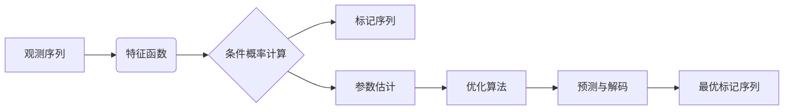
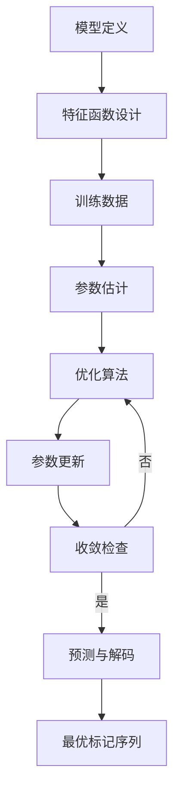

# 条件随机场(CRF)原理与代码实战案例讲解

## 1.背景介绍

### 1.1 序列标注任务

在自然语言处理(NLP)和模式识别领域中,序列标注是一种常见的任务。它的目标是为给定的输入序列(如句子或时间序列)中的每个元素(如单词或观测值)分配一个标签或类别。常见的序列标注任务包括:

- 命名实体识别(Named Entity Recognition, NER): 识别文本中的人名、地名、组织机构名等实体。
- 词性标注(Part-of-Speech Tagging, POS): 为每个单词分配相应的词性标签(如名词、动词、形容词等)。
- 生物序列分析: 预测蛋白质或DNA序列中每个核苷酸或氨基酸的结构或功能。

### 1.2 传统方法的局限性

传统的序列标注方法主要基于隐马尔可夫模型(Hidden Markov Model, HMM)和Maximum Entropy Markov Model(MEMM)。然而,这些模型存在一些固有的局限性:

1. **标记偏置(Label Bias)**: HMM模型倾向于过度预测出现频率较高的标签,而忽视了上下文信息的影响。
2. **标注偏置(Label Bias)**: MEMM模型虽然利用了丰富的特征,但由于缺乏对未来观测的考虑,可能会产生不一致的预测。
3. **难以捕捉长程依赖关系**: 这两种模型都假设当前标签只与有限个历史标签和观测值相关,难以捕捉长程依赖关系。

### 1.3 条件随机场(CRF)的优势

为了克服上述局限性,条件随机场(Conditional Random Field, CRF)应运而生。CRF是一种基于无向图模型的discriminative框架,具有以下优势:

1. **全局归一化**: CRF在整个序列上进行概率计算,从而避免了标记偏置和标注偏置问题。
2. **灵活的特征设计**: CRF可以轻松地整合多种特征,包括当前观测值、过去和未来的观测值以及标签等。
3. **捕捉长程依赖关系**: CRF能够有效地捕捉序列中元素之间的长程依赖关系。

因此,CRF已经成为序列标注任务中最常用和最有效的方法之一,广泛应用于NLP、生物信息学、语音识别等领域。

## 2.核心概念与联系

### 2.1 概率无向图模型

条件随机场是一种基于无向图的概率模型,用于计算给定观测序列条件下标记序列的条件概率分布。无向图由节点(表示随机变量)和边(表示变量之间的依赖关系)组成。在序列标注任务中,无向图通常采用线性链(Linear Chain)结构,其中:

- 节点表示观测序列中的元素及其对应的标签。
- 边表示相邻元素之间的依赖关系。

### 2.2 条件概率计算

对于给定的观测序列$X$和标记序列$Y$,CRF模型定义了条件概率$P(Y|X)$,表示在观测序列$X$的条件下,标记序列$Y$出现的概率。CRF的目标是学习参数,使得在训练数据上条件概率$P(Y|X)$最大化。

条件概率$P(Y|X)$的计算公式如下:

$$P(Y|X) = \frac{1}{Z(X)}\exp\left(\sum_{i,k}\lambda_kf_k(y_{i-1},y_i,X,i)\right)$$

其中:

- $Z(X)$是归一化因子(Partition Function),用于确保概率之和为1。
- $f_k(y_{i-1},y_i,X,i)$是特征函数,描述了标签序列$Y$在观测序列$X$下的某些特征。
- $\lambda_k$是对应特征函数的权重参数。

特征函数可以包含各种信息,如观测值、前一个标签、当前标签等。通过学习合适的权重参数$\lambda_k$,CRF模型可以捕捉序列数据中的复杂依赖关系。

### 2.3 参数估计

CRF模型的参数估计通常采用最大似然估计(Maximum Likelihood Estimation, MLE)或正则化的最大似然估计。目标是在训练数据上最大化对数似然函数:

$$L(\lambda) = \sum_{i=1}^N\log P(Y^{(i)}|X^{(i)};\lambda) - \frac{1}{2\sigma^2}\|\lambda\|^2$$

其中$N$是训练样本数量,$\lambda$是所有权重参数的集合,$\sigma$是正则化系数。

参数估计通常使用数值优化算法(如梯度下降、拟牛顿法等)来进行。在实践中,还可以采用诸如L1/L2正则化、提前停止(Early Stopping)等技术来防止过拟合。

### 2.4 预测与解码

在预测阶段,给定一个新的观测序列$X^{new}$,我们需要找到最可能的标记序列$Y^*$:

$$Y^* = \arg\max_Y P(Y|X^{new})$$

这个过程称为解码(Decoding),通常采用维特比(Viterbi)算法或其变体来有效地求解。维特比算法利用动态规划的思想,以线性时间复杂度找到最优路径。

### 2.5 CRF原理总结

条件随机场(CRF)是一种用于序列标注任务的有力工具,它通过无向图模型捕捉观测序列和标记序列之间的复杂依赖关系。CRF的核心思想包括:

1. 基于无向图模型,通过特征函数描述观测序列和标记序列之间的关系。
2. 使用全局归一化的条件概率,避免了标记偏置和标注偏置问题。
3. 利用最大似然估计或正则化最大似然估计来学习特征权重参数。
4. 在预测时,使用维特比算法或其变体进行高效解码,找到最可能的标记序列。

通过灵活的特征设计和全局归一化,CRF能够有效地捕捉序列数据中的长程依赖关系,从而在序列标注任务中取得了优异的表现。

## 3.核心算法原理具体操作步骤

### 3.1 CRF模型定义

首先,我们需要定义CRF模型的基本结构,包括:

1. 观测序列$X$和标记序列$Y$的表示形式。
2. 特征函数$f_k(y_{i-1},y_i,X,i)$的设计,用于描述观测序列和标记序列之间的关系。
3. 模型参数$\lambda_k$的初始化方式。

### 3.2 特征函数设计

特征函数的设计是CRF模型中最关键的一步,它直接影响了模型的表现能力。一般来说,特征函数应该包含以下几个方面的信息:

1. **观测值特征**: 描述当前观测值与标签之间的关系,如单词本身、大小写、数字等。
2. **转移特征**: 描述相邻标签之间的转移关系,如标签对的共现频率等。
3. **上下文特征**: 描述当前标签与周围观测值和标签的关系,如窗口内的单词、标点符号等。

特征函数的设计需要结合具体任务和领域知识,通常需要一定的试验和调优。

### 3.3 参数估计

参数估计的目标是找到一组参数$\lambda$,使得在训练数据上条件概率$P(Y|X;\lambda)$最大化。这通常通过最大化正则化的对数似然函数来实现:

$$L(\lambda) = \sum_{i=1}^N\log P(Y^{(i)}|X^{(i)};\lambda) - \frac{1}{2\sigma^2}\|\lambda\|^2$$

其中$N$是训练样本数量,$\sigma$是正则化系数。

参数估计通常采用数值优化算法,如梯度下降、拟牛顿法等。具体步骤如下:

1. 计算对数似然函数及其梯度。
2. 选择合适的优化算法和学习率。
3. 迭代更新参数$\lambda$,直到收敛或达到最大迭代次数。

在实践中,还可以采用诸如L1/L2正则化、提前停止等技术来防止过拟合。

### 3.4 预测与解码

在预测阶段,给定一个新的观测序列$X^{new}$,我们需要找到最可能的标记序列$Y^*$:

$$Y^* = \arg\max_Y P(Y|X^{new};\lambda)$$

这个过程称为解码(Decoding),通常采用维特比(Viterbi)算法或其变体来有效地求解。维特比算法利用动态规划的思想,以线性时间复杂度找到最优路径。

具体步骤如下:

1. 构建一个矩阵$V$,其中$V_{i,j}$表示在位置$i$处标记为$j$的最大分数。
2. 递推计算$V$矩阵的每个元素,利用之前计算的结果。
3. 从$V$矩阵的最后一行找到最大值,反向回溯得到最优路径,即最可能的标记序列。

维特比算法的时间复杂度为$O(mn^2)$,其中$m$是观测序列长度,$n$是标记集合大小。对于线性链CRF,还可以利用特殊的三角矩阵结构,将时间复杂度降低到$O(mn)$。

### 3.5 CRF算法步骤总结

综上所述,CRF算法的核心步骤包括:

1. **模型定义**: 定义观测序列、标记序列及特征函数。
2. **特征函数设计**: 设计能够有效描述数据特征的特征函数。
3. **参数估计**: 使用正则化的最大似然估计,通过数值优化算法学习特征权重参数。
4. **预测与解码**: 对于新的观测序列,使用维特比算法或其变体找到最可能的标记序列。

## 4.数学模型和公式详细讲解举例说明

### 4.1 线性链条件随机场

线性链条件随机场(Linear Chain Conditional Random Field, CRF)是CRF最常用的一种形式,它假设在序列标注任务中,每个标签只依赖于当前观测值和相邻的标签。

对于给定的观测序列$X=\{x_1,x_2,\dots,x_T\}$和标记序列$Y=\{y_1,y_2,\dots,y_T\}$,线性链CRF定义了条件概率:

$$P(Y|X) = \frac{1}{Z(X)}\exp\left(\sum_{t=1}^T\sum_{k}\lambda_kf_k(y_{t-1},y_t,X,t)\right)$$

其中:

- $Z(X)$是归一化因子(Partition Function),用于确保概率之和为1:

$$Z(X) = \sum_Y\exp\left(\sum_{t=1}^T\sum_{k}\lambda_kf_k(y_{t-1},y_t,X,t)\right)$$

- $f_k(y_{t-1},y_t,X,t)$是特征函数,描述了标签序列$Y$在观测序列$X$下的某些特征。
- $\lambda_k$是对应特征函数的权重参数。

特征函数可以包含各种信息,如观测值、前一个标签、当前标签等。通过学习合适的权重参数$\lambda_k$,线性链CRF模型可以捕捉序列数据中的依赖关系。

### 4.2 参数估计

线性链CRF模型的参数估计通常采用最大似然估计(Maximum Likelihood Estimation, MLE)或正则化的最大似然估计。目标是在训练数据上最大化对数似然函数:

$$L(\lambda) = \sum_{i=1}^N\log P(Y^{(i)}|X^{(i)};\lambda) - \frac{1}{2\sigma^