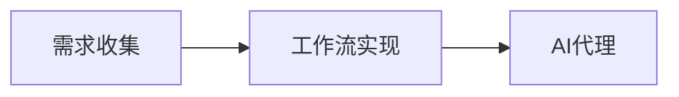

## 1.背景介绍

在当前的科技环境中，AI代理已经成为了一个热门话题。AI代理，简单来说，就是一种能够自主完成特定任务的智能系统。这些任务可能涉及到数据分析、决策制定，甚至是与人类进行交互。然而，构建一个有效的AI代理并不是一件简单的事情，它需要我们从需求收集开始，一步步进行工作流实现。本文将详细介绍如何构建一个AI代理。

## 2.核心概念与联系

在构建AI代理的过程中，我们需要理解一些核心概念，包括：

- 需求收集：这是构建AI代理的第一步，需要收集和理解用户的需求，明确AI代理需要完成的任务。

- 工作流实现：根据收集到的需求，设计并实现AI代理的工作流程。这包括数据处理、模型训练、决策制定等步骤。

- AI代理：一个能够自主完成特定任务的智能系统，它的工作流程是根据用户需求来设计的。

这三个概念之间的关系可以通过以下的Mermaid流程图来表示：



## 3.核心算法原理具体操作步骤

构建AI代理的过程中，我们需要采用一些核心的算法。以下是一些常见的算法和具体的操作步骤：

- 数据处理：这是AI代理工作流的第一步，需要对收集到的数据进行预处理，包括数据清洗、特征选择等。

- 模型训练：根据处理后的数据，使用机器学习算法训练模型。常见的算法包括决策树、随机森林、神经网络等。

- 决策制定：模型训练完成后，AI代理需要根据模型的预测结果来制定决策。这一步通常需要设计一些策略或规则。

## 4.数学模型和公式详细讲解举例说明

在AI代理的构建过程中，我们会使用到一些数学模型和公式。以下是一些常见的模型和公式的详细讲解和举例说明：

- 决策树：决策树是一种常用的机器学习算法，它通过构建一棵树来进行决策。决策树的每一个节点都代表一个特征，每一条边代表一个决策规则，每一个叶子节点代表一个决策结果。决策树的构建过程可以通过信息增益或基尼指数来选择最优特征。

- 随机森林：随机森林是一种集成学习方法，它通过构建多棵决策树并进行投票来进行决策。随机森林的构建过程可以通过自助采样和特征随机选择来生成多棵决策树。

- 神经网络：神经网络是一种深度学习算法，它通过模拟人脑神经元的工作方式来进行学习和决策。神经网络的构建过程需要定义网络结构、激活函数、损失函数和优化算法。

## 5.项目实践：代码实例和详细解释说明

下面我们通过一个简单的项目实践来说明如何构建一个AI代理。在这个项目中，我们将构建一个能够自动回答问题的AI代理。

首先，我们需要收集用户的需求，明确AI代理需要完成的任务。在这个项目中，AI代理的任务是自动回答用户的问题。

然后，我们需要设计并实现AI代理的工作流程。在这个项目中，工作流程包括数据处理、模型训练和决策制定三个步骤。

接下来，我们需要选择合适的算法来实现工作流程。在这个项目中，我们选择使用神经网络来训练模型，使用最大概率选择法来制定决策。

最后，我们需要编写代码来实现AI代理。在这个项目中，我们使用Python语言和TensorFlow框架来编写代码。

以下是项目的部分代码和详细的解释说明：

```python
# 导入所需的库
import tensorflow as tf
from tensorflow.keras.models import Sequential
from tensorflow.keras.layers import Dense

# 定义神经网络模型
model = Sequential()
model.add(Dense(128, input_dim=100, activation='relu'))
model.add(Dense(64, activation='relu'))
model.add(Dense(10, activation='softmax'))

# 编译模型
model.compile(loss='categorical_crossentropy', optimizer='adam', metrics=['accuracy'])

# 训练模型
model.fit(X_train, y_train, epochs=10, batch_size=32)
```

在这段代码中，我们首先导入了所需的库，然后定义了一个神经网络模型，接着编译了模型，最后训练了模型。

## 6.实际应用场景

AI代理可以应用在许多场景中，以下是一些常见的应用场景：

- 客户服务：AI代理可以用来自动回答客户的问题，提高客户服务的效率和质量。

- 数据分析：AI代理可以用来自动分析数据，提供有价值的洞察和预测。

- 决策支持：AI代理可以用来自动制定决策，帮助企业优化业务流程和提高效率。

## 7.工具和资源推荐

以下是一些在构建AI代理过程中可能会用到的工具和资源：

- TensorFlow：一个开源的深度学习框架，支持多种类型的神经网络。

- scikit-learn：一个开源的机器学习库，提供了大量的机器学习算法。

- Pandas：一个开源的数据分析库，提供了大量的数据处理功能。

- Kaggle：一个数据科学竞赛平台，提供了大量的数据集和竞赛。

## 8.总结：未来发展趋势与挑战

随着科技的发展，AI代理的应用将越来越广泛，它的发展趋势主要有以下几点：

- 自主性：未来的AI代理将更加自主，能够自我学习和自我决策。

- 透明性：未来的AI代理将更加透明，用户能够清楚地了解其工作原理和决策依据。

- 人性化：未来的AI代理将更加人性化，能够更好地理解和满足用户的需求。

然而，AI代理的发展也面临一些挑战，主要有以下几点：

- 数据隐私：AI代理需要大量的数据来学习和决策，如何保护用户的数据隐私是一个大问题。

- 法律责任：当AI代理的决策导致问题时，如何确定法律责任是一个难题。

- 技术难题：如何提高AI代理的自主性、透明性和人性化，仍然是一些技术难题。

## 9.附录：常见问题与解答

1. 问题：AI代理是什么？

答：AI代理是一种能够自主完成特定任务的智能系统。

2. 问题：如何构建AI代理？

答：构建AI代理需要从需求收集开始，然后设计并实现工作流程，最后选择合适的算法来实现工作流程。

3. 问题：AI代理可以应用在哪些场景中？

答：AI代理可以应用在许多场景中，如客户服务、数据分析和决策支持等。

---

作者：禅与计算机程序设计艺术 / Zen and the Art of Computer Programming