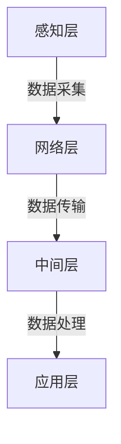
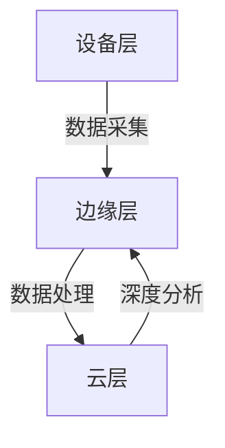
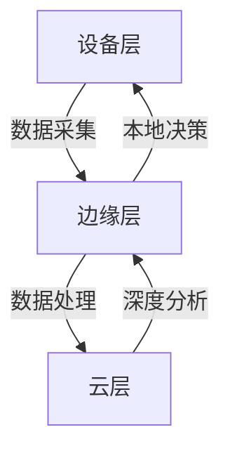
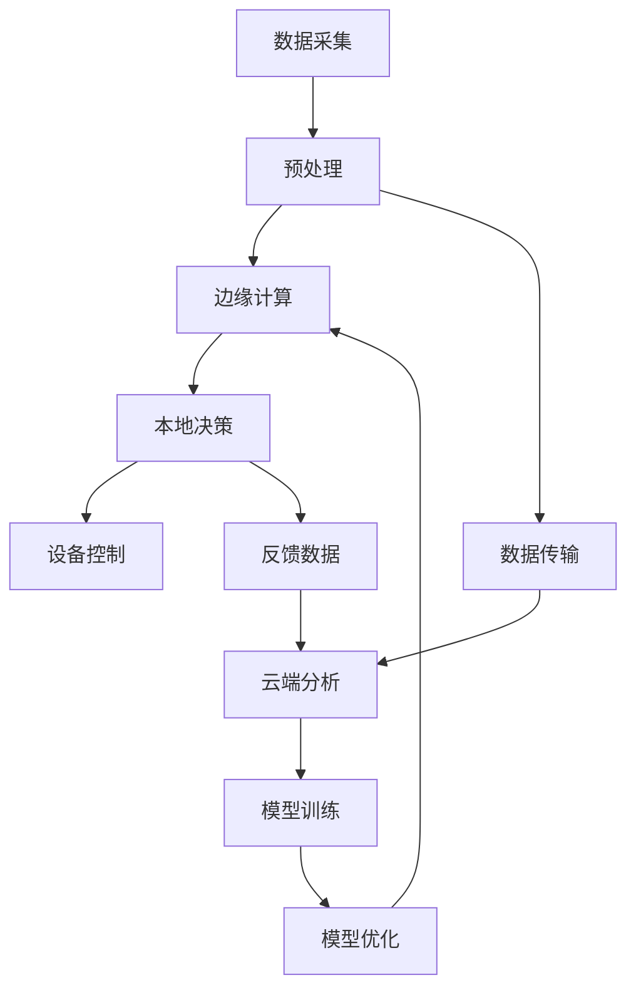
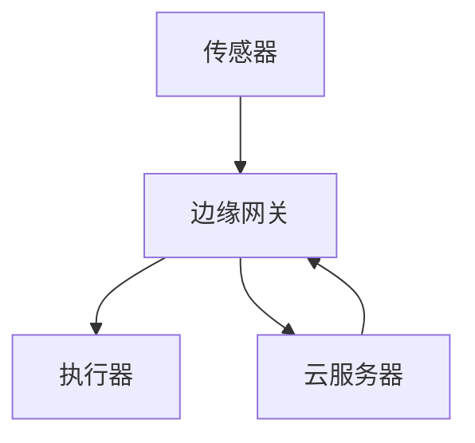

# 架构设计中的物联网和边缘计算

## 1. 背景介绍

### 1.1 物联网的兴起

随着互联网、移动通信和传感器技术的不断发展,物联网(Internet of Things, IoT)应运而生。物联网是一种新兴的互联网接入方式,通过各种信息传感设备,实现对物品和过程的智能化识别、定位、跟踪、监控和管理。物联网将现实世界中的物品与虚拟世界相连接,使物物相连、人机交互成为可能。

物联网的核心是利用各种传感器和智能终端设备采集数据,通过网络传输并在云端进行大数据分析处理,从而对所连接的物体进行状态监测、智能识别和精准控制。物联网正在渗透到生活和工作的方方面面,推动着智能家居、智慧城市、智能制造等领域的快速发展。

### 1.2 边缘计算的兴起

随着物联网设备和应用的快速增长,传统的云计算架构面临着一些挑战,如网络延迟、带宽限制、隐私和安全问题等。为了解决这些问题,边缘计算(Edge Computing)应运而生。

边缘计算是一种新兴的分布式计算范式,将计算资源和数据处理能力从云端延伸到网络边缘,靠近数据源。通过在靠近数据源的位置进行数据处理和分析,边缘计算可以减少数据传输延迟,提高响应速度,降低带宽成本,并增强隐私和安全性。

边缘计算与云计算相辅相成,共同构建了一种新型的分布式计算架构。在这种架构中,边缘设备负责采集和预处理数据,而云端则负责进行更深入的数据分析和智能决策。

### 1.3 物联网与边缘计算的融合

物联网和边缘计算的结合,正在推动着新一代智能系统的发展。通过将边缘计算引入物联网架构,可以实现以下优势:

1. **实时响应**: 边缘设备可以就近处理数据,减少了与云端的通信延迟,从而提高了系统的实时响应能力。
2. **带宽优化**: 只有必要的数据才会被传输到云端,降低了网络带宽的需求。
3. **隐私和安全性**: 敏感数据可以在边缘设备上进行处理,而无需传输到云端,从而增强了隐私和安全性。
4. **可靠性**: 即使与云端的连接中断,边缘设备仍可以继续运行,提高了系统的可靠性。
5. **智能化**: 通过在边缘设备上部署机器学习模型,可以实现本地智能化决策和控制。

物联网和边缘计算的融合正在推动着智能系统架构的演进,为我们带来了全新的机遇和挑战。

## 2. 核心概念与联系

### 2.1 物联网架构

物联网架构通常由以下几个层次组成:

1. **感知层**: 包括各种传感器和智能终端设备,用于采集物理世界的数据。
2. **网络层**: 负责将采集的数据传输到上层进行处理,包括各种有线和无线网络技术。
3. **中间层**: 负责数据的汇聚、过滤、转换和预处理,通常包括边缘计算设备。
4. **应用层**: 基于处理后的数据,提供各种智能应用和服务,如可视化、决策支持等。

### 2.2 边缘计算架构

边缘计算架构通常由以下几个层次组成:

1. **设备层**: 包括各种物联网设备和传感器,用于采集数据。
2. **边缘层**: 包括边缘计算节点,如边缘服务器、网关等,用于就近处理数据。
3. **云层**: 包括云计算资源,用于进行更深入的数据分析和存储。

### 2.3 物联网与边缘计算的融合

物联网和边缘计算的融合,形成了一种新型的分布式计算架构:

1. **设备层**: 包括各种物联网设备和传感器,用于采集数据。
2. **边缘层**: 包括边缘计算节点,用于就近处理和分析数据,并进行本地决策和控制。
3. **云层**: 包括云计算资源,用于进行更深入的数据分析、模型训练和智能决策。

在这种架构中,边缘层和云层相互协作,实现了实时响应、带宽优化、隐私保护和可靠性等优势。同时,通过在边缘层部署机器学习模型,可以实现本地智能化决策和控制,进一步提高系统的智能化水平。

## 3. 核心算法原理具体操作步骤

在物联网和边缘计算融合的架构中,核心算法原理包括以下几个方面:

### 3.1 数据采集和预处理

1. 利用各种传感器和智能终端设备,采集物理世界的数据,如温度、湿度、图像、声音等。
2. 对采集的原始数据进行预处理,如去噪、滤波、特征提取等,以提高数据质量。
3. 在边缘设备上进行数据压缩和编码,以减小数据传输量。

### 3.2 边缘计算和本地决策

1. 在边缘设备上部署轻量级的机器学习模型,如决策树、支持向量机等。
2. 利用边缘设备的计算资源,对预处理后的数据进行本地分析和决策。
3. 根据本地决策的结果,对物联网设备进行实时控制和调节。

### 3.3 云端深度分析和模型训练

1. 将边缘设备处理后的数据传输到云端进行汇总和存储。
2. 在云端利用大数据分析和机器学习算法,对汇总的数据进行深度挖掘和建模。
3. 根据分析结果,优化和更新边缘设备上的机器学习模型。

### 3.4 协同优化和反馈调整

1. 云端和边缘层之间建立双向通信和反馈机制。
2. 根据边缘设备的实时运行情况,动态调整云端模型和边缘模型的参数。
3. 通过不断的协同优化和反馈调整,提高整个系统的智能化水平和决策精度。

上述算法原理体现了物联网和边缘计算融合架构的核心特点,即边缘层负责实时数据处理和本地决策,而云层则负责深度分析和模型优化,两者通过协同优化和反馈调整不断提高系统的智能化水平。

## 4. 数学模型和公式详细讲解举例说明

在物联网和边缘计算融合架构中,常见的数学模型和公式包括:

### 4.1 数据压缩和编码

为了减小数据传输量,常采用数据压缩和编码算法。常见的压缩算法包括:

1. **熵编码**

熵编码是一种无损压缩算法,基于数据符号出现的概率进行编码。符号出现概率越高,编码长度越短。常见的熵编码算法包括霍夫曼编码和算术编码。

对于一个离散随机变量 $X$,其熵定义为:

$$H(X) = -\sum_{i=1}^{n} P(x_i) \log_2 P(x_i)$$

其中 $P(x_i)$ 表示事件 $x_i$ 发生的概率。熵值越小,表示数据的冗余度越低,压缩效果越好。

2. **变换编码**

变换编码是一种有损压缩算法,通过对数据进行变换,将能量集中到少数几个系数上,然后对这些系数进行编码。常见的变换编码算法包括离散余弦变换(DCT)、小波变换等。

对于一个长度为 $N$ 的一维信号 $x(n)$,其 DCT 系数为:

$$X(k) = \sum_{n=0}^{N-1} x(n) \cos\left[\frac{\pi(2n+1)k}{2N}\right], \quad k = 0, 1, \ldots, N-1$$

通过保留能量较大的低频系数,并对其进行编码,可以实现有效的数据压缩。

### 4.2 边缘计算和本地决策

在边缘设备上部署机器学习模型,实现本地决策和控制。常见的机器学习模型包括:

1. **决策树**

决策树是一种常用的监督学习算法,通过构建决策树模型,可以对输入数据进行分类或回归预测。

对于一个二分类问题,决策树的目标是找到一个最优划分,使得划分后的子集尽可能纯净。常用的划分准则包括信息增益、信息增益率和基尼系数等。

对于一个特征 $A$,其信息增益定义为:

$$\text{Gain}(D, A) = \text{Ent}(D) - \sum_{v=1}^{V} \frac{|D^v|}{|D|} \text{Ent}(D^v)$$

其中 $\text{Ent}(D)$ 表示数据集 $D$ 的熵,而 $D^v$ 表示根据特征 $A$ 取值 $v$ 划分后的子集。

2. **支持向量机**

支持向量机(SVM)是一种有监督的机器学习算法,通过构建最大间隔超平面,实现对数据的分类或回归预测。

对于一个线性可分的二分类问题,SVM 的目标是找到一个最优超平面,使得两类样本点到超平面的距离最大。该超平面可表示为:

$$\vec{w} \cdot \vec{x} + b = 0$$

其中 $\vec{w}$ 为超平面的法向量,而 $b$ 为偏移量。通过求解以下优化问题,可以得到最优的 $\vec{w}$ 和 $b$:

$$\begin{align*}
\min_{\vec{w}, b} &\quad \frac{1}{2} \|\vec{w}\|^2 \\
\text{s.t.} &\quad y_i(\vec{w} \cdot \vec{x}_i + b) \geq 1, \quad i = 1, 2, \ldots, n
\end{align*}$$

上述数学模型和公式展示了在物联网和边缘计算融合架构中,常见的数据压缩、编码和机器学习算法的基本原理。通过合理应用这些算法,可以实现高效的数据传输、边缘计算和本地决策,从而提高整个系统的性能和智能化水平。

## 5. 项目实践: 代码实例和详细解释说明

为了更好地理解物联网和边缘计算融合架构的实现,我们以一个智能农场监控系统为例,展示相关代码实例和详细解释。

### 5.1 系统架构

该系统采用了物联网和边缘计算融合的架构,包括以下几个层次:

1. **设备层**: 包括各种传感器和执行器,如温湿度传感器、土壤湿度传感器、喷淋系统等。
2. **边缘层**: 包括边缘网关,负责数据采集、预处理、边缘计算和本地决策。
3. **云层**: 包括云服务器,负责数据存储、深度分析和模型训练。

### 5.2 边缘网关代码实例

边缘网关采用 Python 语言编写,利用 TensorFlow Lite 实现边缘计算和本地