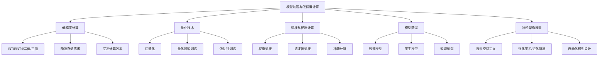

# 模型加速与低精度计算原理与代码实战案例讲解

## 1.背景介绍

### 1.1 人工智能模型的计算挑战

随着深度学习模型的规模不断扩大,训练和推理所需的计算资源也呈指数级增长。大型语言模型和视觉模型往往包含数十亿甚至上万亿个参数,对计算能力和内存带宽提出了极高的要求。以GPT-3为例,它拥有1750亿个参数,在单精度浮点数(FP32)下的模型大小高达350GB。即使是中等规模的BERT模型,在FP32下也需要1.3GB的存储空间。

### 1.2 模型加速的重要性  

由于训练大型AI模型的计算成本极高,因此提高模型的计算效率对于实现可持续的人工智能发展至关重要。此外,在推理阶段,高效的模型计算也能为终端设备(如手机、物联网等)提供更流畅的人工智能服务体验。因此,如何在不牺牲太多精度的情况下加速模型的计算,是当前人工智能领域亟需解决的重要课题。

## 2.核心概念与联系

### 2.1 低精度计算

低精度计算(Low-Precision Computing)是一种通过降低数值表示的位宽来节省计算资源和存储空间的技术。传统的深度学习模型通常使用32位(FP32)或16位(FP16)浮点数来表示权重和激活值,而低精度计算则尝试使用更低的位宽,例如8位整数(INT8)、4位(INT4)或者甚至是二值(-1/1)或三值(-1/0/1)。

降低数值精度不仅能减小模型大小,还能提高计算效率,因为低精度数据的运算可以利用更高效的整数指令集。此外,低精度数据在内存和存储器之间的传输也更加高效。

### 2.2 量化技术

量化(Quantization)是将原始的高精度浮点数模型参数映射到低精度表示的过程。根据量化方式的不同,可以分为:

1. **后量化(Post-Training Quantization)**: 在模型训练完成后,对已训练好的权重进行量化。这种方法简单,但是量化误差较大,精度下降较多。

2. **量化感知训练(Quantization-Aware Training)**: 在模型训练过程中,模拟低精度计算,使得模型在训练时就适应了低精度表示。这种方法可以大幅减少量化误差,但训练过程复杂。

3. **低比特训练(Low-Bit Training)**: 直接使用低精度数据(如INT8)进行模型训练,避免了量化过程。这种方法最为高效,但需要专门的硬件和软件支持。

### 2.3 剪枝与稀疏计算

剪枝(Pruning)是通过移除神经网络中不重要的连接和神经元,从而减小模型大小和计算量。常见的剪枝方法包括权重剪枝和滤波器剪枝。剪枝后,模型会变得越来越稀疏,可以利用稀疏计算(Sparse Computation)技术来加速稀疏张量的运算。

### 2.4 模型蒸馏

模型蒸馏(Model Distillation)指的是使用一个大型教师模型(Teacher Model)来指导训练一个小型的学生模型(Student Model)。通过知识蒸馏,学生模型可以在保持较高精度的同时大幅减小模型大小。

### 2.5 神经架构搜索

神经架构搜索(Neural Architecture Search, NAS)是一种自动化的模型压缩方法。通过在预定义的搜索空间中,使用强化学习或进化算法等技术来搜索最优的网络结构,从而得到精简高效的模型。

### 2.6 Mermaid流程图

以下是模型加速和低精度计算的核心概念及其关系的Mermaid流程图:

## 3.核心算法原理具体操作步骤

### 3.1 低精度计算

低精度计算的核心思想是将原始的高精度浮点数模型参数映射到低精度表示,从而减小模型大小和计算量。以下是一个典型的INT8量化算法流程:

1. **确定量化范围**: 对模型权重张量的绝对值取最大值,作为量化范围的上限。

2. **计算量化间隔**: 量化间隔 = 量化范围 / (2^(量化位数-1) - 1)。例如对于INT8,量化间隔 = 量化范围 / 127。

3. **量化公式**:
   $$
   Q(x) = \mathrm{clip}(\mathrm{round}(\frac{x}{\text{量化间隔}}), -2^{(量化位数-1)}, 2^{(量化位数-1)}-1)
   $$
   其中$x$是原始浮点数值,`round`是四舍五入函数,`clip`是剪裁函数,确保量化后的值在量化范围内。

4. **反量化公式**:
   $$
   X = Q(x) \times \text{量化间隔}
   $$
   通过将量化后的整数值乘以量化间隔,即可近似地还原出原始的浮点数值。

以上是最基本的对称量化方法,实际应用中还可以使用非对称量化、每层量化等技术进一步优化量化效果。

### 3.2 量化感知训练

量化感知训练(Quantization-Aware Training, QAT)的目标是在模型训练阶段就模拟低精度计算,使得模型可以适应低精度表示。以下是一个典型的QAT算法流程:

1. **模拟量化**:在正向传播时,使用FakeQuantOp算子模拟低精度量化的效果。FakeQuantOp算子包含以下步骤:
   - 统计当前批次数据的量化范围
   - 根据量化范围计算量化间隔
   - 使用量化公式对输入张量进行模拟量化
   - 使用反量化公式对量化后的张量进行反量化,得到近似的浮点数表示
   - 将反量化后的张量传递给下一层

2. **直通估计**:在反向传播时,直接对FakeQuantOp算子的输入张量进行梯度计算,而不是对量化后的张量进行梯度计算。这种"直通估计"(Straight-Through Estimator)方法避免了对离散的量化函数求梯度的困难。

3. **指数移动平均**:在训练过程中,使用指数移动平均(Exponential Moving Average)的方式更新量化范围的统计估计值,使其更加稳定。

4. **量化感知正则化**:在损失函数中添加量化感知正则化项,惩罚量化误差较大的情况,从而促使模型在训练时就尽量适应低精度表示。

通过量化感知训练,模型在低精度情况下的精度下降可以得到很大程度的缓解。

### 3.3 剪枝与稀疏计算

剪枝算法通过移除神经网络中不重要的连接和神经元,从而减小模型大小和计算量。常见的剪枝方法包括:

1. **权重剪枝**:
   - 计算每个权重的重要性得分,例如绝对值、二范数等
   - 根据重要性得分,移除得分最低的一定比例的权重连接
   - 对剪枝后的稀疏模型进行几轮精细调优(Fine-tuning)

2. **滤波器剪枝**:
   - 计算每个卷积滤波器的重要性得分,例如L1范数
   - 根据重要性得分,移除得分最低的一定比例的滤波器
   - 同时移除对应的特征图通道,从而减小下一层的输入通道数
   - 对剪枝后的模型进行精细调优

剪枝后的模型会变得越来越稀疏,可以利用稀疏计算技术来加速稀疏张量的运算。常见的稀疏计算优化包括:

- **压缩存储格式**:使用CSR、CSC等压缩存储格式,只存储非零元素及其索引。
- **稀疏基本线性代数子程序(Sparse BLAS)**:针对稀疏矩阵乘法等基本运算进行优化。
- **负载均衡**:在并行计算时,合理分配稀疏数据以实现负载均衡。

通过剪枝和稀疏计算相结合,可以在保持模型精度的前提下,大幅减小模型大小和计算量。

### 3.4 模型蒸馏

模型蒸馏的核心思想是使用一个大型教师模型来指导训练一个小型的学生模型。以下是一个典型的模型蒸馏算法流程:

1. **训练教师模型**:使用大量数据和计算资源训练一个高精度的大型教师模型。

2. **生成教师模型的soft标签**:对于每个训练样本,使用教师模型进行前向传播,得到logits输出,然后通过softmax函数得到soft标签(类别概率分布)。

3. **训练学生模型**:
   - 将教师模型的soft标签作为监督信号
   - 在损失函数中加入soft标签损失项,例如KL散度损失:
     $$
     \mathcal{L}_\text{KD} = (1-\alpha) \mathcal{L}_\text{CE}(y, y_s) + \alpha T^2 \mathcal{L}_\text{KL}(p_t, p_s)
     $$
     其中$y$是真实标签,$ y_s$是学生模型的hard标签预测,$ p_t$是教师模型的soft标签,$ p_s$是学生模型的soft标签,$ T$是温度超参数,$ \alpha$是损失权重。
   - 同时优化标准的交叉熵损失和soft标签损失,使学生模型学习教师模型的知识。

4. **模型微调**:在知识蒸馏后,可以对学生模型进行少量数据的微调,进一步提升其在真实数据上的性能。

通过模型蒸馏,可以将大型教师模型的知识有效地迁移到小型高效的学生模型中,实现模型压缩和加速。

### 3.5 神经架构搜索

神经架构搜索(NAS)是一种自动化的模型压缩方法,通过在预定义的搜索空间中搜索最优的网络结构,从而得到精简高效的模型。以下是一个典型的NAS算法流程:

1. **定义搜索空间**:确定网络架构的可变部分,例如卷积核大小、滤波器数量、跳连层数等,并为每个可变部分设置一个有限的选择范围。

2. **编码网络架构**:使用一个固定长度的向量或序列来编码网络架构,每个元素对应架构中的一个可变部分。

3. **设计评估策略**:定义评估网络架构性能的指标,例如在验证集上的精度、模型大小、计算量等。

4. **搜索算法**:
   - 使用强化学习算法,将网络架构编码作为策略,评估指标作为奖励,通过策略梯度的方式优化编码向量。
   - 或者使用进化算法,将网络架构编码作为基因,根据评估指标的适应度函数进行种群进化。

5. **derived模型训练**:对搜索出的最优架构进行全数据集的从头训练,得到derived模型。

6. **模型微调**:可以对derived模型进行少量数据的微调,进一步提升其性能。

通过神经架构搜索,可以自动设计出在给定硬件资源约束下,