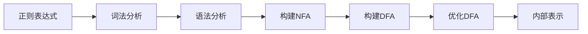

# 正则化技术原理与代码实战案例讲解

## 1.背景介绍

正则表达式是一种强大的文本处理工具,广泛应用于各种编程语言和文本编辑器中。它使用一种紧凑的语法来描述字符模式,可以实现高效的文本匹配、搜索、替换等操作。无论是网页抓取、日志分析还是数据清洗,正则表达式都扮演着重要角色。

随着数据量的激增和处理需求的多样化,掌握正则表达式已经成为程序员的基本技能之一。然而,正则表达式语法晦涩难懂,初学者常常会感到困惑和挫折。本文将深入探讨正则表达式的原理和实践应用,旨在帮助读者彻底掌握这一强大工具。

## 2.核心概念与联系

### 2.1 正则表达式的构成

正则表达式由一些普通字符和元字符(特殊字符)构成。普通字符匹配它们自身,而元字符则具有特殊含义,用于描述字符模式。常见的元字符包括:

- `.` 匹配任意单个字符(除了换行符)
- `\d` 匹配任意数字字符
- `\w` 匹配任意单词字符(字母、数字或下划线)
- `[]` 匹配括号内的任意单个字符
- `^` 匹配行首
- `$` 匹配行尾
- `*` 匹配前面元素0次或多次
- `+` 匹配前面元素1次或多次
- `?` 匹配前面元素0次或1次
- `|` 匹配左右两个模式中的任意一个
- `()` 捕获分组,对正则模式进行分组

### 2.2 正则引擎工作原理

正则引擎是一种有限状态机(FSM),它按照正则表达式定义的规则,从头到尾扫描输入文本,判断是否与模式匹配。这个过程可以用状态转移图来描述。

```mermaid
graph LR
    S((Start))
    A[/a/]
    B[/b/]
    C[/c/]
    F((Accept))

    S --"a"--> A
    A --"b"--> B 
    B --"c"--> C
    C --""--> F
```

上图展示了一个简单的正则引擎状态转移图,用于匹配模式 `abc`。起始状态 `S` 遇到字符 `a` 时转移到状态 `A`,遇到 `b` 时转移到 `B`,遇到 `c` 时转移到 `C`,最终到达终止状态 `F`,表示匹配成功。

实际的正则引擎实现要复杂得多,需要处理各种元字符、分组、回溯等情况。著名的正则引擎有 PCRE、RE2、Rust 的 regex 等。

### 2.3 回溯与贪婪匹配

回溯是正则引擎中一个重要概念。当模式无法继续匹配时,引擎会回到上一个状态,尝试其他可能的路径,这个过程称为回溯。

```mermaid
graph LR
    S((Start))
    A[/a/]
    B[/a?/]
    C[/b/]
    D[/c*/]
    E[/d/]
    F((Accept))

    S --"a"--> A
    A --"a"--> B
    B --"b"--> C
    C --"c"--> D
    D --"d"--> E
    E --""--> F
```

上图中,如果输入为 `abcd`,正则引擎会先走 `S->A->B->C->D->E->F` 的路径,匹配成功。但如果输入为 `abccccd`,引擎会先走 `S->A->B->C->D` 的路径,发现 `D` 状态无法继续匹配,就会回溯到 `C` 状态,重新尝试匹配 `c*`。

另一个需要注意的是贪婪匹配。正则引擎默认采用贪婪策略,即在有多种可能匹配的情况下,选择最长的那个。比如模式 `a.*b` 匹配 `acccb` 时,`.*` 会匹配 `ccc`。如果需要非贪婪匹配,可以在量词后加 `?`,如 `a.*?b`。

## 3.核心算法原理具体操作步骤  

### 3.1 正则表达式编译

在使用正则表达式之前,需要先将它编译成内部表示,以便正则引擎能够高效执行。编译过程包括以下几个步骤:

1. **词法分析**: 将正则表达式拆分为一个个token,如字面字符、元字符等。
2. **语法分析**: 根据正则语法规则,构建语法树(Parse Tree)。
3. **构建NFA**: 将语法树转换为非确定有限自动机(NFA)。
4. **构建DFA**: 将NFA通过子集构造法转换为确定有限自动机(DFA),以提高匹配效率。
5. **优化DFA**: 对DFA进行状态合并、编码压缩等优化,以减小内存占用。



### 3.2 正则匹配算法

正则引擎的核心是匹配算法,用于判断输入文本是否与正则表达式相匹配。常见的匹配算法有:

1. **朴素的NFA模拟**:直接在NFA上模拟输入文本,效率较低。
2. **DFA模拟**:在DFA上模拟输入文本,速度快但可能产生状态空间爆炸问题。
3. **位并行模拟**:利用位操作并行模拟DFA状态转移,性能优异但编码复杂。
4. **SIMD模拟**:使用SIMD指令集进行并行模拟,在现代CPU上表现出色。

此外,还有一些专用算法用于特殊情况,如仅查找是否存在匹配、查找所有匹配等。

### 3.3 回溯算法

回溯是正则引擎中一个重要的算法,用于处理模式无法继续匹配时的情况。回溯算法的基本思路是:

1. 从正则表达式的起始状态开始匹配。
2. 如果当前状态可以继续匹配,则消耗一个输入字符,转移到下一状态。
3. 如果无法继续匹配,则回溯到上一个状态,尝试其他可能的路径。
4. 重复步骤2和3,直到找到匹配或所有路径都试过为止。

回溯算法的时间复杂度在最坏情况下为指数级,因此正则引擎会采用各种优化策略来提高效率,如预测并行、字符串字面值优化等。

## 4.数学模型和公式详细讲解举例说明

### 4.1 正则表达式的形式化定义

正则表达式可以用形式语言理论中的正则文法(Regular Grammar)来定义。设 $\Sigma$ 为字母表,正则文法 $G$ 定义了一个正则语言 $L(G) \subseteq \Sigma^*$。

正则文法的形式定义如下:

$$
G = (N, \Sigma, P, S)
$$

其中:

- $N$ 是非终结符号集合
- $\Sigma$ 是终结符号集合(字母表)
- $P$ 是产生式集合
- $S \in N$ 是开始符号

产生式的形式为:

$$
A \rightarrow \alpha
$$

其中 $A \in N$, $\alpha \in (N \cup \Sigma)^*$。

常见的产生式包括:

$$
\begin{align*}
A &\rightarrow \epsilon \qquad \text{(空串)} \\
A &\rightarrow a \qquad \qquad \text{(字面字符)} \\
A &\rightarrow BC \qquad \qquad \text{(连接)} \\
A &\rightarrow B|C \qquad \qquad \text{(选择)} \\
A &\rightarrow B^* \qquad \qquad \text{(闭包)}
\end{align*}
$$

通过产生式的有限次应用,可以推导出正则语言中的所有字符串。

### 4.2 有限自动机与正则表达式的等价性

正则语言与有限自动机(FA)是等价的,即一个语言是正则语言,当且仅当存在一个FA能够识别它。

具体来说,对于任意正则表达式 $r$,都存在一个非确定有限自动机(NFA) $N$,使得 $L(N) = L(r)$。反之,对于任意NFA $N$,也存在一个正则表达式 $r$,使得 $L(N) = L(r)$。

NFA到正则表达式的转换可以使用 Kleene 定理,其基本思路是:

1. 将NFA转换为 $\epsilon$-NFA(允许 $\epsilon$ 转移)
2. 构造 $\epsilon$-NFA 的转移函数
3. 通过转移函数推导出正则表达式

这种转换过程可以用数学归纳法证明其正确性。

### 4.3 有限自动机的子集构造法

子集构造法是将NFA转换为等价的DFA的一种常用算法。基本思路是:

1. 初始状态是NFA的 $\epsilon$-closure 集合
2. 对于每个状态 $T$,对于每个输入字符 $a$:
    - 计算 $U = \epsilon\text{-closure}(\text{move}(T, a))$
    - 如果 $U$ 不在 DFA 中,则添加 $U$ 作为新状态
    - 添加从 $T$ 到 $U$ 的转移,标记为 $a$
3. 重复步骤2,直到没有新状态被添加

其中:

- $\text{move}(T, a)$ 表示从 $T$ 集合出发,读入字符 $a$ 后,NFA 能够转移到的所有状态集合
- $\epsilon\text{-closure}(S)$ 表示通过 $\epsilon$ 转移能够到达的所有状态集合

子集构造法的时间复杂度为 $O(2^n \cdot |\Sigma|)$,其中 $n$ 是NFA的状态数, $\Sigma$ 是字母表。

## 5.项目实践:代码实例和详细解释说明

接下来,我们通过一个实际项目来演示如何使用正则表达式。假设我们需要从一段文本中提取所有的电子邮件地址。

### 5.1 正则表达式模式

首先,我们需要定义一个正则表达式模式来匹配电子邮件地址。一个基本的电子邮件地址模式可以是:

```regex
\b[\w.%-]+@[\w.-]+\.[a-zA-Z]{2,}\b
```

让我们逐步解释这个模式:

- `\b` 是单词边界,确保匹配的是一个完整的单词
- `[\w.%-]+` 匹配用户名部分,可以包含字母、数字、下划线、点号、百分号和连字符
- `@` 是必须的 at 符号
- `[\w.-]+` 匹配域名部分,可以包含字母、数字、下划线和连字符
- `\.` 是必须的点号,用于分隔域名和顶级域名
- `[a-zA-Z]{2,}` 匹配顶级域名,必须至少有两个字母
- `\b` 确保匹配的是一个完整的单词

### 5.2 Python 代码实现

接下来,我们使用 Python 的 `re` 模块来实现电子邮件地址的提取。

```python
import re

text = """
Hello, my email is john@example.com.
You can also contact me at john.doe@my-company.co.uk.
For spam, try spam@spam.spam.
"""

pattern = r'\b[\w.%-]+@[\w.-]+\.[a-zA-Z]{2,}\b'
emails = re.findall(pattern, text, re.IGNORECASE)

print("Extracted emails:")
for email in emails:
    print(email)
```

输出结果:

```
Extracted emails:
john@example.com
john.doe@my-company.co.uk
```

代码解释:

1. 首先,我们导入 `re` 模块,并定义一段包含多个电子邮件地址的文本。
2. 使用 `re.findall()` 函数查找所有匹配正则表达式模式的字符串。`re.IGNORECASE` 标志确保匹配时不区分大小写。
3. 遍历匹配结果,打印出提取的电子邮件地址。

### 5.3 正则表达式的高级用法

上面的例子只是正则表达式的基本用法。实际上,正则表达式还有许多高级特性,例如: