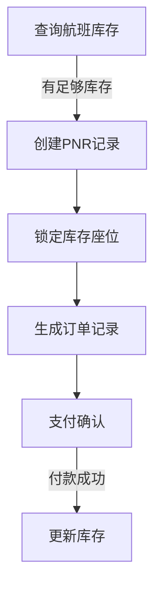
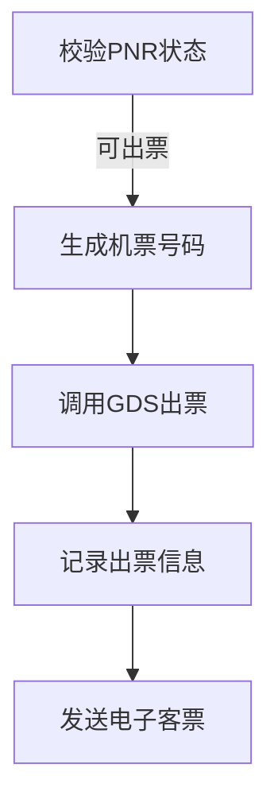
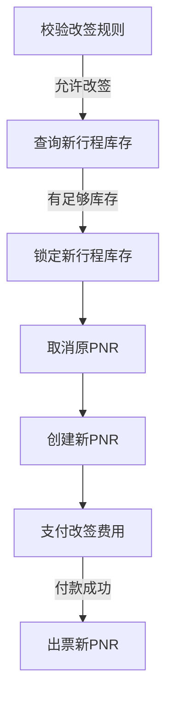
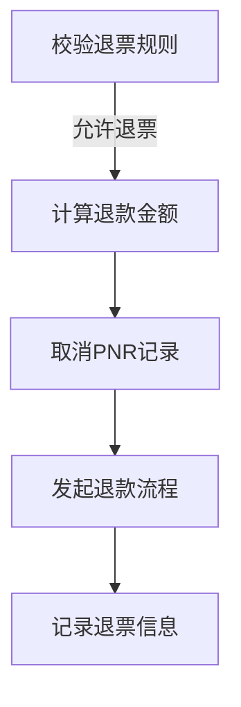

# 民航售票管理系统详细设计与具体代码实现

## 1.背景介绍

随着航空旅行的日益普及,对航空公司的运营管理系统提出了更高的要求。其中,售票管理系统作为航空公司的核心业务系统,对整个运营效率和客户体验至关重要。本文将深入探讨民航售票管理系统的设计与实现,为读者提供一个全面的解决方案。

### 1.1 系统概述

民航售票管理系统是一个复杂的分布式系统,需要处理大量的并发请求,并保证数据的一致性和可靠性。它主要包括以下几个核心模块:

- 机票预订模块
- 机票出票模块
- 机票改签模块
- 机票退票模块
- 库存管理模块
- 支付模块
- 报表统计模块

### 1.2 系统挑战

设计和实现一个高性能、高可用的民航售票管理系统面临着诸多挑战:

- 高并发场景下的性能优化
- 分布式事务的一致性保证
- 库存管理的准确性和实时性
- 系统的可扩展性和容错性
- 复杂业务流程的编排和监控

## 2.核心概念与联系

在深入探讨系统设计之前,我们先介绍一些核心概念,为后续内容的理解打下基础。

### 2.1 PNR (Passenger Name Record)

PNR是乘客姓名记录的缩写,它是航空公司为每一个乘客预订机票时生成的唯一标识符。PNR包含了乘客的个人信息、行程信息、机票信息等数据。在整个售票流程中,PNR扮演着至关重要的角色。

### 2.2 GDS (Global Distribution System)

GDS是全球分销系统的缩写,它是航空公司、旅行社和其他旅游服务提供商之间的信息交换平台。通过GDS,航空公司可以将机票库存信息发布给代理商,代理商也可以通过GDS进行机票预订和出票操作。

### 2.3 BSP (Billing and Settlement Plan)

BSP是航空公司与代理商之间的结算系统,它规范了机票销售、款项收取和分成的流程。BSP确保了航空公司和代理商之间资金的准确划转,是整个售票系统的关键环节。

### 2.4 核心概念关系

上述三个核心概念相互关联,共同构成了民航售票管理系统的基础。PNR记录了每个乘客的行程信息,GDS则是航空公司与代理商之间信息交换的桥梁,而BSP则负责最终的资金结算。它们有机地协作,确保了整个售票流程的顺利进行。

## 3.核心算法原理具体操作步骤

### 3.1 机票预订流程

机票预订是整个售票系统的起点,它包括以下几个主要步骤:

1. **查询航班库存**:通过GDS查询航班的座位库存情况。
2. **创建PNR记录**:如果有足够的库存,则在系统中创建一个新的PNR记录,记录乘客信息和行程信息。
3. **锁定库存座位**:为新创建的PNR锁定相应的库存座位,防止重复售出。
4. **生成订单记录**:根据PNR信息生成订单记录,等待乘客付款。
5. **支付确认**:乘客完成支付后,确认订单并更新库存。

该流程的核心算法是库存锁定算法,它需要保证在高并发场景下,库存锁定的正确性和一致性。我们可以采用基于Redis的分布式锁或者基于数据库的行级锁等方案来实现。



### 3.2 机票出票流程

机票出票是将预订信息转换为有效机票的过程,它包括以下步骤:

1. **校验PNR状态**:检查PNR是否处于可出票状态,例如付款已确认。
2. **生成机票号码**:为该PNR分配一个唯一的机票号码。
3. **调用GDS出票**:通过GDS向航空公司发起出票请求。
4. **记录出票信息**:在本地系统中记录出票信息,包括机票号码、出票时间等。
5. **发送电子客票**:将电子客票发送给乘客。

该流程的关键在于与GDS的对接,需要严格遵守GDS的出票规范和协议。同时,为了提高系统的容错性,我们可以采用异步出票的方式,将出票请求先存入消息队列,由专门的出票服务来异步处理。



### 3.3 机票改签流程

机票改签是指乘客需要更改行程信息的情况,它包括以下步骤:

1. **校验改签规则**:检查该机票是否允许改签,以及改签所需的手续费用。
2. **查询新行程库存**:查询乘客希望改签到的新行程的库存情况。
3. **锁定新行程库存**:如果有足够库存,则锁定新行程的座位。
4. **取消原PNR**:取消原PNR记录,释放原有的库存座位。
5. **创建新PNR**:根据新行程信息创建一个新的PNR记录。
6. **支付改签费用**:乘客支付改签所需的手续费用。
7. **出票新PNR**:为新PNR出票,发送新的电子客票。

该流程的关键在于库存管理和费用计算,需要精确地计算改签所需的费用,并正确地管理新旧行程的库存锁定和释放。



### 3.4 机票退票流程

机票退票是指乘客需要取消行程的情况,它包括以下步骤:

1. **校验退票规则**:检查该机票是否允许退票,以及需扣除的手续费用。
2. **计算退款金额**:根据航空公司的退票政策,计算应退还给乘客的金额。
3. **取消PNR记录**:取消对应的PNR记录,释放库存座位。
4. **发起退款流程**:向支付系统发起退款请求。
5. **记录退票信息**:在本地系统中记录退票信息,用于后续查询和报表统计。

该流程的关键在于准确计算退款金额,并及时释放库存座位,避免资源浪费。同时,需要与支付系统对接,保证退款流程的顺利进行。



## 4.数学模型和公式详细讲解举例说明

在民航售票管理系统中,有一些核心的数学模型和公式需要我们重点关注。

### 4.1 库存管理模型

库存管理是整个系统的核心,它需要精确地计算和管理每个航班的座位库存。我们可以使用一个简单的线性模型来表示:

$$
剩余库存 = 总库存 - 已售出库存 - 已锁定库存
$$

其中:

- 总库存是该航班的总座位数
- 已售出库存是已经出票的座位数
- 已锁定库存是正在预订或改签流程中锁定的座位数

在实际系统中,我们需要为每个航班维护一个库存快照,实时更新上述三个值,以确保库存计算的准确性。

### 4.2 费用计算模型

在改签和退票流程中,我们需要准确计算相应的手续费用。这通常由航空公司的规则决定,可以使用一个简单的加法模型来表示:

$$
手续费 = 基础费用 + 附加费用_1 + 附加费用_2 + \cdots + 附加费用_n
$$

其中:

- 基础费用是航空公司统一规定的固定费用
- 附加费用是根据具体情况计算的可变费用,例如时间因素、舱位级别等

在实现时,我们可以将这些规则配置在系统中,通过一个规则引擎来动态计算手续费用。

### 4.3 报表统计模型

报表统计模块需要从海量的交易数据中提取有价值的信息,以支持决策分析。我们可以使用一些常见的统计模型,例如:

$$
总销售额 = \sum_{i=1}^{n} 机票价格_i
$$

$$
平均客座率 = \frac{\sum_{i=1}^{n} 已售出座位数_i}{\sum_{i=1}^{n} 总座位数_i}
$$

通过对这些指标进行多维度的统计和分析,我们可以洞察业务的运营情况,并制定相应的营销策略。

## 5.项目实践:代码实例和详细解释说明

为了更好地理解系统的实现细节,我们将提供一些核心模块的代码示例,并进行详细的解释说明。

### 5.1 机票预订模块

机票预订模块是整个系统的入口,它需要与GDS对接,查询航班库存并创建PNR记录。下面是一个简化的Java代码示例:

```java
// 查询航班库存
FlightInventory inventory = gdsService.queryFlightInventory(flightNumber, departureDate);
if (inventory.getAvailableSeats() < numPassengers) {
    // 库存不足
    return;
}

// 创建PNR记录
PNR pnr = new PNR();
pnr.setPassengerInfo(passengerInfo);
pnr.setFlightInfo(flightInfo);

// 锁定库存座位
boolean lockSuccess = inventoryManager.lockSeats(flightNumber, departureDate, numPassengers);
if (!lockSuccess) {
    // 锁定失败
    return;
}

// 保存PNR记录
pnrRepository.save(pnr);

// 生成订单记录
Order order = new Order();
order.setPnr(pnr);
order.setTotalAmount(calculateTotalAmount(flightInfo, numPassengers));
orderRepository.save(order);
```

在这个示例中,我们首先通过GDS服务查询航班的库存情况。如果库存足够,我们就创建一个新的PNR记录,并调用库存管理器锁定相应的座位数量。成功锁定后,我们保存PNR记录并生成订单记录,等待乘客付款。

### 5.2 库存管理模块

库存管理模块负责维护每个航班的库存快照,并提供锁定和解锁库存的操作。下面是一个基于Redis的实现示例:

```java
// 维护库存快照
String inventoryKey = "flight:" + flightNumber + ":" + departureDate;
String totalSeatsKey = inventoryKey + ":totalSeats";
String soldSeatsKey = inventoryKey + ":soldSeats";
String lockedSeatsKey = inventoryKey + ":lockedSeats";

// 锁定库存座位
public boolean lockSeats(String flightNumber, LocalDate departureDate, int numSeats) {
    String inventoryKey = getInventoryKey(flightNumber, departureDate);
    String lockedSeatsKey = inventoryKey + ":lockedSeats";

    while (true) {
        // 获取当前锁定座位数
        Long currentLockedSeats = redisTemplate.opsForValue().increment(lockedSeatsKey, numSeats);

        // 检查总库存是否足够
        Long totalSeats = redisTemplate.opsForValue().get(inventoryKey + ":totalSeats");
        Long soldSeats = redisTemplate.opsForValue().get(inventoryKey + ":soldSeats");
        Long availableSeats = totalSeats - soldSeats - currentLockedSeats;

        if (availableSeats >= 0) {
            // 库存足够,锁定成功
            return true;
        } else {
            // 库存不足,回滚锁定操作
            redisTemplate.opsForValue().decrement(lockedSeatsKey, numSeats);
        }
    }
}
```

在这个示例中,我们使用Redis来维护每个