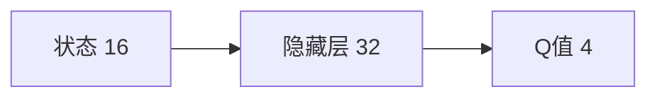

# 深度 Q-learning：在机器人技术中的应用

## 1. 背景介绍

### 1.1 强化学习与Q-learning

强化学习(Reinforcement Learning, RL)是一种重要的机器学习范式,它通过智能体(agent)与环境的交互,通过试错来学习最优策略,以获得最大的累积奖励。Q-learning是一种经典的无模型、离线策略的强化学习算法,它通过学习状态-动作值函数Q(s,a)来估计在状态s下采取动作a可获得的长期累积奖励。

### 1.2 深度学习与深度Q-learning

深度学习(Deep Learning)是机器学习领域的一个重要分支,它利用多层神经网络来自动学习数据中的高层特征表示。深度Q-learning(DQN)将深度学习与Q-learning相结合,用深度神经网络来逼近Q函数,可以处理高维、连续的状态空间,极大地拓展了强化学习的应用范围。

### 1.3 DQN在机器人技术中的应用前景

机器人技术是人工智能的一个重要应用领域。传统的机器人控制主要依赖人工设计的控制策略,难以应对复杂动态环境。将深度强化学习应用到机器人技术中,可以让机器人通过自主学习来掌握运动控制、路径规划、目标抓取等技能,提高机器人的智能水平和鲁棒性,在工业、服务、特种等领域具有广阔的应用前景。

## 2. 核心概念与联系

### 2.1 马尔可夫决策过程(MDP)

马尔可夫决策过程是强化学习的理论基础。MDP由状态集合S、动作集合A、状态转移概率P、奖励函数R构成。在MDP中,智能体与环境交互,在每个离散的时间步t,智能体观测到状态$s_t \in S$,采取动作$a_t \in A$,环境给予即时奖励$r_t$,并转移到下一状态$s_{t+1}$。

### 2.2 Q函数与贝尔曼方程

Q函数$Q(s,a)$表示在状态s下采取动作a的长期累积奖励期望。最优Q函数$Q^*(s,a)$满足贝尔曼最优方程:

$$Q^*(s,a) = \mathbb{E}_{s' \sim P(\cdot|s,a)}[r + \gamma \max_{a'}Q^*(s',a')]$$

其中$\gamma \in [0,1]$是折扣因子。Q-learning的目标就是逼近最优Q函数。

### 2.3 深度Q网络(DQN) 

DQN用深度神经网络$Q(s,a;\theta)$来逼近Q函数,其中$\theta$为网络参数。DQN的训练采用了两个关键技巧:

- 经验回放(Experience Replay):将智能体与环境交互得到的转移样本$(s_t,a_t,r_t,s_{t+1})$存入回放缓冲区D,之后从D中随机抽取小批量样本来更新网络参数。这样做可以打破样本间的相关性,提高训练稳定性。

- 目标网络(Target Network):每隔一定步数将当前Q网络的参数复制给目标Q网络,用目标网络来计算TD目标值。这样做可以减少训练的波动,提高收敛性。

DQN的训练目标是最小化TD误差:

$$L(\theta) = \mathbb{E}_{(s,a,r,s') \sim D}[(r + \gamma \max_{a'}Q(s',a';\theta^-) - Q(s,a;\theta))^2]$$

其中$\theta^-$为目标网络参数。

## 3. 核心算法原理具体操作步骤

DQN算法的具体操作步骤如下:

1. 初始化Q网络参数$\theta$,目标网络参数$\theta^- = \theta$,回放缓冲区D。

2. for episode = 1 to M do

3. &emsp;初始化初始状态$s_1$

4. &emsp;for t = 1 to T do 

5. &emsp;&emsp;根据$\epsilon-greedy$策略选择动作$a_t = \begin{cases} \arg\max_a Q(s_t,a;\theta), & \text{rand} \ge \epsilon \\ \text{随机动作}, & \text{rand} < \epsilon \end{cases}$

6. &emsp;&emsp;执行动作$a_t$,观测奖励$r_t$和下一状态$s_{t+1}$

7. &emsp;&emsp;将转移样本$(s_t,a_t,r_t,s_{t+1})$存入D

8. &emsp;&emsp;从D中随机抽取小批量转移样本 $(s,a,r,s')$

9. &emsp;&emsp;计算TD目标$y=\begin{cases} r, & \text{if } s' \text{ is terminal} \\ r + \gamma \max_{a'}Q(s',a';\theta^-), & \text{otherwise} \end{cases}$

10. &emsp;&emsp;最小化TD误差 $L(\theta) = (y - Q(s,a;\theta))^2$ 来更新Q网络参数$\theta$

11. &emsp;&emsp;每隔C步将Q网络参数复制给目标网络:$\theta^- \leftarrow \theta$

12. &emsp;end for

13. end for

其中$\epsilon$是探索率,$\epsilon-greedy$策略在前期多探索、后期多利用,以平衡探索和利用。

## 4. 数学模型和公式详细讲解举例说明

下面我们以一个简单的网格世界环境为例,详细说明DQN的数学模型和公式。

假设智能体在一个4x4的网格世界中,状态空间为网格位置的集合,动作空间为{上,下,左,右}。每个时间步智能体采取一个动作,若移动到目标位置则获得+1的奖励,其余位置奖励为0,撞墙不动。我们的目标是训练一个DQN来学习最优策略。

首先定义Q网络结构。我们用一个两层的MLP作为Q网络,输入为one-hot编码的状态(维度16),输出为每个动作的Q值(维度4):



设隐藏层激活函数为ReLU,batch size为32,折扣因子$\gamma=0.99$,学习率为0.001。

然后定义$\epsilon-greedy$探索策略。初始$\epsilon=1$,每个episode将$\epsilon$乘以衰减率0.995,并限制在0.01以上。

接下来开始训练DQN。假设在某个时间步t,智能体位于状态$s_t=(2,3)$,根据$\epsilon-greedy$策略选择动作$a_t=\text{右}$,执行后得到奖励$r_t=0$,并转移到下一状态$s_{t+1}=(2,4)$。我们将转移样本$((2,3),\text{右},0,(2,4))$存入回放缓冲区D。

之后从D中随机抽取一个batch的样本,假设抽到的其中一个样本为$((1,2),\text{下},0,(1,3))$。我们计算该样本的TD目标:

$$y = r + \gamma \max_{a'}Q(s',a';\theta^-) = 0 + 0.99 \times (-0.24) = -0.2376$$

其中$\max_{a'}Q(s',a';\theta^-)$是用目标网络在下一状态(1,3)处计算得到的最大Q值。

然后计算该样本在Q网络中的估计:

$$Q(s,a;\theta) = Q((1,2),\text{下};\theta) = -0.36$$

最后计算TD误差:

$$(y - Q(s,a;\theta))^2 = (-0.2376 - (-0.36))^2 = 0.015$$

对batch中的所有样本计算TD误差,取平均值作为总的损失函数$L(\theta)$,然后用梯度下降法更新Q网络参数$\theta$以最小化损失。

每隔一定步数(如1000步),再将更新后的Q网络参数复制给目标网络。

以上就是DQN在网格世界中学习最优策略的数学模型和训练过程。通过不断与环境交互并最小化TD误差,DQN最终可以收敛到最优Q函数,从而得到最优策略。

## 5. 项目实践：代码实例和详细解释说明

下面我们用PyTorch实现一个简单的DQN,并应用于上述网格世界环境。

首先定义Q网络类:

```python
class QNet(nn.Module):
    def __init__(self, state_dim, action_dim):
        super().__init__()
        self.fc1 = nn.Linear(state_dim, 32)
        self.fc2 = nn.Linear(32, action_dim) 

    def forward(self, x):
        x = F.relu(self.fc1(x))
        return self.fc2(x)
```

然后定义DQN智能体类:

```python
class DQNAgent:
    def __init__(self, state_dim, action_dim):
        self.q_net = QNet(state_dim, action_dim)
        self.target_q_net = QNet(state_dim, action_dim) 
        self.optimizer = optim.Adam(self.q_net.parameters(), lr=1e-3)

        self.buffer = deque(maxlen=10000)
        self.batch_size = 32  
        self.gamma = 0.99
        self.epsilon = 1
        self.epsilon_decay = 0.995
        self.epsilon_min = 0.01
        
    def select_action(self, state):
        if np.random.rand() < self.epsilon:
            return np.random.randint(self.action_dim)
        else:
            state = torch.tensor(state, dtype=torch.float32)
            q_values = self.q_net(state)
            return q_values.argmax().item()

    def update(self):
        if len(self.buffer) < self.batch_size:
            return
        
        samples = random.sample(self.buffer, self.batch_size)
        states, actions, rewards, next_states, dones = zip(*samples)

        states = torch.tensor(states, dtype=torch.float32)
        actions = torch.tensor(actions, dtype=torch.long).unsqueeze(1)  
        rewards = torch.tensor(rewards, dtype=torch.float32)
        next_states = torch.tensor(next_states, dtype=torch.float32)
        dones = torch.tensor(dones, dtype=torch.float32)

        curr_q_values = self.q_net(states).gather(1, actions)
        next_q_values = self.target_q_net(next_states).max(1)[0]
        expected_q_values = rewards + self.gamma * (1 - dones) * next_q_values
        
        loss = F.mse_loss(curr_q_values, expected_q_values.unsqueeze(1))
        
        self.optimizer.zero_grad()
        loss.backward()
        self.optimizer.step()
        
    def update_target_net(self):
        self.target_q_net.load_state_dict(self.q_net.state_dict())
```

接着定义网格世界环境类:

```python
class GridWorld:
    def __init__(self):
        self.width = 4
        self.height = 4
        self.goal = (3, 3)
        
    def reset(self):
        self.pos = (0, 0)
        return self._encode_state(self.pos)
        
    def step(self, action):
        x, y = self.pos
        if action == 0:  # 上
            y = max(0, y - 1)
        elif action == 1:  # 下
            y = min(self.height - 1, y + 1)
        elif action == 2:  # 左
            x = max(0, x - 1)
        elif action == 3:  # 右
            x = min(self.width - 1, x + 1)
        
        self.pos = (x, y)
        
        if self.pos == self.goal:
            reward = 1
            done = True
        else:
            reward = 0
            done = False
            
        return self._encode_state(self.pos), reward, done
        
    def _encode_state(self, pos):
        x, y = pos
        state = [0] * (self.width * self.height) 
        state[y * self.width + x] = 1
        return state
```

最后编写训练代码:

```python
env = GridWorld()
agent = DQNAgent(state_dim=16, action_dim=4)

num_episodes = 500
update_target_net_freq = 50

for episode in range(num_episodes):
    state = env.reset()
    done = False
    total_reward = 0
    
    while not done:
        action = agent.select_action(state)
        next_state, reward, done = env.step(action)
        
        agent.buffer.append((state, action, reward, next_state, done))
        agent.update()
        
        state = next_state
        total_reward += reward
        
    if episode % update_target_net_freq == 0:
        agent.update_target_net()
        
    agent.epsilon = max(agent.epsilon * agent.epsilon_decay, agent.epsilon_min)
    
    print(f"Episode {episode}: total reward = {total_reward}")
```

代码说明:

- 定义了一个简单的两层MLP作为Q网络,输入状态维度为16,输出动作维度为4。
- DQNAgent类实现了DQN算法,包括$\epsilon-gre