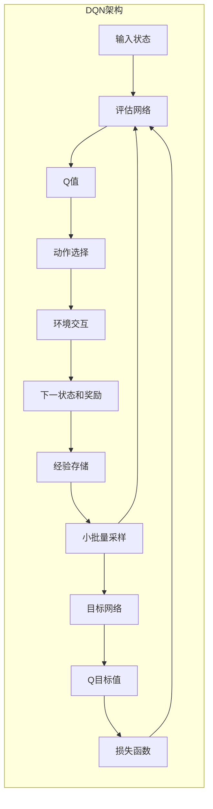

# 深度 Q-learning：在视觉目标追踪领域的应用

## 1.背景介绍

### 1.1 视觉目标追踪的重要性

视觉目标追踪是计算机视觉领域的一个核心任务,广泛应用于安防监控、智能交通、人机交互等诸多领域。其目标是在连续视频帧中自动检测和跟踪感兴趣的目标对象。由于现实场景中存在目标形变、遮挡、光照变化等复杂情况,使得视觉目标追踪仍然是一个极具挑战的问题。

### 1.2 传统方法的局限性

传统的视觉目标追踪方法主要基于手工设计的特征和模板匹配,难以适应复杂多变的环境。随着深度学习的兴起,基于深度神经网络的目标追踪算法取得了长足的进步,但大多数方法仍然属于判别式模型,需要大量的标注数据进行监督训练。

### 1.3 强化学习在目标追踪中的应用

近年来,强化学习(Reinforcement Learning)作为机器学习的一个重要分支,在视觉目标追踪等序列决策问题中展现出巨大的潜力。与监督学习不同,强化学习能够基于环境反馈自主学习最优策略,不需要大量标注数据,尤其适合应用于视觉目标追踪这一连续决策过程。

## 2.核心概念与联系

### 2.1 强化学习基本概念

强化学习是一种基于环境交互的学习范式,由智能体(Agent)、环境(Environment)和奖励信号(Reward)组成。智能体根据当前状态执行动作,环境返回新的状态和奖励信号,智能体的目标是最大化累积奖励。

$$
J(\pi) = \mathbb{E}_{\pi}\left[\sum_{t=0}^{\infty}\gamma^tr_t\right]
$$

其中$\pi$为智能体的策略,用于映射状态到动作的概率分布;$r_t$为时刻$t$的奖励;$\gamma$为折扣因子,控制对未来奖励的权重。

### 2.2 Q-learning算法

Q-learning是强化学习中一种基于价值函数的经典算法,通过估计状态-动作对的长期价值函数Q(s,a)来学习最优策略。在每个时刻,智能体选择具有最大Q值的动作执行:

$$
a_t = \arg\max_aQ(s_t,a)
$$

并根据下一状态的奖励和Q值更新当前Q值:

$$
Q(s_t,a_t) \leftarrow Q(s_t,a_t) + \alpha\left[r_t + \gamma\max_aQ(s_{t+1},a) - Q(s_t,a_t)\right]
$$

其中$\alpha$为学习率。通过不断探索和利用,Q-learning能够收敛到最优策略。

### 2.3 深度Q网络(DQN)

传统的Q-learning使用表格存储Q值,难以应对高维状态空间。深度Q网络(Deep Q-Network,DQN)将深度神经网络引入Q-learning,用于近似高维状态下的Q函数。DQN使用经验回放(Experience Replay)和目标网络(Target Network)等技巧来提高训练稳定性。

### 2.4 深度Q-learning在视觉目标追踪中的应用

将深度Q-learning应用于视觉目标追踪,可以将追踪过程建模为马尔可夫决策过程(MDP)。智能体的状态为当前视频帧,动作为调整跟踪框的位置和大小,奖励则根据跟踪质量计算得到。通过与环境交互,智能体学习到最优的跟踪策略,无需人工标注的训练数据。

## 3.核心算法原理具体操作步骤  

### 3.1 状态表示

视觉目标追踪的状态通常由当前视频帧及其上下文信息构成,如目标对象的外观特征、运动信息等。常见的状态表示方式有:

1. **原始像素值**: 直接使用原始RGB图像像素作为状态输入,缺点是输入维度高、难以捕捉高层语义信息。

2. **手工设计特征**: 使用传统的手工设计特征如HOG、颜色直方图等,需要专业领域知识,泛化能力有限。

3. **深度特征**: 利用预训练的深度卷积神经网络(如VGGNet、ResNet等)提取高层语义特征,具有很强的泛化能力。

4. **多模态融合**: 将视觉、运动、上下文等多种模态信息融合作为状态输入,能够全面描述目标对象。

### 3.2 动作空间设计

动作空间的设计直接影响智能体的控制精度。常见的动作空间有:

1. **离散动作空间**: 将动作离散为左移、右移、放大、缩小等有限个动作,简单但控制精度有限。

2. **连续动作空间**: 直接预测跟踪框的位移和缩放系数,控制精度高但动作空间维度较高,收敛难度加大。

3. **层次化动作空间**: 将动作分解为粗调整和精调整两级,先在粗空间选择大致方向,再在细空间进行微调,平衡了精度和难度。

4. **自适应动作空间**: 根据目标运动状态自适应调整动作空间的范围和分辨率,提高了控制的灵活性。

### 3.3 奖励函数设计

奖励函数的设计直接决定了智能体的优化目标,是视觉目标追踪中的关键环节。常见的奖励函数包括:

1. **重叠度奖励**: 以预测框与Ground Truth之间的重叠度(IoU)作为奖励,直观且常用。

2. **中心点距离奖励**: 以预测框中心与Ground Truth中心的欧氏距离作为奖励,对目标位置更加敏感。

3. **复合奖励**: 将重叠度、中心点距离、尺度变化等多个因素线性组合作为奖励,能够全面衡量跟踪质量。

4. **主观奖励**: 引入人工评分作为奖励,能够更贴近人的主观感受,但标注成本高且缺乏连续性。

### 3.4 探索策略

为了获得最优策略,智能体需要在exploitation(利用已有经验)和exploration(探索未知区域)之间寻求平衡:

1. **$\epsilon$-greedy策略**: 以$\epsilon$的概率随机选择动作,否则选择当前Q值最大的动作,简单有效但探索效率较低。

2. **软更新策略**: 根据Q值的softmax分布进行采样,能够根据Q值的差异自适应探索程度。

3. **熵正则化**: 在目标函数中增加策略熵正则项,鼓励策略在相近动作上的分布更加平滑,提高探索效率。

4. **参数噪声**: 在网络参数上添加噪声,等价于在动作空间上的探索,能够有效应对高维连续动作空间。

### 3.5 经验回放与目标网络

为了提高训练稳定性和数据利用率,DQN引入了两个关键技术:

1. **经验回放(Experience Replay)**: 将智能体与环境的交互存储为(s,a,r,s')的四元组,并从经验池中随机采样小批量数据进行训练,打破数据的相关性,提高数据利用率。

2. **目标网络(Target Network)**: 在训练时使用一个独立的目标网络计算Q目标值,其参数是评估网络参数的滑动平均,增加了目标值的稳定性,避免了Q估计的振荡。

### 3.6 算法流程

综上所述,深度Q-learning在视觉目标追踪中的算法流程如下:

1. 初始化评估网络$Q(s,a;\theta)$和目标网络$\hat{Q}(s,a;\theta^-)$,令$\theta^-\leftarrow\theta$。
2. 初始化经验回放池$\mathcal{D}$为空集。
3. 对于每个视频序列,执行以下步骤:
    1) 初始化跟踪框状态$s_0$。
    2) 对于每个时刻$t$:
        - 根据$\epsilon$-greedy策略选择动作$a_t$。
        - 执行动作$a_t$,观测到新状态$s_{t+1}$和奖励$r_t$。
        - 将$(s_t,a_t,r_t,s_{t+1})$存入经验回放池$\mathcal{D}$。
        - 从$\mathcal{D}$采样小批量数据$(s_j,a_j,r_j,s_{j+1})$。
        - 计算Q目标值$y_j=r_j+\gamma\max_{a'}\hat{Q}(s_{j+1},a';\theta^-)$。
        - 最小化损失$L=\mathbb{E}_{(s_j,a_j)\sim\mathcal{D}}\left[(y_j-Q(s_j,a_j;\theta))^2\right]$,更新$\theta$。
        - 每隔一定步数同步$\theta^-\leftarrow\theta$。
4. 直到所有视频序列结束,得到最终的目标追踪策略$\pi^*(s)=\arg\max_aQ(s,a;\theta)$。

## 4.数学模型和公式详细讲解举例说明

在深度Q-learning算法中,我们需要学习一个近似的动作价值函数$Q(s,a;\theta)$,其中$\theta$为神经网络的参数。我们的目标是最小化以下损失函数:

$$
L(\theta)=\mathbb{E}_{(s,a,r,s')\sim\mathcal{D}}\left[(r+\gamma\max_{a'}Q(s',a';\theta^-)-Q(s,a;\theta))^2\right]
$$

其中$\mathcal{D}$为经验回放池;$\theta^-$为目标网络的参数;$\gamma$为折扣因子,控制对未来奖励的权重。

我们使用Q-learning的贝尔曼方程作为目标值:

$$
y=r+\gamma\max_{a'}Q(s',a';\theta^-)
$$

其中$r$为立即奖励,$\max_{a'}Q(s',a';\theta^-)$为下一状态$s'$下所有动作的最大Q值,代表了之后的累积奖励的估计。

通过最小化损失函数,我们可以使评估网络$Q(s,a;\theta)$的输出值逼近真实的Q值。在训练过程中,我们会定期将评估网络的参数$\theta$复制到目标网络的参数$\theta^-$,以保持目标值的稳定性。

以视觉目标追踪为例,假设我们的状态$s$为当前视频帧的图像特征,动作$a$为调整跟踪框的位移和缩放,立即奖励$r$为预测框与Ground Truth之间的重叠度IoU。我们可以使用卷积神经网络作为评估网络$Q(s,a;\theta)$,其输入为图像特征,输出为不同动作的Q值。

在每个时刻,我们根据$\epsilon$-greedy策略选择动作$a_t$,即以$\epsilon$的概率随机选择动作,否则选择当前Q值最大的动作:

$$
a_t=\begin{cases}
\text{random action} & \text{if }U(0,1)<\epsilon\\
\arg\max_aQ(s_t,a;\theta) & \text{otherwise}
\end{cases}
$$

其中$U(0,1)$为均匀分布的随机数。

执行动作$a_t$后,我们观测到新状态$s_{t+1}$和奖励$r_t$(如IoU值)。将$(s_t,a_t,r_t,s_{t+1})$存入经验回放池$\mathcal{D}$,并从$\mathcal{D}$中采样小批量数据进行训练。

对于采样的数据$(s_j,a_j,r_j,s_{j+1})$,我们计算Q目标值:

$$
y_j=r_j+\gamma\max_{a'}\hat{Q}(s_{j+1},a';\theta^-)
$$

其中$\hat{Q}(s_{j+1