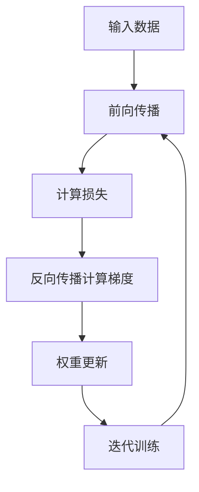

# 深度学习原理与代码实战案例讲解

## 1.背景介绍

深度学习是机器学习的一个新的研究热点领域,它源于对人脑神经网络进行建模和仿真的想法。近年来,由于算力的飞速提升、训练数据的爆炸式增长以及一些新算法的突破,深度学习取得了令人瞩目的进展,在语音识别、图像识别、自然语言处理等领域表现出色,甚至超越了人类的水平。

深度学习的核心思想是通过构建有多个隐藏层的神经网络模型,让计算机像人脑一样从数据中自动学习特征模式,并用于检测、分类或预测等任务。与传统的机器学习算法相比,深度学习模型具有自动从原始数据中提取多层次特征的能力,无需人工设计特征,因此在处理高维度原始数据时有着巨大的优势。

## 2.核心概念与联系

### 2.1 神经网络

神经网络是深度学习的核心模型,它是一种受生物神经系统启发而设计的算法模型。神经网络由大量的节点(神经元)和连接这些节点的边(权重)组成。每个节点会对从前一层接收到的信号进行加权求和,然后通过一个非线性激活函数进行处理,将结果传递给下一层。

神经网络的结构可以分为输入层、隐藏层和输出层。输入层接收原始数据,隐藏层对数据进行特征提取和转换,输出层给出最终的结果。通过对网络中的权重进行调整(训练),神经网络可以学习到从输入映射到输出的复杂函数关系。


### 2.2 深度学习与传统机器学习的区别

与传统的机器学习算法相比,深度学习有以下几个显著的特点:

1. **自动特征提取**: 深度学习模型能够自动从原始数据中学习出多层次的特征表示,而无需人工设计特征。这使得深度学习在处理原始数据(如图像、语音等)时具有巨大的优势。

2. **端到端学习**: 深度学习模型可以直接从原始输入到目标输出进行端到端的训练,无需分开训练各个子模块。

3. **层次化特征表示**: 深度学习模型通过多个隐藏层对数据进行层次化的特征转换和表示,从低层次的简单特征到高层次的复杂特征,这种分层结构能够很好地对抗噪声,提取出更加鲁棒的特征。

4. **海量数据和大规模并行计算**: 深度学习模型需要大量的数据和计算资源来进行有效的训练,这得益于近年来大数据和GPU/TPU等加速硬件的快速发展。

## 3.核心算法原理具体操作步骤  

深度学习算法的核心步骤主要包括:

1. **前向传播(Forward Propagation)**: 输入数据经过神经网络的各个层的计算,层层传递,最终得到输出结果。每一层的输出作为下一层的输入,通过对权重的线性组合和非线性激活函数的计算,实现从输入到输出的映射。

2. **反向传播(Backward Propagation)**: 通过比较输出结果与真实标签的差异(损失函数),计算每个权重对最终损失的敏感程度(梯度),然后沿着与前向传播相反的方向,将梯度自下而上地传播回各层的权重,从而确定每个权重需要调整的方向和幅度。

3. **权重更新(Weight Update)**: 根据计算出的梯度,采用一定的优化算法(如梯度下降)来更新网络中的权重和偏置参数,使得损失函数值不断减小,模型的预测结果不断逼近真实值。

4. **迭代训练(Iteration)**: 重复上述前向传播、反向传播和权重更新的过程,不断地优化网络参数,直到模型在训练集和验证集上的性能满足要求为止。



上述算法流程是深度学习模型训练的核心部分,通过不断迭代优化权重参数,使得模型能够从海量数据中学习到有效的特征表示和映射关系,从而完成各种预测、分类等任务。

## 4.数学模型和公式详细讲解举例说明

### 4.1 神经元数学模型

神经元是神经网络的基本计算单元,它接收来自上一层的输入信号,进行加权求和运算,然后通过一个非线性激活函数进行处理,将结果传递给下一层。

设第 $j$ 层第 $i$ 个神经元的输入为 $x_i^{(j)}$,权重为 $w_{ki}^{(j)}$,偏置为 $b_i^{(j)}$,激活函数为 $f$,则该神经元的输出 $a_i^{(j)}$ 可以表示为:

$$a_i^{(j)} = f\left(\sum_{k} w_{ki}^{(j)}x_k^{(j-1)} + b_i^{(j)}\right)$$

其中,输入 $x_i^{(j)}$ 是上一层所有神经元输出 $a_k^{(j-1)}$ 的加权和:

$$x_i^{(j)} = \sum_{k} w_{ki}^{(j)}a_k^{(j-1)}$$

常用的激活函数有Sigmoid函数、Tanh函数、ReLU函数等,它们的作用是引入非线性,增强神经网络的表达能力。

### 4.2 损失函数

在深度学习模型的训练过程中,需要定义一个损失函数(Loss Function)来衡量模型输出与真实标签之间的差异。通过最小化损失函数,可以不断优化模型参数,使得模型的预测结果逐渐逼近真实值。

对于分类问题,常用的损失函数是交叉熵损失函数(Cross Entropy Loss):

$$J(\theta) = -\frac{1}{m}\sum_{i=1}^{m}\sum_{j=1}^{C}y_i^{(j)}\log\hat{y}_i^{(j)}$$

其中, $m$ 是训练样本数, $C$ 是类别数, $y_i^{(j)}$ 是样本 $i$ 的真实标签(一个热编码向量), $\hat{y}_i^{(j)}$ 是模型对样本 $i$ 预测的第 $j$ 类的概率, $\theta$ 表示模型的所有参数。

对于回归问题,常用的损失函数是均方误差损失函数(Mean Squared Error Loss):

$$J(\theta) = \frac{1}{2m}\sum_{i=1}^{m}(\hat{y}_i - y_i)^2$$

其中, $m$ 是训练样本数, $\hat{y}_i$ 是模型对样本 $i$ 的预测值, $y_i$ 是样本 $i$ 的真实标签值。

### 4.3 反向传播算法

反向传播算法(Backpropagation)是深度学习模型训练的核心,它通过计算每个权重对最终损失函数的梯度,从而确定权重需要调整的方向和幅度。

假设神经网络有 $L$ 层,第 $l$ 层有 $s_l$ 个神经元,第 $(l+1)$ 层有 $s_{l+1}$ 个神经元。令 $a_i^{(l)}$ 表示第 $l$ 层第 $i$ 个神经元的输出,则第 $(l+1)$ 层第 $j$ 个神经元的输入为:

$$z_j^{(l+1)} = \sum_{i=1}^{s_l}w_{ji}^{(l+1)}a_i^{(l)} + b_j^{(l+1)}$$

其中, $w_{ji}^{(l+1)}$ 是连接第 $l$ 层第 $i$ 个神经元和第 $(l+1)$ 层第 $j$ 个神经元的权重,  $b_j^{(l+1)}$ 是第 $(l+1)$ 层第 $j$ 个神经元的偏置。

反向传播算法的核心思想是计算每个权重对最终损失函数的梯度,并沿着与前向传播相反的方向,将梯度自下而上地传播回各层的权重。具体步骤如下:

1. 前向传播计算输出: 输入数据经过网络的各层传播,计算最终的输出 $\hat{y}$。

2. 计算输出层误差: 根据输出 $\hat{y}$ 和真实标签 $y$,计算输出层的误差项 $\delta^{(L)}$。对于分类问题,误差项为 $\delta^{(L)} = \hat{y} - y$;对于回归问题,误差项为 $\delta^{(L)} = (\hat{y} - y) \odot f'(z^{(L)})$,其中 $f'$ 是激活函数的导数,  $\odot$ 表示元素wise乘积。

3. 反向传播误差: 从输出层开始,将误差项 $\delta^{(l+1)}$ 传播回第 $l$ 层,计算第 $l$ 层的误差项 $\delta^{(l)}$:

$$\delta^{(l)} = ((w^{(l+1)})^T\delta^{(l+1)}) \odot f'(z^{(l)})$$

4. 计算梯度: 对于每个权重 $w_{ji}^{(l+1)}$,计算它对损失函数的梯度:

$$\frac{\partial J}{\partial w_{ji}^{(l+1)}} = a_i^{(l)}\delta_j^{(l+1)}$$

对于每个偏置 $b_j^{(l+1)}$,计算它对损失函数的梯度:

$$\frac{\partial J}{\partial b_j^{(l+1)}} = \delta_j^{(l+1)}$$

5. 更新权重和偏置: 根据计算出的梯度,采用一定的优化算法(如梯度下降)来更新网络中的权重和偏置参数。

6. 迭代训练: 重复上述步骤,不断优化网络参数,直到模型在训练集和验证集上的性能满足要求为止。

反向传播算法通过有效地计算每个权重对最终损失函数的梯度,使得深度神经网络能够进行端到端的训练,从而学习到有效的特征表示和映射关系。

## 5.项目实践:代码实例和详细解释说明

为了更好地理解深度学习的原理和实现,我们将使用Python和TensorFlow框架,构建一个简单的多层感知机(MLP)模型,对MNIST手写数字数据集进行分类。

### 5.1 导入必要的库

```python
import tensorflow as tf
from tensorflow.keras.datasets import mnist
from tensorflow.keras.utils import to_categorical
from tensorflow.keras.models import Sequential
from tensorflow.keras.layers import Dense
import matplotlib.pyplot as plt
```

### 5.2 加载和预处理数据

```python
# 加载MNIST数据集
(x_train, y_train), (x_test, y_test) = mnist.load_data()

# 将数据归一化到0-1之间
x_train = x_train.reshape(60000, 784).astype('float32') / 255
x_test = x_test.reshape(10000, 784).astype('float32') / 255

# 将标签进行one-hot编码
y_train = to_categorical(y_train, num_classes=10)
y_test = to_categorical(y_test, num_classes=10)
```

### 5.3 构建多层感知机模型

```python
# 构建模型
model = Sequential([
    Dense(units=128, activation='relu', input_shape=(784,)),
    Dense(units=64, activation='relu'),
    Dense(units=10, activation='softmax')
])

# 编译模型
model.compile(optimizer='adam',
              loss='categorical_crossentropy',
              metrics=['accuracy'])
```

上述代码构建了一个包含两个隐藏层的多层感知机模型。第一个隐藏层有128个神经元,使用ReLU激活函数;第二个隐藏层有64个神经元,也使用ReLU激活函数;输出层有10个神经元(对应10个数字类别),使用Softmax激活函数。

### 5.4 训练模型

```python
# 训练模型
history = model.fit(x_train, y_train, epochs=10, batch_size=128, validation_data=(x_test, y_test))
```

上述代码将模型在训练集上进行了10个epoch的训练,每个batch的大小为128,并使用测试集作为验证集