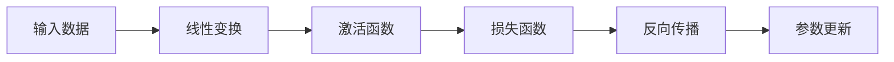

# 深度学习框架原理与代码实战案例讲解

## 1.背景介绍

在过去的几年里,深度学习技术取得了令人瞩目的进展,并在诸多领域展现出巨大的潜力和应用前景。作为推动深度学习发展的关键力量,各种深度学习框架应运而生,为研究人员和开发者提供了高效的工具和平台。本文将深入探讨三大主流深度学习框架:TensorFlow、PyTorch和MXNet,揭示它们的核心原理、算法实现和代码实战案例,帮助读者全面掌握这些框架的使用方法和底层机理。

### 1.1 深度学习的兴起

深度学习是机器学习的一个新的研究热点,它的理论基础可以追溯到20世纪80年代提出的人工神经网络(Artificial Neural Networks)。经过数十年的发展,benefiting from大数据、强大算力和新算法的驱动,深度学习在语音识别、图像分类、自然语言处理等领域取得了突破性进展,展现出超越传统机器学习方法的优异性能。

### 1.2 深度学习框架的重要性

尽管深度学习模型有着卓越的性能表现,但是从零开始构建和训练这些模型是一项艰巨的挑战。深度学习框架为研究人员和工程师提供了高度优化的基础架构和丰富的预置模型,极大简化了模型的开发和部署流程。此外,这些框架还支持跨平台的模型移植,提高了深度学习应用的可扩展性和可维护性。

## 2.核心概念与联系

在深入探讨具体的深度学习框架之前,我们有必要先了解一些核心概念,这些概念贯穿于各种框架之中,是理解它们的基础。

### 2.1 张量(Tensor)

张量是深度学习框架中表示数据的核心数据结构。它可以被视为一个多维数组,用于存储模型的参数和输入数据。不同的张量阶数(rank)代表不同的数据形式,例如0阶张量是标量、1阶张量是向量、2阶张量是矩阵等。

### 2.2 计算图(Computational Graph)

计算图是深度学习框架的核心抽象,它将模型的数学运算过程表示为一系列的节点(代表数学运算)和边(代表数据流动)。通过优化和并行化计算图中的运算,框架可以高效地执行模型的前向传播和反向传播过程。



### 2.3 自动微分(Automatic Differentiation)

自动微分是深度学习框架的核心功能之一,它通过计算图的反向传播自动计算出模型参数相对于损失函数的梯度,从而支持了基于梯度下降的优化算法。这避免了手动推导复杂模型梯度表达式的需要,大大简化了模型训练的过程。

### 2.4 动态图与静态图

深度学习框架根据构建计算图的方式,可以分为动态图(Dynamic Graph)和静态图(Static Graph)两种范式。动态图(如PyTorch)在运行时根据数据动态构建计算图,而静态图(如TensorFlow)需要在运行前先完整定义好计算图。两种范式各有优劣,动态图更加灵活和"Pythonic",而静态图则具有更好的优化和部署性能。

## 3.核心算法原理具体操作步骤

接下来,我们将分别介绍三大主流深度学习框架(TensorFlow、PyTorch和MXNet)的核心算法原理和具体操作步骤。

### 3.1 TensorFlow

TensorFlow是Google开源的一个用于机器学习和深度学习的框架,它采用了数据流图(Data Flow Graph)的编程范式。在TensorFlow中,计算过程被表示为一个有向图,其中节点代表操作(Operations),边代表张量(Tensor)在节点间的流动。

#### 3.1.1 核心算法原理

1. **计算图构建**

   TensorFlow使用Python代码构建计算图,定义出计算的每一个步骤。计算图中的节点表示具体的数学运算,而边则表示这些运算之间的数据依赖关系。

2. **会话管理**

   在TensorFlow中,计算图是静态的,需要在会话(Session)中启动后才能执行。会话负责分配资源(如GPU/CPU),并实际执行计算图中的运算。

3. **自动微分**

   TensorFlow通过计算图的反向传播自动计算出模型参数相对于损失函数的梯度,从而支持基于梯度下降的优化算法。这避免了手动推导复杂模型梯度表达式的需要。

4. **模型保存与部署**

   TensorFlow支持将训练好的模型保存为可序列化的格式,方便后续的模型加载和部署。此外,TensorFlow还提供了多种模型部署方案,包括在移动设备、浏览器和云端部署等。

#### 3.1.2 具体操作步骤

以下是使用TensorFlow构建、训练和部署一个简单的线性回归模型的步骤:

1. 导入所需的库
```python
import tensorflow as tf
```

2. 构建计算图
```python
# 定义占位符,用于输入数据
X = tf.placeholder(tf.float32, shape=[None, 1])
y = tf.placeholder(tf.float32, shape=[None, 1])

# 定义模型参数
W = tf.Variable(tf.random_normal([1]), name='weight')
b = tf.Variable(tf.zeros([1]), name='bias')

# 定义前向传播过程
y_pred = tf.matmul(X, W) + b

# 定义损失函数和优化器
loss = tf.reduce_mean(tf.square(y_pred - y))
optimizer = tf.train.GradientDescentOptimizer(0.01).minimize(loss)
```

3. 启动会话并训练模型
```python
# 创建会话
sess = tf.Session()

# 初始化变量
init = tf.global_variables_initializer()
sess.run(init)

# 训练模型
for i in range(1000):
    sess.run(optimizer, feed_dict={X: X_train, y: y_train})

# 评估模型
W_value, b_value = sess.run([W, b])
print(f"Weight: {W_value}, Bias: {b_value}")
```

4. 保存和加载模型
```python
# 保存模型
saver = tf.train.Saver()
saver.save(sess, 'model.ckpt')

# 加载模型
new_saver = tf.train.import_meta_graph('model.ckpt.meta')
new_saver.restore(sess, 'model.ckpt')
```

5. 模型部署(示例:在移动设备上部署)
```python
# 将模型转换为TensorFlow Lite格式
converter = tf.lite.TFLiteConverter.from_saved_model('model.ckpt')
tflite_model = converter.convert()

# 将TensorFlow Lite模型部署到移动设备
```

### 3.2 PyTorch

PyTorch是一个由Facebook开源的深度学习框架,它采用了动态计算图的编程范式,与TensorFlow形成了鲜明对比。PyTorch的设计理念是"高度灵活和可扩展",它提供了类似NumPy的张量计算接口,使得模型构建和调试变得更加简单和"Pythonic"。

#### 3.2.1 核心算法原理

1. **动态计算图**

   与TensorFlow不同,PyTorch采用动态计算图的方式,在运行时根据数据动态构建计算图。这种方式更加灵活,但可能会牺牲一些优化和部署性能。

2. **自动微分**

   PyTorch通过`autograd`模块实现了自动微分功能。在执行正向传播时,PyTorch会同时跟踪计算过程,从而在反向传播时自动计算出梯度。

3. **模型定义与训练**

   PyTorch使用Python类来定义模型结构,并提供了`nn`模块封装了常用的网络层和损失函数。用户可以灵活地组合和定制这些模块,构建出所需的模型。

4. **GPU加速**

   PyTorch提供了对CUDA的无缝支持,可以高效地利用GPU进行并行计算,加速模型的训练和推理过程。

#### 3.2.2 具体操作步骤

以下是使用PyTorch构建、训练和部署一个简单的线性回归模型的步骤:

1. 导入所需的库
```python
import torch
import torch.nn as nn
```

2. 定义模型
```python
class LinearRegression(nn.Module):
    def __init__(self):
        super().__init__()
        self.linear = nn.Linear(1, 1)

    def forward(self, x):
        return self.linear(x)
```

3. 准备数据和模型
```python
# 准备数据
X_train = torch.randn(100, 1)
y_train = 3 * X_train + 2 + torch.randn(100, 1)

# 实例化模型
model = LinearRegression()

# 定义损失函数和优化器
criterion = nn.MSELoss()
optimizer = torch.optim.SGD(model.parameters(), lr=0.01)
```

4. 训练模型
```python
# 训练模型
for epoch in range(1000):
    y_pred = model(X_train)
    loss = criterion(y_pred, y_train)

    optimizer.zero_grad()
    loss.backward()
    optimizer.step()

# 评估模型
with torch.no_grad():
    y_test = model(X_train)
    print(f"Weight: {model.linear.weight.item()}, Bias: {model.linear.bias.item()}")
```

5. 保存和加载模型
```python
# 保存模型
torch.save(model.state_dict(), 'model.pth')

# 加载模型
new_model = LinearRegression()
new_model.load_state_dict(torch.load('model.pth'))
```

6. 模型部署(示例:在C++中加载PyTorch模型)
```cpp
#include <torch/script.h>

// 加载PyTorch模型
torch::jit::script::Module model = torch::jit::load("model.pt");

// 执行模型推理
std::vector<torch::jit::IValue> inputs;
inputs.push_back(torch::ones({1, 1}));
auto outputs = model.forward(inputs);
```

### 3.3 MXNet

MXNet是一个由Apache软件基金会开源的深度学习框架,它结合了命令式编程和符号式编程两种范式的优点。MXNet具有高效的分布式计算能力,可以在多GPU和多机器环境下进行模型的并行训练。

#### 3.3.1 核心算法原理

1. **命令式编程与符号式编程**

   MXNet支持两种编程范式:命令式编程(Imperative Programming)和符号式编程(Symbolic Programming)。命令式编程更加灵活和直观,而符号式编程则具有更好的优化和并行化能力。

2. **计算图优化**

   MXNet会根据输入数据的形状,自动推导出计算图的最优执行方式。这种延迟绑定(Lazy Binding)机制可以有效减少内存占用,并提高计算效率。

3. **自动并行化**

   MXNet支持自动并行化,可以在多GPU和多机器环境下高效地进行模型的并行训练,从而加快训练速度。

4. **模型部署**

   MXNet提供了多种模型部署方案,包括在移动设备、云端和嵌入式系统等环境中部署。此外,MXNet还支持模型的量化和压缩,以减小模型的footprint。

#### 3.3.2 具体操作步骤

以下是使用MXNet构建、训练和部署一个简单的线性回归模型的步骤:

1. 导入所需的库
```python
import mxnet as mx
from mxnet import nd, autograd
```

2. 准备数据
```python
# 准备数据
X_train = nd.random.normal(shape=(100, 1))
y_train = 3 * X_train + 2 + nd.random.normal(shape=(100, 1))
```

3. 定义模型
```python
# 定义模型
W = nd.random.normal(shape=(1, 1))
b = nd.zeros(shape=(1,))

def model(X):
    return nd.dot(X, W.T) + b

# 定义损失函数
loss_fn = lambda y_pred, y_true: (y_pred - y_true)**2
```

4. 训练模型
```python
# 训练模型
learning_rate = 0.01
for epoch in range(1000):
    with autograd.record():
        y_pred = model(X_train)
        loss = loss_fn(y_pred, y_train).mean()
    loss.backward()

    W.assign_sub(learning_rate * W.grad())
    b.assign_sub(learning_rate * b.grad())

    W.grad().zeros()
    b.grad().zeros()

# 评估模型
print(f"