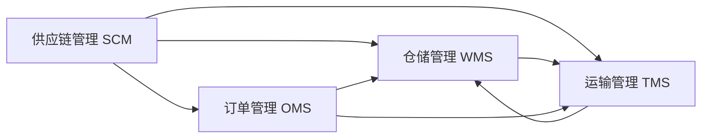

# 物流管理系统详细设计与具体代码实现

## 1. 背景介绍

物流管理在现代企业运营中扮演着至关重要的角色。随着全球化贸易的不断深入和电子商务的蓬勃发展,高效、智能的物流管理系统已成为企业提升竞争力,优化供应链的关键因素。本文将深入探讨物流管理系统的详细设计与具体代码实现,为读者提供全面、实用的技术指南。

### 1.1 物流管理系统概述
#### 1.1.1 定义与目标
#### 1.1.2 系统架构与功能模块
#### 1.1.3 技术选型与开发环境

### 1.2 物流行业现状与挑战  
#### 1.2.1 行业发展趋势
#### 1.2.2 面临的主要问题
#### 1.2.3 智能化与自动化的需求

## 2. 核心概念与联系

在设计与实现物流管理系统时,需要深入理解以下核心概念及其相互联系:

### 2.1 供应链管理(SCM)
#### 2.1.1 定义与目标
#### 2.1.2 关键流程与活动
#### 2.1.3 与物流管理的关系

### 2.2 仓储管理(WMS) 
#### 2.2.1 定义与功能
#### 2.2.2 库存控制与优化
#### 2.2.3 与运输管理的协同

### 2.3 运输管理(TMS)
#### 2.3.1 定义与功能  
#### 2.3.2 路径规划与调度
#### 2.3.3 与仓储管理的协同

### 2.4 订单管理(OMS)
#### 2.4.1 定义与流程
#### 2.4.2 订单履行与跟踪
#### 2.4.3 与物流管理的关系

以下是物流管理系统核心概念之间的联系示意图:



## 3. 核心算法原理具体操作步骤

物流管理系统涉及多个核心算法,以下详细介绍其原理与具体操作步骤:

### 3.1 库存控制算法
#### 3.1.1 经济订货批量(EOQ)模型
##### 3.1.1.1 基本假设与公式
##### 3.1.1.2 计算步骤与示例
#### 3.1.2 再订货点(ROP)模型 
##### 3.1.2.1 基本原理与公式
##### 3.1.2.2 计算步骤与示例
#### 3.1.3 ABC分类法
##### 3.1.3.1 基本原理与步骤
##### 3.1.3.2 分类标准与管理策略

### 3.2 路径规划算法
#### 3.2.1 旅行商问题(TSP) 
##### 3.2.1.1 问题定义与建模
##### 3.2.1.2 精确算法:动态规划、分支定界
##### 3.2.1.3 启发式算法:贪心算法、遗传算法
#### 3.2.2 车辆路径问题(VRP)
##### 3.2.2.1 问题定义与变种
##### 3.2.2.2 建模与求解方法
##### 3.2.2.3 启发式算法:禁忌搜索、蚁群算法

### 3.3 订单批处理算法
#### 3.3.1 订单合并
##### 3.3.1.1 合并规则与策略
##### 3.3.1.2 合并算法步骤
#### 3.3.2 波次拣选 
##### 3.3.2.1 基本原理与优势
##### 3.3.2.2 拣选策略与算法

## 4. 数学模型和公式详细讲解举例说明

本节将详细讲解物流管理系统中的关键数学模型和公式,并提供具体的举例说明。

### 4.1 经济订货批量(EOQ)模型
EOQ模型用于确定最优订货量,以平衡订货成本和库存持有成本。其基本公式为:

$$Q^* = \sqrt{\frac{2DS}{H}}$$

其中,$Q^*$为最优订货量,$D$为年需求量,$S$为单次订货成本,$H$为单位库存持有成本。

举例:某公司年需求量为1000件,单次订货成本为100元,单位库存持有成本为2元/件/年。求最优订货量。

解:代入公式得:

$$Q^* = \sqrt{\frac{2\times1000\times100}{2}} = 100$$

因此,最优订货量为100件。

### 4.2 再订货点(ROP)模型
ROP模型用于确定再订货点,即当库存降至某一水平时触发补货。其基本公式为:

$$ROP = d \times L + SS$$

其中,$d$为日需求量,$L$为提前期,$SS$为安全库存。

举例:某公司日需求量为20件,提前期为5天,安全库存为50件。求再订货点。

解:代入公式得:

$$ROP = 20 \times 5 + 50 = 150$$

因此,再订货点为150件。

### 4.3 旅行商问题(TSP)模型
TSP问题可表述为:给定n个城市和城市间距离,求访问每个城市一次并返回起点的最短路径。其数学模型为:

$$\min \sum_{i=1}^n \sum_{j=1}^n c_{ij}x_{ij}$$

$$s.t. \sum_{i=1}^n x_{ij} = 1, j=1,2,\cdots,n$$
$$\sum_{j=1}^n x_{ij} = 1, i=1,2,\cdots,n$$
$$x_{ij} \in \{0,1\}, i,j=1,2,\cdots,n$$

其中,$c_{ij}$为城市$i$到城市$j$的距离,$x_{ij}$为决策变量,当$x_{ij}=1$时表示从城市$i$到城市$j$,否则$x_{ij}=0$。

举例:假设有4个城市,距离矩阵为:

$$
C = 
\begin{bmatrix}
0 & 2 & 9 & 3\\\\
2 & 0 & 6 & 4\\\\
9 & 6 & 0 & 5\\\\
3 & 4 & 5 & 0
\end{bmatrix}
$$

求最短旅行路径。

解:利用动态规划算法求解,最短路径为1-2-4-3-1,总距离为14。

## 5. 项目实践:代码实例和详细解释说明

本节将提供物流管理系统的核心功能代码实例,并对关键部分进行详细解释说明。

### 5.1 库存管理模块
#### 5.1.1 库存查询与更新
```python
def get_inventory(item_id):
    """查询商品库存"""
    sql = "SELECT quantity FROM inventory WHERE item_id = ?"
    result = db.execute(sql, (item_id,)).fetchone()
    return result[0] if result else 0

def update_inventory(item_id, quantity):
    """更新商品库存"""
    sql = "UPDATE inventory SET quantity = quantity + ? WHERE item_id = ?"
    db.execute(sql, (quantity, item_id))
    db.commit()
```

以上代码实现了基本的库存查询与更新功能。`get_inventory`函数根据商品ID查询当前库存量,`update_inventory`函数则根据传入的数量对库存进行增减。

#### 5.1.2 经济订货批量计算
```python
def calculate_eoq(demand, order_cost, holding_cost):
    """计算经济订货批量"""
    return math.sqrt(2 * demand * order_cost / holding_cost)

def get_order_quantity(item_id):
    """获取推荐订货量"""
    demand = get_annual_demand(item_id)
    order_cost = get_order_cost(item_id)
    holding_cost = get_holding_cost(item_id)
    eoq = calculate_eoq(demand, order_cost, holding_cost)
    return round(eoq)
```

以上代码实现了经济订货批量(EOQ)的计算。`calculate_eoq`函数根据年需求量、订货成本和库存持有成本计算最优订货量,`get_order_quantity`函数则综合考虑各项因素,返回推荐的订货量。

### 5.2 运输管理模块
#### 5.2.1 旅行商问题求解
```python
def tsp_dp(dist):
    """动态规划求解TSP问题"""
    n = len(dist)
    dp = [[float('inf')] * n for _ in range(1 << n)]
    dp[1][0] = 0
    
    for mask in range(1, 1 << n):
        if mask & 1 == 0:
            continue
        for i in range(1, n):
            if mask & (1 << i):
                prev_mask = mask ^ (1 << i)
                for j in range(n):
                    if prev_mask & (1 << j):
                        dp[mask][i] = min(dp[mask][i], dp[prev_mask][j] + dist[j][i])
    
    return min(dp[-1][i] + dist[i][0] for i in range(1, n))
```

以上代码实现了利用动态规划算法求解TSP问题。`tsp_dp`函数接受一个距离矩阵`dist`,返回最短旅行路径的总距离。通过状态压缩和动态规划,可以在$O(n^2 2^n)$的时间复杂度内求解TSP问题。

#### 5.2.2 车辆路径问题求解
```python
def vrp_tabu(dist, capacity, demands):
    """禁忌搜索求解VRP问题"""
    n = len(dist)
    tabu_list = []
    best_solution = None
    best_cost = float('inf')
    
    # 初始解
    solution = generate_initial_solution(n, capacity, demands)
    cost = calculate_cost(solution, dist)
    
    while not is_terminate():
        # 生成邻域解
        neighborhood = generate_neighborhood(solution)
        
        # 选择最优邻域解
        for neighbor in neighborhood:
            if neighbor not in tabu_list:
                neighbor_cost = calculate_cost(neighbor, dist)
                if neighbor_cost < best_cost:
                    best_solution = neighbor
                    best_cost = neighbor_cost
        
        # 更新当前解和禁忌表        
        solution = best_solution
        tabu_list.append(solution)
        if len(tabu_list) > MAX_TABU_SIZE:
            tabu_list.pop(0)
            
    return best_solution, best_cost
```

以上代码实现了利用禁忌搜索算法求解VRP问题。`vrp_tabu`函数接受距离矩阵`dist`、车辆容量`capacity`和客户需求`demands`,返回最优车辆路径和总成本。

算法流程如下:
1. 生成初始解
2. 进入循环,直到满足终止条件:
   - 生成当前解的邻域解
   - 选择最优邻域解(不在禁忌表中)作为新的当前解
   - 将新解加入禁忌表,并移除最早进入的解
3. 返回最优解和总成本

通过禁忌搜索,可以在合理的时间内获得VRP问题的高质量解。

### 5.3 订单管理模块
#### 5.3.1 订单合并
```python
def merge_orders(orders):
    """订单合并"""
    merged_orders = []
    
    # 按客户分组
    orders_by_customer = {}
    for order in orders:
        customer_id = order['customer_id']
        if customer_id not in orders_by_customer:
            orders_by_customer[customer_id] = []
        orders_by_customer[customer_id].append(order)
        
    # 合并同一客户的订单    
    for customer_id, customer_orders in orders_by_customer.items():
        merged_order = {
            'customer_id': customer_id,
            'items': [],
            'total_amount': 0
        }
        for order in customer_orders:
            merged_order['items'].extend(order['items'])
            merged_order['total_amount'] += order['total_amount']
        merged_orders.append(merged_order)
        
    return merged_orders
```

以上代码实现了订单合并功能。`merge_orders`函数接受一组订单,返回合并后的订单列表。合并规则为:将同一客户的所有订单合并为一个订单,合并后的订单包含所有商品并累加总金额。

#### 5.3.2 波次拣选
```python
def batch_picking(orders, batch_size):
    """波次拣选"""
    batches = []
    
    # 按仓库分区分组
    orders_by_zone = {}
    for order in orders:
        zone = get_zone(order['items'])
        if zone not in orders_by_zone:
            orders_by_zone[zone] = []
        orders_by_zone[zone].append(order)
        
    # 生成拣选波次    
    for zone, zone_orders in orders_by_zone.items():
        while len(zone_orders) > 0:
            batch = zone_orders[:batch_size]
            batches.append(batch)
            zone_orders = zone_orders[batch_