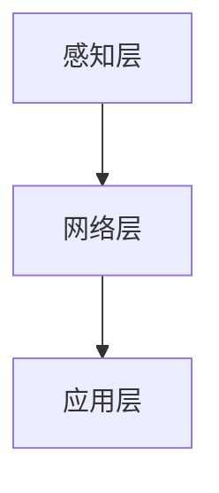

# 物联网(IoT)技术和各种传感器设备的集成：物联网的系统集成

## 1.背景介绍

### 1.1 物联网(IoT)的定义与发展历程
#### 1.1.1 物联网的定义
物联网(Internet of Things, IoT)是指通过各种信息传感设备,按约定的协议,把任何物品与互联网相连接,进行信息交换和通信,以实现智能化识别、定位、跟踪、监控和管理的一种网络。它是继计算机、互联网之后的又一次信息产业浪潮。

#### 1.1.2 物联网的发展历程
物联网概念最早由麻省理工学院(MIT)的Kevin Ashton教授于1999年提出。2005年国际电信联盟(ITU)发布了《ITU互联网报告2005:物联网》,标志着物联网概念开始被业界广泛接受。近年来,随着传感器、无线通信、大数据等技术的快速发展,物联网进入了高速发展阶段。

### 1.2 物联网系统的架构与特点
#### 1.2.1 物联网系统的架构
物联网系统通常由感知层、网络层和应用层三个部分组成:

- 感知层:由各种传感器、RFID、摄像头等设备组成,负责采集物理世界的信息。  
- 网络层:将感知层采集的信息进行传输,通常包括各种有线和无线通信网络。
- 应用层:对采集到的数据进行处理和分析,实现各种智能化应用。

#### 1.2.2 物联网系统的特点
物联网系统具有以下几个主要特点:

1. 广泛的连接性:物联网可以将各种物理设备连接起来,形成一个庞大的网络。
2. 海量的数据:物联网设备产生的数据量巨大,需要大数据技术进行处理和分析。  
3. 智能化:通过对数据的分析,物联网可以实现设备的智能控制和优化决策。
4. 异构性:物联网涉及多种不同类型的设备和协议,需要解决互联互通的问题。

### 1.3 物联网中的传感器设备
#### 1.3.1 传感器的定义与分类
传感器是物联网感知层的核心组件,可以将物理量转换为电信号。按照检测对象和工作原理,传感器可分为:

- 热敏电阻、热电偶等温度传感器
- 电阻应变式、压电式等压力传感器  
- 电容式、超声波式等液位传感器
- 霍尔式、电磁式等位移传感器
- 加速度计、陀螺仪等运动传感器
- 气敏、湿敏等环境传感器

#### 1.3.2 MEMS传感器 
MEMS(Micro-Electro-Mechanical System)传感器是一种微型化、集成化的传感器,具有体积小、功耗低、成本低、可批量生产等优点,在物联网中得到广泛应用。常见的MEMS传感器有压力传感器、惯性传感器、麦克风等。

#### 1.3.3 智能传感器
智能传感器是在传感器的基础上集成了信号处理、自诊断、通信等功能,可以实现信息的采集、处理、交换和控制。智能传感器具有体系结构开放、接口标准化、功能可重构等特点,是物联网的发展方向之一。

## 2.核心概念与联系

### 2.1 物联网协议
物联网协议是指物联网设备之间进行通信和数据交换所遵循的规范。由于物联网设备种类繁多,不同厂商的设备所采用的协议也各不相同,因此需要一些标准的物联网协议来实现互联互通。

#### 2.1.1 传输层协议
传输层协议主要解决端到端的通信问题,常见的有TCP、UDP、MQTT等。

- TCP是一种面向连接的可靠传输协议,能够保证数据的完整性,但是传输效率较低。
- UDP是一种无连接的不可靠传输协议,传输效率高,但是可能会丢包。
- MQTT是一种轻量级的发布/订阅式消息传输协议,适用于低带宽、不稳定的网络环境。

#### 2.1.2 应用层协议 
应用层协议定义了应用程序之间交互的规则,常见的有HTTP、CoAP、XMPP等。

- HTTP是互联网上最常用的应用层协议,但是对于资源受限的物联网设备来说较为"重量级"。
- CoAP是一种类似HTTP的轻量级协议,采用二进制格式,可以运行在UDP之上,适合资源受限的环境。
- XMPP是一种基于XML的消息传递协议,支持即时通讯、状态更新等功能。

### 2.2 边缘计算
边缘计算是指在靠近物联网设备或数据源的网络边缘侧,融合网络、计算、存储、应用核心能力的开放平台,就近提供边缘智能服务,满足行业数字化在敏捷连接、实时业务、数据优化、应用智能、安全与隐私保护等方面的关键需求。

相比于传统的云计算模式,边缘计算具有以下优势:

1. 低时延:数据在本地处理,避免了传输到云端的网络时延。
2. 节省带宽:大量数据在本地处理和存储,减少了对网络带宽的占用。
3. 隐私保护:敏感数据可以在本地处理,无需上传至云端,降低了隐私泄露的风险。
4. 高可靠:即使在网络中断的情况下,本地的业务逻辑也可以持续运行。

### 2.3 数字孪生
数字孪生(Digital Twin)是指物理实体在数字世界中的虚拟表示,通过传感器数据实时映射物理实体的状态,并可以对其进行分析、预测和优化。数字孪生可以应用于产品设计、生产制造、运维管理等各个环节。

在物联网系统中,数字孪生主要有以下作用:

1. 设备监控:通过数字孪生实时监控设备的运行状态,预测设备的健康状况和剩余寿命。
2. 性能优化:利用数字孪生对设备进行仿真和优化,提高系统的性能和效率。
3. 远程运维:通过数字孪生对远程设备进行诊断和维护,减少现场作业的需求。
4. 业务创新:利用数字孪生开发新的业务模式和服务,如设备租赁、预测性维护等。

## 3.核心算法原理具体操作步骤

### 3.1 数据预处理
由于物联网设备采集的数据通常存在噪声、异常值、缺失值等问题,因此在进行数据分析之前,需要对原始数据进行预处理。常用的数据预处理方法包括:

1. 数据清洗:去除噪声、异常值等"脏"数据,提高数据质量。常用的方法有中位数滤波、卡尔曼滤波等。
2. 数据填充:对缺失值进行填充,保证数据的完整性。常用的方法有均值填充、最近邻填充等。
3. 数据归一化:将不同量纲的数据统一到同一尺度,便于进行比较和分析。常用的方法有最大最小值归一化、Z-score归一化等。
4. 数据降维:对高维数据进行降维处理,减少数据的复杂度。常用的方法有PCA、t-SNE等。

### 3.2 数据融合
物联网系统通常由多个异构的传感器组成,不同传感器采集的数据在时间、空间、语义上可能存在差异,需要进行数据融合以获得一致的、高质量的信息。数据融合的方法可分为三类:

1. 数据层融合:对同一目标的多个传感器数据进行融合,如加权平均、卡尔曼滤波等。
2. 特征层融合:提取不同传感器数据的特征,再对特征进行融合,如特征拼接、特征选择等。
3. 决策层融合:对不同传感器的决策结果进行融合,如投票法、贝叶斯融合等。

### 3.3 数据挖掘
数据挖掘是从大量的数据中发现隐藏的、有价值的知识的过程。在物联网系统中,可以利用数据挖掘技术从海量的传感器数据中提取有用的信息,用于设备监控、故障诊断、行为分析等。常用的数据挖掘算法包括:

1. 关联规则挖掘:发现数据项之间的关联关系,如Apriori、FP-growth等。
2. 聚类:将相似的数据划分到同一类别,如K-means、DBSCAN等。
3. 异常检测:发现数据中的异常模式,如基于统计的方法、基于距离的方法等。
4. 时间序列分析:对时间序列数据进行建模和预测,如ARIMA、RNN等。

## 4.数学模型和公式详细讲解举例说明

### 4.1 卡尔曼滤波
卡尔曼滤波是一种常用的数据融合算法,可以对含有噪声的数据进行滤波和预测。其基本思想是:在每个时刻,根据当前的测量值和先前的预测值,得到一个最优的估计值。

卡尔曼滤波的数学模型如下:

状态方程:
$$x_k = Ax_{k-1} + Bu_k + w_k$$

观测方程:  
$$z_k = Hx_k + v_k$$

其中,$x_k$为k时刻的状态向量,$u_k$为控制量,$z_k$为观测值,$w_k$和$v_k$分别为过程噪声和观测噪声,满足高斯白噪声,协方差矩阵分别为$Q$和$R$。

卡尔曼滤波的具体步骤如下:

1. 预测:根据上一时刻的最优估计值和状态方程,预测当前时刻的状态。
$$\hat{x}_k^- = A\hat{x}_{k-1} + Bu_k$$
$$P_k^- = AP_{k-1}A^T + Q$$

2. 更新:根据当前时刻的观测值,对预测值进行校正,得到最优估计值。
$$K_k = P_k^-H^T(HP_k^-H^T+R)^{-1}$$
$$\hat{x}_k = \hat{x}_k^- + K_k(z_k - H\hat{x}_k^-)$$
$$P_k = (I-K_kH)P_k^-$$

其中,$\hat{x}_k^-$和$\hat{x}_k$分别为预测值和最优估计值,$P_k^-$和$P_k$为对应的协方差矩阵,$K_k$为卡尔曼增益。

举例来说,假设我们要对一个移动机器人的位置进行估计,机器人的状态向量为$x=[p_x,p_y,v_x,v_y]^T$,分别表示位置和速度。状态方程为:

$$
\begin{bmatrix} 
p_x \\ p_y \\ v_x \\ v_y
\end{bmatrix}_{k+1} = 
\begin{bmatrix}
1 & 0 & \Delta t & 0\\
0 & 1 & 0 & \Delta t\\
0 & 0 & 1 & 0\\ 
0 & 0 & 0 & 1
\end{bmatrix}
\begin{bmatrix} 
p_x \\ p_y \\ v_x \\ v_y
\end{bmatrix}_k + w_k
$$

观测方程为:

$$
\begin{bmatrix}
z_{px} \\ z_{py} 
\end{bmatrix}_k = 
\begin{bmatrix}
1 & 0 & 0 & 0 \\
0 & 1 & 0 & 0
\end{bmatrix}
\begin{bmatrix} 
p_x \\ p_y \\ v_x \\ v_y
\end{bmatrix}_k + v_k
$$

其中,$\Delta t$为采样时间间隔。假设初始位置为$\hat{x}_0 = [0,0,0,0]^T$,初始协方差矩阵为$P_0=\mathrm{diag}(1,1,1,1)$,过程噪声协方差矩阵$Q=\mathrm{diag}(0.1,0.1,0.1,0.1)$,观测噪声协方差矩阵$R=\mathrm{diag}(1,1)$。

根据卡尔