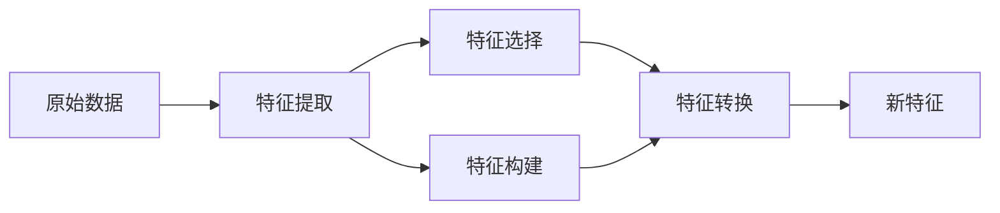

# 特征工程 (Feature Engineering) 原理与代码实例讲解

## 1. 背景介绍

在机器学习和数据挖掘领域,特征工程是一个非常重要而且耗时的环节。它是指通过数据的转换和处理,从原始数据中提取出能更好地表示潜在问题的特征,从而提高机器学习模型的性能。一个优秀的特征工程过程,可以大幅度提升模型的准确率和泛化能力。

### 1.1 特征工程的重要性

- 直接影响模型的性能表现
- 能够减少训练时间,提高训练效率  
- 有助于降低模型的过拟合风险
- 能够提高模型的可解释性

### 1.2 特征工程的主要步骤

- 特征提取 (Feature Extraction)
- 特征选择 (Feature Selection) 
- 特征构建 (Feature Construction)
- 特征转换 (Feature Transformation)

## 2. 核心概念与联系

### 2.1 特征 (Feature)

特征是样本的一个可度量的属性或特性。在机器学习任务中,特征通常是指数据集中的列(列表示一个可度量的属性)。一组特征可以看作是表示样本的特征向量。

### 2.2 特征提取 (Feature Extraction)

特征提取是指从原始数据中提取出能够更好地表示样本特点,且利于机器学习模型学习的新特征的过程。常见的特征提取方法有:

- 时域特征:均值、方差、峰度等统计量
- 频域特征:傅里叶变换、小波变换等
- 图像特征:SIFT、HOG、LBP等
- 文本特征:TF-IDF、Word2Vec等

### 2.3 特征选择 (Feature Selection)

特征选择是指从原有特征集合中选择出一个最优特征子集的过程,目的是去除冗余和不相关的特征,从而提高模型性能,降低过拟合风险。常见的特征选择方法有:  

- 过滤法 (Filter):方差选择法、卡方检验、互信息等
- 包裹法 (Wrapper):递归特征消除法、序列特征选择等  
- 嵌入法 (Embedding):L1正则化、决策树等

### 2.4 特征构建 (Feature Construction) 

特征构建是指基于领域知识和经验,人工地构建一些新特征的过程。比如在CTR预估领域,可以组合用户的人口统计学特征和历史行为特征构建新的组合特征。

### 2.5 特征转换 (Feature Transformation)

特征转换是指对特征进行某种数学变换,将特征映射到一个新的空间,从而使样本在新空间更容易区分。常见的特征变换方法有:

- 标准化/归一化:使特征数据分布均匀
- 对数变换:平滑长尾分布
- 多项式变换:引入特征的高阶和交叉项
- PCA/LDA:对特征进行降维

下图展示了特征工程各个核心概念之间的关系:



## 3. 核心算法原理具体操作步骤

### 3.1 特征提取算法

#### 3.1.1 统计特征提取

对于数值型特征,可以提取一些统计学特征,如均值、方差、偏度、峰度等。以均值为例,提取步骤如下:

1. 读入数据集,获得目标列的所有样本值
2. 对所有样本值求和,然后除以样本总数,得到均值

#### 3.1.2 文本特征提取

对于文本型特征,可以使用词袋模型、TF-IDF等方法提取特征。以TF-IDF为例,提取步骤如下:

1. 对文本进行分词处理
2. 统计每个词在每个文档中的词频TF
3. 统计每个词在所有文档中的文档频率DF 
4. 根据公式计算每个词的IDF:$IDF=log(\frac{N}{DF})$
5. 对于每个文档,将每个词的TF与IDF相乘,得到TF-IDF值作为新的特征

### 3.2 特征选择算法

#### 3.2.1 过滤法-方差选择法

方差选择法的核心思想是,方差太小的特征说明样本在这个特征上几乎没有差异,对判别没有贡献,因此可以去除。步骤如下:

1. 计算每个特征的方差
2. 设定方差阈值,去除方差小于阈值的特征
3. 返回剩下的特征子集

#### 3.2.2 包裹法-递归特征消除法

递归特征消除法 (Recursive Feature Elimination) 的核心思想是反复构建模型,每次基于模型的权重系数消除若干特征,直到达到所需的特征数量。步骤如下:

1. 输入特征矩阵和目标向量,设置所需的特征数量K
2. 基于所有特征训练模型,得到特征权重系数
3. 去除若干权重系数最小的特征  
4. 重复步骤2-3,直到剩下K个特征
5. 输出最终的特征子集

### 3.3 特征构建示例

以CTR预估中的用户年龄和历史点击次数为例,可以构建一个组合特征"年龄段_点击次数":

1. 将年龄划分为几个区间,比如 (0,18]、(18,25]、(25,35]、(35,50]、(50,+)
2. 将点击次数也划分为几个区间,比如 [0,100]、(100,500]、(500,1000]、(1000,+)
3. 将年龄段和点击次数进行组合,比如"18-25岁_点击100-500次"作为一个新的特征

### 3.4 特征变换算法

#### 3.4.1 标准化

标准化 (Standardization) 的目的是将特征数据变换为均值为0、方差为1的标准正态分布,使得不同特征之间更容易比较。步骤如下:

1. 对于每个特征,计算其均值$\mu$和标准差$\sigma$ 
2. 对每个样本的特征值 $x$,转化为 $z=\frac{x-\mu}{\sigma}$
3. 得到标准化后的特征矩阵

#### 3.4.2 主成分分析PCA  

主成分分析 (Principal Component Analysis) 是一种常用的线性降维方法。其核心思想是将高维特征空间映射到低维空间,尽可能保留数据的原有信息。步骤如下:

1. 对所有样本的特征向量构成的矩阵 $X$ 进行中心化
2. 计算协方差矩阵 $C=\frac{1}{m}X^TX$
3. 对协方差矩阵 $C$ 进行特征值分解
4. 取最大的 $d$ 个特征值对应的特征向量构成映射矩阵 $P$
5. 对样本特征矩阵 $X$ 进行映射,得到降维后的新矩阵 $Y=PX$

## 4. 数学模型和公式详细讲解举例说明

### 4.1 方差

方差用于度量一组数据的离散程度,是每个样本与均值差平方的均值,公式为:

$$Var(X)=\frac{1}{n}\sum_{i=1}^{n}(x_i-\bar{x})^2$$

其中,$X$表示随机变量,$n$为样本数量,$x_i$为第$i$个样本,$\bar{x}$为样本均值。

举例说明:假设有5个样本的某特征值为 ${1,2,3,4,5}$,则均值 $\bar{x}=3$,方差为:

$$Var=\frac{(1-3)^2+(2-3)^2+(3-3)^2+(4-3)^2+(5-3)^2}{5}=2$$

### 4.2 TF-IDF

TF-IDF (Term Frequency-Inverse Document Frequency)是一种用于评估词语在文本中重要性的统计方法。TF衡量词语在文档中的频率,IDF衡量词语在语料库中的稀缺程度。

- TF: 词频,表示词语 $t$ 在文档 $d$ 中出现的频率。

$$TF(t,d) = \frac{词语t在文档d中出现的次数}{文档d的总词数}$$

- IDF: 逆文档频率,衡量词语的稀缺程度。$N$为语料库的文档总数, $DF(t)$ 为包含词语 $t$ 的文档数。

$$IDF(t) = log(\frac{N}{DF(t)})$$

- TF-IDF: TF与IDF的乘积,既考虑了词语频率,又考虑了词语稀缺程度。

$$TF-IDF(t,d) = TF(t,d) \times IDF(t)$$

举例说明:假设语料库有100万个文档,其中包含"机器学习"的文档有1000个,包含"哈哈哈"的文档有10万个。对于某篇文档A,其中"机器学习"出现20次,"哈哈哈"出现50次,文档总词数为1000。则:

- "机器学习"的TF=20/1000=0.02,"哈哈哈"的TF=50/1000=0.05
- "机器学习"的IDF=log(1000000/1000)=6,"哈哈哈"的IDF=log(1000000/100000)=2  
- "机器学习"的TF-IDF=0.02*6=0.12,"哈哈哈"的TF-IDF=0.05*2=0.1

可见,"机器学习"虽然频率低于"哈哈哈",但是在更多文档中更为稀缺,因此TF-IDF权重更高,更能代表这篇文档的主题。

### 4.3 PCA

设有 $m$ 个 $n$ 维样本 ${x^{(1)}, x^{(2)}, ..., x^{(m)}}$,PCA的目标是找到一个 $n\times d$ 维的矩阵 $P$ ($d<n$),将原始数据映射到一个低维空间,使得样本点到这个低维空间的距离足够近。 

假设 $P$ 的列向量为 ${p_1,p_2,...,p_d}$,原始数据为 $X$,映射后的低维数据为 $Z$,则映射过程为:

$$Z^T = P^TX^T$$

如何求解 $P$ 呢?PCA的思路是最大化映射后样本的方差,使得降维后的数据尽可能分散。可以证明,最优的 $P$ 由协方差矩阵 $C=\frac{1}{m}X^TX$ 的前 $d$ 个最大特征值对应的特征向量构成。求解步骤为:

1. 对所有样本的特征向量构成的矩阵 $X$ 进行中心化:

$$X = X - \frac{1}{m}\sum_{i=1}^{m}x^{(i)}$$

2. 计算协方差矩阵:

$$C=\frac{1}{m}X^TX$$

3. 对协方差矩阵 $C$ 进行特征值分解:

$$C=V\Sigma V^T$$

其中,$V$为特征向量矩阵,$\Sigma$为特征值构成的对角矩阵。

4. 取最大的 $d$ 个特征值对应的特征向量构成映射矩阵 $P$。

5. 对样本特征矩阵 $X$ 进行映射,得到降维后的新矩阵 $Z$:

$$Z^T=P^TX^T$$

## 5. 项目实践:代码实例和详细解释说明

下面以Python为例,展示几个特征工程的代码实现。

### 5.1 统计特征提取

使用Pandas库计算数值型特征的均值、方差、偏度和峰度:

```python
import pandas as pd

# 读取数据  
data = pd.read_csv('data.csv')

# 计算统计特征
data['mean'] = data['value'].mean()
data['var'] = data['value'].var()  
data['skew'] = data['value'].skew()
data['kurt'] = data['value'].kurt()
```

### 5.2 文本特征提取

使用Scikit-learn库进行TF-IDF文本特征提取:

```python
from sklearn.feature_extraction.text import TfidfVectorizer

# 构建TF-IDF提取器
tfidf = TfidfVectorizer(stop_words='english')

# 对文本数据进行特征提取
X = tfidf.fit_transform(texts)
```

### 5.3 特征选择-方差选择法

使用Scikit-learn库的VarianceThreshold类进行方差选择:

```python
from sklearn.feature_selection