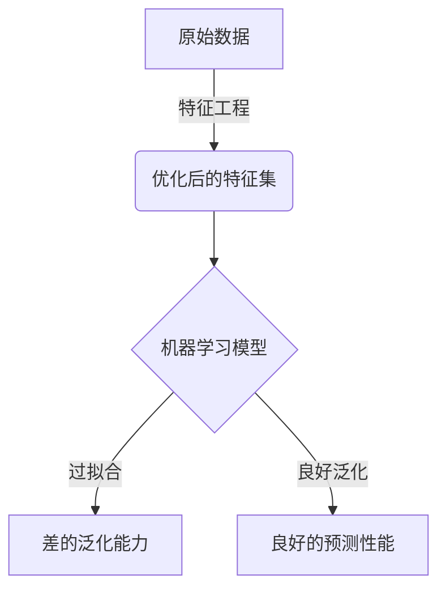

# 特征工程与过拟合：如何避免模型过度学习

## 1.背景介绍

### 1.1 机器学习模型的挑战

在现代数据密集型应用中,机器学习模型扮演着至关重要的角色。然而,训练高质量的模型并非一蹴而就,存在诸多挑战需要克服。其中,过拟合(Overfitting)被公认为机器学习模型面临的最大障碍之一。

过拟合是指模型过于专注于训练数据中的细节和噪声,以至于无法很好地泛化到新的、未见过的数据。过拟合模型在训练数据上表现良好,但在测试数据或现实应用中的性能却大打折扣。这不仅降低了模型的实用性,也浪费了宝贵的计算资源。

### 1.2 特征工程的重要性

为了解决过拟合问题,特征工程(Feature Engineering)应运而生。特征工程是指从原始数据中构造出能够更好地表示潜在模式的特征,从而提高机器学习模型的性能。通过特征工程,我们可以减少模型对噪声和无关数据的敏感性,提高其泛化能力。

特征工程是数据科学家和机器学习从业者的必备技能之一。一个优秀的特征工程过程不仅需要对问题领域有深入的理解,还需要具备创造力、编程能力和实践经验。本文将探讨特征工程在解决过拟合问题中的作用,并介绍相关的技术和最佳实践。

## 2.核心概念与联系

### 2.1 过拟合的原因

过拟合的根源在于模型过于复杂,捕捉了训练数据中的噪声和无关特征。这种情况通常发生在以下几种情况:

1. **特征数量过多** - 当特征数量远大于样本数量时,模型容易将噪声也作为模式来学习。
2. **模型复杂度过高** - 高阶多项式模型、深度神经网络等复杂模型,自由度过高,更容易过拟合。
3. **训练数据质量不佳** - 训练数据存在噪声、异常值或数据倾斜时,模型难以学习到真实的潜在规律。

过拟合不仅会影响模型的泛化能力,还可能导致计算资源的浪费和不必要的模型复杂性。

### 2.2 特征工程与过拟合的关系

特征工程可以通过以下几种方式帮助缓解过拟合问题:

1. **特征选择** - 通过消除无关特征和降低特征数量,减少模型的自由度。
2. **特征提取** - 将原始特征转换为更能概括潜在模式的新特征,提高信号噪声比。
3. **特征构造** - 基于领域知识创造新的有意义的特征,增强模型的表达能力。
4. **特征缩放** - 将特征值缩放到相似的数值范围,防止某些特征对模型的影响过大。

通过特征工程,我们可以为模型提供更加简洁、信息丰富的特征集,从而减少过拟合的风险,提高模型的泛化能力。

### 2.3 Mermaid流程图



上图展示了特征工程在机器学习模型中的作用。通过对原始数据进行特征工程,我们可以获得优化后的特征集,为机器学习模型提供高质量的输入数据。如果模型过拟合,将导致差的泛化能力;相反,如果模型能够很好地泛化,就能获得良好的预测性能。

## 3.核心算法原理具体操作步骤

特征工程包含多种技术和方法,下面将介绍其中的核心算法原理和具体操作步骤。

### 3.1 特征选择

特征选择的目标是从原始特征集中选择出对模型预测最为重要的一个子集。这不仅可以减少模型的复杂度,还能提高模型的可解释性和训练效率。常用的特征选择算法包括:

1. **Filter方法**
    - 原理: 根据特征与目标变量的相关性得分,选择得分最高的前N个特征。
    - 算法: 相关系数(Pearson、Spearman)、互信息、卡方统计量等。
    - 操作步骤:
        1) 计算每个特征与目标变量的相关性得分
        2) 根据得分从高到低排序
        3) 选择前N个特征或设置阈值过滤

2. **Wrapper方法**  
    - 原理: 将特征选择视为模型搜索的子集选择问题,评估不同特征子集对模型性能的影响。
    - 算法: 递归特征消除(RFE)、贪婪算法等。
    - 操作步骤:
        1) 定义模型评估准则
        2) 生成特征子集
        3) 训练模型并评估性能
        4) 选择最优特征子集

3. **Embedded方法**
    - 原理: 在模型训练的同时自动进行特征选择。
    - 算法: Lasso回归、决策树等。
    - 操作步骤:
        1) 构建具有特征选择能力的模型
        2) 训练模型
        3) 获取模型中的特征重要性评分
        4) 选择重要特征或设置阈值过滤

### 3.2 特征提取

特征提取的目标是从原始特征中提取出能更好地表示潜在模式的新特征。常用的特征提取算法包括:

1. **主成分分析(PCA)**
    - 原理: 将原始特征线性投影到一组正交基向量上,得到方差最大的低维表示。
    - 算法: 特征值分解、奇异值分解等。
    - 操作步骤:
        1) 对数据进行标准化
        2) 计算协方差矩阵
        3) 对协方差矩阵进行特征值分解
        4) 选择前N个主成分作为新特征

2. **独立成分分析(ICA)** 
    - 原理: 将原始特征分解为统计上互相独立的子成分。
    - 算法: FastICA、InfomaxICA等。
    - 操作步骤:
        1) 对数据进行预处理(中心化、白化)
        2) 应用ICA算法提取独立成分
        3) 选择部分独立成分作为新特征

3. **核技巧(Kernel Trick)**
    - 原理: 将原始特征映射到更高维的特征空间,使其在新空间中线性可分。
    - 算法: 多项式核、RBF核等。
    - 操作步骤:
        1) 选择合适的核函数
        2) 计算核矩阵
        3) 将核矩阵作为新的特征矩阵输入模型

### 3.3 特征构造

特征构造的目标是基于领域知识,创造出新的有意义的特征。这需要对问题领域有深入的理解,并具备一定的创造力。常见的特征构造方法包括:

1. **数学变换**
    - 原理: 对原始特征进行数学变换,如指数、对数、三角函数等。
    - 操作步骤:
        1) 确定合适的数学变换
        2) 应用变换生成新特征

2. **组合特征**
    - 原理: 将两个或多个原始特征进行组合,生成新的复合特征。
    - 操作步骤: 
        1) 确定有意义的特征组合
        2) 应用算术运算、布尔运算等生成新特征

3. **时间窗口特征**
    - 原理: 对于时序数据,提取一段时间窗口内的统计量作为新特征。
    - 操作步骤:
        1) 确定时间窗口大小
        2) 计算窗口内的均值、方差、最大值等统计量

4. **领域特有特征**
    - 原理: 根据问题领域的先验知识,构造出具有物理或语义意义的新特征。
    - 操作步骤:
        1) 研究问题领域
        2) 应用领域知识生成新特征

### 3.4 特征缩放

特征缩放的目标是将特征值缩放到相似的数值范围,防止某些特征对模型的影响过大。常用的特征缩放方法包括:

1. **标准化(Standardization)** 
    - 原理: 将特征值缩放到均值为0、标准差为1的范围。
    - 公式: $x' = \frac{x - \mu}{\sigma}$
    - 操作步骤:
        1) 计算每个特征的均值和标准差
        2) 对每个特征值进行标准化

2. **区间缩放(MinMax Scaling)**
    - 原理: 将特征值线性映射到给定的范围,通常是[0, 1]。  
    - 公式: $x' = \frac{x - x_{\min}}{x_{\max} - x_{\min}}$
    - 操作步骤:
        1) 计算每个特征的最大值和最小值
        2) 对每个特征值进行区间缩放

3. **对数变换(Log Transformation)**
    - 原理: 对特征值取对数,压缩大值的影响。
    - 公式: $x' = \log(1 + x)$
    - 操作步骤:
        1) 对每个特征值进行对数变换

4. **分位数分箱(Quantile Binning)** 
    - 原理: 将特征值按分位数划分成多个区间,并用区间编码替代原始值。
    - 操作步骤:
        1) 计算每个特征的分位数
        2) 将特征值划分到对应的区间
        3) 用区间编码替代原始值

## 4.数学模型和公式详细讲解举例说明

在特征工程中,我们经常需要使用一些数学模型和公式来量化特征与目标变量之间的关系,或者对特征进行转换。本节将详细讲解其中的几个核心公式。

### 4.1 相关系数

相关系数是衡量两个变量线性相关程度的重要指标,在特征选择中被广泛使用。常见的相关系数包括Pearson相关系数和Spearman相关系数。

1. **Pearson相关系数**

Pearson相关系数用于测量两个连续变量之间的线性相关程度,取值范围为[-1, 1]。相关系数越接近1,表示两个变量正相关;越接近-1,表示负相关;等于0,表示不相关。

$$r_{xy} = \frac{\sum_{i=1}^{n}(x_i - \bar{x})(y_i - \bar{y})}{\sqrt{\sum_{i=1}^{n}(x_i - \bar{x})^2\sum_{i=1}^{n}(y_i - \bar{y})^2}}$$

其中,$x_i$和$y_i$分别表示第i个样本的特征值和目标值,$\bar{x}$和$\bar{y}$分别表示特征值和目标值的均值,n是样本数量。

2. **Spearman相关系数**

Spearman相关系数是基于变量的排名而不是实际数值来计算的,因此它能够测量两个变量之间的单调关系,而不仅限于线性关系。

$$r_s = 1 - \frac{6\sum_{i=1}^{n}d_i^2}{n(n^2 - 1)}$$

其中,$d_i$表示第i个样本在两个变量的排名之差,n是样本数量。

**示例**

假设我们有一个包含3个特征(X1,X2,X3)和1个目标变量(y)的数据集,样本数量为5。我们计算每个特征与目标变量之间的Pearson相关系数,以确定哪些特征对预测目标变量更为重要。

```python
import numpy as np

X = np.array([[1, 2, 3], 
              [4, 5, 6],
              [7, 8, 9],
              [5, 3, 8],
              [6, 4, 7]])

y = np.array([2, 4, 6, 5, 3])

# 计算Pearson相关系数
corr_X1 = np.corrcoef(X[:, 0], y)[0, 1]
corr_X2 = np.corrcoef(X[:, 1], y)[0, 1]
corr_X3 = np.corrcoef(X[:, 2], y)[0, 1]

print(f"X1与y的相关系数: {corr_X1:.2f}")
print(f"