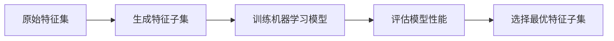
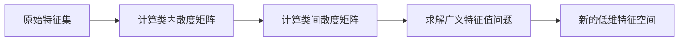
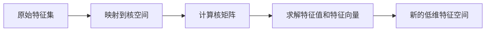

# 特征选择与特征降维原理与代码实战案例讲解

## 1.背景介绍

在现代机器学习和数据挖掘领域,我们经常会遇到数据集包含大量特征(features)的情况。这些特征可能来自于不同的数据源,具有不同的统计特性。然而,并非所有特征对于构建有效的机器学习模型都是必需的,有些特征可能是冗余的或者是噪声。因此,进行特征选择和特征降维就显得尤为重要。

特征选择的目的是从原始特征集中选择出一个最优特征子集,使得在该特征子集上训练出的机器学习模型能够获得最佳的预测性能。而特征降维则是将高维特征映射到低维空间,从而达到降低特征数量和去除噪声的目的。这两种技术在机器学习的数据预处理阶段扮演着重要角色。

### 1.1 特征选择与特征降维的必要性

- **降低数据维度** 高维数据不仅会增加计算开销,还容易导致维数灾难(curse of dimensionality)问题。
- **去除无关特征** 数据集中可能存在一些与目标变量无关的特征,保留这些特征会影响模型的预测性能。
- **减少过拟合风险** 过多的特征可能会导致模型过于复杂,从而出现过拟合的情况。
- **提高模型可解释性** 通过选择出对预测目标最重要的特征,可以提高模型的可解释性。

### 1.2 特征选择与特征降维的区别

特征选择和特征降维虽然都是为了减少特征数量,但存在一些本质区别:

- 特征选择保留了原始特征的语义,而特征降维则是将原始特征映射到新的特征空间。
- 特征选择的结果是原始特征的一个子集,而特征降维则会产生新的特征组合。
- 特征选择可能会丢失部分有用的特征信息,而特征降维则试图保留原始特征的大部分信息。

## 2.核心概念与联系

### 2.1 特征选择

特征选择的核心思想是从原始特征集中选择出一个最优特征子集,使得在该特征子集上训练出的机器学习模型能够获得最佳的预测性能。常见的特征选择方法包括过滤式(Filter)、包裹式(Wrapper)和嵌入式(Embedded)三种。

#### 2.1.1 过滤式特征选择

过滤式特征选择是根据特征与目标变量的相关性进行评分,然后选择得分最高的特征。常用的评分函数包括相关系数(Correlation Coefficient)、互信息(Mutual Information)和卡方统计量(Chi-Square Statistic)等。


#### 2.1.2 包裹式特征选择

包裹式特征选择是将特征选择过程看作一个优化问题,通过搜索不同的特征子集组合,并使用机器学习算法评估每个子集的性能,最终选择性能最佳的特征子集。常用的搜索策略包括贪婪搜索(Greedy Search)、最优化搜索(Optimization Search)和随机搜索(Random Search)等。



#### 2.1.3 嵌入式特征选择

嵌入式特征选择是在机器学习算法的训练过程中同时进行特征选择。常见的嵌入式特征选择方法包括基于正则化的特征选择(如Lasso回归)和基于树模型的特征选择(如随机森林)等。


### 2.2 特征降维

特征降维的核心思想是将高维特征映射到低维空间,从而达到降低特征数量和去除噪声的目的。常见的特征降维方法包括主成分分析(PCA)、线性判别分析(LDA)、等式核映射(Kernel PCA)和流形学习(Manifold Learning)等。

#### 2.2.1 主成分分析(PCA)

主成分分析(PCA)是一种线性无监督降维技术,它通过正交变换将原始特征映射到一组线性无关的主成分上,并选择方差最大的前几个主成分作为新的特征。


#### 2.2.2 线性判别分析(LDA)

线性判别分析(LDA)是一种线性有监督降维技术,它通过最大化类内散度与类间散度的比值来寻找最优的投影方向,从而将原始特征映射到低维空间。



#### 2.2.3 等式核映射(Kernel PCA)

等式核映射(Kernel PCA)是主成分分析的核方法扩展,它通过将原始特征映射到高维核空间,然后在核空间中执行主成分分析,从而能够发现非线性结构。



#### 2.2.4 流形学习(Manifold Learning)

流形学习(Manifold Learning)是一种非线性降维技术,它基于这样一个假设:高维数据实际上躺在一个低维流形(Manifold)上。常见的流形学习算法包括等度量映射(Isomap)、局部线性嵌入(LLE)和拉普拉斯特征映射(Laplacian Eigenmaps)等。


## 3.核心算法原理具体操作步骤

### 3.1 过滤式特征选择算法

以相关系数(Correlation Coefficient)为例,过滤式特征选择算法的具体操作步骤如下:

1. 计算每个特征与目标变量之间的相关系数。
2. 根据相关系数的绝对值对特征进行排序。
3. 选择排名前N个特征作为特征子集。

```python
import numpy as np
from sklearn.feature_selection import f_regression

def filter_feature_selection(X, y, n_features):
    """
    过滤式特征选择
    
    参数:
    X: 特征矩阵
    y: 目标变量
    n_features: 要选择的特征数量
    
    返回:
    选择的特征索引
    """
    # 计算每个特征与目标变量的相关系数
    _, p_values = f_regression(X, y)
    
    # 根据相关系数排序
    sorted_idx = np.argsort(p_values)
    
    # 选择前N个特征
    selected_idx = sorted_idx[:n_features]
    
    return selected_idx
```

### 3.2 包裹式特征选择算法

以递归特征消除(Recursive Feature Elimination, RFE)为例,包裹式特征选择算法的具体操作步骤如下:

1. 初始化特征集为原始特征集。
2. 训练机器学习模型,并计算每个特征的重要性得分。
3. 移除重要性得分最低的特征。
4. 重复步骤2和3,直到达到期望的特征数量。

```python
from sklearn.linear_model import LogisticRegression
from sklearn.feature_selection import RFE

def wrapper_feature_selection(X, y, n_features):
    """
    包裹式特征选择
    
    参数:
    X: 特征矩阵
    y: 目标变量
    n_features: 要选择的特征数量
    
    返回:
    选择的特征索引
    """
    # 初始化模型
    model = LogisticRegression()
    
    # 执行递归特征消除
    rfe = RFE(model, n_features_to_select=n_features)
    rfe.fit(X, y)
    
    # 获取选择的特征索引
    selected_idx = np.flatnonzero(rfe.support_)
    
    return selected_idx
```

### 3.3 嵌入式特征选择算法

以Lasso回归为例,嵌入式特征选择算法的具体操作步骤如下:

1. 训练Lasso回归模型。
2. 获取模型的系数向量。
3. 选择系数不为零的特征作为特征子集。

```python
from sklearn.linear_model import Lasso

def embedded_feature_selection(X, y, alpha):
    """
    嵌入式特征选择
    
    参数:
    X: 特征矩阵
    y: 目标变量
    alpha: Lasso回归的正则化参数
    
    返回:
    选择的特征索引
    """
    # 训练Lasso回归模型
    model = Lasso(alpha=alpha)
    model.fit(X, y)
    
    # 获取模型系数
    coef = model.coef_
    
    # 选择非零系数对应的特征
    selected_idx = np.flatnonzero(coef)
    
    return selected_idx
```

### 3.4 主成分分析(PCA)算法

主成分分析(PCA)算法的具体操作步骤如下:

1. 对原始特征矩阵进行中心化(减去均值)。
2. 计算特征矩阵的协方差矩阵。
3. 对协方差矩阵进行特征值分解,获得特征值和特征向量。
4. 选择前N个特征值对应的特征向量作为主成分。
5. 将原始特征矩阵投影到主成分空间,获得新的低维特征矩阵。

```python
import numpy as np

def pca(X, n_components):
    """
    主成分分析(PCA)
    
    参数:
    X: 特征矩阵
    n_components: 要保留的主成分数量
    
    返回:
    新的低维特征矩阵
    """
    # 中心化
    X_centered = X - np.mean(X, axis=0)
    
    # 计算协方差矩阵
    cov_matrix = np.cov(X_centered.T)
    
    # 特征值分解
    eigenvalues, eigenvectors = np.linalg.eig(cov_matrix)
    
    # 排序特征值和特征向量
    sorted_idx = np.argsort(eigenvalues)[::-1]
    sorted_eigenvalues = eigenvalues[sorted_idx]
    sorted_eigenvectors = eigenvectors[:, sorted_idx]
    
    # 选择前N个主成分
    eigenvectors_subset = sorted_eigenvectors[:, :n_components]
    
    # 投影到主成分空间
    X_pca = np.dot(X_centered, eigenvectors_subset)
    
    return X_pca
```

## 4.数学模型和公式详细讲解举例说明

### 4.1 相关系数(Correlation Coefficient)

相关系数是一种衡量两个随机变量线性相关程度的统计量,常用于过滤式特征选择。相关系数的取值范围为[-1, 1],绝对值越大表示两个变量之间的线性相关性越强。

对于两个随机变量$X$和$Y$,它们的相关系数$\rho_{X,Y}$可以通过下式计算:

$$\rho_{X,Y} = \frac{cov(X,Y)}{\sqrt{var(X)var(Y)}}$$

其中,$cov(X,Y)$表示$X$和$Y$的协方差,$var(X)$和$var(Y)$分别表示$X$和$Y$的方差。

例如,假设我们有一个包含3个特征和1个目标变量的数据集:

$$X = \begin{bmatrix}
1 & 2 & 3\\
4 & 5 & 6\\
7 & 8 & 9
\end{bmatrix}, \quad y = \begin{bmatrix}
1\\
2\\
3
\end{bmatrix}$$

我们可以计算每个特征与目标变量之间的相关