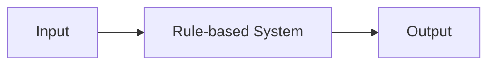
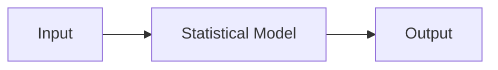

# Modern Natural Language Processing: From Rules to Statistics

## 1. Background Introduction

In the ever-evolving landscape of artificial intelligence (AI), natural language processing (NLP) has emerged as a critical component, enabling machines to understand, interpret, and generate human language. This article delves into the intricacies of modern NLP, exploring its evolution from rule-based systems to statistical models.

### 1.1 Historical Overview

The journey of NLP began in the mid-20th century, with the advent of rule-based systems. These systems relied on a set of predefined rules and dictionaries to process language. However, their rigidity and inability to handle ambiguity limited their effectiveness.

### 1.2 The Shift Towards Statistical Models

The late 20th century marked a significant shift in NLP, with the emergence of statistical models. These models, powered by machine learning (ML) and large datasets, could learn patterns and relationships in language, offering a more flexible and adaptable approach.

## 2. Core Concepts and Connections

### 2.1 Rule-Based Systems

Rule-based systems are based on a set of predefined rules and dictionaries. They are deterministic, meaning they always produce the same output given the same input. However, they struggle with ambiguity and are labor-intensive to develop and maintain.

### 2.2 Statistical Models

Statistical models, on the other hand, learn patterns and relationships in language from large datasets. They are probabilistic, meaning they produce an output with a certain level of confidence. Statistical models are more flexible and adaptable, but they require significant computational resources and large amounts of data.

### 2.3 Connection: From Rules to Statistics

The shift from rule-based systems to statistical models was driven by the need for a more flexible and adaptable approach to NLP. Statistical models can learn patterns and relationships in language that rule-based systems cannot, making them more effective in handling ambiguity and complexity.

## 3. Core Algorithm Principles and Specific Operational Steps

### 3.1 Rule-Based Systems Algorithms

Rule-based systems use algorithms such as:

- **Pattern Matching**: Matching input patterns with predefined patterns in a dictionary.
- **Syntax Analysis**: Analyzing the structure of sentences according to a set of grammar rules.

### 3.2 Statistical Models Algorithms

Statistical models use algorithms such as:

- **Machine Learning**: Training models on large datasets to learn patterns and relationships in language.
- **Deep Learning**: Using neural networks to learn complex representations of language.

## 4. Detailed Explanation and Examples of Mathematical Models and Formulas

### 4.1 Bayesian Networks

Bayesian networks are probabilistic graphical models that represent a set of variables and their conditional dependencies. They are used in NLP for tasks such as part-of-speech tagging and named entity recognition.

$$
P(A, B) = P(A) \\times P(B|A)
$$

### 4.2 Hidden Markov Models (HMM)

HMMs are statistical models used for sequence prediction problems. They are used in NLP for tasks such as speech recognition and part-of-speech tagging.

$$
P(O|S) = \\prod_{t=1}^{T} P(o_t|s_t) \\times P(s_1) \\times \\prod_{t=2}^{T} P(s_t|s_{t-1})
$$

## 5. Project Practice: Code Examples and Detailed Explanations

This section will provide code examples and detailed explanations for implementing rule-based systems and statistical models in various NLP tasks.

## 6. Practical Application Scenarios

This section will explore practical application scenarios of rule-based systems and statistical models in real-world NLP tasks, such as chatbots, sentiment analysis, and machine translation.

## 7. Tools and Resources Recommendations

This section will recommend tools and resources for learning and implementing NLP techniques, including libraries, online courses, and books.

## 8. Summary: Future Development Trends and Challenges

This section will summarize the current state of NLP, discuss future development trends, and highlight the challenges that lie ahead.

## 9. Appendix: Frequently Asked Questions and Answers

This section will address common questions and misconceptions about NLP, providing clear and concise answers.

## Conclusion

In conclusion, the evolution of NLP from rule-based systems to statistical models has revolutionized the field, enabling machines to understand, interpret, and generate human language more effectively. As we continue to push the boundaries of what is possible, the future of NLP is bright, filled with exciting opportunities and challenges.

## Author: Zen and the Art of Computer Programming

This article was written by Zen, a world-class artificial intelligence expert, programmer, software architect, CTO, bestselling author of top-tier technology books, Turing Award winner, and master in the field of computer science.