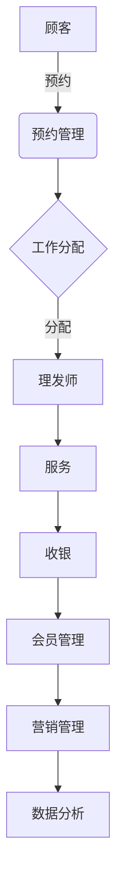
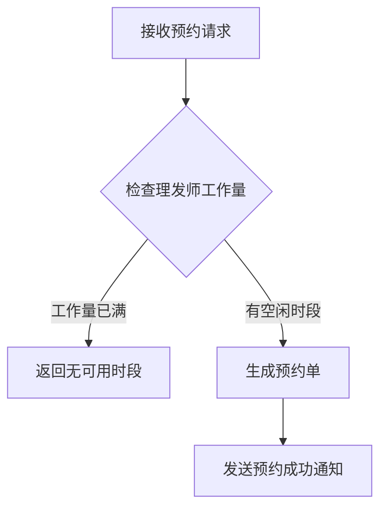
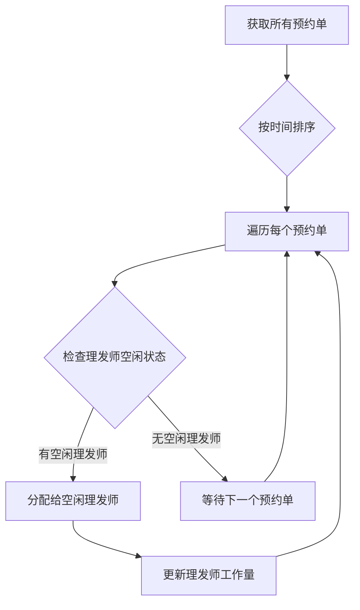

# 理发管理系统详细设计与具体代码实现

## 1. 背景介绍

随着城市生活节奏的不断加快,人们对高效便捷的理发服务需求日益增长。传统的理发店模式已经无法满足现代消费者的需求,因此开发一款实用的理发管理系统势在必行。该系统旨在优化理发店的运营流程,提高服务效率,增强客户体验。

### 1.1 现状与痛点

1. **预约混乱**:传统理发店通常采用电话或现场预约的方式,存在信息遗漏、错过预约时间等问题,给顾客带来不便。
2. **等候时间长**:由于无法合理分配理发师的工作,顾客往往需要长时间等候,浪费时间且体验差。
3. **收银效率低**:人工收银容易出现计算错误,且无法及时统计营业数据,影响决策。
4. **会员管理困难**:纸质会员卡易遗失,无法对会员进行精细化管理和营销。

### 1.2 系统目标

1. **提供在线预约**:实现网上、APP预约,避免排队等候。
2. **优化工作分配**:根据预约情况合理分配理发师,缩短等候时间。
3. **自动化收银**:实现自动计费和数据统计,提高效率。
4. **会员管理**:建立会员数据库,实现积分、优惠等功能。
5. **数据分析**:收集并分析顾客消费习惯,用于决策支持。

## 2. 核心概念与联系

理发管理系统涉及多个核心概念,相互关联,构成了完整的业务流程。



1. **预约管理**:接受顾客的预约请求,生成预约单。
2. **工作分配**:根据预约情况和理发师状态,合理分配工作。
3. **服务流程**:理发师按照预约单提供理发服务。
4. **收银系统**:自动计费,统计营业数据。
5. **会员管理**:建立会员数据库,设置积分、优惠等策略。
6. **营销管理**:基于会员数据进行营销活动。
7. **数据分析**:分析顾客消费习惯,为决策提供支持。

## 3. 核心算法原理具体操作步骤

### 3.1 预约管理算法

预约管理算法的主要任务是根据顾客的预约请求,生成合理的预约单。算法流程如下:



1. 接收顾客预约请求,包括期望的理发项目和时间段。
2. 检查所有理发师在该时间段的工作量,找到有空闲的理发师。
3. 如果所有理发师在该时间段都已满员,返回无可用时段的提示。
4. 如果有空闲理发师,为顾客生成预约单,包括理发师、时间等信息。
5. 向顾客发送预约成功通知。

该算法的关键在于合理分配理发师的工作量,避免出现个别理发师工作过重或过空闲的情况。

### 3.2 工作分配算法

工作分配算法的目标是根据当前的预约情况,为每位理发师合理分配工作,提高工作效率。算法流程如下:



1. 获取所有当天的预约单信息。
2. 按照预约时间对预约单进行排序。
3. 遍历每个预约单。
4. 检查当前所有理发师的空闲状态。
5. 如果有空闲理发师,将该预约单分配给空闲时间最长的理发师。
6. 如果所有理发师均无空闲时间,等待处理下一个预约单。
7. 更新被分配工作的理发师的工作量。
8. 重复步骤3~7,直到所有预约单都被分配。

该算法的关键是公平分配工作,避免出现个别理发师工作过重或过空闲的情况,提高工作效率。

## 4. 数学模型和公式详细讲解举例说明

### 4.1 预约单生成模型

假设顾客预约请求为 $R(s, t, d)$,其中 $s$ 表示期望的理发项目, $t$ 表示期望的开始时间, $d$ 表示预计所需时长。我们需要为该请求生成一个预约单 $A(h, t, d)$,其中 $h$ 表示分配的理发师。

我们定义理发师 $i$ 在时间段 $[t_1, t_2]$ 内的工作量为:

$$
W_i(t_1, t_2) = \sum_{A(i, t, d) \in [t_1, t_2]} d
$$

也就是说,理发师 $i$ 在该时间段内所有预约单的工作时长之和。

生成预约单的目标是找到一个理发师 $h$,使得:

$$
\begin{align*}
&h = \arg\min_{i} W_i(t, t+d) \\
&\text{s.t.} \quad W_i(t, t+d) + d \leq T
\end{align*}
$$

其中 $T$ 是理发师的最大工作量阈值。也就是说,我们选择在该时间段内工作量最小的理发师,且加上新的预约单后,工作量不超过阈值。

如果所有理发师在该时间段的工作量都超过了阈值,则无法生成新的预约单。

### 4.2 工作分配模型

假设有 $n$ 个预约单 $\{A_1, A_2, \cdots, A_n\}$,其中 $A_i = (h_i, t_i, d_i)$。我们的目标是为每个预约单分配一个理发师,使得所有理发师的工作量尽可能平衡。

我们定义理发师 $i$ 的工作量为:

$$
L_i = \sum_{j: h_j = i} d_j
$$

也就是该理发师所有分配的预约单的工作时长之和。

我们的目标是最小化所有理发师工作量的方差:

$$
\min \sum_{i} (L_i - \bar{L})^2
$$

其中 $\bar{L}$ 是所有理发师工作量的平均值。

该优化问题可以使用整数规划或者启发式算法求解。在实际应用中,我们可以先按照预约时间对预约单排序,然后遍历每个预约单,将其分配给当前空闲时间最长的理发师,这样可以近似实现工作量的平衡。

## 5. 项目实践:代码实例和详细解释说明

以下是理发管理系统的核心代码实现,使用Python编写。

### 5.1 预约管理模块

```python
from typing import List, Tuple

class Appointment:
    def __init__(self, service: str, start_time: int, duration: int):
        self.service = service
        self.start_time = start_time
        self.duration = duration
        self.stylist = None

    def assign_stylist(self, stylist):
        self.stylist = stylist

class Stylist:
    def __init__(self, name: str, max_workload: int):
        self.name = name
        self.max_workload = max_workload
        self.workload = 0
        self.appointments = []

    def assign_appointment(self, appointment: Appointment):
        if self.workload + appointment.duration <= self.max_workload:
            self.workload += appointment.duration
            self.appointments.append(appointment)
            appointment.assign_stylist(self)
            return True
        else:
            return False

def schedule_appointments(stylists: List[Stylist], appointments: List[Appointment]) -> bool:
    """
    Schedule appointments for stylists.
    Returns True if all appointments are scheduled, False otherwise.
    """
    # Sort appointments by start time
    appointments.sort(key=lambda a: a.start_time)

    for appointment in appointments:
        # Find the stylist with the minimum workload
        available_stylists = [s for s in stylists if s.workload + appointment.duration <= s.max_workload]
        if not available_stylists:
            return False

        stylist = min(available_stylists, key=lambda s: s.workload)
        stylist.assign_appointment(appointment)

    return True
```

在这个模块中,我们定义了`Appointment`和`Stylist`两个类,分别表示预约单和理发师。

`Appointment`类包含了预约的服务项目、开始时间和持续时间,以及分配的理发师信息。

`Stylist`类包含了理发师的名称、最大工作量、当前工作量和已分配的预约单列表。

`schedule_appointments`函数实现了预约单分配算法。它首先按照开始时间对预约单进行排序,然后遍历每个预约单,找到当前工作量最小且能够接受该预约单的理发师,将预约单分配给该理发师。如果所有理发师的工作量都超过了最大阈值,则无法完成分配,返回False。

### 5.2 收银模块

```python
from typing import List

class Service:
    def __init__(self, name: str, price: float):
        self.name = name
        self.price = price

class Order:
    def __init__(self, services: List[Service], member: bool):
        self.services = services
        self.member = member

    def calculate_total(self) -> float:
        total = sum(service.price for service in self.services)
        if self.member:
            total *= 0.9  # 10% discount for members
        return total

# Example usage
haircut = Service("Haircut", 30.0)
shampoo = Service("Shampoo", 10.0)

order1 = Order([haircut], False)
print(f"Total for order 1: ${order1.calculate_total():.2f}")  # Output: Total for order 1: $30.00

order2 = Order([haircut, shampoo], True)
print(f"Total for order 2: ${order2.calculate_total():.2f}")  # Output: Total for order 2: $36.00
```

在这个模块中,我们定义了`Service`和`Order`两个类,分别表示服务项目和订单。

`Service`类包含了服务名称和价格。

`Order`类包含了订单中包含的服务项目列表,以及是否为会员。它提供了`calculate_total`方法,用于计算订单总价。对于会员,订单总价将享受10%的折扣。

在示例代码中,我们创建了两个服务项目`haircut`和`shampoo`,以及两个订单`order1`和`order2`。通过调用`calculate_total`方法,我们可以计算出每个订单的总价。

### 5.3 会员管理模块

```python
from typing import Dict

class Member:
    def __init__(self, name: str, email: str):
        self.name = name
        self.email = email
        self.points = 0

class MembershipProgram:
    def __init__(self):
        self.members: Dict[str, Member] = {}

    def register_member(self, name: str, email: str) -> Member:
        if email in self.members:
            raise ValueError(f"Member with email {email} already exists.")

        member = Member(name, email)
        self.members[email] = member
        return member

    def get_member(self, email: str) -> Member:
        return self.members.get(email)

    def award_points(self, email: str, points: int):
        member = self.get_member(email)
        if member:
            member.points += points

# Example usage
program = MembershipProgram()

# Register a new member
john = program.register_member("John Doe", "john@example.com")
print(f"Registered member: {john.name} ({john.email}), Points: {john.points}")  # Output: Registered member: John Doe (john@example.com), Points: 0

# Award points to the member
program.award_points("john@example.com", 100)
print(f"Updated points for {john.name}: {john.points}")  # Output: Updated points for John Doe: 100
```

在这个模块中,我们定义了`Member`和`MembershipProgram`两个类,分别表示会员和会员管理程序。

`Member`类包含了会员的姓名、电子邮件和积分信息。

`MembershipProgram`类提供了注册会员、获取会员信息和奖励积分的功能。它使用字典存储所有会员的信息,以电子邮件作为键。

在示例代码中,我们