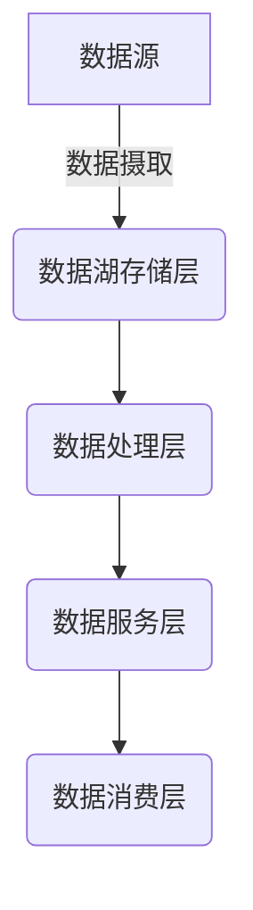
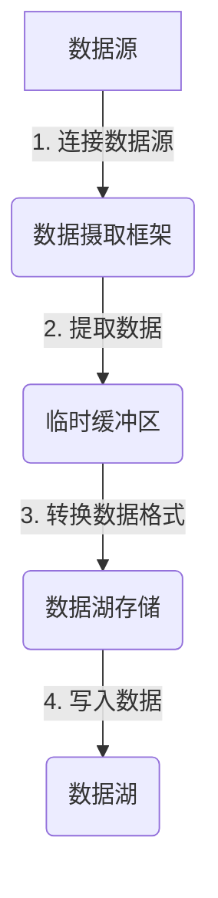
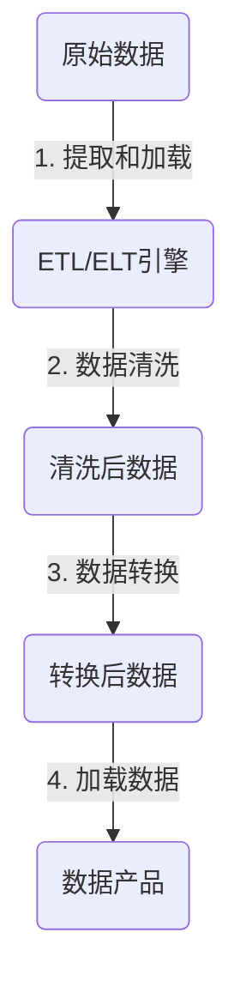
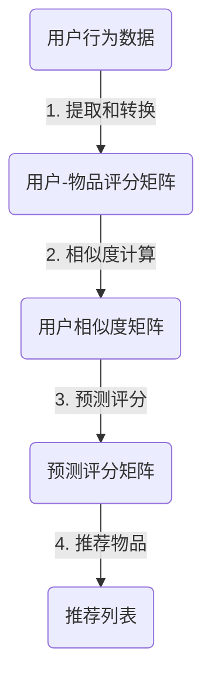

# 电商行业数据湖应用案例

## 1.背景介绍

### 1.1 电商行业数据爆炸

在当今数字化时代,电子商务(电商)已经成为零售业的主导力量。随着移动设备和互联网的普及,消费者可以随时随地购买商品和服务。这种便利性推动了电商行业的快速增长,但同时也带来了一个挑战:海量的数据涌入。

电商公司每天都会产生大量的结构化和非结构化数据,包括交易记录、客户信息、产品目录、网站日志、社交媒体数据等。这些数据来源复杂多样,数据量呈指数级增长。传统的数据存储和处理方式已经无法满足电商公司对数据管理和分析的需求。

### 1.2 数据湖的兴起

为了解决数据爆炸带来的挑战,数据湖(Data Lake)应运而生。数据湖是一种新型的大数据存储和处理架构,旨在存储各种类型的原始数据,并支持各种分析工作负载。与传统数据仓库不同,数据湖不需要预先定义数据模式,可以存储任何格式的数据,包括结构化、半结构化和非结构化数据。

数据湖的出现为电商公司提供了一种高效、灵活的方式来管理和利用海量数据。它可以帮助电商公司实现以下目标:

1. 存储和保留所有原始数据,为未来的分析和应用提供基础。
2. 支持各种分析工作负载,包括批处理、实时流处理和交互式查询。
3. 降低数据集成和转换的成本,简化数据管理流程。
4. 促进数据民主化,让更多用户能够访问和利用数据。

## 2.核心概念与联系

### 2.1 数据湖架构

数据湖通常采用分层架构,包括以下几个关键组件:

1. **数据源**: 包括各种来源的原始数据,如交易记录、网站日志、社交媒体数据等。
2. **数据湖存储层**: 用于存储原始数据,通常使用分布式文件系统(如HDFS)或对象存储服务(如AWS S3)。
3. **数据处理层**: 对原始数据进行清洗、转换和加载(ETL)操作,以及各种分析任务,如批处理、流处理和交互式查询。常用的处理引擎包括Apache Spark、Apache Flink等。
4. **数据服务层**: 为上层应用提供数据访问和管理服务,如元数据管理、数据治理、安全控制等。
5. **数据消费层**: 包括各种数据应用和可视化工具,如商业智能(BI)工具、机器学习模型、报表系统等。

### 2.2 数据湖与数据仓库的区别

数据湖和传统数据仓库虽然都用于存储和处理数据,但它们在设计理念和应用场景上存在一些关键差异:

| 特性 | 数据湖 | 数据仓库 |
| --- | --- | --- |
| 数据类型 | 支持各种格式的结构化、半结构化和非结构化数据 | 主要支持结构化数据 |
| 数据模式 | 模式灵活,可以在读取时解析 | 需要预先定义严格的数据模式 |
| 数据处理 | 支持批处理、流处理和交互式查询 | 主要支持批处理和报表查询 |
| 数据存储 | 存储原始数据,支持低成本扩展 | 存储经过ETL处理的数据 |
| 用户群体 | 面向数据科学家、数据分析师和开发人员 | 面向业务分析人员和报表用户 |
| 数据质量 | 数据质量较低,需要进一步处理 | 数据质量较高,已经过清洗和转换 |

总的来说,数据湖更加灵活和开放,适合存储和处理各种类型的原始数据,支持多种分析工作负载。而数据仓库则更加结构化和专注,主要用于支持业务智能和报表查询。在实际应用中,两者可以互为补充,形成完整的数据架构。

## 3.核心算法原理具体操作步骤

在电商数据湖中,常见的数据处理任务包括:

1. **数据摄取(Data Ingestion)**: 从各种数据源收集原始数据,并存储到数据湖中。
2. **数据清洗和转换(Data Cleaning and Transformation)**: 对原始数据进行清洗、转换和标准化,以满足下游应用的需求。
3. **数据分析和建模(Data Analytics and Modeling)**: 对处理后的数据进行分析和建模,如构建推荐系统、预测销售趋势等。

下面我们将详细介绍这些任务的核心算法原理和具体操作步骤。

### 3.1 数据摄取

数据摄取是将数据从各种来源传输到数据湖的过程。常见的数据摄取方法包括:

1. **批量摄取**: 定期从数据源批量导入数据,适用于离线处理场景。
2. **流式摄取**: 实时从数据源获取数据流,适用于实时处理场景。

无论采用何种方式,数据摄取都需要遵循以下基本步骤:

1. **连接数据源**: 根据数据源的类型和位置,建立与之的连接,如JDBC连接数据库、Kafka Consumer连接消息队列等。
2. **提取数据**: 从数据源中读取原始数据,并缓存到临时存储区域,如内存缓冲区或临时文件。
3. **转换数据格式**: 将原始数据转换为适合存储在数据湖中的格式,如Parquet、ORC或Avro等列式存储格式。
4. **写入数据**: 将转换后的数据写入到数据湖存储系统中,如HDFS或对象存储。

常用的数据摄取框架包括Apache NiFi、Apache Kafka Connect、AWS Glue等。

### 3.2 数据清洗和转换

原始数据通常存在质量问题,如缺失值、异常值、不一致性等,需要进行清洗和转换,以满足下游应用的需求。数据清洗和转换的基本步骤如下:

1. **提取和加载(Extract and Load)**: 从数据湖中提取原始数据,加载到ETL/ELT引擎中进行处理。
2. **数据清洗(Data Cleaning)**: 对原始数据进行清洗,包括处理缺失值、异常值、重复数据、标准化等操作。
3. **数据转换(Data Transformation)**: 根据业务需求,对清洗后的数据进行转换和加工,如数据聚合、连接、过滤等。
4. **加载数据(Load)**: 将转换后的数据加载到目标数据存储或分析系统中,如数据仓库、数据mart或机器学习模型等。

常用的数据清洗和转换工具包括Apache Spark、Apache Hive、AWS Glue等。

### 3.3 数据分析和建模

在数据清洗和转换之后,我们就可以对处理后的数据进行分析和建模,以满足各种业务需求。常见的数据分析和建模任务包括:

1. **描述性分析**: 通过汇总统计和可视化,了解数据的基本特征和趋势。
2. **诊断性分析**: 深入挖掘数据,发现数据背后的原因和影响因素。
3. **预测性分析**: 基于历史数据,构建机器学习模型,预测未来的趋势和结果。
4. **规范性分析**: 利用优化算法,寻找最佳的决策方案。

以电商推荐系统为例,我们可以采用协同过滤算法对用户行为数据进行分析和建模,为用户推荐感兴趣的商品。协同过滤算法的基本思路如下:

1. **提取和转换**: 从原始数据中提取用户对物品的评分记录,构建用户-物品评分矩阵。
2. **相似度计算**: 基于评分矩阵,计算用户之间的相似度,构建用户相似度矩阵。常用的相似度计算方法包括余弦相似度、皮尔逊相关系数等。
3. **预测评分**: 对于目标用户未评分的物品,基于相似用户的评分,预测目标用户对该物品的评分,得到预测评分矩阵。
4. **推荐物品**: 根据预测评分矩阵,为目标用户推荐预测评分较高的物品。

除了协同过滤算法,电商推荐系统还可以采用基于内容的推荐、基于规则的推荐等多种算法,并结合上下文信息(如地理位置、时间等)进行混合推荐,以提高推荐效果。

## 4.数学模型和公式详细讲解举例说明

在数据分析和建模过程中,我们常常需要使用一些数学模型和公式来描述和解决问题。下面我们将详细介绍一些常见的数学模型和公式,并给出具体的例子和解释。

### 4.1 相似度计算

相似度计算是协同过滤算法的核心步骤之一,用于度量两个对象之间的相似程度。常见的相似度计算方法包括:

1. **余弦相似度**

余弦相似度是基于向量空间模型计算两个向量之间夹角余弦值的方法,公式如下:

$$\text{sim}(x, y) = \cos(\theta) = \frac{x \cdot y}{\|x\|\|y\|} = \frac{\sum_{i=1}^{n}x_iy_i}{\sqrt{\sum_{i=1}^{n}x_i^2}\sqrt{\sum_{i=1}^{n}y_i^2}}$$

其中,$$x$$和$$y$$是两个$$n$$维向量,$$\theta$$是它们之间的夹角。余弦相似度的值域为$$[-1, 1]$$,值越接近1,表示两个向量越相似。

例如,在电商推荐系统中,我们可以将用户对商品的评分表示为一个向量,然后计算不同用户之间的余弦相似度,找到相似的用户群体。

2. **皮尔逊相关系数**

皮尔逊相关系数是衡量两个变量之间线性相关程度的统计量,公式如下:

$$r_{xy} = \frac{\sum_{i=1}^{n}(x_i - \bar{x})(y_i - \bar{y})}{\sqrt{\sum_{i=1}^{n}(x_i - \bar{x})^2}\sqrt{\sum_{i=1}^{n}(y_i - \bar{y})^2}}$$

其中,$$x_i$$和$$y_i$$是两个变量的第$$i$$个观测值,$$\bar{x}$$和$$\bar{y}$$是它们的均值。皮尔逊相关系数的值域为$$[-1, 1]$$,值越接近1,表示两个变量正相关性越强;值越接近-1,表示两个变量负相关性越强。

在电商场景中,我们可以使用皮尔逊相关系数来衡量两个用户对商品的评分是否存在线性相关关系,从而发现相似的用户群体。

### 4.2 评分预测

在协同过滤算法中,我们需要预测目标用户对未评分商品的评分,以便为其推荐感兴趣的商品。常见的评分预测方法包括:

1. **基于用户的协