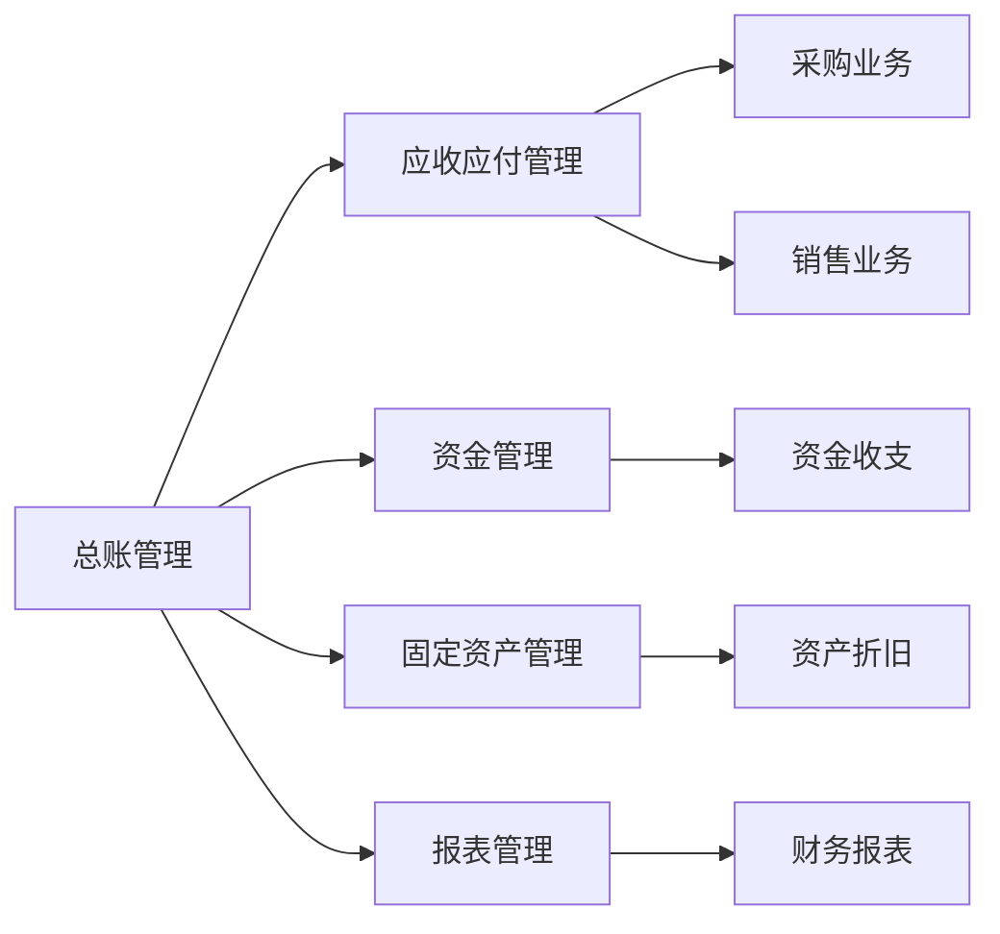

# 电脑公司财务管理系统详细设计与具体代码实现

## 1. 背景介绍
### 1.1 财务管理系统概述
#### 1.1.1 财务管理系统的定义
#### 1.1.2 财务管理系统的作用
#### 1.1.3 财务管理系统的发展历程
### 1.2 电脑公司财务管理系统的必要性
#### 1.2.1 电脑公司的业务特点
#### 1.2.2 电脑公司财务管理的痛点
#### 1.2.3 电脑公司财务管理系统的价值

## 2. 核心概念与联系
### 2.1 财务管理系统的核心模块
#### 2.1.1 总账管理
#### 2.1.2 应收应付管理
#### 2.1.3 资金管理
#### 2.1.4 固定资产管理
#### 2.1.5 报表管理
### 2.2 财务管理系统的核心业务流程
#### 2.2.1 采购业务流程
#### 2.2.2 销售业务流程
#### 2.2.3 费用报销流程
#### 2.2.4 资金收支流程
### 2.3 财务管理系统的核心概念关系


## 3. 核心算法原理具体操作步骤
### 3.1 总账管理算法
#### 3.1.1 会计分录生成算法
#### 3.1.2 账簿平衡校验算法
#### 3.1.3 期末结账算法
### 3.2 应收应付管理算法 
#### 3.2.1 应收账款账龄分析算法
#### 3.2.2 应付账款到期提醒算法
#### 3.2.3 坏账准备计提算法
### 3.3 资金管理算法
#### 3.3.1 资金预算控制算法
#### 3.3.2 资金调拨优化算法
#### 3.3.3 资金风险预警算法
### 3.4 固定资产管理算法
#### 3.4.1 固定资产折旧算法
#### 3.4.2 固定资产盘点算法
#### 3.4.3 固定资产处置算法
### 3.5 报表管理算法
#### 3.5.1 财务报表编制算法
#### 3.5.2 财务指标分析算法
#### 3.5.3 报表合并抵消算法

## 4. 数学模型和公式详细讲解举例说明
### 4.1 应收账款账龄分析模型
#### 4.1.1 账龄区间划分
#### 4.1.2 账龄分布计算公式
$$ P_i = \frac{A_i}{\sum_{j=1}^n A_j} $$
其中，$P_i$ 表示第 $i$ 个账龄区间的应收账款占比，$A_i$ 表示第 $i$ 个账龄区间的应收账款金额，$n$ 表示账龄区间总数。
#### 4.1.3 账龄分析矩阵
### 4.2 固定资产折旧模型
#### 4.2.1 直线法折旧
$$ D = \frac{C - S}{n} $$
其中，$D$ 表示每年折旧额，$C$ 表示固定资产原值，$S$ 表示预计净残值，$n$ 表示预计使用年限。
#### 4.2.2 双倍余额递减法折旧
$$ D_i = \frac{2}{n} \times (C - \sum_{j=1}^{i-1} D_j) $$
其中，$D_i$ 表示第 $i$ 年的折旧额，$C$ 表示固定资产原值，$n$ 表示预计使用年限。
#### 4.2.3 工作量法折旧
$$ D_i = \frac{W_i}{\sum_{j=1}^n W_j} \times (C - S) $$
其中，$D_i$ 表示第 $i$ 年的折旧额，$W_i$ 表示第 $i$ 年的工作量，$C$ 表示固定资产原值，$S$ 表示预计净残值，$n$ 表示预计使用年限。
### 4.3 资金预算控制模型
#### 4.3.1 预算编制方法
#### 4.3.2 预算执行分析
$$ E_i = \frac{A_i}{B_i} \times 100\% $$
其中，$E_i$ 表示第 $i$ 个预算项目的执行率，$A_i$ 表示第 $i$ 个预算项目的实际发生金额，$B_i$ 表示第 $i$ 个预算项目的预算金额。
#### 4.3.3 预算调整机制

## 5. 项目实践：代码实例和详细解释说明
### 5.1 总账管理模块代码实现
#### 5.1.1 会计分录生成
```java
public void generateVoucher(Transaction transaction) {
    // 根据交易类型生成会计分录
    List<AccountingEntry> entries = new ArrayList<>();
    if (transaction.getType() == TransactionType.PURCHASE) {
        entries.add(new AccountingEntry("应付账款", transaction.getAmount(), EntryType.DEBIT));
        entries.add(new AccountingEntry("存货", transaction.getAmount(), EntryType.CREDIT));
    } else if (transaction.getType() == TransactionType.SALE) {
        entries.add(new AccountingEntry("应收账款", transaction.getAmount(), EntryType.DEBIT));
        entries.add(new AccountingEntry("主营业务收入", transaction.getAmount(), EntryType.CREDIT));
    }
    // 保存会计分录
    accountingEntryRepository.saveAll(entries);
}
```
该方法根据交易类型生成相应的会计分录，借方分录和贷方分录金额相等，保证了账簿平衡。
#### 5.1.2 账簿平衡校验
```java
public boolean isBalanced() {
    // 查询所有会计分录
    List<AccountingEntry> entries = accountingEntryRepository.findAll();
    // 计算借方和贷方金额
    double debitTotal = 0;
    double creditTotal = 0;
    for (AccountingEntry entry : entries) {
        if (entry.getType() == EntryType.DEBIT) {
            debitTotal += entry.getAmount();
        } else if (entry.getType() == EntryType.CREDIT) {
            creditTotal += entry.getAmount();
        }
    }
    // 判断借贷是否平衡
    return Math.abs(debitTotal - creditTotal) < 0.0001;
}
```
该方法通过查询所有会计分录，分别计算借方和贷方的总金额，然后判断两者之差是否小于一个极小值，以校验账簿是否平衡。
#### 5.1.3 期末结账
```java
public void carryForward() {
    // 查询收入类和费用类账户
    List<Account> incomeAccounts = accountRepository.findByType(AccountType.INCOME);
    List<Account> expenseAccounts = accountRepository.findByType(AccountType.EXPENSE);
    // 结转收入类账户
    for (Account account : incomeAccounts) {
        double balance = accountingEntryRepository.getBalance(account);
        AccountingEntry entry = new AccountingEntry("利润分配", balance, EntryType.DEBIT);
        accountingEntryRepository.save(entry);
        AccountingEntry oppositeEntry = new AccountingEntry(account.getName(), balance, EntryType.CREDIT);
        accountingEntryRepository.save(oppositeEntry);
    }
    // 结转费用类账户
    for (Account account : expenseAccounts) {
        double balance = accountingEntryRepository.getBalance(account);
        AccountingEntry entry = new AccountingEntry(account.getName(), balance, EntryType.DEBIT);
        accountingEntryRepository.save(entry);
        AccountingEntry oppositeEntry = new AccountingEntry("利润分配", balance, EntryType.CREDIT);
        accountingEntryRepository.save(oppositeEntry);
    }
}
```
该方法在期末时将收入类账户和费用类账户的余额结转到"利润分配"科目，并生成相应的会计分录，为编制财务报表做准备。

### 5.2 应收应付管理模块代码实现
#### 5.2.1 应收账款账龄分析
```java
public List<ReceivableAgingItem> getReceivableAgingAnalysis() {
    // 查询应收账款明细
    List<ReceivableItem> items = receivableItemRepository.findAll();
    // 定义账龄区间
    List<Integer> intervals = Arrays.asList(0, 30, 60, 90, 120, 180, 360, Integer.MAX_VALUE);
    // 计算每个账龄区间的金额
    List<ReceivableAgingItem> agingItems = new ArrayList<>();
    for (int i = 0; i < intervals.size() - 1; i++) {
        int start = intervals.get(i);
        int end = intervals.get(i + 1);
        double amount = items.stream()
                .filter(item -> item.getDaysOverdue() >= start && item.getDaysOverdue() < end)
                .mapToDouble(ReceivableItem::getAmount)
                .sum();
        ReceivableAgingItem agingItem = new ReceivableAgingItem(start, end, amount);
        agingItems.add(agingItem);
    }
    return agingItems;
}
```
该方法首先查询应收账款明细，然后定义账龄区间，遍历每个区间，筛选出属于该区间的应收账款明细，计算它们的金额总和，生成账龄分析结果。
#### 5.2.2 应付账款到期提醒
```java
@Scheduled(cron = "0 0 8 * * ?") // 每天早上8点执行
public void remindOverduePayables() {
    // 查询已到期的应付账款
    List<PayableItem> overdueItems = payableItemRepository.findOverdueItems();
    // 生成提醒消息
    String message = "以下应付账款已到期，请及时处理：\n";
    for (PayableItem item : overdueItems) {
        message += item.getSupplier() + " " + item.getAmount() + " 元，逾期 " + item.getDaysOverdue() + " 天\n";
    }
    // 发送提醒邮件
    mailService.sendMail("财务部", "应付账款到期提醒", message);
}
```
该方法使用Spring的@Scheduled注解实现定时任务，每天早上8点执行。它查询已到期的应付账款明细，生成提醒消息，并调用邮件服务发送提醒邮件给财务部。
#### 5.2.3 坏账准备计提
```java
public void calculateBadDebtProvision() {
    // 查询应收账款账龄分析结果
    List<ReceivableAgingItem> agingItems = getReceivableAgingAnalysis();
    // 设置各账龄区间的计提比例
    Map<Integer, Double> provisionRates = new HashMap<>();
    provisionRates.put(0, 0.0);
    provisionRates.put(30, 0.01);
    provisionRates.put(60, 0.02);
    provisionRates.put(90, 0.05);
    provisionRates.put(120, 0.1);
    provisionRates.put(180, 0.3);
    provisionRates.put(360, 0.5);
    // 计算坏账准备金额
    double provision = 0;
    for (ReceivableAgingItem item : agingItems) {
        double rate = provisionRates.get(item.getEndDays());
        provision += item.getAmount() * rate;
    }
    // 保存坏账准备金额
    BadDebtProvision badDebtProvision = new BadDebtProvision();
    badDebtProvision.setAmount(provision);
    badDebtProvisionRepository.save(badDebtProvision);
}
```
该方法首先调用getReceivableAgingAnalysis方法获取应收账款账龄分析结果，然后设置各账龄区间的计提比例，遍历账龄分析结果，根据每个区间的金额和计提比例计算坏账准备金额，最后将坏账准备金额保存到数据库。

### 5.3 资金管理模块代码实现
#### 5.3.1 资金预算控制
```java
public void controlBudget(String itemName, double amount) {
    // 查询预算项目
    BudgetItem budgetItem = budgetItemRepository.findByName(itemName);
    // 检查可用余额是否足够
    if (budgetItem.getBalance() < amount) {
        throw new InsufficientBalanceException("预算不足");
    }
    // 更新预算项目余额
    budgetItem.setBalance(budgetItem.getBalance() - amount);
    budgetItemRepository.save(budgetItem);
    // 记录预算执行情况
    BudgetLog budgetLog = new BudgetLog();
    budgetLog.setItemName(itemName);
    budgetLog.setAmount(amount);
    budgetLogRepository.save(budgetLog);
}
```
该方法用于控制预算执行，它首先根据预算项目名称查询预算项目，检查可用余额是否足够，如果不够则抛出异常，否则更新预算项目余额，并记录预算执行情况。
#### 5.3.2 资金调拨优化
```java
public List<Transfer> optimizeTransfers(List<TransferRequest> requests) {