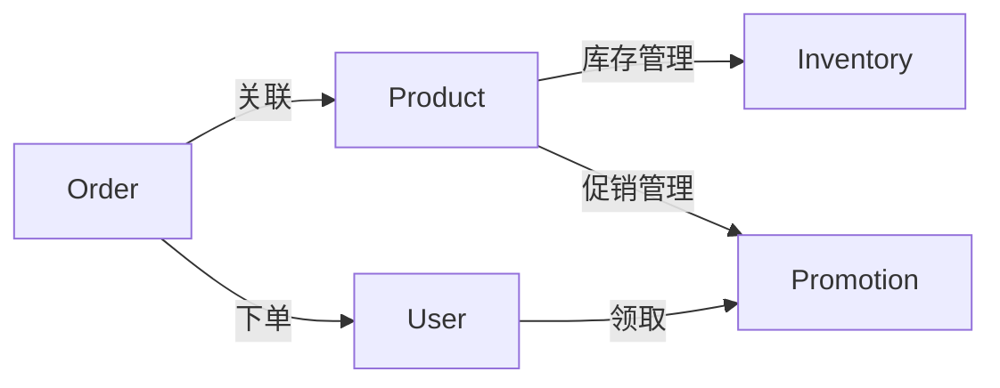
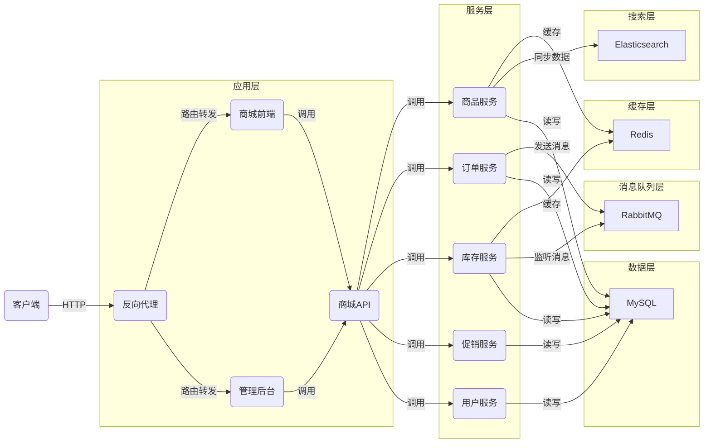
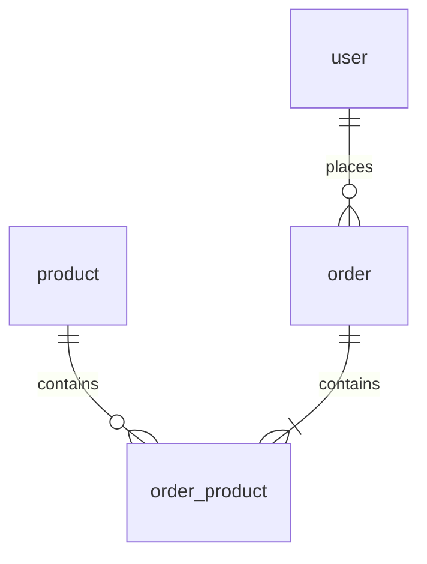

# 电脑商城销售管理系统详细设计与具体代码实现

## 1. 背景介绍

随着电子商务的蓬勃发展,越来越多的企业开始关注线上销售渠道。作为IT行业的重要分支,电脑及其周边产品的销售也逐渐从线下实体店转移到了网上商城。为了更好地管理电脑商城的销售业务,开发一套功能完善、易于扩展的销售管理系统势在必行。

本文将详细介绍一个电脑商城销售管理系统的设计与实现过程,重点关注其核心概念、系统架构、关键算法、数据库设计以及代码实现等方面。通过对该系统的全面剖析,帮助读者深入理解电商销售管理系统的开发技术和最佳实践。

### 1.1 电脑商城销售管理系统的意义

电脑商城销售管理系统是连接电商平台和企业内部管理的重要桥梁,其主要意义体现在以下几个方面:

1. 提高销售效率:通过系统实现商品管理、订单处理、库存同步等业务流程的自动化,大大提升了销售人员的工作效率。

2. 优化客户体验:系统支持多种促销方式、个性化推荐等功能,为客户提供更加贴心和人性化的购物体验。

3. 加强数据分析:销售管理系统可以采集和分析销售数据,帮助企业及时洞察市场趋势,优化经营策略。

4. 降低运营成本:通过系统对业务流程进行标准化和精细化管理,减少人工操作环节,从而降低企业的运营成本。

### 1.2 系统开发目标

本项目旨在开发一个高可用、高性能、可扩展的电脑商城销售管理系统。具体目标包括:

1. 实现商品管理、订单管理、库存管理、促销管理等核心业务功能。

2. 设计合理的系统架构,做到模块化、低耦合,便于日后的二次开发和功能扩展。

3. 选用成熟稳定的技术框架,保证系统的可靠性和性能。

4. 规范化的代码设计,提供清晰详尽的文档,减少后续的维护成本。

## 2. 核心概念与关系

在电脑商城销售管理系统中,涉及到以下几个核心概念:

- 商品(Product):电脑商城销售的实物,包含基本信息如名称、价格、规格、库存等。

- 订单(Order):客户在商城下达的采购需求,包含订单号、商品明细、收货信息、支付状态等。

- 库存(Inventory):商城持有的商品数量,影响是否可售及发货。

- 促销(Promotion):商城开展的各类营销活动,如满减、优惠券、秒杀等。

- 用户(User):使用商城进行购物的客户,包含基本信息如姓名、联系方式、收货地址等。

这些核心概念之间的关系可用下图表示:



从图中可以看出,商品与订单、库存、促销都有直接关系。用户通过下单购买商品,并可领取促销优惠。因此,这些概念在系统中是紧密关联、相互影响的。

## 3. 系统架构设计

### 3.1 技术选型

本系统采用主流的Java技术栈进行开发,主要使用的框架和工具包括:

- Spring Boot:简化配置,快速构建独立的Spring应用。

- MyBatis:优秀的持久层框架,与Spring Boot完美集成。

- Redis:高性能的分布式缓存,用于提升系统并发能力。

- RabbitMQ:开源消息中间件,实现系统解耦和异步通信。

- Elasticsearch:分布式搜索引擎,提供商品检索等功能。

- Vue.js:渐进式JavaScript框架,用于构建Web端交互界面。

- Swagger:API文档生成工具,自动生成接口文档。

### 3.2 系统架构图

系统整体架构如下图所示:



从架构图可以看出,系统采用前后端分离的设计,由Nginx提供反向代理和负载均衡。应用层包含商城前端、管理后台和商城API,其中商城API对外提供RESTful接口,供前端和后台调用。

服务层采用微服务架构,将业务拆分为多个独立的服务,每个服务对应一个特定的业务领域。服务之间通过HTTP进行通信。考虑到服务的可扩展性,每个服务都可以进行水平扩容。

为了提高系统性能,引入Redis作为分布式缓存,用于缓存热点数据如商品详情、库存信息等。

订单服务和库存服务通过RabbitMQ实现异步通信,当创建订单时,发送消息到消息队列,库存服务监听消息进行出库处理,保证两个服务之间的数据一致性。

商品服务将商品数据同步到Elasticsearch中,提供商品检索功能。数据层采用MySQL数据库存储业务数据。

## 4. 数据库设计

根据系统的核心概念,设计了以下几张关键数据库表:

### 4.1 商品表(product)

| 字段名 | 类型 | 说明 |
| --- | --- | --- |
| id | bigint | 商品id,主键 |
| name | varchar | 商品名称 |
| price | decimal | 商品价格 |
| stock | int | 商品库存 |
| status | tinyint | 商品状态,1-正常,2-下架,3-删除 |
| created_at | datetime | 创建时间 |
| updated_at | datetime | 更新时间 |

### 4.2 订单表(order)

| 字段名 | 类型 | 说明 |
| --- | --- | --- |
| id | bigint | 订单id,主键 |
| order_no | varchar | 订单编号 |
| user_id | bigint | 用户id,外键 |
| total_amount | decimal | 订单总金额  |
| pay_amount | decimal | 实付金额 |
| pay_type | tinyint | 支付方式,1-微信,2-支付宝 |
| pay_status | tinyint | 支付状态,1-待支付,2-已支付,3-已退款 |
| created_at | datetime | 创建时间 |
| updated_at | datetime | 更新时间 |

### 4.3 订单商品表(order_product)

| 字段名 | 类型 | 说明 |
| --- | --- | --- |
| id | bigint | 主键 |
| order_id | bigint | 订单id,外键 |
| product_id | bigint | 商品id,外键 |
| price | decimal | 商品价格 |
| count | int | 商品数量 |
| created_at | datetime | 创建时间 |
| updated_at | datetime | 更新时间 |

### 4.4 用户表(user)

| 字段名 | 类型 | 说明 |
| --- | --- | --- |
| id | bigint | 用户id,主键 |
| username | varchar | 用户名 |
| password | varchar | 密码 |
| phone | varchar | 手机号 |
| email | varchar | 邮箱 |
| created_at | datetime | 创建时间 |
| updated_at | datetime | 更新时间 |

### 4.5 ER图

以上几张表的ER图如下:



从ER图可以看出,商品和订单是多对多的关系,中间通过订单商品表进行关联。用户和订单是一对多的关系,一个用户可以下多个订单。

## 5. 核心功能设计

### 5.1 商品管理

商品管理主要包括商品的添加、修改、删除和查询功能,下面以添加商品为例,给出具体的接口设计和实现代码。

#### 5.1.1 接口设计

- 请求方式:POST

- 请求路径:/product/add

- 请求参数:

| 参数名 | 类型 | 是否必须 | 说明 |
| --- | --- | --- | --- |
| name | string | 是 | 商品名称 |
| price | decimal | 是 | 商品价格 |
| stock | int | 是 | 商品库存 |

- 返回结果:

```json
{
  "code": 0,
  "message": "success",
  "data": {
    "id": 1,
    "name": "笔记本电脑",
    "price": 4999.99,
    "stock": 100
  }
}
```

#### 5.1.2 代码实现

- Controller层

```java
@RestController
@RequestMapping("/product")
public class ProductController {
    
    @Autowired
    private ProductService productService;
    
    @PostMapping("/add")
    public Result<Product> add(@RequestBody Product product) {
        Product savedProduct = productService.add(product);
        return Result.success(savedProduct);
    }
}
```

- Service层

```java
@Service
public class ProductServiceImpl implements ProductService {
    
    @Autowired
    private ProductMapper productMapper;
    
    @Override
    public Product add(Product product) {
        productMapper.insert(product);
        return product;
    }
}
```

- Mapper层

```java
@Mapper
public interface ProductMapper {
    
    @Insert("INSERT INTO product(name, price, stock, status, created_at, updated_at) " +
            "VALUES(#{name}, #{price}, #{stock}, #{status}, #{createdAt}, #{updatedAt})")
    @Options(useGeneratedKeys = true, keyProperty = "id")
    int insert(Product product);
}
```

### 5.2 订单管理

订单管理涉及到订单的创建、支付、取消、删除等操作,其中订单的创建和支付流程相对复杂,需要涉及到库存扣减、优惠计算等逻辑。

#### 5.2.1 创建订单

创建订单的主要流程如下:

1. 用户在商城前端选择商品,点击下单按钮,请求创建订单接口。

2. 订单服务接收到请求后,首先查询商品信息,检查库存是否充足。

3. 根据优惠活动计算订单优惠金额。

4. 创建订单,并将订单商品信息保存到订单商品表中。

5. 发送消息到RabbitMQ,通知库存服务进行库存扣减。

6. 返回订单信息给前端。

#### 5.2.2 支付订单

支付订单的主要流程如下:

1. 用户在商城前端选择支付方式,点击支付按钮,请求支付订单接口。

2. 订单服务接收到请求后,调用第三方支付平台的接口进行支付。

3. 支付成功后,更新订单状态为已支付。

4. 发送消息到RabbitMQ,通知库存服务进行库存扣减确认。

5. 返回支付结果给前端。

#### 5.2.3 接口设计

- 创建订单接口

请求方式:POST

请求路径:/order/create

请求参数:

| 参数名 | 类型 | 是否必须 | 说明 |
| --- | --- | --- | --- |
| userId | long | 是 | 用户id |
| addressId | long | 是 | 收货地址id |
| couponId | long | 否 | 优惠券id |
| products | array | 是 | 订单商品列表 |

products参数:

| 参数名 | 类型 | 是否必须 | 说明 |