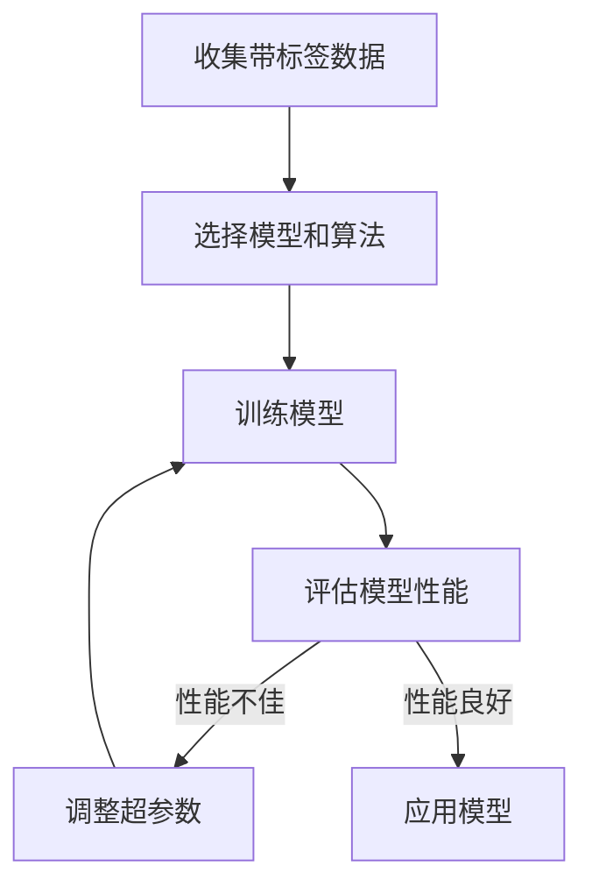
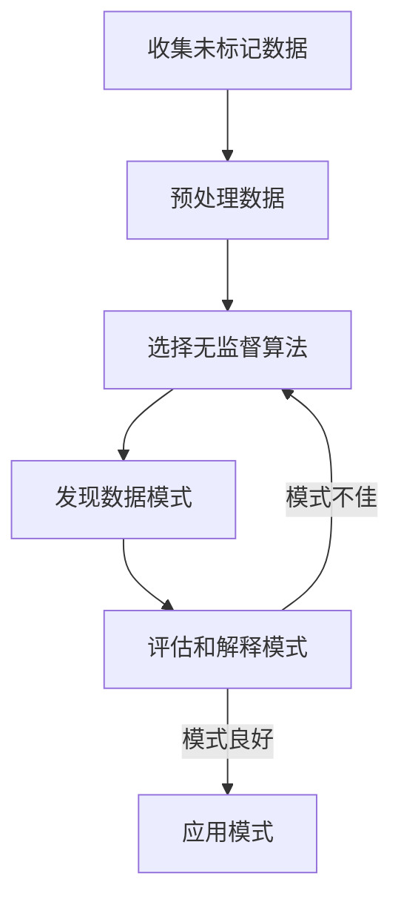

# 监督学习vs.无监督学习：一场算法的巅峰对决

## 1.背景介绍

### 1.1 人工智能的崛起

在过去几十年中,人工智能(AI)已经从一个遥不可及的概念发展成为一个无处不在的现实。从语音助手到自动驾驶汽车,从推荐系统到医疗诊断,AI已经深深融入到我们生活的方方面面。作为AI的核心,机器学习算法正在推动这一革命性的变革。

### 1.2 机器学习的分类

机器学习可以大致分为两大类:监督学习(Supervised Learning)和无监督学习(Unsupervised Learning)。这两种学习范式虽然有着根本的区别,但又存在着千丝万缕的联系。它们就像是人工智能领域的两座巍峨山峰,相互竞争又相辅相成。

## 2.核心概念与联系  

### 2.1 监督学习

监督学习是机器学习中最常见和最成熟的范式。在这种方法中,算法会从一组带有标签的训练数据中学习,目标是找到将输入数据映射到正确输出的函数或模型。常见的监督学习任务包括分类(将输入实例划分到预定义的类别中)和回归(预测一个连续值输出)。

#### 2.1.1 监督学习的工作流程

监督学习的工作流程通常包括以下几个步骤:

1. 收集并准备带标签的训练数据
2. 选择合适的模型和算法
3. 训练模型,使其学习输入和输出之间的映射关系
4. 评估模型在测试数据上的性能
5. 调整模型超参数,提高性能(如有必要)
6. 将训练好的模型应用于新的未标记数据



#### 2.1.2 监督学习算法示例

一些流行的监督学习算法包括:

- K-近邻算法(KNN)
- 支持向量机(SVM)
- 决策树和随机森林
- 逻辑回归
- 人工神经网络

### 2.2 无监督学习

与监督学习不同,无监督学习算法是从未标记的原始数据中寻找内在模式和结构。这种方法没有预定义的输出标签,而是试图发现数据中隐藏的规律和群集。常见的无监督学习任务包括聚类(将相似的数据点分组)和降维(将高维数据映射到低维空间)。

#### 2.2.1 无监督学习的工作流程  

无监督学习的工作流程通常包括以下几个步骤:

1. 收集原始未标记数据
2. 预处理和清洗数据
3. 选择合适的无监督算法
4. 应用算法发现数据模式或结构  
5. 评估和解释发现的模式
6. 将发现的模式应用于新数据



#### 2.2.2 无监督学习算法示例

一些常用的无监督学习算法包括:

- K-means聚类
-层次聚类
- DBSCAN密度聚类
- 高斯混合模型
- 主成分分析(PCA)
- t-SNE可视化

### 2.3 监督学习与无监督学习的关系

尽管监督学习和无监督学习在目标和方法上存在明显区别,但它们之间并非完全割裂。在实际应用中,两者常常会结合使用,相互补充。

例如,无监督学习可以用于发现数据中的隐藏结构,从而为监督学习任务提供有价值的特征。另一方面,监督学习模型的输出也可以作为无监督算法的输入,用于进一步分析和发现新的模式。

此外,一些算法框架(如生成对抗网络)将监督和无监督学习融合在一起,以实现更强大的机器学习能力。

## 3.核心算法原理具体操作步骤

在本节中,我们将深入探讨监督学习和无监督学习算法的核心原理和具体操作步骤。

### 3.1 监督学习算法

#### 3.1.1 线性回归

线性回归是最简单和最常用的监督学习算法之一,它试图找到一个最佳拟合的线性方程来描述自变量和因变量之间的关系。

算法步骤:

1. 收集数据,包括自变量(X)和因变量(y)
2. 定义线性模型: $y = \theta_0 + \theta_1x_1 + ... + \theta_nx_n$  
3. 使用最小二乘法估计模型参数$\theta$,最小化代价函数:

$$J(\theta) = \frac{1}{2m}\sum_{i=1}^{m}(h_\theta(x^{(i)}) - y^{(i)})^2$$

其中$h_\theta(x) = \theta^Tx$是模型的预测值。

4. 使用梯度下降法最小化代价函数,更新参数:

$$\theta_j := \theta_j - \alpha\frac{\partial}{\partial\theta_j}J(\theta)$$

5. 重复步骤4直到收敛
6. 使用训练好的模型对新数据进行预测

#### 3.1.2 逻辑回归

逻辑回归是一种用于分类任务的监督算法。它使用对数函数(logistic function)将输入映射到0到1之间的值,从而预测实例属于某个类别的概率。

算法步骤:

1. 收集带标签的训练数据
2. 定义逻辑回归模型:

$$h_\theta(x) = g(\theta^Tx) = \frac{1}{1+e^{-\theta^Tx}}$$

其中$g(z)$是sigmoid函数。

3. 定义代价函数:

$$J(\theta) = -\frac{1}{m}\sum_{i=1}^m[y^{(i)}\log(h_\theta(x^{(i)})) + (1-y^{(i)})\log(1-h_\theta(x^{(i)}))]$$

4. 使用梯度下降最小化代价函数
5. 重复步骤4直到收敛
6. 使用训练好的模型对新数据进行分类

#### 3.1.3 决策树

决策树是一种强大且可解释的监督学习算法,它以树状结构表示决策过程。每个内部节点代表一个特征,每个分支代表该特征的一个值,而每个叶节点对应一个类别或数值。

算法步骤(以分类树为例):

1. 从根节点开始,选择最优特征进行分裂
2. 基于所选特征的不同取值,将数据集分割成若干子集
3. 对每个子集重复步骤1和2,递归构建决策树
4. 直到满足停止条件(如最大深度、最小样本数等)
5. 将每个叶节点分配一个类别标签
6. 使用生成的决策树对新数据进行分类

特征选择通常使用信息增益或基尼指数等指标。决策树易于理解,但也容易过拟合。

### 3.2 无监督学习算法

#### 3.2.1 K-Means聚类

K-Means是一种简单而流行的无监督聚类算法。它将数据划分为K个聚类,每个数据点被分配到与其最近的聚类中心的簇。

算法步骤:

1. 随机初始化K个聚类中心
2. 对每个数据点:
    a. 计算它与每个聚类中心的距离  
    b. 将其分配到最近的聚类中心所在的簇
3. 对每个聚类,重新计算聚类中心
4. 重复步骤2和3,直到聚类中心不再发生变化

聚类质量可以使用簇内平方和(WSS)等指标进行评估。K-Means对异常值敏感,需要对数据进行预处理。

#### 3.2.2 层次聚类

层次聚类是一种将数据对象分组为层次结构的无监督算法。根据聚类方式的不同,可分为自底向上(凝聚式)和自顶向下(分裂式)两种方法。

算法步骤(以凝聚式为例):

1. 将每个数据点视为单独的簇
2. 计算每对簇之间的距离或相似度
3. 合并距离最近(或相似度最高)的两个簇
4. 更新簇间距离矩阵
5. 重复步骤3和4,直到所有数据点聚为一簇
6. 根据所需的聚类数量,从树状结构中截取相应层次

常用的距离度量包括欧氏距离、曼哈顿距离等。层次聚类可视化效果好,但计算复杂度较高。

#### 3.2.3 主成分分析(PCA)

主成分分析是一种常用的无监督降维技术,它通过正交变换将原始数据投影到一个低维子空间,使投影数据的方差最大化。

算法步骤:

1. 对原始数据进行归一化处理
2. 计算数据的协方差矩阵
3. 计算协方差矩阵的特征值和特征向量
4. 选取与最大K个特征值对应的K个特征向量,构成投影矩阵
5. 使用投影矩阵将原始数据投影到K维空间

PCA可以有效降低数据维度,去除噪声,提高计算效率。但它只能发现线性关系,对非线性模式不太敏感。

## 4.数学模型和公式详细讲解举例说明

在上一节中,我们介绍了监督学习和无监督学习算法的核心原理和步骤。现在,让我们更深入地探讨一些常用算法的数学模型和公式。

### 4.1 线性回归

线性回归试图找到一个最佳拟合的线性方程来描述自变量和因变量之间的关系。其数学模型可以表示为:

$$y = \theta_0 + \theta_1x_1 + ... + \theta_nx_n$$

其中$y$是因变量,${x_1, x_2, ..., x_n}$是自变量,而$\theta$是需要估计的模型参数。

为了找到最佳参数估计,我们需要定义一个代价函数(Cost Function),它衡量了模型预测值与实际值之间的差异。最常用的代价函数是均方误差(Mean Squared Error, MSE):

$$J(\theta) = \frac{1}{2m}\sum_{i=1}^{m}(h_\theta(x^{(i)}) - y^{(i)})^2$$

其中$m$是训练样本数量,$h_\theta(x)$是模型的预测值。

我们的目标是最小化这个代价函数,从而找到最佳拟合的参数$\theta$。一种常用的优化算法是梯度下降(Gradient Descent),它通过计算代价函数相对于参数的偏导数,并沿着负梯度方向更新参数:

$$\theta_j := \theta_j - \alpha\frac{\partial}{\partial\theta_j}J(\theta)$$

其中$\alpha$是学习率,控制着参数更新的步长。

让我们用一个简单的例子来说明线性回归的工作原理。假设我们有一组房屋面积和价格的数据,我们希望建立一个线性模型来预测房价。

```python
import numpy as np
from sklearn.linear_model import LinearRegression

# 训练数据
area = np.array([1000, 1500, 2000, 2500, 3000])  # 面积(平方英尺)
price = np.array([200, 300, 400, 550, 800])  # 价格(千美元)

# 创建线性回归模型
model = LinearRegression()

# 训练模型
model.fit(area.reshape(-1, 1), price)

# 打印模型参数
print(f"截距(Intercept): {model.intercept_}")
print(f"系数(Coefficient): {model.coef_[0]}")

# 预测新数据
new_area = 2200
predicted_price = model.predict([[new_area]])
print(f"面积为 {new_area} 平方英尺的房屋预测价格为 {predicted_price[0]} 千美元")
```

输出:

```
截距(Intercept): 50.0
系数(Coefficient): 0.25
面积为 2200 平方英尺