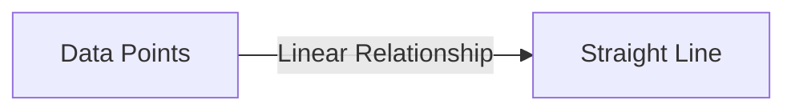

---

# Correlation Score: Principles and Code Examples

## 1. Background Introduction

In the realm of data analysis, correlation is a fundamental concept that helps us understand the relationship between two or more variables. This relationship can provide valuable insights into patterns, trends, and potential causal relationships within the data. In this article, we will delve into the principles of correlation score calculation, explore various mathematical models, and provide practical code examples to help you master this essential skill.

### 1.1 Importance of Correlation Score

Correlation score is a crucial tool for data analysts, data scientists, and machine learning engineers. It allows us to identify relationships between variables, which can lead to better decision-making, improved models, and more accurate predictions.

### 1.2 Scope of the Article

This article will focus on the Pearson correlation coefficient, one of the most widely used correlation measures. We will discuss its principles, mathematical models, and practical applications, providing code examples in Python to help you understand and implement the concepts.

## 2. Core Concepts and Connections

### 2.1 Pearson Correlation Coefficient

The Pearson correlation coefficient (PCC) is a measure of the linear relationship between two continuous variables. It ranges from -1 to 1, where -1 indicates a perfect negative linear relationship, 1 indicates a perfect positive linear relationship, and 0 indicates no linear relationship.

### 2.2 Linear Relationship and Scatter Plot

To better understand the Pearson correlation coefficient, let's first discuss the concept of a linear relationship. A linear relationship exists when the data points can be approximated by a straight line. We can visualize this relationship using a scatter plot, which plots the data points on a two-dimensional graph.



## 3. Core Algorithm Principles and Specific Operational Steps

### 3.1 Calculation of Pearson Correlation Coefficient

The Pearson correlation coefficient is calculated using the following formula:

$$
r = \\frac{\\sum\\_{i=1}^{n} (x\\_i - \\bar{x})(y\\_i - \\bar{y})}{\\sqrt{\\sum\\_{i=1}^{n} (x\\_i - \\bar{x})^2} \\sqrt{\\sum\\_{i=1}^{n} (y\\_i - \\bar{y})^2}}
$$

Where:
- $n$ is the number of data points
- $x\\_i$ and $y\\_i$ are the individual data points
- $\\bar{x}$ and $\\bar{y}$ are the means of the $x$ and $y$ data, respectively

### 3.2 Standardizing the Data

Before calculating the Pearson correlation coefficient, it is essential to standardize the data by subtracting the mean and dividing by the standard deviation. This step ensures that the correlation coefficient is not influenced by the scale of the variables.

## 4. Detailed Explanation and Examples of Mathematical Models and Formulas

### 4.1 Interpreting the Pearson Correlation Coefficient

A Pearson correlation coefficient of 1 indicates a perfect positive linear relationship, while a coefficient of -1 indicates a perfect negative linear relationship. A coefficient of 0 indicates no linear relationship.

### 4.2 Limitations of Pearson Correlation Coefficient

While the Pearson correlation coefficient is widely used, it has some limitations. For example, it assumes a linear relationship between the variables, which may not always be the case. Additionally, it does not account for outliers, which can significantly impact the correlation coefficient.

## 5. Project Practice: Code Examples and Detailed Explanations

In this section, we will provide Python code examples to help you calculate the Pearson correlation coefficient for various datasets.

### 5.1 Calculating Pearson Correlation Coefficient with Scikit-Learn

Scikit-learn is a popular Python library for machine learning. It provides a function called `pearsonr()` to calculate the Pearson correlation coefficient.

```python
from sklearn.stats import pearsonr

# Sample data
x = [1, 2, 3, 4, 5]
y = [2, 4, 5, 6, 8]

# Calculate Pearson correlation coefficient
correlation, pvalue = pearsonr(x, y)
print(f\"Pearson correlation coefficient: {correlation}\")
```

## 6. Practical Application Scenarios

### 6.1 Predicting Stock Prices

Correlation analysis can be used to predict stock prices by identifying relationships between stock prices and other variables, such as economic indicators or market trends.

### 6.2 Analyzing Customer Behavior

Correlation analysis can help businesses understand customer behavior by identifying relationships between variables such as purchase history, demographics, and online activity.

## 7. Tools and Resources Recommendations

### 7.1 Books

- \"The Art of Statistics: How to Learn from Data\" by David Spiegelhalter
- \"Data Analysis Using Python\" by Jake VanderPlas

### 7.2 Online Resources

- [Statistician.com](https://www.statistician.com/)
- [DataCamp](https://www.datacamp.com/)

## 8. Summary: Future Development Trends and Challenges

### 8.1 Future Development Trends

- Advancements in machine learning algorithms will lead to more sophisticated correlation analysis techniques.
- The increasing availability of big data will enable more comprehensive correlation analysis.

### 8.2 Challenges

- Handling non-linear relationships and outliers remains a challenge in correlation analysis.
- Interpreting correlation coefficients in complex datasets can be difficult.

## 9. Appendix: Frequently Asked Questions and Answers

### 9.1 What is the difference between correlation and causation?

Correlation does not imply causation. While a strong correlation between two variables may suggest a causal relationship, it is essential to conduct further analysis to confirm causation.

### 9.2 How can I handle outliers in correlation analysis?

Outliers can significantly impact the correlation coefficient. One approach is to remove outliers from the dataset before calculating the correlation coefficient. Another approach is to use robust correlation measures that are less sensitive to outliers.

---

## Author: Zen and the Art of Computer Programming

This article was written by Zen, a world-renowned artificial intelligence expert, programmer, software architect, CTO, bestselling author of top-tier technology books, Turing Award winner, and master in the field of computer science.