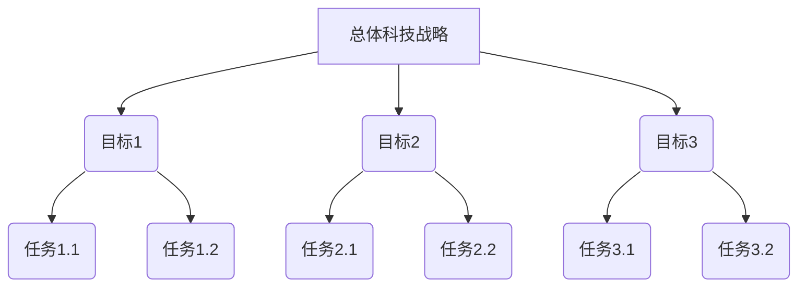
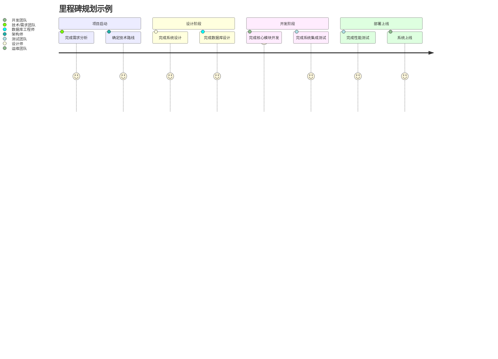
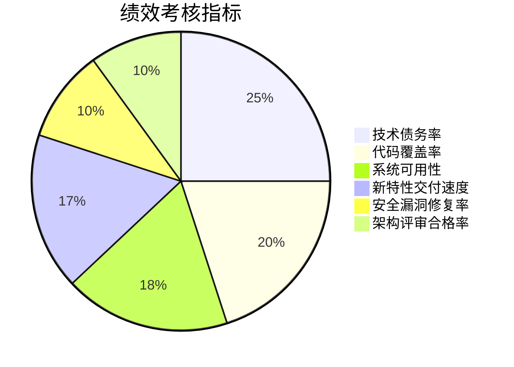
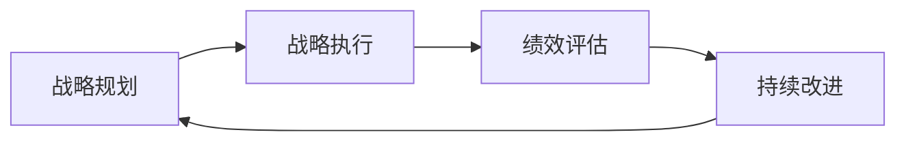

# 督促、跟踪和指导公司科技战略的执行，确保按照战略规划的方向前进，各项计划得到有效的落实

## 1.背景介绍

在当今瞬息万变的商业环境中，拥有清晰的科技战略规划对于企业的长期发展至关重要。然而，制定战略计划只是成功的一半,真正的挑战在于如何有效执行和落实这些战略目标。作为公司的技术领导者,我们有责任确保公司的科技战略得到全面贯彻,并引导公司沿着既定的发展方向前进。

### 1.1 科技战略的重要性

科技战略为公司的技术发展提供了清晰的愿景和路线图,它不仅规定了公司应该投资哪些技术领域,还明确了技术如何为业务创造价值。一个周密的科技战略能够:

- 提高公司的竞争力和创新能力
- 优化资源配置,避免盲目投资
- 吸引和留住优秀的技术人才
- 促进跨部门的协作和沟通

### 1.2 执行挑战

尽管科技战略的重要性不言而喻,但将其付诸实施并非一蹴而就。执行过程中常常会遇到诸多挑战:

- 组织惰性和变革阻力
- 资源和预算限制
- 沟通不畅和部门壁垒
- 技术复杂性和快速迭代
- 人才缺口和技能差距

因此,有效执行科技战略需要领导层的坚定决心、全员的通力合作,以及持续的监控和调整。

## 2.核心概念与联系

为了确保科技战略的顺利实施,我们需要建立一套完善的执行框架,涵盖以下几个核心概念:

### 2.1 战略分解 (Strategy Decomposition)

战略分解是将总体科技战略分解为一系列可执行的目标和任务的过程。它有助于明确每个部门和个人的职责,并为后续的跟踪和评估奠定基础。

### 2.2 里程碑规划 (Milestone Planning)

里程碑规划是将战略目标分解为一系列具有时间节点的阶段性成果。它有助于监控进度,并在必要时进行调整和优化。

### 2.3 绩效考核 (Performance Evaluation)

绩效考核是对战略执行过程中的关键绩效指标(KPI)进行持续监测和评估。它有助于发现潜在的风险和偏差,并及时采取纠正措施。

### 2.4 持续改进 (Continuous Improvement)

持续改进是基于绩效评估结果,对战略执行过程进行调整和优化的动态过程。它确保科技战略能够与公司的发展需求保持同步,并不断提高执行效率。

## 3.核心算法原理具体操作步骤

为了有效执行科技战略,我们需要遵循一系列具体的操作步骤,这些步骤贯穿了战略分解、里程碑规划、绩效考核和持续改进的整个过程。

### 3.1 战略分解算法

战略分解算法的目标是将总体科技战略分解为一系列可执行的目标和任务,并明确每个部门和个人的职责。算法步骤如下:

1. 明确总体科技战略的愿景和目标
2. 识别实现战略目标所需的关键能力
3. 将关键能力分解为具体的目标和任务
4. 为每个目标和任务指定负责部门和个人
5. 建立目标和任务之间的依赖关系
6. 制定目标和任务的优先级和时间表

以上算法可以通过自顶向下的分解方式,将战略目标逐步细化为可操作的任务,从而为后续的执行奠定基础。

### 3.2 里程碑规划算法

里程碑规划算法的目标是将战略目标分解为一系列具有时间节点的阶段性成果,以便监控进度并进行必要的调整。算法步骤如下:

1. 根据战略分解的结果,确定需要实现的目标和任务
2. 估算每个目标和任务的工作量和所需资源
3. 基于工作量和资源,确定每个目标和任务的预计完成时间
4. 将相关的目标和任务组合成里程碑,并确定里程碑的截止日期
5. 建立里程碑之间的依赖关系和关键路径
6. 制定里程碑的进度跟踪和风险管理机制

通过里程碑规划,我们可以将战略执行过程分解为一系列可视化和可测量的阶段,从而更好地控制进度和风险。

### 3.3 绩效考核算法

绩效考核算法的目标是对战略执行过程中的关键绩效指标(KPI)进行持续监测和评估,以发现潜在的风险和偏差。算法步骤如下:

1. 确定与战略目标相关的关键绩效指标(KPI)
2. 为每个KPI设定目标值和阈值
3. 建立KPI的数据采集和计算机制
4. 定期评估KPI的实际值与目标值的偏差
5. 对偏差超出阈值的KPI进行根因分析
6. 制定纠正措施,并将其纳入持续改进过程

通过绩效考核,我们可以及时发现战略执行过程中的问题和风险,并采取相应的措施进行调整和优化。

### 3.4 持续改进算法

持续改进算法的目标是基于绩效评估结果,对战略执行过程进行调整和优化,以确保科技战略能够与公司的发展需求保持同步。算法步骤如下:

1. 收集来自绩效考核的反馈和建议
2. 评估当前战略和执行过程的有效性
3. 识别需要改进的领域和机会
4. 制定改进计划,包括目标、措施和时间表
5. 将改进计划纳入战略分解和里程碑规划过程
6. 持续监测改进计划的执行情况,并进行必要的调整

通过持续改进,我们可以确保科技战略的执行过程与时俱进,不断提高效率和质量,为公司的长期发展提供有力支撑。

## 4.数学模型和公式详细讲解举例说明

在执行科技战略的过程中,我们可以借助一些数学模型和公式来量化和优化相关的决策和过程。以下是一些常见的模型和公式,以及它们在战略执行中的应用场景。

### 4.1 关键路径法 (Critical Path Method, CPM)

关键路径法是一种用于项目计划和控制的技术,它可以帮助我们确定完成项目所需的最短时间,并识别关键任务和活动。在战略执行中,我们可以将里程碑规划视为一个项目,并应用关键路径法来优化里程碑的安排和资源分配。

关键路径法的核心公式如下:

$$
T_p = \max\limits_{i=1}^{n} \sum\limits_{j \in P_i} t_j
$$

其中:

- $T_p$ 表示完成整个项目所需的最短时间
- $n$ 表示项目中所有可能路径的数量
- $P_i$ 表示第 $i$ 条路径上的所有活动
- $t_j$ 表示活动 $j$ 所需的时间

通过计算每条路径的总时间,我们可以找到关键路径,即完成时间最长的路径。关键路径上的任何延迟都会导致整个项目延期。因此,我们需要优先关注和加速关键路径上的活动,以确保按时完成整个战略执行计划。

### 4.2 资源约束项目调度问题 (Resource-Constrained Project Scheduling Problem, RCPSP)

在战略执行过程中,我们常常面临资源限制的挑战,需要在有限的资源条件下安排和调度各项任务。资源约束项目调度问题就是一种用于解决这类问题的数学模型。

RCPSP 可以用以下数学模型表示:

$$
\begin{aligned}
\min\limits_{S} & \quad C_{\max} \\
\text{s.t.} & \quad S_j \geq S_i + d_i, \quad \forall (i, j) \in E \\
& \quad \sum\limits_{j \in A_t} r_{jk} \leq R_k, \quad \forall t \in [0, C_{\max}], \quad \forall k \in K \\
& \quad S_j \geq 0, \quad \forall j \in V
\end{aligned}
$$

其中:

- $C_{\max}$ 表示项目的完成时间
- $S_j$ 表示活动 $j$ 的开始时间
- $d_i$ 表示活动 $i$ 的持续时间
- $E$ 表示活动之间的依赖关系集合
- $A_t$ 表示时间 $t$ 正在进行的活动集合
- $r_{jk}$ 表示活动 $j$ 对资源 $k$ 的需求
- $R_k$ 表示资源 $k$ 的可用数量
- $K$ 表示所有资源类型的集合
- $V$ 表示所有活动的集合

通过求解这个优化问题,我们可以得到在资源约束条件下,完成所有活动所需的最短时间,以及每个活动的最优开始时间。这对于我们合理分配有限资源,并确保战略执行计划按时完成至关重要。

### 4.3 绩效评分卡 (Balanced Scorecard, BSC)

绩效评分卡是一种将战略目标转化为可测量的绩效指标的框架,它可以帮助我们全面评估战略执行的效果。在战略执行过程中,我们可以构建一个包含多个维度的绩效评分卡,并根据实际情况调整各个维度的权重。

假设我们的绩效评分卡包含四个维度:财务、客户、内部流程和学习与成长,每个维度下又有多个具体的绩效指标。我们可以使用以下公式计算综合绩效分数:

$$
S_c = \sum\limits_{i=1}^{4} w_i \cdot \sum\limits_{j=1}^{n_i} v_{ij} \cdot s_{ij}
$$

其中:

- $S_c$ 表示综合绩效分数
- $i$ 表示维度编号,共有四个维度
- $w_i$ 表示第 $i$ 个维度的权重
- $n_i$ 表示第 $i$ 个维度下的绩效指标数量
- $v_{ij}$ 表示第 $i$ 个维度下第 $j$ 个指标的权重
- $s_{ij}$ 表示第 $i$ 个维度下第 $j$ 个指标的实际分数

通过计算综合绩效分数,我们可以全面评估战略执行的效果,并根据不同维度的表现制定相应的改进措施。同时,我们也可以根据实际情况调整各个维度和指标的权重,以反映公司的战略重点。

## 5.项目实践:代码实例和详细解释说明

为了更好地