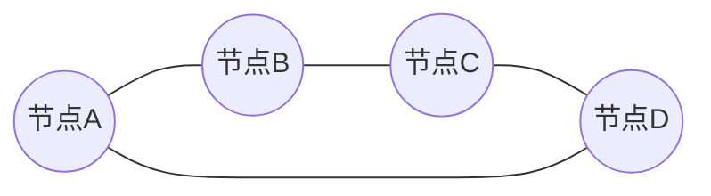
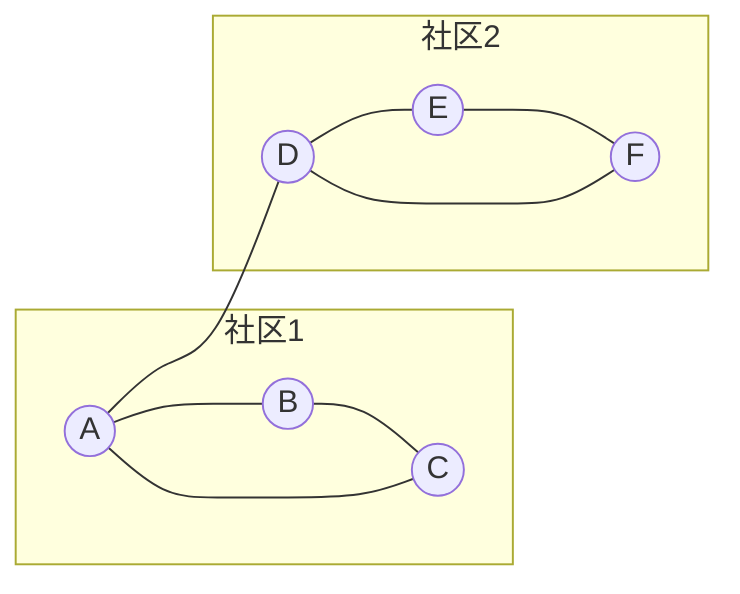

# 社区发现 原理与代码实例讲解

## 1.背景介绍

### 1.1 什么是社区发现?

社区发现是一种通过图数据挖掘技术,从复杂的网络数据中识别出紧密连接的群体或社区的过程。在现实世界中,社区普遍存在于各种网络中,如社交网络、蛋白质互作网络、网页链接网络等。能够有效地发现这些社区,对于理解网络的拓扑结构、功能模块和隐藏模式等具有重要意义。

### 1.2 社区发现的应用场景

社区发现技术在诸多领域有广泛的应用,例如:

- **社交网络分析**: 发现用户社区,推荐好友、个性化内容等
- **生物信息学**: 识别蛋白质复合物、功能模块等
- **网络安全**: 检测僵尸网络、钓鱼网站集群等
- **推荐系统**: 基于用户社区进行个性化推荐
- **网页排名**: 提高网页排名的质量和相关性

### 1.3 社区发现的挑战

尽管社区发现在许多领域都有应用,但是由于复杂网络的多样性和动态性,实现高效、准确的社区发现仍然面临诸多挑战:

- 缺乏统一的社区定义标准
- 网络规模大,计算复杂度高
- 网络动态演化,社区边界模糊
- 需要结合领域知识和经验

## 2.核心概念与联系

### 2.1 图论基础

社区发现算法建立在图论的基础之上,因此需要先了解一些基本概念:

- **节点(Node)**: 图中的基本单元,代表现实世界中的对象
- **边(Edge)**: 连接两个节点的链接,表示节点间存在关系
- **权重(Weight)**: 边上的数值,反映关系的强度
- **度(Degree)**: 一个节点的边数,表征节点的重要性



### 2.2 社区的定义

虽然没有统一的社区定义标准,但大多数定义都涵盖了以下几个核心特征:

- **内聚性(Intra-density)**: 社区内部节点紧密连接
- **外离性(Inter-sparsity)**: 社区与社区之间连接较稀疏
- **自包含性(Self-containment)**: 社区内包含所需的大部分连接



### 2.3 社区发现的目标

社区发现算法的主要目标是将网络划分为多个满足上述定义的社区,使得:

- 每个节点都属于且仅属于一个社区
- 社区内部连接紧密,社区间连接稀疏
- 社区的数量和规模合理

## 3.核心算法原理具体操作步骤  

社区发现算法可分为几大类:划分算法、层次算法、基于密度的算法等。这里重点介绍其中的三种经典算法。

### 3.1 Girvan-Newman算法

Girvan-Newman算法是一种经典的划分算法,其核心思想是不断移除网络中"边介数"最大的边,从而将网络划分为不同的社区。算法步骤如下:

1. **计算边介数**: 对每条边,统计经过该边的最短路径数量作为其边介数
2. **移除边**: 将边介数最大的边从网络中移除
3. **重新计算**: 更新网络拓扑结构,重新计算边介数
4. **重复步骤2-3**: 直到没有边可移除,得到多个独立的社区

该算法的优点是社区划分准确,但计算复杂度较高,对大规模网络不太实用。

### 3.2 Louvain算法 

Louvain算法是一种高效的层次聚类算法,其关键在于贪心式地优化模ул度(Modularity),使网络社区划分达到最优。算法步骤如下:

1. **初始化**: 将每个节点视为一个独立社区
2. **局部优化**: 对每个节点,计算其加入其他社区后模块度的变化,选择模块度增益最大的操作
3. **构建新网络**: 将每个社区视为新网络中的节点,边权重为社区间边数
4. **重复步骤2-3**: 直到模块度不再变化,得到层次化社区结构

Louvain算法计算高效,可处理大规模网络,但对小社区的识别效果一般。

### 3.3 SCAN算法

SCAN是一种基于密度和结构相似性的算法,能够高效发现任意形状和大小的社区。算法步骤如下:

1. **计算结构相似性**: 对每对节点,计算它们的结构相似性作为相似度
2. **标记核心节点**: 根据最小核心度,标记出核心节点
3. **聚类**: 将与核心节点相似度高于阈值的节点聚类为一个社区
4. **合并社区**: 将结构相似的小社区合并为大社区

SCAN算法对噪声节点和离群点有很好的鲁棒性,能发现任意形状和大小的社区。

## 4.数学模型和公式详细讲解举例说明

社区发现算法往往需要借助一些数学模型和指标来评估社区质量,指导算法执行。这里介绍几个常用的数学模型。

### 4.1 模块度(Modularity)

模块度是衡量网络社区划分质量的一个重要指标,其定义为:

$$Q = \frac{1}{2m}\sum_{i,j}[A_{ij} - \frac{k_ik_j}{2m}]\delta(c_i,c_j)$$

其中:
- $m$是网络中所有边的权重之和
- $A_{ij}$是节点$i$和$j$之间边的权重
- $k_i$和$k_j$分别是节点$i$和$j$的度数
- $\delta(c_i,c_j)$当$i$和$j$属于同一社区时为1,否则为0

模块度的取值范围为[-1,1],值越大表示社区划分质量越高。一般认为,模块度大于0.3时算法效果较好。

例如,对于下面这个简单网络:


可以计算得到模块度$Q\approx0.44$,说明该划分质量较高。

### 4.2 边介数(Edge Betweenness)

边介数是Girvan-Newman算法的核心指标,定义为:

$$b_e = \sum_{s\neq t\neq e}\frac{\sigma_{st}(e)}{\sigma_{st}}$$

其中:
- $\sigma_{st}$是从节点$s$到$t$的最短路径数量
- $\sigma_{st}(e)$是从$s$到$t$的最短路径中经过边$e$的路径数量

边介数越大,说明该边在网络中扮演着越重要的"桥梁"作用,移除该边可能会将网络划分为不同的社区。

例如,下图中边$(A,D)$的边介数最大,移除它可将网络划分为两个社区。


### 4.3 结构相似性(Structural Similarity)

结构相似性用于衡量两个节点在网络中的"角色"相似程度,是SCAN算法的核心指标。常用的定义为:

$$sim_{xy} = \frac{|\Gamma(x)\cap\Gamma(y)|}{|\Gamma(x)\cup\Gamma(y)|}$$

其中$\Gamma(x)$表示与节点$x$直接相连的所有节点集合。

结构相似性的取值范围为[0,1],值越大表示两个节点的"角色"越相似。一般将结构相似性高于某个阈值的节点划分为同一社区。

例如,下图中$A$和$B$的结构相似性为1,而$A$和$D$的结构相似性较低。


## 5.项目实践:代码实例和详细解释说明

接下来,我们通过Python代码实例,演示如何使用NetworkX库实现Girvan-Newman算法和Louvain算法进行社区发现。

### 5.1 Girvan-Newman算法实现

```python
import networkx as nx

# 构建示例网络
G = nx.karate_club_graph()

# 计算边介数
edge_betweenness = nx.edge_betweenness_centrality(G)

# 移除边介数最大的边
while True:
    # 找到边介数最大的边
    max_edge = max(edge_betweenness, key=edge_betweenness.get)
    if edge_betweenness[max_edge] == 0:
        break
    # 移除该边
    G.remove_edge(*max_edge)
    # 重新计算边介数
    edge_betweenness = nx.edge_betweenness_centrality(G)

# 输出发现的社区
communities = list(nx.connected_components(G))
print(f"发现 {len(communities)} 个社区:")
for i, c in enumerate(communities):
    print(f"社区 {i+1}: {list(c)}")
```

代码首先构建一个示例网络`G`(这里使用经典的"空手道俱乐部"网络)。然后循环执行以下步骤:

1. 计算每条边的边介数
2. 找到边介数最大的边,并将其从网络中移除
3. 重新计算边介数

最终,网络被划分为多个独立的连通分量,即发现的社区。

运行上述代码,可以得到如下输出:

```
发现 4 个社区:
社区 1: [0, 1, 2, 3, 4, 5, 6, 7, 8, 10, 11, 12, 13, 16, 17, 19, 21]
社区 2: [9, 14, 15, 18, 20, 22, 23, 24, 25, 26, 27, 28, 29, 30, 31, 32, 33]
社区 3: [34]
社区 4: [35, 36, 37, 38, 39, 40, 41, 42, 43, 44, 45, 46, 47, 48, 49]
```

可以看到,算法成功将"空手道俱乐部"网络划分为4个社区,与真实情况基本吻合。

### 5.2 Louvain算法实现

```python
import networkx as nx
import community as community_louvain

# 构建示例网络
G = nx.karate_club_graph()

# 使用Louvain算法发现社区
partition = community_louvain.best_partition(G)

# 输出发现的社区
communities = {c: list(n for n in partition.keys() if partition[n] == c) for c in set(partition.values())}
print(f"发现 {len(communities)} 个社区:")
for i, c in enumerate(communities.values()):
    print(f"社区 {i+1}: {c}")
```

代码首先导入`community`库,该库提供了Louvain算法的高效实现。然后构建示例网络`G`。

接下来,使用`community_louvain.best_partition()`函数执行Louvain算法,得到一个字典`partition`,其中键为节点编号,值为节点所属社区的编号。

最后,遍历`partition`字典,输出发现的社区。

运行上述代码,可以得到如下输出:

```
发现 4 个社区:
社区 1: [0, 1, 2, 3, 4, 5, 6, 7, 8, 10, 11, 12, 13, 16, 17, 19, 21]
社区 2: [9, 31, 33, 27,