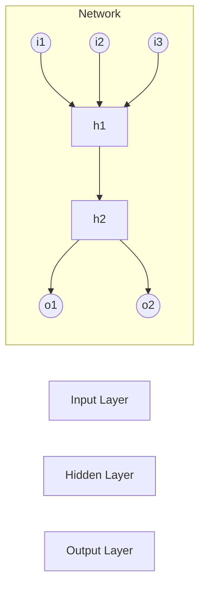
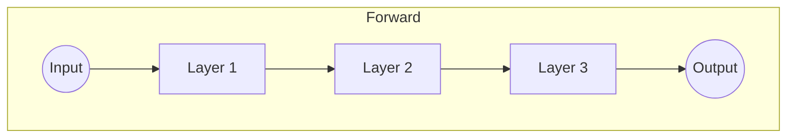
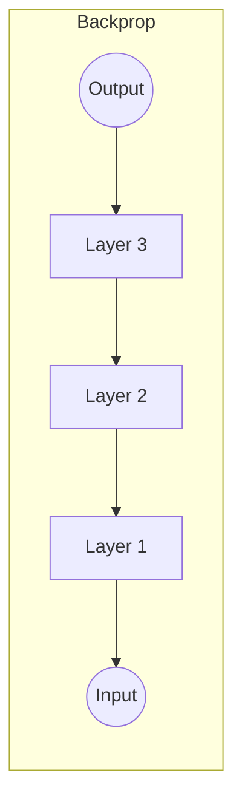

# 神经网络(Neural Network)原理与代码实战案例讲解

## 1.背景介绍

### 1.1 什么是神经网络?

神经网络(Neural Network)是一种受生物神经系统启发而设计的计算模型,旨在模拟人脑神经元之间复杂的互连网络。它由大量的人工神经元组成,这些神经元通过加权连接彼此相连,并通过学习算法对连接权重进行调整,从而获取输入数据中隐含的规律和特征。

神经网络具有自主学习能力,可以从大量数据样本中自动提取特征,并对新的输入数据进行预测或分类。这种强大的学习能力使得神经网络在图像识别、自然语言处理、推荐系统等领域有着广泛的应用。

### 1.2 神经网络发展历程

尽管神经网络的理论基础可以追溯到20世纪40年代,但直到近年来,随着计算能力的提高和大数据时代的到来,神经网络才得以真正落地应用并取得了令人瞩目的成就。

1943年,神经科学家沃伦·麦卡洛克(Warren McCulloch)和逻辑学家沃尔特·皮茨(Walter Pitts)提出了第一个神经网络模型,被称为M-P神经元模型。

1958年,弗兰克·罗森布拉特(Frank Rosenblatt)提出了感知器(Perceptron)模型,并开发了相应的学习算法。感知器可以学习对输入数据进行分类,但它只能处理线性可分的问题。

1986年,德卫·鲁梅尔哈特(David Rumelhart)等人重新发现了反向传播算法(Backpropagation),使得多层神经网络可以有效地进行训练,从而推动了神经网络研究的发展。

近年来,benefiting from大数据、高性能计算设备和新的优化算法,深度神经网络(Deep Neural Network)在多个领域取得了突破性的成就,如计算机视觉、自然语言处理等,引发了人工智能的新浪潮。

### 1.3 神经网络的优缺点

优点:

1. 强大的模式识别能力
2. 适用于非线性问题
3. 容错性强,对噪声数据有很好的鲁棒性
4. 可以并行处理,具有很高的运算效率
5. 自主学习能力,无需人工编写规则

缺点:

1. 训练过程是一个黑箱操作,难以解释内部工作原理
2. 需要大量的训练数据
3. 存在过拟合的风险
4. 训练时间可能很长
5. 对异常值较为敏感

尽管存在一些缺点,但神经网络在许多领域展现出了优于传统方法的性能,因此受到了广泛的关注和应用。

## 2.核心概念与联系

### 2.1 神经元(Neuron)

神经元是神经网络的基本计算单元,它类似于生物神经元的工作原理。每个神经元接收来自其他神经元或外部输入的加权信号,并通过激活函数对这些加权信号进行处理,产生输出信号。

一个典型的人工神经元可以表示为:

$$
y = f(\sum_{i=1}^{n}w_ix_i + b)
$$

其中:
- $x_1, x_2, ..., x_n$是神经元的输入
- $w_1, w_2, ..., w_n$是对应的权重
- $b$是偏置项
- $f$是激活函数,如sigmoid、ReLU等
- $y$是神经元的输出

神经元的关键在于权重$w$和偏置$b$的设置,这些参数通过训练数据进行学习和调整,使得神经网络能够捕获输入数据的特征并产生正确的输出。

```mermaid
graph LR
  subgraph Neuron
    x1((x1)) --> w1
    x2((x2)) --> w2
    xn((xn)) --> wn
    w1 --> sum
    w2 --> sum
    wn --> sum
    b --> sum
    sum --> f[f(x)]
    f --> y((y))
  end
```

### 2.2 神经网络的层次结构

神经网络通常由多个层次组成,每一层包含多个神经元。根据层次的不同,可以分为输入层、隐藏层和输出层。

- 输入层(Input Layer):接收外部输入数据,并将其传递给下一层。
- 隐藏层(Hidden Layer):对输入数据进行特征提取和转换,可以有多个隐藏层。
- 输出层(Output Layer):根据隐藏层的输出,产生最终的预测或分类结果。

层与层之间通过加权连接相连,每个神经元的输出将作为下一层神经元的输入。通过反向传播算法,可以根据输出与期望值之间的误差,不断调整各层之间的权重和偏置,使得神经网络能够学习到输入与输出之间的映射关系。



### 2.3 激活函数(Activation Function)

激活函数在神经网络中扮演着非常重要的角色,它引入了非线性,使得神经网络能够学习复杂的映射关系。常见的激活函数包括:

1. Sigmoid函数: $f(x) = \frac{1}{1 + e^{-x}}$
2. Tanh函数: $f(x) = \frac{e^x - e^{-x}}{e^x + e^{-x}}$
3. ReLU(Rectified Linear Unit): $f(x) = \max(0, x)$
4. Leaky ReLU: $f(x) = \max(\alpha x, x)$,其中$\alpha$是一个小的常数。

不同的激活函数具有不同的特性,在实际应用中需要根据具体问题选择合适的激活函数。例如,Sigmoid和Tanh函数的输出范围在(0,1)或(-1,1)之间,适合作为二分类问题的输出层激活函数;而ReLU函数在深度神经网络中表现更加出色,能够有效缓解梯度消失问题。

### 2.4 损失函数(Loss Function)

在神经网络的训练过程中,我们需要定义一个损失函数(Loss Function)来衡量预测值与真实值之间的差距。通过最小化损失函数,神经网络可以不断调整权重和偏置,使得预测值逐渐接近真实值。

常见的损失函数包括:

1. 均方误差(Mean Squared Error, MSE): $L = \frac{1}{n}\sum_{i=1}^{n}(y_i - \hat{y}_i)^2$
2. 交叉熵损失(Cross-Entropy Loss): $L = -\frac{1}{n}\sum_{i=1}^{n}[y_i\log(\hat{y}_i) + (1 - y_i)\log(1 - \hat{y}_i)]$

其中,$y_i$是真实值,$\hat{y}_i$是预测值,n是样本数量。

均方误差常用于回归问题,而交叉熵损失更适用于分类问题。在实际应用中,还可以根据具体问题设计其他形式的损失函数。

### 2.5 优化算法(Optimization Algorithm)

神经网络的训练过程实际上是一个优化问题,目标是找到一组最优的权重和偏置,使得损失函数最小化。常见的优化算法包括:

1. 梯度下降(Gradient Descent)
2. 随机梯度下降(Stochastic Gradient Descent, SGD)
3. 动量梯度下降(Momentum)
4. RMSProp
5. Adam

其中,梯度下降是最基本的优化算法,但计算效率较低。随机梯度下降通过每次只使用一个或一个小批量的样本来更新参数,提高了计算效率。动量梯度下降、RMSProp和Adam等算法则在梯度下降的基础上引入了一些技巧,能够加快收敛速度并提高收敛性能。

在实际应用中,通常需要根据具体问题和数据集的特点,选择合适的优化算法和相应的超参数,以获得最佳的训练效果。

## 3.核心算法原理具体操作步骤

### 3.1 前向传播(Forward Propagation)

前向传播是神经网络的基本计算过程,它将输入数据通过各层神经元进行加权求和和激活函数运算,最终得到输出结果。具体步骤如下:

1. 将输入数据传递给输入层的神经元。
2. 在每一层,每个神经元根据上一层的输出和连接权重,计算加权和。
3. 对加权和应用激活函数,得到该层神经元的输出。
4. 重复步骤2和3,直到到达输出层,得到最终的输出结果。

数学表达式如下:

$$
\begin{aligned}
z_j^{(l)} &= \sum_{i=1}^{n^{(l-1)}}w_{ij}^{(l)}a_i^{(l-1)} + b_j^{(l)} \\
a_j^{(l)} &= f(z_j^{(l)})
\end{aligned}
$$

其中:
- $z_j^{(l)}$是第$l$层第$j$个神经元的加权和
- $w_{ij}^{(l)}$是第$l$层第$j$个神经元与第$(l-1)$层第$i$个神经元之间的连接权重
- $a_i^{(l-1)}$是第$(l-1)$层第$i$个神经元的输出
- $b_j^{(l)}$是第$l$层第$j$个神经元的偏置项
- $f$是激活函数

前向传播过程可以用以下流程图表示:



### 3.2 反向传播(Backpropagation)

反向传播是神经网络训练过程中的关键步骤,它通过计算损失函数对各个权重和偏置的梯度,并基于梯度信息更新参数,从而使得神经网络能够逐步减小损失函数的值,提高预测精度。

具体步骤如下:

1. 计算输出层的误差项(输出层的损失函数对输出的偏导数)。
2. 反向传播误差项,计算每一层的误差项(当前层误差项是上一层误差项与当前层权重的加权和)。
3. 计算每一层的权重和偏置的梯度(误差项与输入的乘积)。
4. 根据梯度和学习率,更新每一层的权重和偏置。
5. 重复步骤1-4,直到损失函数收敛或达到最大迭代次数。

数学表达式如下:

$$
\begin{aligned}
\delta^{(L)} &= \nabla_a C \odot f'(z^{(L)}) \\
\delta^{(l)} &= ((w^{(l+1)})^T \delta^{(l+1)}) \odot f'(z^{(l)}) \\
\frac{\partial C}{\partial w_{ij}^{(l)}} &= a_i^{(l-1)} \delta_j^{(l)} \\
\frac{\partial C}{\partial b_j^{(l)}} &= \delta_j^{(l)}
\end{aligned}
$$

其中:
- $\delta^{(l)}$是第$l$层的误差项
- $\nabla_a C$是损失函数对输出的梯度
- $f'(z)$是激活函数的导数
- $w^{(l)}$是第$l$层的权重矩阵

反向传播过程可以用以下流程图表示:



通过反向传播算法,神经网络可以不断调整权重和偏置,使得预测值逐渐接近真实值,从而实现有效的学习和优化。

## 4.数学模型和公式详细讲解举例说明

### 4.1 线性模型

在介绍神经网络之前,我们先来看一下线性模型。线性模型是最简单的机器学习模型之一,它试图通过一个线性函数来拟合输入数据和目标值之间的关系。

对于单变量线性回归问题,线性模型可以表示为:

$$