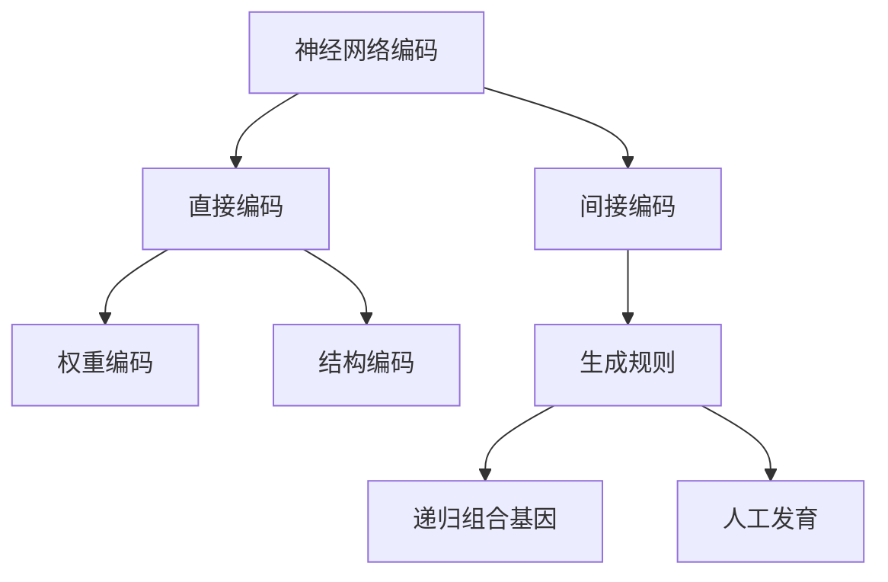
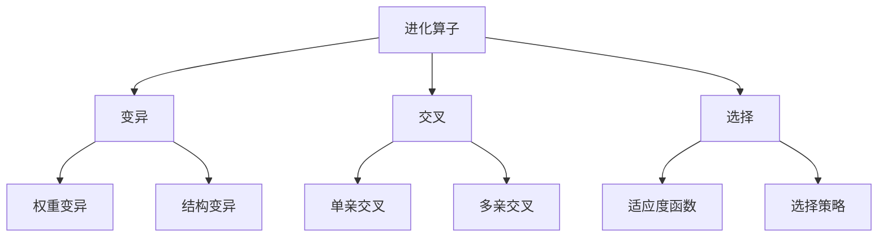
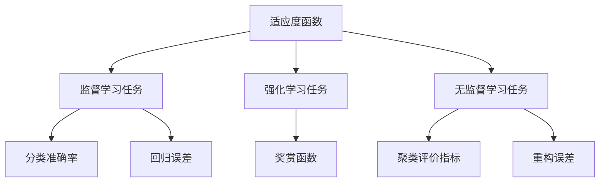
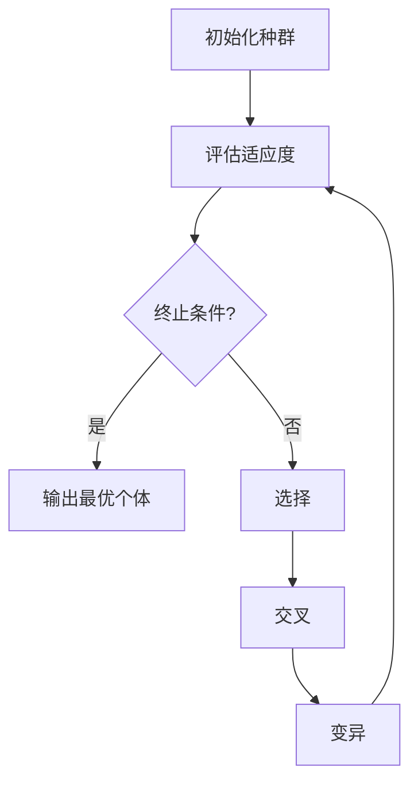

# 神经进化算法(Neuroevolution) - 原理与代码实例讲解

## 1.背景介绍

### 1.1 神经网络的局限性

神经网络在过去几十年取得了巨大的成功,在计算机视觉、自然语言处理、推荐系统等诸多领域展现出卓越的性能。然而,传统的神经网络训练方法存在一些固有的局限性:

1. **需要大量标注数据**:监督学习需要大量的标注数据集,而获取高质量的标注数据通常是一个代价高昂的过程。
2. **黑盒优化**:神经网络训练过程是一个黑盒优化,难以对网络内部机理有深入的理解和解释。
3. **陷入局部最优**:基于梯度下降的优化算法容易陷入局部最优,难以找到全局最优解。
4. **缺乏泛化能力**:神经网络在训练数据上表现良好,但往往难以很好地泛化到新的未见过的数据。

### 1.2 神经进化算法(Neuroevolution)的兴起

为了克服传统神经网络训练方法的局限性,神经进化算法(Neuroevolution)应运而生。神经进化算法借鉴了生物进化的思想,将神经网络视为一种"人工生命",通过模拟自然界中的进化过程(如变异、交叉、选择等),来优化神经网络的权重和拓扑结构。

神经进化算法具有以下优点:

1. **无需大量标注数据**:通过设计合理的适应度函数,可以在无监督或少量监督的情况下进行训练。
2. **全局优化能力强**:进化算法具有更强的全局搜索能力,不易陷入局部最优解。
3. **可解释性更好**:进化过程中,可以追踪网络权重和结构的变化,有助于理解网络内部机理。
4. **泛化能力更强**:通过模拟自然界中的进化过程,神经进化算法产生的网络具有更好的鲁棒性和泛化能力。

## 2.核心概念与联系

### 2.1 基因编码

在神经进化算法中,神经网络被编码为一个基因型(Genotype),通常采用直接编码或间接编码的方式。直接编码直接将网络权重和结构编码为基因,而间接编码则使用一些生成规则来产生网络。



### 2.2 进化算子

神经进化算法模拟了自然进化中的变异、交叉和选择等过程,通过应用不同的进化算子来优化神经网络。



### 2.3 适应度函数

适应度函数(Fitness Function)是衡量个体适应环境的指标,在神经进化算法中通常根据任务需求设计合理的适应度函数,用于评估神经网络的性能表现。



## 3.核心算法原理具体操作步骤

神经进化算法的核心步骤如下:



1. **初始化种群**:随机生成一个包含多个神经网络个体的初始种群。
2. **评估适应度**:对每个个体计算适应度函数的值,用于衡量其性能表现。
3. **终止条件检查**:检查是否满足预设的终止条件,如达到最大进化代数、适应度收敛等。若满足则输出当前最优个体,否则进行下一步。
4. **选择**:根据适应度大小,从当前种群中选择一部分个体,作为下一代进化的父代。常用的选择策略有轮盘赌选择、锦标赛选择等。
5. **交叉**:对选中的父代个体进行交叉操作,产生新的子代个体。交叉有单亲交叉和多亲交叉等方式。
6. **变异**:对交叉后的子代个体进行变异操作,引入一定的随机扰动,增加种群的多样性。变异包括权重变异和结构变异。
7. **回到步骤2**,重复进化过程,直至满足终止条件。

## 4.数学模型和公式详细讲解举例说明

### 4.1 基因编码

#### 4.1.1 直接编码

直接编码将神经网络的权重和结构直接编码为基因型。

**权重编码**

假设一个全连接神经网络有$N$个神经元,每个神经元与其他所有神经元相连,则该网络的权重矩阵$W$为一个$N \times N$的矩阵。我们可以将这个矩阵展开为一个一维向量,作为基因型的一部分:

$$
\begin{aligned}
W &= \begin{bmatrix}
    w_{11} & w_{12} & \cdots & w_{1N} \\
    w_{21} & w_{22} & \cdots & w_{2N} \\
    \vdots & \vdots & \ddots & \vdots \\
    w_{N1} & w_{N2} & \cdots & w_{NN}
\end{bmatrix} \\
\text{Genotype}_\text{weights} &= \begin{bmatrix}
    w_{11}, w_{12}, \cdots, w_{1N}, w_{21}, w_{22}, \cdots, w_{2N}, \cdots, w_{N1}, \cdots, w_{NN}
\end{bmatrix}
\end{aligned}
$$

**结构编码**

对于网络结构的编码,我们可以使用一个二进制串来表示每两个神经元之间是否存在连接。例如,对于一个包含4个神经元的网络,其连接矩阵可以编码为:

$$
\begin{aligned}
C &= \begin{bmatrix}
    0 & 1 & 0 & 1\\
    1 & 0 & 1 & 0\\
    0 & 1 & 0 & 1\\
    1 & 0 & 1 & 0
\end{bmatrix} \\
\text{Genotype}_\text{structure} &= \begin{bmatrix}
    0, 1, 0, 1, 1, 0, 1, 0, 0, 1, 0, 1, 1, 0, 1, 0
\end{bmatrix}
\end{aligned}
$$

其中,1表示两个神经元之间存在连接,0表示不连接。

#### 4.1.2 间接编码

间接编码使用一些生成规则来产生神经网络,而不是直接编码权重和结构。常见的间接编码方法包括递归组合基因(Compositional Pattern Producing Networks, CPPN)和人工发育(Artificial Embryogeny)等。

**递归组合基因(CPPN)**

CPPN使用一个简单的神经网络(称为合成模式)来编码复杂的重复模式。合成模式的输入是一组空间坐标,输出是该坐标处的神经元参数(如权重、是否存在连接等)。通过在整个空间上采样合成模式,可以生成最终的神经网络结构。

**人工发育**

人工发育借鉴了生物体的发育过程,使用一组生长规则和初始种子细胞,通过细胞分裂、迁移等过程,最终发育出神经网络的结构。发育过程由基因型编码的一组规则控制。

### 4.2 进化算子

#### 4.2.1 变异

**权重变异**

对于权重的变异,最常见的方法是对基因型中编码权重的部分添加一个小的随机扰动:

$$
w'_i = w_i + \mathcal{N}(0, \sigma^2)
$$

其中,$w_i$是原始权重,$w'_i$是变异后的权重,$\mathcal{N}(0, \sigma^2)$是一个均值为0、方差为$\sigma^2$的高斯噪声。

**结构变异**

对于网络结构的变异,常见的操作包括:

- 添加/删除连接
- 添加/删除神经元
- 改变神经元的激活函数
- 改变网络层数或层类型

例如,对于一个二进制编码的结构基因型,我们可以随机选择一些位并取反,从而改变网络的连接情况。

#### 4.2.2 交叉

**单亲交叉**

单亲交叉从一个父代个体中随机选取一段基因片段,并将其插入到另一个父代个体的基因型中,从而产生新的子代个体。

**多亲交叉**

多亲交叉则从多个父代个体中选取基因片段,并将它们组合在一起,产生新的子代个体。常见的多亲交叉方法包括均匀交叉、算术交叉等。

### 4.3 适应度函数

适应度函数的设计取决于具体的任务类型,下面分别给出一些常见任务的适应度函数示例:

**监督学习任务**

对于分类任务,适应度函数可以定义为分类准确率:

$$
\text{Fitness} = \frac{1}{N}\sum_{i=1}^N \mathbb{I}(y_i = \hat{y}_i)
$$

对于回归任务,适应度函数可以定义为均方误差的负值:

$$
\text{Fitness} = -\frac{1}{N}\sum_{i=1}^N (y_i - \hat{y}_i)^2
$$

**强化学习任务**

在强化学习任务中,适应度函数可以定义为智能体在一个环境中获得的累积奖赏:

$$
\text{Fitness} = \sum_{t=0}^T r_t
$$

其中,$r_t$是智能体在时间步$t$获得的奖赏。

**无监督学习任务**

对于聚类任务,适应度函数可以定义为某些聚类评价指标,如轮廓系数(Silhouette Coefficient):

$$
\text{Fitness} = \frac{1}{N}\sum_{i=1}^N \frac{b_i - a_i}{\max(a_i, b_i)}
$$

对于自编码器等重构任务,适应度函数可以定义为重构误差的负值:

$$
\text{Fitness} = -\frac{1}{N}\sum_{i=1}^N \|x_i - \hat{x}_i\|^2
$$

## 5.项目实践:代码实例和详细解释说明

下面是一个使用Python和PyTorch实现的简单神经进化算法的示例,用于解决XOR二元分类问题。

### 5.1 定义神经网络

首先,我们定义一个简单的全连接神经网络,用于学习XOR函数:

```python
import torch
import torch.nn as nn

class NeuralNetwork(nn.Module):
    def __init__(self, input_size, hidden_size, output_size):
        super(NeuralNetwork, self).__init__()
        self.fc1 = nn.Linear(input_size, hidden_size)
        self.relu = nn.ReLU()
        self.fc2 = nn.Linear(hidden_size, output_size)

    def forward(self, x):
        out = self.fc1(x)
        out = self.relu(out)
        out = self.fc2(out)
        return out
```

### 5.2 基因编码

我们使用直接编码的方式,将神经网络的权重编码为一个一维向量:

```python
def genotype_to_weights(genotype, input_size, hidden_size, output_size):
    num_weights = (input_size * hidden_size) + (hidden_size * output_size) + hidden_size + output_size
    weights = torch.tensor(genotype[:num_weights])
    
    start = 0
    end = input_size * hidden_size
    w1 = weights[start:end].view(hidden_size, input_size)
    
    start = end
    end = start + hidden_size
    b1 = weights[start:end]
    
    start = end
    end = start + (hidden_size * output_size)
    w