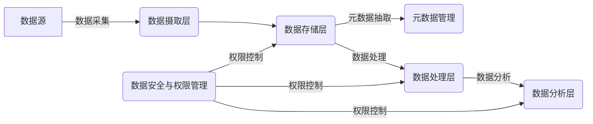

# 第二十八章：数据湖开源工具推荐

## 1. 背景介绍
### 1.1 数据湖的概念
数据湖(Data Lake)是一种存储海量原始数据的集中式存储库,可以存储结构化、半结构化和非结构化数据。与传统的数据仓库不同,数据湖存储的是原始格式的数据,不需要预先定义数据模型和架构,从而使得数据湖具有很大的灵活性和可扩展性。

### 1.2 数据湖的优势
数据湖的优势主要体现在以下几个方面:

1. 支持多种数据类型和格式,包括结构化、半结构化和非结构化数据。
2. 可以存储海量数据,具有很强的扩展性。  
3. 数据存储成本低,不需要昂贵的ETL和数据建模过程。
4. 支持实时和批处理分析,满足不同的业务需求。
5. 可以进行数据探索和发现,挖掘数据价值。

### 1.3 开源工具在数据湖中的重要性
开源工具在数据湖的构建和应用中扮演着重要角色。使用开源工具不仅可以降低成本,还能提供灵活性、可扩展性以及丰富的生态系统支持。很多优秀的开源工具已经成为构建数据湖的事实标准。选择合适的开源工具可以大大加速数据湖项目的实施进度,降低技术风险。

## 2. 核心概念与联系
### 2.1 数据采集与摄取
数据采集和摄取是数据湖的第一步,负责将各种来源的原始数据导入到数据湖中。常见的数据采集工具有Flume、Sqoop、Kafka等。

### 2.2 数据存储 
数据湖的核心是一个集中式的存储系统,用于存储原始格式的海量数据。HDFS是最常用的数据湖存储方案,也有基于对象存储(如S3)和NoSQL数据库实现的数据湖存储。

### 2.3 元数据管理
元数据管理是数据湖的重要组成部分,负责管理数据的模式、血缘、质量等元数据信息。Atlas、Hive Metastore是常用的元数据管理工具。

### 2.4 数据处理与分析
数据湖中的原始数据需要经过处理和转换才能被分析和应用。Spark、Hive、Presto等是常用的数据处理和分析引擎,可以对数据湖中的数据进行查询、转换和分析。

### 2.5 数据安全与权限管理
数据安全与权限管理对于数据湖至关重要,需要对敏感数据进行脱敏、加密,并对数据访问进行细粒度权限控制。Ranger、Sentry是常用的大数据安全与权限管理工具。

下图展示了数据湖的核心组件及其之间的关系:


## 3. 核心算法原理具体操作步骤
数据湖涉及的核心算法主要包括数据采集、数据存储、元数据提取、数据处理、数据分析等环节中用到的算法。下面以数据处理中常用的ETL操作为例,介绍其基本原理和操作步骤:

### 3.1 ETL的基本原理
ETL是Extract-Transform-Load的缩写,即数据抽取、转换和加载的过程。其目的是将原始数据转换为便于分析和应用的结构化形式。ETL通常包括以下几个步骤:

1. 数据抽取:从源系统中读取原始数据。
2. 数据清洗:检测并纠正数据中的错误,如格式问题、不一致性等。
3. 数据转换:将原始数据转换为目标模型所需的格式和结构。
4. 数据加载:将转换后的数据加载到目标系统中,如数据仓库、数据集市等。

### 3.2 ETL的操作步骤
以下是使用Spark进行ETL操作的基本步骤:

1. 从数据源读取数据,创建DataFrame。
```scala
val rawDF = spark.read.format("csv")
  .option("header", "true")
  .load("/path/to/raw/data.csv") 
```

2. 进行数据清洗和转换,如过滤、列重命名、数据类型转换等。
```scala
val cleanedDF = rawDF
  .filter("age > 0")
  .withColumnRenamed("name", "username") 
  .withColumn("age", col("age").cast("int"))
```

3. 将转换后的数据写入目标系统,如保存为Parquet文件。  
```scala
cleanedDF.write.format("parquet")
  .mode("overwrite") 
  .save("/path/to/target/data.parquet")
```

以上就是使用Spark进行ETL操作的基本步骤。通过将这些步骤组合起来,就可以完成复杂的数据处理和转换任务。

## 4. 数学模型和公式详细讲解举例说明
数据湖中的数据处理和分析经常会用到统计学和机器学习的数学模型和公式。下面以逻辑回归模型为例,详细讲解其数学原理。

### 4.1 逻辑回归模型
逻辑回归是一种常用的分类算法,用于二分类问题。其核心思想是通过Logistic函数将线性回归的输出映射到(0,1)区间,得到样本属于某个类别的概率。

假设有m个样本,每个样本有n个特征,记为 $x^{(i)} = (x_1^{(i)}, x_2^{(i)}, ..., x_n^{(i)})$,其类别标签为 $y^{(i)} \in {0, 1}$。逻辑回归的目标是学习一个参数向量 $\theta = (\theta_0, \theta_1, ..., \theta_n)$,使得模型的输出与真实标签尽可能接近。

逻辑回归模型的数学表达式为:

$$
h_{\theta}(x) = \frac{1}{1 + e^{-\theta^T x}}
$$

其中,$\theta^T x$表示参数向量 $\theta$ 与特征向量 $x$ 的内积:

$$
\theta^T x = \theta_0 + \theta_1 x_1 + \theta_2 x_2 + ... + \theta_n x_n
$$

可以看出,逻辑回归模型的输出 $h_{\theta}(x)$ 表示样本 $x$ 属于类别1的概率。

### 4.2 参数估计
为了学习最优的参数 $\theta$,需要最小化逻辑回归的损失函数。逻辑回归采用对数似然函数作为损失函数:

$$
J(\theta) = -\frac{1}{m} \sum_{i=1}^m [y^{(i)} log(h_{\theta}(x^{(i)})) + (1 - y^{(i)}) log(1 - h_{\theta}(x^{(i)}))]
$$

使用梯度下降法对损失函数进行优化,参数更新公式为:

$$
\theta_j := \theta_j - \alpha \frac{1}{m} \sum_{i=1}^m (h_{\theta}(x^{(i)}) - y^{(i)}) x_j^{(i)}
$$

其中,$\alpha$为学习率。通过迭代更新参数,直到损失函数收敛,就得到了最优的模型参数。

### 4.3 示例说明
下面以一个简单的例子说明逻辑回归的应用。假设要根据学生的考试成绩预测其是否能被大学录取,有以下训练数据:

| 考试成绩1 | 考试成绩2 | 录取结果 |
|--------|--------|--------|
|   51   |   80   |   0    |
|   83   |   92   |   1    |
|   62   |   75   |   0    |
|   90   |   85   |   1    |

使用逻辑回归模型,可以得到参数估计结果:
```
θ0 = -50.37
θ1 = 0.64
θ2 = 0.71
```

因此,逻辑回归模型为:
$$
h_{\theta}(x) = \frac{1}{1 + e^{-(-50.37 + 0.64x_1 + 0.71x_2)}}
$$

假设一个新的学生考试成绩为(80, 90),代入模型计算可得:
$$
h_{\theta}(80, 90) = \frac{1}{1 + e^{-(-50.37 + 0.64*80 + 0.71*90)}} = 0.97
$$

可以预测该学生有97%的概率被大学录取。

这就是逻辑回归的基本原理和应用示例。在实际数据分析中,我们可以使用Spark MLlib提供的逻辑回归算法,快速构建分类模型。

## 5. 项目实践：代码实例和详细解释说明
下面通过一个实际的项目案例,演示如何使用Spark和开源工具构建数据湖,并进行数据处理和分析。

### 5.1 项目背景
假设我们要为一家电商公司建立一个数据湖,用于存储和分析用户行为数据,包括用户浏览、搜索、下单等行为日志,以及商品、订单、物流等业务数据。

### 5.2 数据采集与摄取
首先使用Flume采集服务器日志,将用户行为数据实时传输到Kafka:
```bash
a1.sources = s1
a1.channels = c1
a1.sinks = k1

a1.sources.s1.type = exec
a1.sources.s1.command = tail -F /var/log/nginx/access.log

a1.channels.c1.type = memory

a1.sinks.k1.type = org.apache.flume.sink.kafka.KafkaSink
a1.sinks.k1.kafka.bootstrap.servers = kafka:9092
a1.sinks.k1.kafka.topic = user_behavior

a1.sources.s1.channels = c1
a1.sinks.k1.channel = c1
```

然后使用Sqoop将MySQL中的业务数据导入HDFS:
```bash
sqoop import \
  --connect jdbc:mysql://mysql:3306/ecommerce \
  --username root \
  --password 123456 \
  --table products \
  --target-dir /data/raw/products
```

### 5.3 数据存储
使用HDFS存储原始数据,将Kafka中的日志数据和MySQL中的业务数据分别存储到HDFS的不同目录下:
```bash
/data/raw/
  user_behavior/
    dt=2023-05-01/
    dt=2023-05-02/
    ...
  products/
  orders/
  ...  
```

### 5.4 元数据管理
使用Atlas对数据湖中的数据进行元数据管理,自动抽取数据的Schema信息,并为每个数据集生成血缘关系图。
```bash
curl -X POST -H "Content-Type: application/json" -d '{
  "entity": {
    "typeName": "hdfs_path",
    "attributes": {
      "name": "/data/raw/user_behavior/dt=2023-05-01",
      "description": "User behavior logs",
      "owner": "etl",
      "createTime": 1651334400000
    }
  }
}' http://atlas:21000/api/atlas/v2/entity
```

### 5.5 数据处理与分析
使用Spark对HDFS中的原始数据进行处理和分析。首先读取用户行为日志数据:
```scala
val behaviorDF = spark.read.format("json")
  .load("/data/raw/user_behavior/dt=2023-05-01")

val filteredDF = behaviorDF
  .where("event_type = 'click'")
  .select("user_id", "item_id", "timestamp") 
```

然后与商品维度表进行Join,得到每个商品的点击次数:
```scala
val productDF = spark.read.format("parquet")
  .load("/data/raw/products")

val joinedDF = filteredDF.join(productDF, "item_id")
  .groupBy("item_id", "product_name")
  .agg(count("*").as("click_count"))
  .orderBy(desc("click_count"))
```

最后将结果写入Hive表中,供后续分析使用:
```scala
joinedDF.write.format("hive")
  .mode("overwrite")
  .saveAsTable("product_clicks")  
```

除了使用Spark进行批处理分析,还可以使用Presto进行交互式查询。例如查询某个商品的详细信息:
```sql
SELECT *
FROM products
WHERE product_id = 123456;  
```

### 5.6 数据安全与权限管理
使用Ranger对数据湖中的数据进行安全和权限管理。