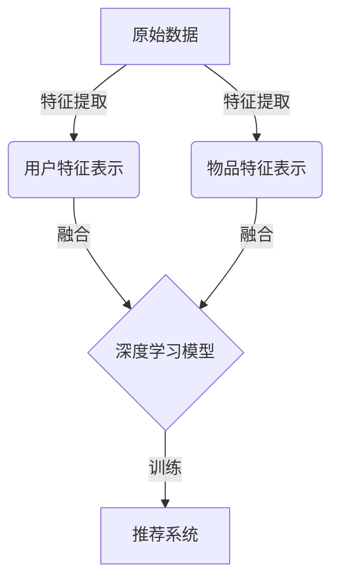

# 第五篇：深度学习推荐系统：AI加持，个性化推荐更上一层楼

## 1.背景介绍

### 1.1 推荐系统的重要性

在当今信息时代,数据和信息的爆炸式增长使得信息过载成为一个普遍的问题。推荐系统应运而生,旨在从海量信息中为用户个性化推荐感兴趣的内容,帮助用户发现有价值的信息,提高信息获取效率。推荐系统已广泛应用于电商、视频、新闻等多个领域,为用户提供个性化的商品、内容和服务推荐,提升用户体验,增强用户粘性,促进业务增长。

### 1.2 传统推荐系统的局限性

早期的推荐系统主要基于协同过滤、内容过滤等传统机器学习算法,虽然取得了一定成效,但也存在一些局限性:

1. 数据稀疏性:当用户行为数据和物品内容数据较为稀疏时,传统算法的性能会受到影响。
2. 冷启动问题:对于新用户和新物品,由于缺乏足够的历史数据,传统算法难以做出准确推荐。
3. 隐式反馈利用不足:传统算法主要利用用户的显式反馈(如评分),而忽视了更多隐式反馈(如浏览时长、点击次数等)。

### 1.3 深度学习推荐系统的兴起

近年来,深度学习技术在计算机视觉、自然语言处理等领域取得了巨大成功,也逐渐被引入推荐系统领域。与传统机器学习算法相比,深度学习推荐系统具有以下优势:

1. 自动特征学习:深度学习模型能够从原始数据中自动学习高阶特征表示,无需人工设计特征工程。
2. 非线性建模能力强:深度神经网络能够有效捕捉数据中复杂的非线性关系。
3. 多模态数据融合:深度学习模型能够融合多种模态数据(如文本、图像、视频等),提供更丰富的用户和物品表示。
4. 序列建模能力:递归神经网络等深度模型能够有效捕捉时序行为模式,为推荐提供更多线索。

本文将重点介绍深度学习在推荐系统中的应用,包括核心概念、关键技术、实际应用场景等,为读者提供全面的理解和实践指导。

## 2.核心概念与联系

在深入探讨深度学习推荐系统之前,我们先来了解一些核心概念及其之间的联系。

### 2.1 推荐系统的基本概念

推荐系统通常包含以下三个基本组成部分:

1. **用户(Users)**: 接受推荐的对象,通常由一个唯一的用户ID表示。
2. **物品(Items)**: 被推荐的对象,如商品、电影、音乐等,通常由一个唯一的物品ID表示。
3. **用户-物品交互数据(User-Item Interactions)**: 记录了用户对物品的一些行为,如购买、浏览、评分等。

推荐系统的目标是基于用户的历史行为数据,为用户推荐感兴趣的新物品。

### 2.2 深度学习在推荐系统中的作用

在传统的推荐算法中,需要人工设计特征工程将用户和物品的原始数据(如用户画像、物品属性等)转换为特征向量,然后基于这些特征向量进行建模和推荐。而深度学习则能够自动从原始数据中学习出高阶的特征表示,无需人工特征工程,从而提高了推荐系统的效果。

深度学习在推荐系统中主要发挥以下作用:

1. **特征学习**: 自动从原始数据(如用户画像、物品属性、交互数据等)中学习出高阶特征表示。
2. **融合多模态数据**: 融合多种模态数据(如文本、图像、视频等),获得更丰富的用户和物品表示。
3. **捕捉复杂模式**: 通过非线性变换,捕捉用户行为和物品特征中复杂的非线性关系模式。
4. **时序建模**: 利用递归神经网络等模型,捕捉用户行为序列中的时序模式。

通过深度学习技术,推荐系统能够更精准地理解用户的偏好和需求,从而提供更加个性化和智能化的推荐服务。

### 2.3 深度学习推荐系统框架

一个典型的深度学习推荐系统框架如下所示:

1. 原始数据包括用户数据(如用户画像)、物品数据(如物品属性)和用户-物品交互数据(如浏览记录)。
2. 通过特征提取模块,将原始数据转换为用户特征表示和物品特征表示。
3. 将用户特征表示和物品特征表示输入到深度学习模型中,融合两者的信息。
4. 训练深度学习模型,学习用户偏好模式。
5. 将训练好的深度学习模型部署到推荐系统中,为用户提供个性化推荐服务。

接下来,我们将详细介绍深度学习推荐系统的核心算法原理和实现细节。

## 3.核心算法原理具体操作步骤

深度学习推荐系统的核心算法主要包括以下几个方面:

### 3.1 特征表示学习

#### 3.1.1 嵌入技术(Embedding)

嵌入技术是将离散特征(如用户ID、物品ID等)映射到连续的低维密集向量空间,从而捕捉不同特征之间的语义相似性。常用的嵌入方法包括:

- **Look-up Embedding**: 通过查找嵌入矩阵,将离散特征ID映射到对应的嵌入向量。
- **学习性嵌入(Learned Embedding)**: 将嵌入向量作为模型的参数,通过模型训练自动学习嵌入向量。

#### 3.1.2 结构化数据表示

对于结构化数据(如用户画像、物品属性等),常用的表示方法包括:

- **类别特征嵌入**: 将类别特征(如城市、职业等)通过嵌入技术映射到低维向量空间。
- **数值特征处理**: 对于数值特征(如年龄、收入等),可以直接输入或进行归一化处理。
- **组合特征**: 将多个特征通过特征交叉(Feature Cross)等方式组合,捕捉特征之间的高阶交互关系。

#### 3.1.3 非结构化数据表示

对于非结构化数据(如文本、图像、视频等),常用的表示方法包括:

- **文本表示**: 使用Word2Vec、BERT等模型将文本映射到固定长度的向量表示。
- **图像表示**: 使用CNN等模型从图像中提取高阶特征表示。
- **视频表示**: 使用3D卷积神经网络等模型从视频中提取时空特征表示。

通过上述方法,我们可以将不同模态的原始数据转换为统一的向量表示,为后续的深度学习模型提供输入。

### 3.2 融合多模态特征表示

在获得了用户和物品的多模态特征表示后,需要将它们融合起来,捕捉不同特征之间的交互关系。常用的融合方法包括:

#### 3.2.1 特征拼接(Feature Concatenation)

将不同模态的特征向量直接拼接在一起,形成一个更长的特征向量。然后将拼接后的特征向量输入到后续的深度学习模型中进行训练。

#### 3.2.2 外积(Outer Product)

对两个特征向量进行外积操作,捕捉不同特征之间的二阶交互关系。外积操作可以有效提高模型的表达能力,但同时也会增加计算复杂度。

#### 3.2.3 注意力机制(Attention Mechanism)

通过注意力机制,自适应地为不同模态的特征分配权重,从而更好地融合不同模态的信息。注意力机制能够有效捕捉不同特征之间的重要程度差异。

### 3.3 深度学习模型

融合后的特征表示将被输入到深度学习模型中进行训练。常用的深度学习模型包括:

#### 3.3.1 多层感知机(Multi-Layer Perceptron, MLP)

MLP是最基本的深度神经网络模型,由多个全连接层组成。MLP能够有效捕捉特征之间的非线性关系,但无法捕捉特征之间的高阶交互关系。

#### 3.3.2 因子分解机(Factorization Machine, FM)

FM是一种高效的二阶特征交互模型,能够显式建模特征之间的二阶交互关系。FM通常与深度神经网络结合使用,形成神经因子分解机(Neural Factorization Machine, NFM)模型。

#### 3.3.3 深度交叉网络(Deep Cross Network, DCN)

DCN在FM的基础上引入了交叉网络,能够有效捕捉特征之间的高阶交互关系。DCN通过显式建模高阶交互项,提高了模型的表达能力。

#### 3.3.4 注意力机制模型

注意力机制模型通过自适应地为不同特征分配权重,能够更好地捕捉特征之间的重要程度差异。常用的注意力机制模型包括:

- **自注意力网络(Self-Attention Network)**: 捕捉同一模态特征之间的相关性。
- **跨注意力网络(Cross-Attention Network)**: 捕捉不同模态特征之间的相关性。

#### 3.3.5 序列建模模型

对于序列数据(如用户的浏览历史记录),可以使用递归神经网络(RNN)、长短期记忆网络(LSTM)等模型捕捉时序模式。常用的序列建模模型包括:

- **时间注意力网络(Time-Aware Attention Network)**: 通过注意力机制捕捉用户行为序列中的重要时间点。
- **循环推理网络(Iterative Reasoning Network)**: 通过多次迭代捕捉用户行为序列中的长期依赖关系。

通过上述深度学习模型,我们可以有效捕捉用户偏好中的非线性关系和高阶交互模式,从而提高推荐系统的性能。

### 3.4 模型训练与优化

在选择合适的深度学习模型后,我们需要对模型进行训练和优化,以提高其在推荐任务上的性能。常用的训练方法和优化策略包括:

#### 3.4.1 损失函数

根据推荐任务的不同,可以选择不同的损失函数进行优化,如:

- **二分类交叉熵损失(Binary Cross-Entropy Loss)**: 用于隐式反馈数据(如点击/不点击)的二分类任务。
- **多分类交叉熵损失(Categorical Cross-Entropy Loss)**: 用于显式反馈数据(如评分)的多分类任务。
- **排序损失(Ranking Loss)**: 用于排序任务,如学习用户对不同物品的偏好排序。
- **贝叶斯个性化排序损失(Bayesian Personalized Ranking Loss)**: 一种常用的排序损失函数,能够有效优化个性化排序任务。

#### 3.4.2 正则化

为了防止过拟合,常用的正则化方法包括:

- **L1/L2正则化**: 在损失函数中添加L1或L2范数惩罚项,约束模型参数的大小。
- **Dropout**: 在训练过程中随机丢弃部分神经元,避免模型过度依赖于某些特征。
- **早停(Early Stopping)**: 在验证集上的指标不再提升时,提前停止训练。

#### 3.4.3 优化算法

常用的优化算法包括:

- **随机梯度下降(Stochastic Gradient Descent, SGD)**: 基础的梯度下降优化算法。
- **AdaGrad**: 自适应学习率的优化算法,对于稀疏数据表现较好。
- **Adam**: 结合了动量和自适应学习率的优化算法,收敛速度快且效果好。

#### 3.4.4 负采样(Negative Sampling)

在推荐系统中,由于正