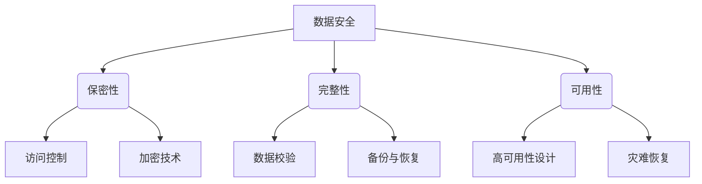

# 筑起数据长城：探索数据安全的核心原则

## 1. 背景介绍

### 1.1 数据安全的重要性

在当今的数字时代，数据已经成为了一种无形的宝贵资源。无论是个人还是企业,都在不断产生和处理大量的数据。这些数据不仅包含着我们的个人隐私,还蕴藏着商业机密和知识产权等关键信息。因此,确保数据的安全性和保密性就显得尤为重要。

数据一旦遭到泄露或被恶意攻击,将会给个人和组织带来严重的经济损失和声誉风险。近年来,数据泄露事件屡见不鲜,从知名企业到政府机构都难逃其咎。这些事件不仅引发了公众对数据安全的广泛关注,也促使各界加大了对数据保护的投入和重视程度。

### 1.2 数据安全面临的挑战

然而,保障数据安全并非一蹴而就。随着数据量的激增、云计算和物联网等新技术的兴起,数据安全面临着前所未有的挑战:

- **数据分散性**:数据不再集中存储在单一位置,而是分散在多个设备、云端和边缘节点上,增加了数据管理和保护的复杂性。
- **攻击手段升级**:黑客和网络犯罪分子不断升级攻击手段,如勒索软件、供应链攻击等,给数据安全带来新的威胁。
- **内部威胁**:内部人员的疏忽或恶意行为也可能导致数据泄露,这种风险往往被忽视。
- **法规合规性**:各国和地区不断出台新的数据保护法规,企业需要确保其数据处理活动符合法律要求。

面对这些挑战,我们需要采取全面的数据安全策略和措施,从技术、流程和人员等多个层面入手,筑起坚实的"数据长城"。

## 2. 核心概念与联系

数据安全是一个涵盖广泛的概念,包括数据保密性(Confidentiality)、完整性(Integrity)和可用性(Availability),被称为"CIA三元组"。这三个核心原则相互关联、相辅相成,缺一不可。

### 2.1 保密性(Confidentiality)

保密性是指确保只有经过适当授权的个人或实体才能访问数据。它主要通过访问控制和加密技术来实现:

- **访问控制**:通过身份认证、授权管理和审计跟踪等措施,控制对数据的访问权限。
- **加密技术**:使用密码学算法将数据转换为无法直接读取的密文,防止未经授权的访问。

### 2.2 完整性(Integrity)

完整性是指确保数据在传输和存储过程中不被非法修改或破坏。它包括以下两个主要方面:

- **数据校验**:使用哈希函数、数字签名等技术,检测数据是否被篡改。
- **备份与恢复**:定期备份数据,以便在数据损坏或丢失时进行恢复。

### 2.3 可用性(Availability)

可用性是指确保授权用户在需要时能够及时访问和使用数据。它主要通过以下方式实现:

- **高可用性设计**:采用冗余、负载均衡等技术,提高系统的可靠性和容错能力。
- **灾难恢复**:制定应急预案,在发生自然灾害或重大故障时快速恢复数据和服务。

这三个核心原则相互依赖、环环相扣。例如,如果数据被加密但系统可用性差,用户就无法访问数据;如果数据完整性受损,即使可以访问,也无法保证数据的准确性。因此,我们需要在这三个方面进行全面考虑和平衡,以确保数据的整体安全性。

## 3. 核心算法原理具体操作步骤

为了实现数据安全的核心原则,我们需要采用多种加密算法和安全协议。下面将介绍其中几种核心算法的原理和具体操作步骤。

### 3.1 对称加密算法

对称加密算法使用相同的密钥进行加密和解密,是实现数据保密性的基础。常见的对称加密算法包括AES、DES、3DES等。以AES(Advanced Encryption Standard)为例,其加密过程如下:

1. **密钥扩展**:根据输入的密钥(128位、192位或256位),通过密钥扩展算法生成一系列轮密钥。
2. **初始化**:将明文分成若干个16字节的数据块。
3. **加密轮**:对每个数据块执行以下操作:
    a. 字节代换(SubBytes):使用S盒将每个字节替换为另一个字节。
    b. 行移位(ShiftRows):对每行字节进行循环左移。
    c. 列混合(MixColumns):将每列字节与一个固定的多项式相乘。
    d. 轮密钥加(AddRoundKey):将当前轮密钥与数据块进行异或运算。
4. **最终轮**:执行字节代换、行移位和轮密钥加操作,但不进行列混合。

解密过程与加密过程基本相反,但需要使用相同的密钥和轮密钥的逆序。

### 3.2 非对称加密算法

非对称加密算法使用一对密钥(公钥和私钥)进行加密和解密,常用于实现身份认证和数据完整性。著名的非对称加密算法包括RSA、ECC等。以RSA为例,其加密过程如下:

1. **选择两个大质数p和q**。
2. **计算n=p*q**。
3. **计算欧拉函数φ(n)=(p-1)(q-1)**。
4. **选择一个与φ(n)互质的整数e,作为公钥指数**。
5. **计算d,使得(d*e)%φ(n)=1,d为私钥指数**。
6. **公钥为(e,n),私钥为(d,n)**。
7. **加密明文m:密文c=m^e mod n**。
8. **解密密文c:明文m=c^d mod n**。

RSA算法的安全性依赖于大整数分解的难度。如果能够快速分解n,就可以计算出私钥d,从而破解加密系统。

### 3.3 哈希函数

哈希函数是实现数据完整性的关键算法,它能够将任意长度的输入数据映射为固定长度的哈希值(也称消息摘要)。常见的哈希函数包括MD5、SHA系列等。以SHA-256为例,其计算过程如下:

1. **填充**:将输入消息填充至长度为64位的整数倍。
2. **初始化**:设置8个32位的初始哈希值。
3. **处理消息块**:对每个512位的消息块执行以下操作:
    a. 准备消息调度单元。
    b. 初始化工作变量。
    c. 执行64轮压缩函数。
    d. 计算中间哈希值。
4. **产生哈希值**:将最后的中间哈希值作为256位的最终哈希值输出。

哈希函数具有单向性和抗冲突性,即给定输入很容易计算哈希值,但由哈希值反推输入或找到两个不同输入具有相同哈希值都是非常困难的。因此,哈希函数常用于数据完整性验证、数字签名和密钥派生等场景。

通过掌握这些核心算法的原理和操作步骤,我们就能更好地理解和应用数据加密、认证和完整性保护等安全技术,为数据安全奠定坚实的基础。

## 4. 数学模型和公式详细讲解举例说明

在数据安全领域,许多算法和协议都基于复杂的数学模型和公式。本节将详细讲解其中几种核心数学模型,并结合具体示例帮助读者更好地理解。

### 4.1 模运算和欧拉函数

模运算和欧拉函数是非对称加密算法(如RSA)的数学基础。

**模运算**定义如下:

$$
a \bmod n = r \quad (0 \leq r < n)
$$

其中,a是被模数,n是模数,r是余数。例如,17 mod 5 = 2。

**欧拉函数**φ(n)表示小于或等于n的正整数中与n互质的数的个数。对于两个互质的正整数p和q,有:

$$
\phi(p \times q) = (p - 1) \times (q - 1)
$$

在RSA算法中,我们选择两个大质数p和q,计算n=p*q和φ(n)=(p-1)(q-1)。然后选择一个与φ(n)互质的整数e作为公钥指数,计算d使得(d*e)%φ(n)=1,d为私钥指数。加密和解密过程分别为:

$$
\begin{aligned}
\text{加密: } c &= m^e \bmod n \\
\text{解密: } m &= c^d \bmod n
\end{aligned}
$$

其中,m是明文,c是密文。

RSA的安全性依赖于大整数分解的困难性。如果能够快速分解n=p*q,就可以计算出φ(n)和私钥d,从而破解加密系统。

### 4.2 有限域和椭圆曲线

有限域和椭圆曲线是另一种非对称加密算法(如ECC)的数学基础。

**有限域**是一个包含有限个元素的代数结构,记作GF(p^n),其中p是一个素数,n是一个正整数。在有限域上进行运算时,所有结果都被约化为模p^n。

**椭圆曲线**是一种特殊的代数曲线,在有限域GF(p)上定义为:

$$
y^2 = x^3 + ax + b \quad (\bmod p)
$$

其中,a和b是有限域中的常数,满足一定条件。在椭圆曲线上,我们可以定义一种代数运算,称为"点加"运算,记作P+Q。

ECC的安全性依赖于椭圆曲线离散对数问题(ECDLP)的困难性。给定一个基点P和另一个点Q,很容易计算出Q=kP(k为某个整数),但要从Q反推出k是非常困难的。

ECC的优势在于相同的安全强度下,所需的密钥长度比RSA短很多。例如,256位ECC密钥的安全强度相当于3072位RSA密钥。这使得ECC在资源受限的环境(如物联网设备)中特别有用。

### 4.3 哈希函数的生日攻击

哈希函数的安全性取决于它是否具有抗冲突性,即找到两个不同的输入具有相同哈希值的难度。生日攻击是评估哈希函数抗冲突能力的一种重要方法。

**生日悖论**指的是:在一个足够大的集合中,只需要√(π*n/2)个随机样本,就有较大概率(约50%)找到两个元素具有相同的生日(或其他特征值)。

对于一个输出长度为n位的哈希函数,如果我们随机选取√(2^n)个不同的输入,就有较大概率(约50%)找到两个输入具有相同的哈希值。这种攻击被称为生日攻击。

例如,对于SHA-256哈希函数,其输出长度为256位。根据生日攻击原理,只需要约2^128次哈希运算,就有50%的概率找到两个不同输入具有相同的256位哈希值。

为了防范生日攻击,哈希函数的输出长度应当足够长。一般认为,对于n位的哈希函数,其强度大约为n/2位。因此,SHA-256的实际强度约为128位,SHA-3的输出长度为512位,强度约为256位。

通过深入理解这些数学模型和公式,我们可以更好地评估和选择适当的加密算法和哈希函数,从而提高数据安全性。

## 5. 项目实践:代码实例和详细解释说明

为了更好地理解数据安全的核心原则和算法,本节将提供一些实际的代码示例,并对其进行详细的解释