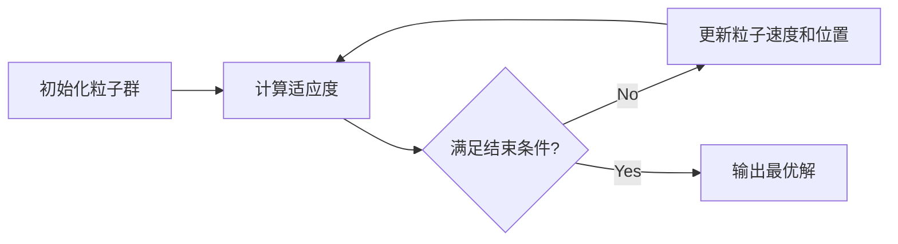

## 1.背景介绍

生物信息学是一门跨学科的科学，它利用计算机科学、数学和统计学的方法来理解生物数据。随着大规模测序技术的发展，生物信息学面临着处理和分析海量数据的挑战。在这个背景下，粒子群优化算法（Particle Swarm Optimization，PSO）作为一种优秀的全局优化算法，被广泛应用于生物信息学的多个领域。

## 2.核心概念与联系

粒子群优化算法是一种基于群体智能的优化算法。它的灵感来源于鸟群捕食的行为。在算法中，每个粒子代表了一个潜在的解决方案，粒子通过迭代搜索寻找最优解。每个粒子的位置更新取决于其自身的历史最佳位置和全局最佳位置。



## 3.核心算法原理具体操作步骤

1. 初始化粒子群：随机生成一组粒子，每个粒子代表一个可能的解。
2. 计算适应度：根据目标函数计算每个粒子的适应度（即解的质量）。
3. 更新粒子速度和位置：每个粒子的速度和位置由其自身的历史最佳位置和全局最佳位置决定。
4. 检查结束条件：如果满足结束条件（如达到最大迭代次数或找到满意解），则输出最优解；否则，返回步骤2。

## 4.数学模型和公式详细讲解举例说明

粒子的速度和位置的更新公式如下：

$$
V_{ij}(t+1) = w \cdot V_{ij}(t) + c_1 \cdot rand() \cdot (pbest_{ij} - X_{ij}(t)) + c_2 \cdot rand() \cdot (gbest_{j} - X_{ij}(t))
$$

$$
X_{ij}(t+1) = X_{ij}(t) + V_{ij}(t+1)
$$

其中，$V_{ij}(t)$是粒子i在维度j的速度，$X_{ij}(t)$是粒子i在维度j的位置，$pbest_{ij}$是粒子i的历史最佳位置，$gbest_{j}$是全局最佳位置，$w$是惯性权重，$c_1$和$c_2$是学习因子，rand()是一个[0,1]之间的随机数。

## 5.项目实践：代码实例和详细解释说明

以下是一个简单的PSO算法的Python实现：

```python
import numpy as np

class Particle:
    def __init__(self, dim, minx, maxx):
        self.position = np.random.uniform(low=minx, high=maxx, size=dim)
        self.velocity = np.random.uniform(low=-0.1, high=0.1, size=dim)
        self.best_position = self.position
        self.best_score = -1

    def update_velocity(self, gbest_position):
        w = 0.7
        c1 = 1.4
        c2 = 1.4
        r1 = np.random.uniform(low=0, high=1, size=len(self.velocity))
        r2 = np.random.uniform(low=0, high=1, size=len(self.velocity))
        self.velocity = w*self.velocity + c1*r1*(self.best_position - self.position) + c2*r2*(gbest_position - self.position)

    def update_position(self, minx, maxx):
        self.position = self.position + self.velocity
        self.position = np.clip(self.position, minx, maxx)

def pso(dim, minx, maxx, n_particles, n_iterations):
    swarm = [Particle(dim, minx, maxx) for _ in range(n_particles)]
    gbest_score = -1
    gbest_position = np.random.uniform(low=minx, high=maxx, size=dim)
    for _ in range(n_iterations):
        for particle in swarm:
            score = objective_function(particle.position)
            if score > particle.best_score:
                particle.best_score = score
                particle.best_position = particle.position
            if score > gbest_score:
                gbest_score = score
                gbest_position = particle.position
        for particle in swarm:
            particle.update_velocity(gbest_position)
            particle.update_position(minx, maxx)
    return gbest_position, gbest_score
```

## 6.实际应用场景

PSO算法在生物信息学中的应用非常广泛，例如基因选择、蛋白质结构预测、生物网络重建等。

## 7.工具和资源推荐

- Python的`pyswarm`库提供了PSO算法的实现。
- R的`pso`包也提供了PSO算法的实现。

## 8.总结：未来发展趋势与挑战

随着生物信息学数据的不断增长，如何有效地应用PSO等优化算法来解决更复杂、更大规模的问题将是未来的一个重要挑战。此外，如何理论上更深入地理解PSO算法的性质和行为，以及如何改进算法以获得更好的性能，也是未来的重要研究方向。

## 9.附录：常见问题与解答

Q: PSO算法如何选择参数？
A: PSO算法的参数选择通常需要通过实验来确定，一般来说，惯性权重w选择0.7-0.9，学习因子c1和c2选择1.4-2.0。

Q: PSO算法能保证找到全局最优解吗？
A: 由于PSO是一种启发式算法，所以不能保证一定能找到全局最优解，但在实际应用中，PSO算法通常能找到很好的解。

作者：禅与计算机程序设计艺术 / Zen and the Art of Computer Programming