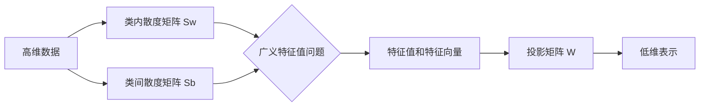

# 线性判别分析(LDA)：面向分类的降维方法

## 1. 背景介绍
### 1.1 数据维度灾难
在当今大数据时代,我们面临着海量高维数据的挑战。高维数据不仅给存储和计算带来困难,也会影响机器学习模型的性能。维度灾难(Curse of Dimensionality)是指随着维度的增加,数据变得稀疏,传统的机器学习方法难以有效处理高维数据。
### 1.2 降维的必要性  
为了克服维度灾难,我们需要降低数据维度,同时尽可能保留数据的本质特征。降维不仅能减少存储和计算开销,还能去除数据中的噪声和冗余,提高后续学习任务的性能。常见的降维方法包括PCA、LDA、MDS等。
### 1.3 LDA的优势
相比于PCA等无监督降维方法,LDA作为一种有监督学习的降维技术,能够充分利用类别标签信息,学习出最有利于样本分类的特征子空间。LDA在模式识别、计算机视觉等领域得到了广泛应用。

## 2. 核心概念与联系
### 2.1 类内散度矩阵
类内散度矩阵(Within-class Scatter Matrix)度量了同一类别内样本特征的差异性。我们希望投影后的样本,类内方差尽可能小,样本聚集紧凑。
### 2.2 类间散度矩阵  
类间散度矩阵(Between-class Scatter Matrix)度量了不同类别样本特征均值之间的差异。我们希望投影后的类别中心尽可能分开,便于区分不同类别。
### 2.3 广义瑞利商
LDA的目标是最大化类间散度与类内散度之比,即广义瑞利商(Generalized Rayleigh Quotient)。求解该商的极大值,就得到了最优的投影矩阵。
### 2.4 Fisher判别准则
LDA又称Fisher线性判别,Fisher判别准则正是广义瑞利商的一种形式。通过优化该准则函数,可得到最优的判别方向。

## 3. 核心算法原理与步骤
### 3.1 LDA的目标
LDA的核心思想是学习一个线性变换,将高维数据投影到低维子空间,使得投影后类内方差最小而类间方差最大,从而达到提高分类性能的目的。
### 3.2 求解步骤
LDA主要分为以下几个步骤:
1) 计算类内散度矩阵Sw和类间散度矩阵Sb
2) 构建广义特征值问题 Sw^(-1)Sbw = λw
3) 求解特征值和特征向量,取前k个最大特征值对应的特征向量构成投影矩阵W
4) 用W将样本投影到低维空间



## 4. 数学模型与公式推导
### 4.1 基本定义
假设有N个d维样本{x1,x2,...,xN},共C个类别,第i类包含Ni个样本。令μ为所有样本均值向量,μi为第i类样本均值向量。
### 4.2 类内散度矩阵
类内散度矩阵 Sw 定义为各类样本协方差矩阵之和:

$$
S_w=\sum_{i=1}^C\sum_{x\in X_i}(x-\mu_i)(x-\mu_i)^T
$$

其中Xi为第i类样本集合。
### 4.3 类间散度矩阵
类间散度矩阵 Sb 定义为各类均值向量与总体均值向量差外积之和:

$$
S_b=\sum_{i=1}^CN_i(\mu_i-\mu)(\mu_i-\mu)^T
$$

### 4.4 广义瑞利商
LDA的目标是求解以下广义瑞利商的极大值:

$$
J(w)=\frac{w^TS_bw}{w^TS_ww}
$$

其中w为投影向量。
### 4.5 求解广义特征值问题
对上式求导并令其为0,可得广义特征值问题:

$$
S_bw=\lambda S_ww
$$

其中λ为广义特征值。上式等价于:

$$
S_w^{-1}S_bw=\lambda w
$$

求解该特征值问题,取前k个最大特征值对应的特征向量w1,w2,...,wk构成投影矩阵W=(w1,w2,...,wk)。
### 4.6 样本投影
对样本x,其低维投影y由下式给出:

$$
y=W^Tx
$$

W即为LDA学习到的投影矩阵。

## 5. 项目实践：代码实例
下面给出Python中使用sklearn库实现LDA的代码示例:

```python
from sklearn.discriminant_analysis import LinearDiscriminantAnalysis
from sklearn.datasets import load_iris
from sklearn.model_selection import train_test_split

# 加载鸢尾花数据集
iris = load_iris()
X = iris.data
y = iris.target

# 划分训练集和测试集 
X_train, X_test, y_train, y_test = train_test_split(X, y, test_size=0.2, random_state=0)

# 训练LDA模型
lda = LinearDiscriminantAnalysis(n_components=2)
X_train_lda = lda.fit_transform(X_train, y_train)
X_test_lda = lda.transform(X_test)

# 可视化投影结果
import matplotlib.pyplot as plt
plt.figure(figsize=(8,4))
colors = ['navy', 'turquoise', 'darkorange']
for color, i, target_name in zip(colors, [0, 1, 2], iris.target_names):
    plt.scatter(X_train_lda[y_train == i, 0], 
                X_train_lda[y_train == i, 1], 
                color=color, label=target_name)
plt.xlabel('LD1')
plt.ylabel('LD2')
plt.legend(loc='best')
plt.title('LDA of IRIS dataset')
plt.show()
```

上述代码首先加载鸢尾花数据集,然后划分训练集和测试集。接着训练LDA模型,并将样本投影到二维空间。最后可视化投影结果,从图中可以看出,LDA学习到的投影方向能够较好地区分三类鸢尾花。

## 6. 实际应用场景
### 6.1 人脸识别
LDA是人脸识别中常用的特征提取方法。将高维人脸图像投影到低维"特征脸"空间,再在该空间中进行分类和识别,能够大大提高识别效率和准确率。
### 6.2 文本分类
对于高维文本特征,如词袋表示,直接应用分类器效果往往不佳。用LDA将文本映射到低维语义子空间,再结合其他分类器,可显著改善文本分类性能。
### 6.3 基因表达数据分析
对于高维基因表达数据,LDA可用于提取与疾病相关的关键基因特征,为后续的生物标记物筛选和疾病诊断提供依据。

## 7. 工具和资源推荐
- scikit-learn: Python机器学习库,提供了LDA等多种降维算法的实现。官网:https://scikit-learn.org/
- FisherFaces: 基于LDA的人脸识别Python实现。Github:https://github.com/Jiangjao/FisherFaces
- LDA-Topic-Model: Java实现的LDA主题模型。Github:https://github.com/Blei-Lab/lda-c

## 8. 总结与展望
### 8.1 LDA的优势与局限
LDA通过有监督学习获得判别性子空间,在模式分类任务中展现出良好性能。但LDA也存在局限:
- LDA假设数据服从高斯分布,对非高斯数据的降维效果欠佳
- LDA降维后的特征维数不超过类别数,对类别较少的问题提取的特征有限
- LDA在样本分布差异较大时性能下降,如不同姿态、光照下的人脸识别

### 8.2 LDA的扩展算法
针对LDA的局限性,研究者提出了一系列扩展算法:
- 核LDA(KLDA):通过核技巧将数据映射到高维空间,实现非线性判别分析
- 异质LDA(HLDA):通过引入异质噪声项,提高LDA对异质数据的建模能力
- 稀疏判别分析(SDA):在LDA的基础上引入L1正则化,学习稀疏判别方向,增强模型可解释性
- 张量LDA(TLDA):通过张量表示样本结构信息,实现高阶判别分析

### 8.3 结合深度学习的LDA
近年来,研究者尝试将LDA与深度学习结合,充分利用深度网络学习高层特征表示的能力。如将LDA作为CNN网络的损失函数,指导网络学习判别性特征。深度LDA有望在图像识别、语音识别等领域取得突破。

## 9. 附录:常见问题解答
### 9.1 LDA可以用于无监督学习吗?
LDA是有监督降维方法,需要利用类别标签信息。对于无标签数据,可使用PCA等无监督降维技术。

### 9.2 LDA学习到的判别方向一定正交吗?
通常LDA得到的判别方向并不正交。但可以对投影矩阵做SVD分解,得到正交基。

### 9.3 如何选择LDA的降维维数?
LDA降维后的特征维数不超过类别数C-1。通常根据具体任务和数据集,尝试不同维数,通过交叉验证确定最佳维数。

### 9.4 对数据进行PCA预处理对LDA有帮助吗?
在LDA之前用PCA降低数据维度,能够减小计算开销,提高LDA求解的数值稳定性。但PCA不能完全替代LDA,因为PCA未考虑类别信息。

### 9.5 LDA对数据噪声敏感吗?
LDA对数据噪声和离群点比较敏感,因此在进行LDA之前,往往需要对数据进行预处理,如去除异常点,标准化等。

作者：禅与计算机程序设计艺术 / Zen and the Art of Computer Programming