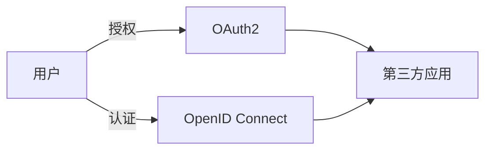

## 1.背景介绍

随着互联网的发展，我们的生活越来越依赖于各种在线服务。每个服务都需要我们进行身份认证，以保护我们的个人信息和隐私。然而，为每个服务创建和记住一个独立的账户和密码，无疑给我们带来了极大的困扰。因此，统一认证与授权的需求应运而生。OAuth2和OpenID Connect就是应对这一需求而诞生的技术。

## 2.核心概念与联系

OAuth2是一个开放标准，它允许用户授权第三方应用访问他们存储在另一服务提供商上的信息，而无需将用户名和密码提供给第三方应用。OAuth2定义了四种授权方式：授权码模式、隐式授权模式、密码模式和客户端模式。

OpenID Connect则是在OAuth2的基础上，为用户身份提供了标准方法。它允许客户端验证用户身份，以及获取基本的用户信息。

OAuth2和OpenID Connect的联系在于：OpenID Connect是在OAuth2协议的基础上建立的。简单来说，OAuth2负责授权，OpenID Connect负责认证。



## 3.核心算法原理具体操作步骤

以OAuth2的授权码模式为例，其操作步骤如下：

1. 用户访问第三方应用，第三方应用将用户重定向到服务提供商。
2. 用户选择是否给予第三方应用授权。
3. 服务提供商将用户重定向回第三方应用，同时附上授权码。
4. 第三方应用向服务提供商请求访问令牌，此请求需要包含授权码。
5. 服务提供商返回访问令牌。

OpenID Connect的操作步骤与OAuth2类似，但在最后一步，服务提供商会返回一个ID令牌，其中包含了用户的身份信息。

## 4.数学模型和公式详细讲解举例说明

在OAuth2和OpenID Connect的实现中，涉及到了一些密码学的知识，例如哈希函数、数字签名等。这些技术保证了令牌的安全性和用户信息的真实性。

例如，服务提供商在返回访问令牌时，会使用私钥对访问令牌进行签名。第三方应用在收到访问令牌后，可以使用服务提供商的公钥进行验证。这样就可以确保访问令牌的真实性，防止被篡改。

## 5.项目实践：代码实例和详细解释说明

下面以Python语言为例，展示如何使用OAuth2进行授权。

```python
from requests_oauthlib import OAuth2Session

# Your client credentials
client_id = 'your_client_id'
client_secret = 'your_client_secret'

# Redirect user to Google for authorization
authorization_base_url = 'https://accounts.google.com/o/oauth2/v2/auth'
redirect_uri = 'https://your_callback_url.com'

# Get authorization url
google = OAuth2Session(client_id, redirect_uri=redirect_uri)
authorization_url, state = google.authorization_url(authorization_base_url)

# Redirect user to authorization URL
print('Please go to the following URL: {}'.format(authorization_url))
```

## 6.实际应用场景

OAuth2和OpenID Connect被广泛应用于各种在线服务，例如Google、Facebook、Twitter等。用户只需要使用一个账户，就可以登录这些服务，极大地提高了用户体验。

## 7.工具和资源推荐

- [OAuth 2.0 Playground](https://developers.google.com/oauthplayground/)
- [OpenID Connect Playground](https://openidconnect.net/)

## 8.总结：未来发展趋势与挑战

随着越来越多的服务开始支持OAuth2和OpenID Connect，我们可以预见，未来的互联网将更加便捷、安全。然而，这也带来了新的挑战，例如如何保护用户的隐私，如何防止身份被盗用等。

## 9.附录：常见问题与解答

Q: OAuth2和OpenID Connect有什么区别？

A: OAuth2是一个授权框架，它允许第三方应用访问用户的资源。OpenID Connect则是一个身份层，它允许第三方应用验证用户的身份。

Q: OAuth2和OpenID Connect安全吗？

A: 从设计上来说，OAuth2和OpenID Connect都是安全的。然而，实际的安全性取决于如何实现和使用它们。

作者：禅与计算机程序设计艺术 / Zen and the Art of Computer Programming