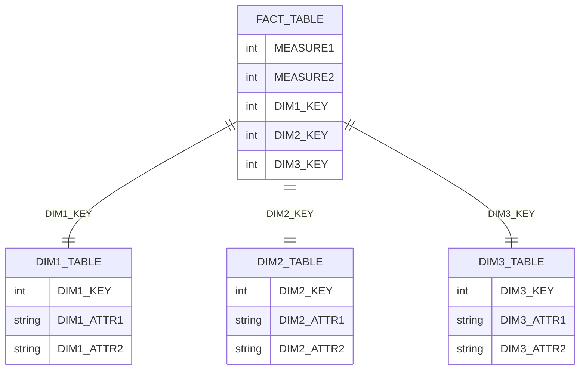
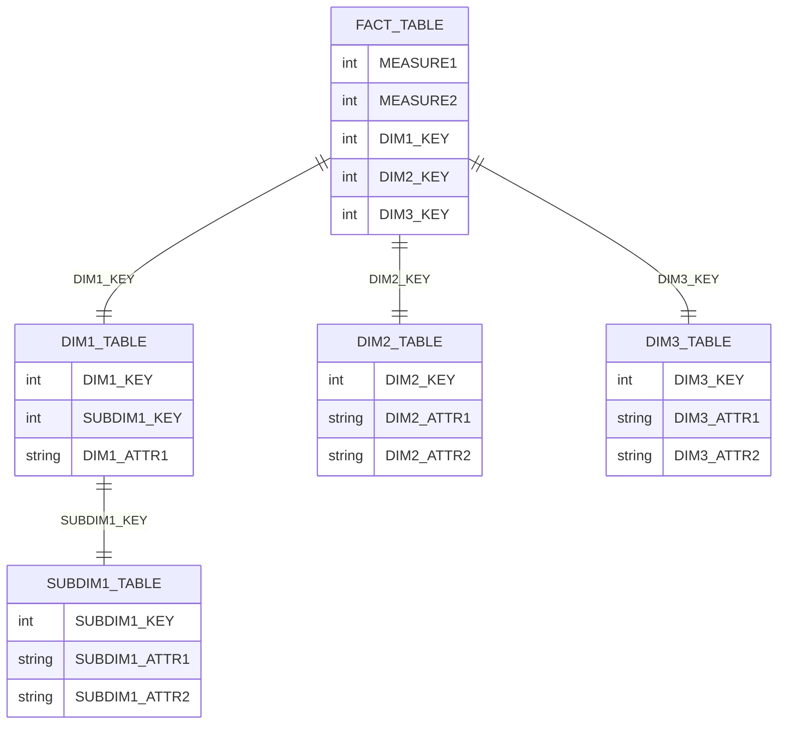
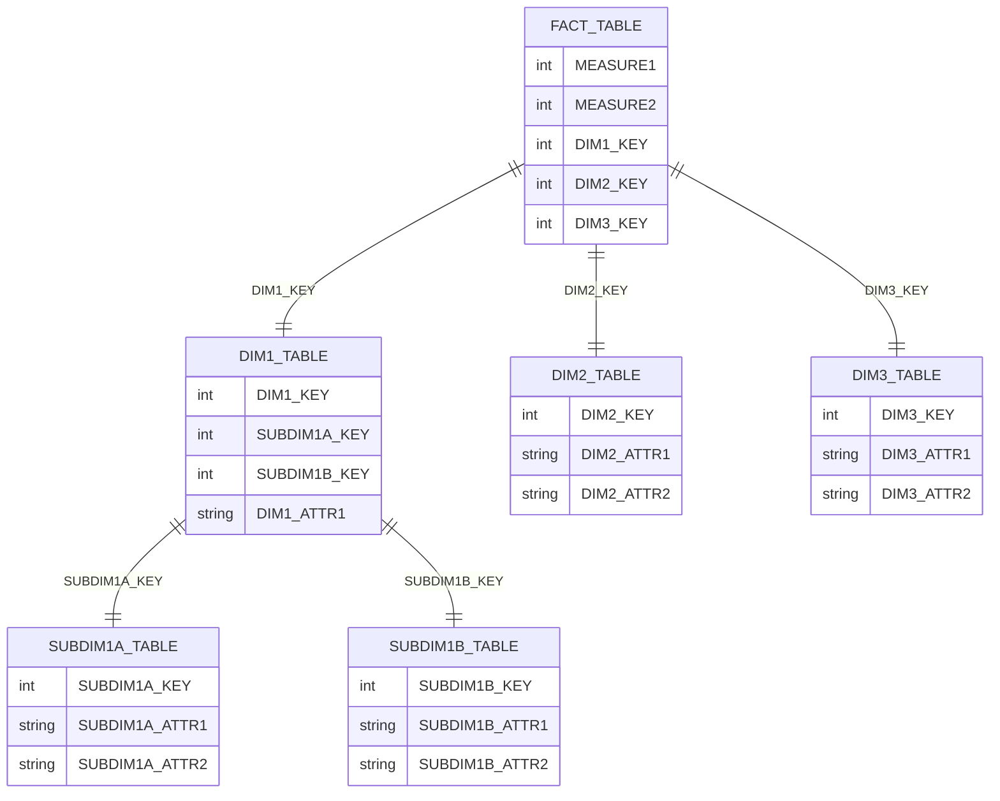

# 维度建模:星型、雪花和银河系结构

## 1.背景介绍

### 1.1 数据仓库和维度建模概述

在当今数据驱动的世界中,企业和组织需要有效地管理和分析大量数据,以获得洞察力并做出明智的决策。数据仓库(Data Warehouse)作为集中存储和管理企业数据的系统,扮演着关键角色。它将来自不同来源的数据整合并优化,为分析和报告提供一个统一的视图。

维度建模是设计和构建数据仓库的关键技术之一。它提供了一种结构化的方法来组织和存储数据,使其易于理解、查询和分析。维度建模的核心思想是将数据划分为事实(facts)和维度(dimensions),事实表示度量值,而维度提供关于事实的上下文信息。

### 1.2 维度建模的重要性

维度建模对于构建高效、易用的数据仓库至关重要,原因如下:

1. **性能优化**: 维度建模通过将数据规范化并将其组织到适当的事实和维度表中,可以显著提高查询性能。
2. **易于理解**: 维度模型使用业务术语和概念,使数据更加直观和易于理解。
3. **灵活性**: 维度模型可以轻松地扩展和修改,以适应业务需求的变化。
4. **数据质量**: 维度建模有助于确保数据的完整性和一致性,减少冗余和异常。

## 2.核心概念与联系

### 2.1 事实表(Fact Table)

事实表是维度建模中的核心组件,它存储了度量值或事实数据。事实表通常由以下几个部分组成:

- **度量值(Measures)**: 这些是需要分析和报告的数值,如销售额、成本、数量等。
- **维度键(Dimension Keys)**: 这些是指向维度表的外键,用于将事实数据与相关维度数据关联。

事实表的粒度级别取决于业务需求和分析目的。例如,零售业中的事实表可能在每日销售级别上捕获数据,而电信行业可能在通话级别上捕获数据。

### 2.2 维度表(Dimension Table)

维度表存储描述性数据或元数据,为事实数据提供上下文信息。每个维度表通常包含以下组件:

- **维度键(Dimension Key)**: 这是维度表的主键,用于与事实表中的外键相关联。
- **维度属性(Dimension Attributes)**: 这些是描述维度的附加信息,如产品名称、类别、地理位置等。

维度表可以是扁平的,也可以采用层次结构或雪花结构,具体取决于数据的复杂性和需求。

### 2.3 星型模式(Star Schema)

星型模式是维度建模中最常见和最简单的模式。它由一个中心事实表和多个维度表组成,形状类似于星星。每个维度表通过主键和外键与事实表相连。星型模式易于理解和查询,但可能会导致维度表中的数据冗余。

### 2.4 雪花模式(Snowflake Schema)

雪花模式是星型模式的扩展,它通过将维度表进一步规范化来减少数据冗余。在雪花模式中,一些维度表可能会被分解为多个表,形成一个层次结构。这种结构类似于雪花的形状,因此得名雪花模式。

雪花模式可以提高存储效率,但可能会增加查询的复杂性和降低性能。

### 2.5 银河系模式(Galaxy Schema)

银河系模式是一种更加复杂的维度建模技术,它结合了星型模式和雪花模式的优点。在银河系模式中,事实表与一个或多个维度表直接相连,同时这些维度表又可以与其他维度表相连,形成一个复杂的层次结构。

银河系模式提供了更大的灵活性和扩展性,但也增加了设计和维护的复杂性。它通常用于处理非常复杂的数据模型,例如在金融或电信领域。

## 3.核心算法原理具体操作步骤

维度建模并不是一种算法,而是一种设计数据仓库模型的方法。它遵循以下一般步骤:

1. **确定业务流程和需求**: 首先需要理解业务流程、关键度量值和分析需求。这将指导维度模型的设计。

2. **识别事实**: 根据业务需求,确定需要跟踪和分析的度量值或事实。这些事实将构成事实表的基础。

3. **识别维度**: 为每个事实确定相关的上下文信息或维度。这些维度将构成维度表。

4. **确定粒度级别**: 决定事实表的粒度级别,即每行记录代表什么级别的细节。这将影响查询性能和数据量。

5. **设计事实表**: 根据确定的事实和粒度级别,创建事实表的结构,包括度量值和维度键。

6. **设计维度表**: 为每个维度创建维度表,包括维度键和相关属性。根据需要,可以将维度表进一步规范化为雪花或银河系结构。

7. **建立关系**: 通过主键和外键,在事实表和维度表之间建立关系。

8. **处理缓慢变化维度(SCD)**: 确定如何处理维度数据随时间变化的情况,例如使用类型 1、类型 2 或类型 3 SCD技术。

9. **优化和调整**: 根据性能和需求,优化模型结构,例如添加索引、分区或聚集。

10. **持续维护和改进**: 随着业务需求的变化,持续评估和改进维度模型。

维度建模是一个迭代的过程,需要与业务用户和数据分析师密切合作,以确保模型满足实际需求。

## 4.数学模型和公式详细讲解举例说明

虽然维度建模本身不涉及复杂的数学模型或公式,但在设计和优化维度模型时,可能需要考虑一些数学概念和原理。以下是一些相关的数学模型和公式:

### 4.1 基数估计

基数是指一个列或列组合中不同值的数量。准确估计维度表和事实表的基数对于优化查询性能至关重要。基数估计可以帮助查询优化器选择最佳的执行计划。

基数估计公式:

$$
基数(A,B) = 基数(A) \times 基数(B) \times \frac{1}{MAX(V(A),V(B))}
$$

其中:
- $基数(A,B)$ 是列 A 和 B 的组合基数
- $基数(A)$ 和 $基数(B)$ 分别是列 A 和 B 的基数
- $V(A)$ 和 $V(B)$ 分别是列 A 和 B 中不同值的数量

### 4.2 存储空间估计

在设计维度模型时,估计所需的存储空间非常重要。这可以帮助确定硬件需求和优化存储策略。

存储空间估计公式:

$$
存储空间 = \sum_{i=1}^{n} 行数_i \times \sum_{j=1}^{m} 列宽度_{i,j}
$$

其中:
- $n$ 是表的数量
- $行数_i$ 是第 $i$ 个表的行数
- $m$ 是第 $i$ 个表的列数
- $列宽度_{i,j}$ 是第 $i$ 个表的第 $j$ 列的宽度(以字节为单位)

### 4.3 查询成本模型

查询成本模型用于估计执行查询所需的成本,例如 I/O 成本、CPU 成本和内存成本。这对于优化查询执行计划至关重要。

查询成本模型通常由数据库管理系统(DBMS)内部使用,并基于各种因素,如数据统计信息、索引、连接策略等。虽然具体公式因 DBMS 而异,但通常包括以下组件:

- 扫描成本:读取表或索引页的 I/O 成本
- 连接成本:执行连接操作的 CPU 和内存成本
- 排序成本:执行排序操作的 CPU 和内存成本
- 传输成本:从磁盘到内存或从一个操作员到下一个操作员传输数据的成本

查询优化器使用成本模型来评估不同执行计划的成本,并选择成本最低的计划。

### 4.4 数据压缩

为了优化存储空间和 I/O 性能,维度模型中常常使用数据压缩技术。常见的压缩算法包括字典编码、运行长度编码(RLE)和比特向量编码。

以 RLE 为例,压缩比可以使用以下公式估计:

$$
压缩比 = \frac{原始大小}{压缩后大小} = \frac{n}{\sum_{i=1}^{m} (l_i + 1) + m \times 头部大小}
$$

其中:
- $n$ 是原始数据的大小(以字节为单位)
- $m$ 是不同的运行长度块的数量
- $l_i$ 是第 $i$ 个运行长度块的长度
- $头部大小$ 是每个块的元数据开销(以字节为单位)

通过合理应用压缩技术,可以显著减少维度模型的存储需求和 I/O 开销。

## 5.项目实践:代码实例和详细解释说明

为了更好地理解维度建模的概念和实现,让我们通过一个实际项目案例来演示。在这个项目中,我们将构建一个零售销售数据仓库,用于分析和报告销售数据。

我们将使用 SQL 作为编程语言,并假设使