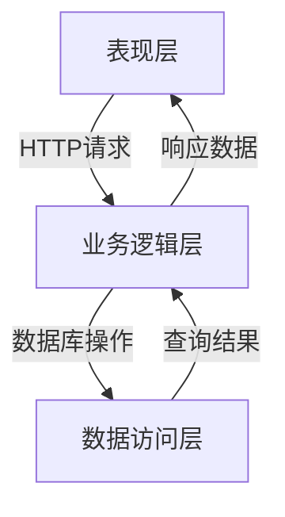

# 网上图书销售系统详细设计与具体代码实现

## 1.背景介绍

在当今电子商务时代,网上购物已经成为人们生活中不可或缺的一部分。随着互联网技术的不断发展,网上购物的便利性和普及度也在不断提高。图书作为知识和文化的载体,其网上销售市场潜力巨大。因此,构建一个高效、安全、用户友好的网上图书销售系统,对于满足用户需求、提高企业竞争力至关重要。

### 1.1 网上图书销售系统概述

网上图书销售系统是一种基于互联网的电子商务应用程序,旨在为用户提供在线浏览、搜索、订购和购买图书的服务。该系统通常包括以下几个主要模块:

- **用户管理模块**: 负责用户注册、登录、个人信息管理等功能。
- **图书管理模块**: 用于管理图书信息,包括添加、修改、删除和查询图书。
- **订单管理模块**: 处理用户下单、支付、发货和订单跟踪等功能。
- **购物车模块**: 允许用户临时存储所选图书,方便下单。
- **搜索模块**: 提供基于关键词、分类、作者等条件的图书搜索功能。
- **评论模块**: 允许用户对购买的图书进行评论和打分。

### 1.2 网上图书销售系统的优势

相比传统的实体书店,网上图书销售系统具有以下优势:

1. **便利性**: 用户可以在任何时间、任何地点通过互联网访问系统,无需亲自前往实体书店。
2. **选择范围广**: 网上书店可以提供大量图书种类,不受实体书店空间限制。
3. **价格竞争力**: 网上书店通常可以提供更加优惠的价格。
4. **个性化推荐**: 基于用户浏览和购买记录,系统可以为用户提供个性化的图书推荐。
5. **评论和评分**: 用户可以查看其他买家的评论和评分,作为购买参考。

## 2.核心概念与联系

### 2.1 系统架构

网上图书销售系统通常采用经典的三层架构,包括表现层(Presentation Layer)、业务逻辑层(Business Logic Layer)和数据访问层(Data Access Layer)。

- **表现层**: 负责与用户交互,接收用户请求并呈现结果。通常由Web页面或移动应用程序组成。
- **业务逻辑层**: 处理用户请求,执行相应的业务逻辑操作,并与数据访问层进行交互。
- **数据访问层**: 负责与数据库进行交互,执行数据查询、插入、更新和删除操作。

### 2.2 核心模块

网上图书销售系统的核心模块包括:

1. **用户模块**: 管理用户注册、登录、个人信息等功能。
2. **图书模块**: 管理图书信息,包括添加、修改、删除和查询图书。
3. **订单模块**: 处理用户下单、支付、发货和订单跟踪等功能。
4. **购物车模块**: 允许用户临时存储所选图书,方便下单。
5. **搜索模块**: 提供基于关键词、分类、作者等条件的图书搜索功能。
6. **评论模块**: 允许用户对购买的图书进行评论和打分。

### 2.3 核心技术

网上图书销售系统的开发通常涉及以下核心技术:

- **Web开发技术**: HTML、CSS、JavaScript等前端技术,以及Java、Python、PHP等后端语言。
- **数据库技术**: 如MySQL、PostgreSQL、Oracle等关系型数据库,或MongoDB、Cassandra等NoSQL数据库。
- **Web框架**: 如Spring、Django、Laravel等框架,用于简化Web应用程序的开发。
- **安全技术**: 如SSL/TLS加密、身份验证、授权等,保证系统和用户数据的安全性。
- **缓存技术**: 如Redis、Memcached等,用于提高系统的响应速度和可扩展性。
- **消息队列**: 如RabbitMQ、Kafka等,用于异步处理订单、发送邮件等任务。
- **搜索引擎**: 如Elasticsearch、Solr等,用于提供高效的全文搜索功能。

## 3.核心算法原理具体操作步骤

### 3.1 用户注册和登录

用户注册和登录是网上图书销售系统的基础功能,确保系统的安全性和可靠性至关重要。

#### 3.1.1 用户注册

用户注册流程通常包括以下步骤:

1. 用户在注册页面填写个人信息,如用户名、密码、电子邮件等。
2. 系统验证用户输入的信息是否合法,如用户名是否已被占用、密码是否符合复杂度要求等。
3. 如果验证通过,系统将用户信息存储在数据库中。
4. 系统可以向用户发送一封验证邮件,确认用户的电子邮件地址。

为了提高系统的安全性,密码通常会使用加密算法(如SHA-256、bcrypt等)进行哈希处理,而不是以明文形式存储在数据库中。

#### 3.1.2 用户登录

用户登录流程通常包括以下步骤:

1. 用户在登录页面输入用户名和密码。
2. 系统从数据库中查询用户信息,并验证用户输入的密码是否与存储的密码哈希值匹配。
3. 如果验证通过,系统为用户生成一个会话令牌(Session Token)或JSON Web Token(JWT),并将其存储在服务器端或客户端(如Cookie或本地存储)。
4. 后续的请求将携带该令牌,系统可以根据令牌验证用户的身份和权限。

为了防止暴力破解攻击,系统可以实现限制失败登录次数的策略,如果超过一定次数,则临时锁定该用户账户。

### 3.2 图书搜索

图书搜索是网上图书销售系统的核心功能之一,它允许用户根据关键词、分类、作者等条件快速查找感兴趣的图书。

#### 3.2.1 基于关键词的全文搜索

基于关键词的全文搜索是最常见的搜索方式,它通常包括以下步骤:

1. 系统将图书信息(如标题、作者、出版社等)建立倒排索引(Inverted Index)。
2. 用户输入关键词,系统将关键词进行分词(Tokenization)和标准化(Normalization)处理。
3. 系统在倒排索引中查找与处理后的关键词匹配的图书记录。
4. 根据相关性算分(Relevance Scoring),系统对匹配的结果进行排序。
5. 将排序后的结果返回给用户。

相关性算分通常考虑多个因素,如关键词在文本中的位置、频率、文档长度等,常用的算法有TF-IDF(Term Frequency-Inverse Document Frequency)、BM25等。

#### 3.2.2 基于分类和作者的搜索

除了基于关键词的全文搜索,系统还可以支持基于分类和作者的搜索。这种搜索通常采用以下步骤:

1. 系统将图书信息按分类和作者建立索引。
2. 用户选择感兴趣的分类或作者。
3. 系统在相应的索引中查找匹配的图书记录。
4. 将匹配的结果返回给用户,可以根据发布日期、评分等条件进行排序。

### 3.3 购物车和订单处理

购物车和订单处理是网上图书销售系统的另一个核心功能,它涉及到用户选择图书、下单、支付和发货等多个环节。

#### 3.3.1 购物车

购物车模块允许用户临时存储所选图书,方便下单。其主要步骤如下:

1. 用户浏览图书并将感兴趣的图书添加到购物车。
2. 系统将图书信息(如书名、作者、价格等)存储在会话(Session)或数据库中。
3. 用户可以在购物车中查看、修改或删除所选图书。
4. 当用户准备下单时,系统将从购物车中获取图书信息,生成订单详情。

#### 3.3.2 订单处理

订单处理流程包括下单、支付和发货等步骤:

1. 用户在购物车中确认图书信息,并提交订单。
2. 系统生成订单号,并将订单信息存储在数据库中。
3. 用户选择支付方式(如在线支付、货到付款等),并完成支付流程。
4. 系统验证支付结果,如果支付成功,则更新订单状态为"已付款"。
5. 系统根据订单信息安排发货,并更新订单状态为"已发货"。
6. 用户收到图书后,可以在系统中确认收货,订单状态更新为"已完成"。

在订单处理过程中,系统可以通过电子邮件或短信等方式向用户发送订单状态更新通知。

### 3.4 评论和评分

评论和评分功能允许用户对已购买的图书进行评价,为其他潜在买家提供参考。其主要步骤如下:

1. 用户在图书详情页面或个人订单页面找到已购买的图书。
2. 用户可以为该图书撰写评论并给出评分(通常为1-5星)。
3. 系统将用户的评论和评分存储在数据库中,并与该图书记录关联。
4. 其他用户浏览该图书时,可以查看所有评论和平均评分。

为了确保评论的真实性和有效性,系统可以采取以下策略:

- 只允许已购买该图书的用户进行评论和评分。
- 限制每个用户对同一本书只能评论一次。
- 实现评论审核机制,过滤包含垃圾信息或不当内容的评论。
- 采用反垃圾邮件技术(如CAPTCHA)防止机器人评论。

## 4.数学模型和公式详细讲解举例说明

在网上图书销售系统中,数学模型和公式主要应用于以下几个方面:

### 4.1 相关性算分

在图书搜索功能中,相关性算分算法用于根据用户的查询词,对匹配的图书结果进行排序,确保最相关的结果排在前面。常用的相关性算分算法包括TF-IDF和BM25。

#### 4.1.1 TF-IDF

TF-IDF(Term Frequency-Inverse Document Frequency)是一种统计方法,用于评估一个词对于一个文档集或一个语料库中的其他文档的重要程度。TF-IDF由两个部分组成:

- **词频(Term Frequency, TF)**: 一个给定的词在文档中出现的频率。
- **逆向文档频率(Inverse Document Frequency, IDF)**: 一个词语在整个文档集中的普遍重要程度。

TF-IDF的计算公式如下:

$$\mathrm{tfidf}(t, d, D) = \mathrm{tf}(t, d) \times \mathrm{idf}(t, D)$$

其中:

- $\mathrm{tf}(t, d)$ 表示词 $t$ 在文档 $d$ 中的词频。
- $\mathrm{idf}(t, D)$ 表示词 $t$ 在文档集 $D$ 中的逆向文档频率,计算公式为:

$$\mathrm{idf}(t, D) = \log \frac{|D|}{|\{d \in D: t \in d\}|}$$

$|D|$ 表示文档集 $D$ 中文档的总数,分母表示包含词 $t$ 的文档数量。

在图书搜索系统中,可以将每本图书的标题、作者、出版社等信息作为一个文档,构建倒排索引。当用户输入查询词时,系统计算每本图书与查询词的TF-IDF分数,并根据分数对结果进行排序。

#### 4.1.2 BM25

BM25是另一种常用的相关性算分算法,它是对TF-IDF的改进,考虑了文档长度和查询词在文档中的位置等因素。BM25的计算公式如下:

$$\mathrm{score}(D, Q) = \sum_{q \in Q} \mathrm{idf}(q) \cdot \frac{f(q, D) \c