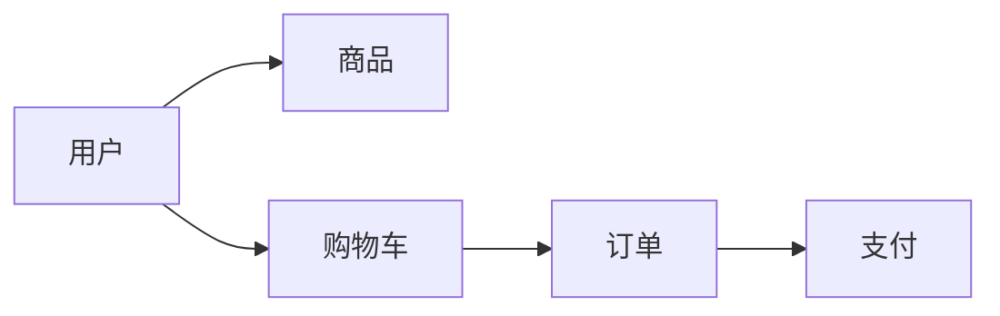

# 网上宠物店系统详细设计与具体代码实现

## 1. 背景介绍

随着互联网技术的快速发展和电子商务的普及,越来越多的传统行业开始向线上转移。作为宠物行业的重要组成部分,网上宠物店系统成为了宠物商家实现线上销售、提升用户体验的重要工具。一个功能完善、设计合理的网上宠物店系统不仅能够为商家带来更多的销售机会,也能为广大宠物爱好者提供更加便捷的购物体验。

本文将详细介绍网上宠物店系统的设计与实现,包括系统的核心概念、架构设计、关键技术、代码实现等方面。通过对系统的全面剖析,帮助读者深入理解网上宠物店系统的工作原理,掌握相关技术的应用,为日后开发类似系统提供参考。

## 2. 核心概念与联系

在设计网上宠物店系统之前,我们需要了解一些核心概念,以及它们之间的关系。

### 2.1 用户

用户是系统的核心,包括普通用户和管理员两种角色。

- 普通用户:可以浏览商品、添加到购物车、下单购买等。
- 管理员:拥有对商品、订单、用户等进行管理的权限。

### 2.2 商品

商品是网上宠物店的主要销售对象,包括宠物、宠物食品、宠物用品等。每个商品都有自己的属性,如名称、价格、库存、图片等。

### 2.3 购物车

购物车用于存储用户选择的商品,方便用户集中管理和结算。用户可以向购物车中添加、删除商品,修改商品数量等。

### 2.4 订单

当用户提交购物车中的商品时,系统会生成相应的订单。订单包含了用户信息、商品信息、支付状态等。

### 2.5 支付

支付是用户完成订单的重要环节。系统需要对接第三方支付平台,如支付宝、微信支付等,以保证支付的安全性和便捷性。

下图展示了这些核心概念之间的关系:



## 3. 核心算法原理具体操作步骤

### 3.1 推荐算法

为了提高用户的购物体验,系统需要根据用户的历史行为,推荐用户可能感兴趣的商品。常见的推荐算法包括:

#### 3.1.1 协同过滤算法

协同过滤算法根据用户的历史行为,找到与其相似的用户,然后将这些相似用户喜欢的商品推荐给当前用户。

具体步骤如下:

1. 收集用户的历史行为数据,如浏览、购买、评分等。
2. 计算用户之间的相似度,常用的相似度计算方法有欧几里得距离、皮尔逊相关系数等。
3. 找出与当前用户最相似的 K 个用户。
4. 将这 K 个用户喜欢的商品推荐给当前用户。

#### 3.1.2 基于内容的推荐算法

基于内容的推荐算法根据商品的属性,如名称、描述、类别等,找到与用户历史浏览、购买商品相似的商品,然后将这些商品推荐给用户。

具体步骤如下:

1. 收集用户的历史行为数据,如浏览、购买等。
2. 对商品的属性进行特征提取,如使用 TF-IDF 算法提取商品描述中的关键词。
3. 计算用户历史浏览、购买商品与其他商品之间的相似度,常用的相似度计算方法有余弦相似度等。
4. 将与用户历史浏览、购买商品最相似的商品推荐给用户。

### 3.2 搜索算法

为了方便用户快速找到所需的商品,系统需要提供高效的搜索功能。常见的搜索算法包括:

#### 3.2.1 倒排索引

倒排索引是一种常用的搜索算法,它将商品的属性(如名称、描述等)切分成词条,然后建立词条到商品的映射关系。

具体步骤如下:

1. 对商品的属性进行分词,提取出关键词。
2. 建立关键词到商品的映射关系,即倒排索引。
3. 当用户输入搜索关键词时,在倒排索引中查找包含这些关键词的商品。
4. 将查找到的商品返回给用户。

#### 3.2.2 全文搜索

全文搜索是一种更加高级的搜索算法,它不仅考虑关键词的出现,还考虑关键词的位置、频率等因素。常用的全文搜索引擎有 Elasticsearch、Solr 等。

具体步骤如下:

1. 将商品的属性提交给全文搜索引擎进行索引。
2. 当用户输入搜索关键词时,全文搜索引擎会根据关键词的位置、频率等因素,计算每个商品的相关性得分。
3. 将相关性得分高的商品返回给用户。

## 4. 数学模型和公式详细讲解举例说明

在推荐算法和搜索算法中,常常会用到一些数学模型和公式。下面我们通过具体的例子来讲解这些模型和公式。

### 4.1 协同过滤算法中的相似度计算

在协同过滤算法中,我们需要计算用户之间的相似度。常用的相似度计算方法有欧几里得距离和皮尔逊相关系数。

#### 4.1.1 欧几里得距离

欧几里得距离用于计算两个用户在 n 维空间中的距离。假设用户 A 和用户 B 对 n 个商品的评分分别为 $(a_1, a_2, ..., a_n)$ 和 $(b_1, b_2, ..., b_n)$,则两个用户之间的欧几里得距离为:

$$
d(A,B) = \sqrt{(a_1-b_1)^2 + (a_2-b_2)^2 + ... + (a_n-b_n)^2}
$$

举例说明:假设用户 A 对商品 1、2、3 的评分为 $(3, 4, 5)$,用户 B 对商品 1、2、3 的评分为 $(4, 4, 4)$,则两个用户之间的欧几里得距离为:

$$
d(A,B) = \sqrt{(3-4)^2 + (4-4)^2 + (5-4)^2} = \sqrt{2} \approx 1.414
$$

#### 4.1.2 皮尔逊相关系数

皮尔逊相关系数用于度量两个用户评分的相关性。假设用户 A 和用户 B 对 n 个商品的评分分别为 $(a_1, a_2, ..., a_n)$ 和 $(b_1, b_2, ..., b_n)$,则两个用户之间的皮尔逊相关系数为:

$$
r(A,B) = \frac{\sum_{i=1}^n (a_i - \bar{a})(b_i - \bar{b})}{\sqrt{\sum_{i=1}^n (a_i - \bar{a})^2} \sqrt{\sum_{i=1}^n (b_i - \bar{b})^2}}
$$

其中,$\bar{a}$ 和 $\bar{b}$ 分别为用户 A 和用户 B 的平均评分。

举例说明:假设用户 A 对商品 1、2、3 的评分为 $(3, 4, 5)$,用户 B 对商品 1、2、3 的评分为 $(4, 4, 4)$,则两个用户的平均评分分别为 $\bar{a} = 4$ 和 $\bar{b} = 4$。代入公式,得到:

$$
r(A,B) = \frac{(3-4)(4-4) + (4-4)(4-4) + (5-4)(4-4)}{\sqrt{(3-4)^2 + (4-4)^2 + (5-4)^2} \sqrt{(4-4)^2 + (4-4)^2 + (4-4)^2}} = 0
$$

可以看出,用户 A 和用户 B 的评分没有相关性。

### 4.2 基于内容的推荐算法中的 TF-IDF 算法

在基于内容的推荐算法中,我们需要对商品的属性进行特征提取。常用的特征提取方法有 TF-IDF 算法。

TF-IDF 算法用于评估一个词条对于一个文档的重要程度。其中,TF(Term Frequency)表示词条在文档中出现的频率,IDF(Inverse Document Frequency)表示词条在整个语料库中的重要程度。

假设一个文档集合包含 $N$ 个文档,词条 $t$ 在其中 $n_t$ 个文档中出现过,且在文档 $d$ 中出现的次数为 $f_{t,d}$,则词条 $t$ 在文档 $d$ 中的 TF-IDF 值为:

$$
\text{TF-IDF}(t,d) = \frac{f_{t,d}}{\sum_{t' \in d} f_{t',d}} \times \log \frac{N}{n_t}
$$

举例说明:假设我们有两个商品,其描述分别为"宠物 狗粮 美味"和"宠物 猫粮 营养"。我们想要提取出这两个商品的关键词,并计算每个关键词的 TF-IDF 值。

首先,我们对商品描述进行分词,得到:

- 商品1:["宠物", "狗粮", "美味"]
- 商品2:["宠物", "猫粮", "营养"]

然后,我们计算每个词条在每个商品描述中的出现次数,得到:

|       | 宠物 | 狗粮 | 美味 | 猫粮 | 营养 |
|-------|------|------|------|------|------|
| 商品1 | 1    | 1    | 1    | 0    | 0    |
| 商品2 | 1    | 0    | 0    | 1    | 1    |

接着,我们计算每个词条在整个语料库中的文档频率,得到:

| 词条 | 文档频率 |
|------|----------|
| 宠物 | 2        |
| 狗粮 | 1        |
| 美味 | 1        |
| 猫粮 | 1        |
| 营养 | 1        |

最后,我们计算每个词条在每个商品描述中的 TF-IDF 值,得到:

|       | 宠物  | 狗粮   | 美味   | 猫粮   | 营养   |
|-------|-------|--------|--------|--------|--------|
| 商品1 | 0.000 | 0.4771 | 0.4771 | 0.0000 | 0.0000 |
| 商品2 | 0.000 | 0.0000 | 0.0000 | 0.4771 | 0.4771 |

可以看出,"狗粮"和"美味"是商品1的关键词,"猫粮"和"营养"是商品2的关键词。

## 5. 项目实践:代码实例和详细解释说明

下面我们通过一个简单的代码实例,来演示如何实现网上宠物店系统的核心功能。

### 5.1 系统架构

我们采用前后端分离的架构,前端使用 Vue.js 框架,后端使用 Node.js 的 Express 框架,数据库使用 MongoDB。

下图展示了系统的整体架构:


### 5.2 数据库设计

我们需要设计用户、商品、购物车、订单等集合的数据结构。

#### 5.2.1 用户集合

```javascript
const userSchema = new mongoose.Schema({
  username: { type: String, required: true },
  password: { type: String, required: true },
  email: { type: String, required: true },
  role: { type: String, default: 'user' },
  createdAt: { type: Date, default: Date.now }
});
```

#### 5.2.2 商品集合

```javascript
const productSchema = new mongoose.Schema({
  name: { type: String, required: true },
  description: { type: String, required: true },
  price: { type: Number, required: true },
  stock: { type: Number, required: true },
  category: { type: String, required: true },
  image: { type: String, required: true },
  createdAt: { type: Date, default: Date.now }
});
```

#### 5.2.3 购物车集合

```javascript
const cartSchema = new mongoose.Schema({
  user: { type: mongoose.Schema.Types.Object