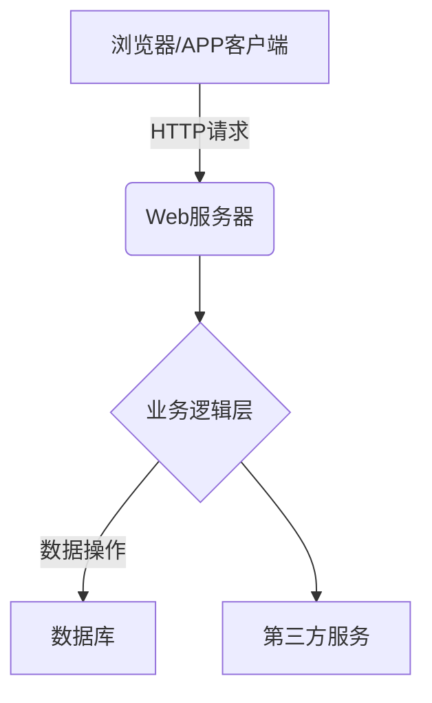
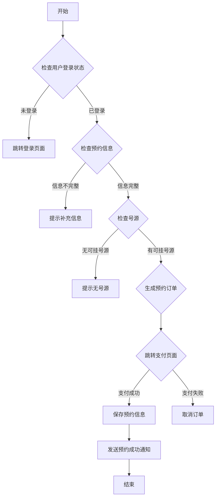
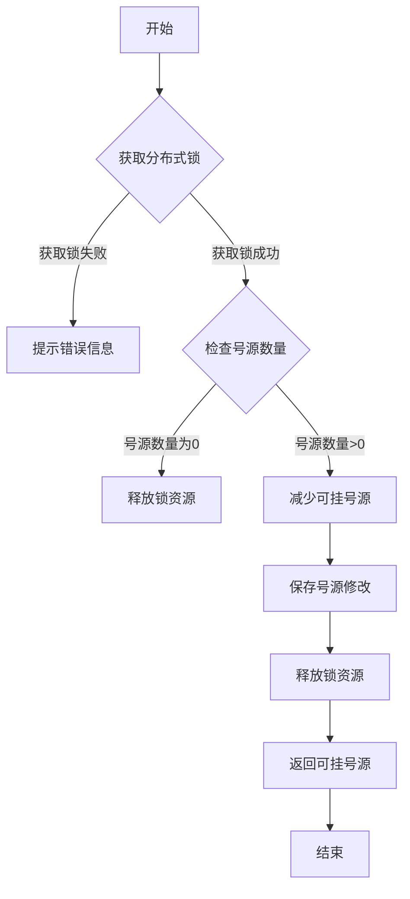
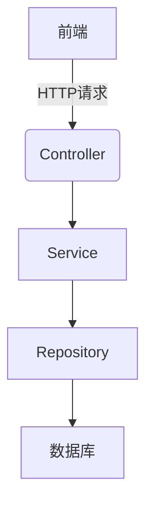

# 网上挂号系统详细设计与具体代码实现

## 1.背景介绍

随着互联网技术的不断发展和普及,越来越多的服务开始向线上转移。在医疗保健领域,网上挂号系统应运而生,为患者和医疗机构提供了极大的便利。传统的就诊流程往往需要患者亲自到医院排队挂号,不仅耗时耗力,还可能错过就诊时间。而网上挂号系统则让患者能够在家中或任何地点通过网络或手机APP预约就诊,大大节省了时间和精力。

网上挂号系统不仅方便了患者,也为医院带来了诸多好处。它可以优化医院的资源分配,减少人工工作量,提高工作效率。同时,通过数据分析,医院可以更好地了解就诊人数、疾病类型等信息,为制定医疗决策提供依据。因此,构建一个高效、安全、可靠的网上挂号系统对于现代医疗服务来说是非常重要的。

## 2.核心概念与联系

### 2.1 系统架构概览

网上挂号系统通常采用 B/S(Browser/Server)架构,即浏览器/服务器架构。其中,浏览器作为客户端,服务器端负责处理业务逻辑和数据存储。系统架构如下图所示:



### 2.2 核心功能模块

网上挂号系统的核心功能模块包括:

1. **用户模块**: 包括患者注册、登录、个人信息管理等功能。
2. **挂号模块**: 包括医院/科室/医生查询、预约挂号、取消预约等功能。
3. **支付模块**: 集成第三方支付平台,实现在线支付功能。
4. **消息模块**: 向用户发送预约成功提醒、就诊提醒等消息。
5. **管理模块**: 针对医院管理员,提供医生排班、号源管理等功能。

### 2.3 关键技术

实现网上挂号系统需要涉及以下关键技术:

- **Web开发技术**: HTML/CSS/JavaScript等前端技术,后端语言如Java、Python等。
- **数据库技术**: 如MySQL、Oracle等关系型数据库,或者NoSQL数据库。
- **安全技术**: 如用户认证、数据加密、防止SQL注入等。
- **并发控制**: 如号源分布式锁、限流等,避免超卖。
- **消息队列**: 如RabbitMQ、Kafka等,实现异步消息通知。
- **缓存技术**: 如Redis等,提高系统响应速度。
- **第三方支付接口**: 如微信支付、支付宝等。

## 3.核心算法原理具体操作步骤  

### 3.1 预约挂号算法

预约挂号是网上挂号系统的核心功能,其算法流程如下:



算法步骤说明:

1. 检查用户登录状态,未登录则跳转登录页面
2. 检查预约信息(医院、科室、医生、就诊时间等)是否完整,不完整则提示补充
3. 检查所选时间段是否有可挂号源,无可挂号源则提示
4. 有可挂号源则生成预约订单,跳转支付页面
5. 支付成功则保存预约信息,发送预约成功通知;支付失败则取消订单
6. 结束预约流程

### 3.2 号源控制算法

为了避免号源被超卖,需要对号源进行控制。一种常见的做法是使用分布式锁,算法流程如下:



算法步骤说明:

1. 获取分布式锁,如Redis的Redlock算法
2. 如果获取锁失败,则提示错误信息
3. 获取锁成功后,检查号源数量
4. 如果号源数量为0,则释放锁资源
5. 如果号源数量大于0,则减少可挂号源数量
6. 保存修改后的号源数据
7. 释放分布式锁资源
8. 返回可挂号源数量
9. 结束号源控制流程

通过使用分布式锁,可以确保同一时刻只有一个线程/进程在操作号源数据,从而避免超卖等并发问题。

## 4.数学模型和公式详细讲解举例说明

在网上挂号系统中,需要对一些指标进行数学建模和计算,以便对系统性能进行评估和优化。

### 4.1 响应时间模型

响应时间是衡量系统性能的重要指标之一。假设系统的响应时间服从正态分布,其概率密度函数为:

$$
f(x) = \frac{1}{\sqrt{2\pi\sigma^2}}e^{-\frac{(x-\mu)^2}{2\sigma^2}}
$$

其中,$\mu$表示响应时间的期望值,$\sigma^2$表示响应时间的方差。

我们可以计算响应时间在一定范围内的概率:

$$
P(a \leq X \leq b) = \int_{a}^{b}\frac{1}{\sqrt{2\pi\sigma^2}}e^{-\frac{(x-\mu)^2}{2\sigma^2}}dx
$$

例如,假设响应时间的期望值为200ms,标准差为50ms,我们可以计算响应时间在150~250ms范围内的概率:

$$
\begin{aligned}
P(150 \leq X \leq 250) &= \int_{150}^{250}\frac{1}{\sqrt{2\pi\times50^2}}e^{-\frac{(x-200)^2}{2\times50^2}}dx\\
&\approx 0.6826
\end{aligned}
$$

这意味着约68.26%的请求的响应时间在150~250ms之间。

### 4.2 队列模型

在网上挂号系统中,可能会出现请求被暂时排队等待的情况,例如号源暂时被占用。我们可以使用队列模型来描述和优化这一过程。

假设请求到达服务器的过程服从泊松分布,其概率质量函数为:

$$
P(X=k) = \frac{\lambda^ke^{-\lambda}}{k!}
$$

其中,$\lambda$表示单位时间内平均到达的请求数。

如果服务时间也服从负指数分布,其概率密度函数为:

$$
f(x) = \mu e^{-\mu x}
$$

其中,$\mu$表示单位时间内平均服务的请求数。

根据队列论的结果,如果$\rho = \lambda / \mu < 1$,则队列系统处于稳定状态,平均队列长度为:

$$
L_q = \frac{\rho^2}{1-\rho}
$$

例如,假设每秒到达的请求数为10,每秒服务的请求数为12,则$\rho = 10/12 = 0.833 < 1$,系统处于稳定状态,平均队列长度为:

$$
L_q = \frac{0.833^2}{1-0.833} \approx 5.2
$$

通过对系统进行数学建模,我们可以更好地了解和优化系统性能。

## 5.项目实践:代码实例和详细解释说明

接下来,我们将通过一个基于Spring Boot的网上挂号系统示例项目,来展示具体的代码实现细节。

### 5.1 系统架构

该示例项目采用典型的三层架构,包括表现层(Controller)、业务逻辑层(Service)和数据访问层(Repository)。



### 5.2 核心模块实现

#### 5.2.1 用户模块

用户模块主要包括用户注册、登录、个人信息管理等功能。

**注册功能示例代码:**

```java
@RestController
@RequestMapping("/users")
public class UserController {

    @Autowired
    private UserService userService;

    @PostMapping("/register")
    public ResponseEntity<String> register(@RequestBody UserDTO userDTO) {
        try {
            userService.register(userDTO);
            return ResponseEntity.ok("注册成功");
        } catch (Exception e) {
            return ResponseEntity.badRequest().body("注册失败: " + e.getMessage());
        }
    }
}
```

```java
@Service
public class UserServiceImpl implements UserService {

    @Autowired
    private UserRepository userRepository;

    @Override
    public void register(UserDTO userDTO) {
        // 检查用户是否已存在
        if (userRepository.existsByUsername(userDTO.getUsername())) {
            throw new RuntimeException("用户名已存在");
        }

        // 创建用户实体并保存到数据库
        User user = new User();
        user.setUsername(userDTO.getUsername());
        user.setPassword(passwordEncoder.encode(userDTO.getPassword()));
        userRepository.save(user);
    }
}
```

在上面的示例中,`UserController`接收前端传来的用户注册信息,并调用`UserService`的`register`方法进行注册。在`UserService`中,首先检查用户名是否已存在,然后创建`User`实体并保存到数据库中。

#### 5.2.2 挂号模块

挂号模块是系统的核心功能,包括医院/科室/医生查询、预约挂号、取消预约等功能。

**预约挂号功能示例代码:**

```java
@RestController
@RequestMapping("/appointments")
public class AppointmentController {

    @Autowired
    private AppointmentService appointmentService;

    @PostMapping
    public ResponseEntity<String> makeAppointment(@RequestBody AppointmentDTO appointmentDTO) {
        try {
            appointmentService.makeAppointment(appointmentDTO);
            return ResponseEntity.ok("预约成功");
        } catch (Exception e) {
            return ResponseEntity.badRequest().body("预约失败: " + e.getMessage());
        }
    }
}
```

```java
@Service
public class AppointmentServiceImpl implements AppointmentService {

    @Autowired
    private AppointmentRepository appointmentRepository;

    @Autowired
    private ScheduleService scheduleService;

    @Override
    public void makeAppointment(AppointmentDTO appointmentDTO) {
        // 检查号源是否可用
        if (!scheduleService.isAvailable(appointmentDTO.getScheduleId(), appointmentDTO.getDate())) {
            throw new RuntimeException("无可用号源");
        }

        // 创建预约实体并保存到数据库
        Appointment appointment = new Appointment();
        appointment.setPatientId(appointmentDTO.getPatientId());
        appointment.setScheduleId(appointmentDTO.getScheduleId());
        appointment.setDate(appointmentDTO.getDate());
        appointmentRepository.save(appointment);

        // 更新号源信息
        scheduleService.updateAvailability(appointmentDTO.getScheduleId(), appointmentDTO.getDate());
    }
}
```

在上面的示例中,`AppointmentController`接收前端传来的预约信息,并调用`AppointmentService`的`makeAppointment`方法进行预约。在`AppointmentService`中,首先检查所选时间段是否有可用号源,如果有则创建`Appointment`实体并保存到数据库中,同时更新号源信息。

#### 5.2.3 支付模块

支付模块集成了第三方支付平台(如微信支付、支付宝等),实现在线支付功能。

**支付功能示例代码:**

```java
@RestController
@RequestMapping("/payments")
public class PaymentController {

    @Autowired
    private PaymentService paymentService;

    @PostMapping
    public ResponseEntity<String> makePayment(@RequestBody PaymentDTO paymentDTO) {
        try {
            String paymentResult = paymentService.makePayment(paymentDTO);
            return ResponseEntity.ok(paymentResult);
        } catch (Exception e) {
            return ResponseEntity.badRequest().body("支付失败: "