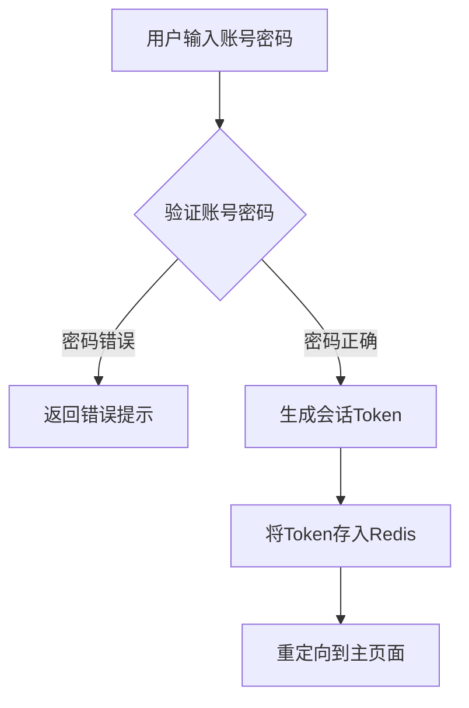
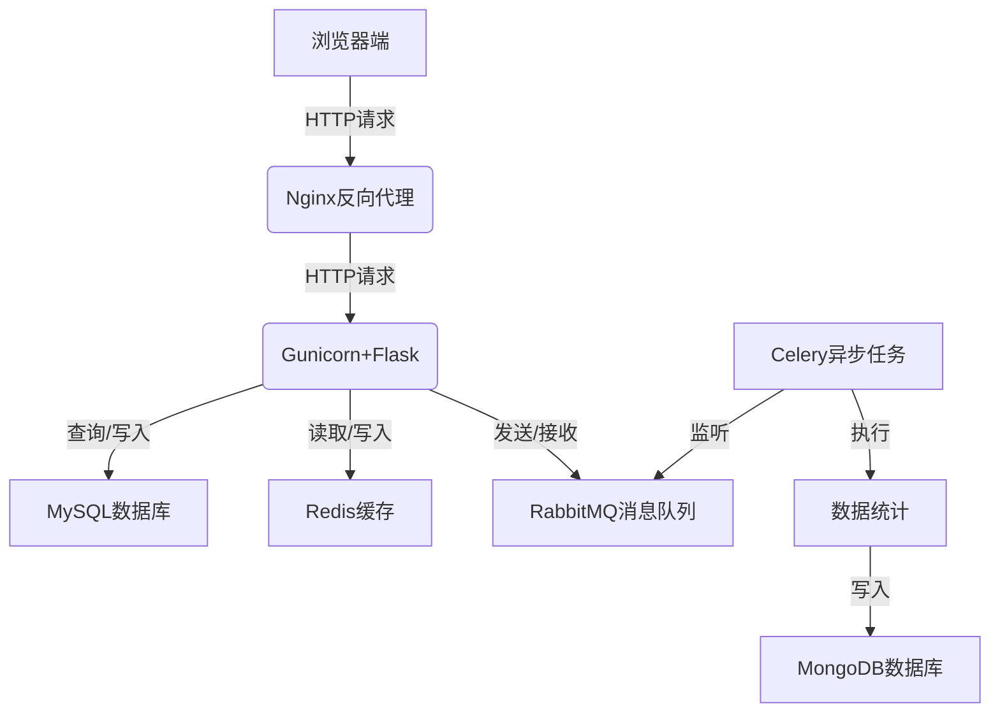

# 网上教务评教系统详细设计与具体代码实现

## 1.背景介绍

随着信息技术的不断发展,网络已经深入到我们生活的方方面面。在教育领域,网上教务评教系统的应用也日益普及。传统的纸质评教方式存在诸多不足,如数据收集困难、统计分析效率低下、难以保证评教的匿名性和公正性等。网上评教系统的出现很好地解决了这些问题,为师生提供了一个高效、便捷、公正的互动平台。

本文将详细介绍网上教务评教系统的设计理念、核心功能、技术实现,以及在实际应用中的注意事项和未来发展趋势,希望能为相关读者提供有价值的参考。

## 2.核心概念与联系

### 2.1 教务评教系统概念

教务评教系统是指由学校教务管理部门搭建的,允许学生对任课教师的教学水平、教学态度等进行评价的在线系统。通过收集学生的反馈意见,教务部门可以全面了解教学质量,并为教师提供改进建议。

### 2.2 系统核心实体

- 学生(Student):系统的主要使用者,可以对所选课程的任课教师进行评价
- 教师(Teacher):接受学生评价的对象,可查看自己的评价结果
- 课程(Course):作为评价的基本单位,每门课程都有对应的任课教师
- 评价(Evaluation):学生对教师的教学质量等方面的具体评分和意见反馈

### 2.3 系统核心功能

- 学生评价:学生根据课程选择任课教师并完成评价
- 教师查看:教师可查看本门课程的所有学生评价
- 数据统计:系统自动统计分析评价结果,为教务决策提供依据
- 用户管理:对系统用户(学生、教师、管理员)的注册、认证等进行管理

### 2.4 系统设计原则

- 用户体验友好:界面简洁,操作便捷
- 数据安全性高:评价过程匿名,防止数据被篡改
- 扩展性强:能方便地集成新功能模块
- 技术先进性:采用当下流行的开发框架和工具

## 3.核心算法原理具体操作步骤

### 3.1 用户认证算法



1. 用户在登录界面输入账号密码
2. 系统从数据库查询用户信息,验证密码是否正确
3. 如果密码错误,返回错误提示
4. 如果密码正确,使用JWT等算法生成一个会话Token
5. 将Token存入Redis等内存数据库,设置过期时间
6. 重定向到主页面,后续请求需携带Token进行身份验证

### 3.2 评价分数计算算法

评价分数计算采用加权平均算法,具体步骤如下:

1. 获取当前课程的所有评价记录
2. 遍历每个评价记录,计算各项指标的加权分数之和
3. 将加权分数之和除以总权重,得到最终平均分

设有n个评价指标,第i个指标的分数为$s_i$,权重为$w_i$,则最终平均分为:

$$\overline{s} = \frac{\sum_{i=1}^n w_i s_i}{\sum_{i=1}^n w_i}$$

例如,某门课程设有"教学态度"、"课程难度"两个评价指标,权重分别为0.6和0.4。某位教师在这两项的得分分别为4.2和3.8,则最终平均得分为:

$$\overline{s} = \frac{0.6 \times 4.2 + 0.4 \times 3.8}{0.6 + 0.4} = 4.04$$

## 4.数学模型和公式详细讲解举例说明

### 4.1 评价数据统计模型

为了更好地分析评价数据,我们构建了一个基于高斯混合模型(Gaussian Mixture Model)的聚类算法,对学生的评价数据进行分组,从而发现不同群体对教师的差异化评价。

高斯混合模型是一种概率模型,可以用于发现数据中潜在的聚类结构。对于给定的数据集$X=\{x_1,x_2,...,x_n\}$,我们假设它由K个高斯分布的混合构成,每个高斯分布代表一个潜在的聚类。模型参数包括:

- $\pi_k$:第k个高斯分布的混合系数,满足$\sum_{k=1}^K \pi_k=1$
- $\mu_k$:第k个高斯分布的均值向量
- $\Sigma_k$:第k个高斯分布的协方差矩阵

对于任意一个数据点$x_i$,它由第k个高斯分布生成的概率为:

$$p(x_i|\pi_k,\mu_k,\Sigma_k)=\frac{1}{(2\pi)^{d/2}|\Sigma_k|^{1/2}}e^{-\frac{1}{2}(x_i-\mu_k)^T\Sigma_k^{-1}(x_i-\mu_k)}$$

其中d为数据的维度。

利用期望最大化(EM)算法可以有效地估计模型参数,进而得到每个数据点所属的聚类。我们将评价数据作为输入,运行EM算法,最终可以发现不同群体对教师的评价差异。

### 4.2 推荐算法模型

为了给学生推荐感兴趣的课程,我们采用了一种基于协同过滤的推荐算法。该算法的核心思想是:对于目标用户,找到与其有相似行为模式的其他用户,并基于这些相似用户的行为给出推荐。

具体来说,我们构建了一个用户-课程评分矩阵$R$,其中$R_{ij}$表示用户i对课程j的评分。对于目标用户$u$,我们计算其与其他用户$v$的相似度:

$$sim(u,v)=\frac{\sum_{i \in I}(R_{ui}-\overline{R_u})(R_{vi}-\overline{R_v})}{\sqrt{\sum_{i \in I}(R_{ui}-\overline{R_u})^2}\sqrt{\sum_{i \in I}(R_{vi}-\overline{R_v})^2}}$$

其中$I$是用户$u$和$v$都对其评分的课程集合,$\overline{R_u}$和$\overline{R_v}$分别表示用户$u$和$v$的平均评分。

对于目标用户$u$未评分的课程$j$,我们预测其评分为:

$$P_{uj}=\overline{R_u}+\frac{\sum_{v \in S(j,k)}sim(u,v)(R_{vj}-\overline{R_v})}{\sum_{v \in S(j,k)}sim(u,v)}$$

其中$S(j,k)$表示对课程$j$评分的前$k$个与用户$u$最相似的用户集合。

通过这种方式,我们可以有效地预测用户对未评分课程的兴趣程度,并推荐感兴趣的课程给用户。

## 5.项目实践:代码实例和详细解释说明

### 5.1 系统架构



整个系统采用了前后端分离的架构设计,主要技术栈包括:

- 前端:Vue.js框架,Element-UI组件库
- 后端:Python Flask框架,Gunicorn+Nginx部署
- 数据库:MySQL(存储用户、课程、评价数据),MongoDB(存储统计分析结果)
- 缓存:Redis(存储会话Token等热数据)
- 消息队列:RabbitMQ(异步执行数据统计任务)
- 任务调度:Celery(监听消息队列,执行统计任务)

### 5.2 关键功能实现

#### 5.2.1 学生评价功能

前端界面:

```html
<el-rate v-model="score" :max="5"></el-rate>
<el-input v-model="comment" type="textarea" placeholder="请输入评价意见"></el-input>
<el-button @click="submitEvaluation">提交评价</el-button>
```

```javascript
submitEvaluation() {
  const token = localStorage.getItem('token')
  const data = {
    courseId: this.courseId,
    teacherId: this.teacherId, 
    score: this.score,
    comment: this.comment
  }
  axios.post('/evaluation', data, {
    headers: { 'Authorization': `Bearer ${token}` }
  })
  .then(res => {
    this.$message.success('评价提交成功')
  })
  .catch(err => {
    this.$message.error('评价提交失败')
  })
}
```

后端实现:

```python
@app.route('/evaluation', methods=['POST'])
@token_required
def submit_evaluation(user):
    course_id = request.json.get('courseId')
    teacher_id = request.json.get('teacherId')
    score = request.json.get('score')
    comment = request.json.get('comment')
    
    evaluation = Evaluation(user_id=user.id, course_id=course_id, teacher_id=teacher_id, score=score, comment=comment)
    db.session.add(evaluation)
    db.session.commit()
    
    # 发送消息到RabbitMQ,触发统计任务
    channel.basic_publish(exchange='', routing_key='eval_queue', body=f'{course_id},{teacher_id}')
    
    return jsonify({'message': 'Evaluation submitted successfully'})
```

1. 前端使用Element-UI组件构建评价界面,包括评分和文字评论
2. 提交评价时,将数据通过Axios库发送到后端API
3. 后端验证用户身份,将评价数据存入MySQL数据库
4. 向RabbitMQ发送消息,触发Celery异步执行统计分析任务

#### 5.2.2 教师查看评价

```python
@app.route('/evaluations/<int:teacher_id>')
@token_required
def get_teacher_evaluations(user, teacher_id):
    if user.role != 'teacher':
        return jsonify({'message': 'Access denied'}), 403
    
    evaluations = Evaluation.query.filter_by(teacher_id=teacher_id).all()
    eval_list = []
    for eval in evaluations:
        student = Student.query.get(eval.user_id)
        course = Course.query.get(eval.course_id)
        eval_list.append({
            'studentName': student.name,
            'courseName': course.name,
            'score': eval.score,
            'comment': eval.comment
        })
    
    return jsonify(eval_list)
```

1. 教师访问 `/evaluations/<teacher_id>` 接口,其中`teacher_id`为自己的ID
2. 后端验证用户身份为教师
3. 从数据库查询该教师所有的评价记录
4. 将评价记录与学生和课程信息组装成JSON格式返回

#### 5.2.3 统计分析任务

```python
@app.task
def analyze_evaluations(course_id, teacher_id):
    evaluations = Evaluation.query.filter_by(course_id=course_id, teacher_id=teacher_id).all()
    
    # 计算平均分和其他统计数据
    total_score = sum(eval.score for eval in evaluations)
    avg_score = total_score / len(evaluations)
    
    # 使用高斯混合模型聚类分析
    data = np.array([[eval.score, len(eval.comment)] for eval in evaluations])
    gmm = GaussianMixture(n_components=3)
    gmm.fit(data)
    labels = gmm.predict(data)
    
    # 将结果存入MongoDB
    result = {
        'courseId': course_id,
        'teacherId': teacher_id,
        'avgScore': avg_score,
        'clusterAnalysis': [] 
    }
    for label in set(labels):
        cluster_data = data[labels == label]
        result['clusterAnalysis'].append({
            'label': label,
            'size': len(cluster_data),
            'avgScore': cluster_data[:, 0].mean(),
            'avgCommentLength': cluster_data[:, 1].mean()
        })
    mongo.db.analysis.insert_one(result)
```

1. Celery任务监听RabbitMQ消息队列,收到消息时执行`analyze_evaluations`函数
2. 从MySQL查询指定课程、教师的所有评价记录
3. 计算评价的平均分和其他统计数据
4. 使用高斯