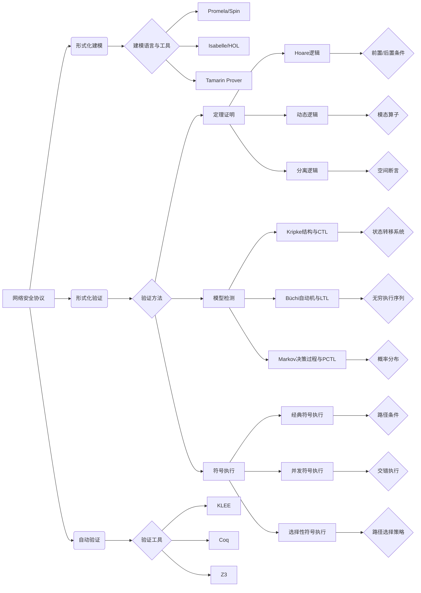

# 网络安全协议的形式化自动验证优化研究

## 1. 背景介绍

### 1.1 网络安全协议概述
#### 1.1.1 网络安全协议的定义与作用
#### 1.1.2 常见的网络安全协议类型
#### 1.1.3 网络安全协议面临的挑战

### 1.2 形式化验证技术
#### 1.2.1 形式化验证的基本概念
#### 1.2.2 形式化验证的优势与局限性
#### 1.2.3 形式化验证在网络安全协议中的应用现状

### 1.3 自动验证技术
#### 1.3.1 自动验证的基本原理
#### 1.3.2 自动验证工具与方法概述
#### 1.3.3 自动验证在网络安全协议中的应用现状

## 2. 核心概念与联系

### 2.1 网络安全协议的形式化建模
#### 2.1.1 形式化建模语言与工具
#### 2.1.2 网络安全协议的形式化建模过程
#### 2.1.3 形式化建模的优化策略

### 2.2 形式化验证与自动验证的结合
#### 2.2.1 形式化验证与自动验证的互补性
#### 2.2.2 形式化验证与自动验证的集成方法
#### 2.2.3 形式化验证与自动验证结合的优势

### 2.3 网络安全协议验证的优化方法
#### 2.3.1 基于抽象解释的验证优化
#### 2.3.2 基于符号执行的验证优化
#### 2.3.3 基于定理证明的验证优化

## 3. 核心算法原理与具体操作步骤

### 3.1 基于模型检测的自动验证算法
#### 3.1.1 有限状态机模型检测算法
#### 3.1.2 时序逻辑模型检测算法
#### 3.1.3 符号模型检测算法

### 3.2 基于定理证明的自动验证算法
#### 3.2.1 Hoare逻辑验证算法
#### 3.2.2 动态逻辑验证算法 
#### 3.2.3 分离逻辑验证算法

### 3.3 基于符号执行的自动验证算法
#### 3.3.1 经典符号执行算法
#### 3.3.2 并发符号执行算法
#### 3.3.3 选择性符号执行算法

## 4. 数学模型和公式详细讲解举例说明

### 4.1 形式化建模中的数学基础
#### 4.1.1 集合论与关系
#### 4.1.2 一阶逻辑与高阶逻辑
#### 4.1.3 过程代数与通信顺序进程

### 4.2 模型检测中的数学模型
#### 4.2.1 Kripke结构与CTL逻辑
#### 4.2.2 Büchi自动机与LTL逻辑
#### 4.2.3 Markov决策过程与PCTL逻辑

### 4.3 定理证明中的数学模型 
#### 4.3.1 Hoare逻辑与前置/后置条件
#### 4.3.2 动态逻辑与模态算子
#### 4.3.3 分离逻辑与空间断言

## 5. 项目实践：代码实例和详细解释说明

### 5.1 使用Promela/Spin进行协议建模与验证
#### 5.1.1 Promela语言基础
#### 5.1.2 使用Promela建模网络安全协议
#### 5.1.3 使用Spin进行自动验证与反例生成

### 5.2 使用Coq定理证明器进行协议验证
#### 5.2.1 Coq证明助理基础
#### 5.2.2 在Coq中形式化定义协议
#### 5.2.3 使用Coq进行交互式证明与证明自动化

### 5.3 使用KLEE符号执行引擎进行协议测试
#### 5.3.1 KLEE符号执行引擎原理
#### 5.3.2 使用KLEE对C语言协议实现进行符号执行
#### 5.3.3 KLEE测试结果分析与漏洞挖掘

## 6. 实际应用场景

### 6.1 TLS/SSL协议的形式化验证
#### 6.1.1 TLS/SSL协议安全性分析
#### 6.1.2 对TLS/SSL协议进行形式化建模
#### 6.1.3 TLS/SSL协议漏洞的自动发现与验证

### 6.2 IPsec协议的形式化验证
#### 6.2.1 IPsec协议安全机制分析
#### 6.2.2 IPsec协议的形式化规范
#### 6.2.3 IPsec协议安全性质的自动证明

### 6.3 区块链共识协议的形式化验证
#### 6.3.1 区块链共识协议安全性分析
#### 6.3.2 对PoW、PoS等共识协议进行形式化
#### 6.3.3 区块链共识协议的活性与安全性自动验证

## 7. 工具和资源推荐

### 7.1 形式化建模与验证工具
#### 7.1.1 Promela/Spin
#### 7.1.2 Isabelle/HOL
#### 7.1.3 Tamarin Prover

### 7.2 自动化验证工具
#### 7.2.1 KLEE
#### 7.2.2 Coq
#### 7.2.3 Z3

### 7.3 网络安全协议分析资源
#### 7.3.1 IETF安全领域工作组文档
#### 7.3.2 NIST SP 800系列特刊
#### 7.3.3 协议标准与规范文档

## 8. 总结：未来发展趋势与挑战

### 8.1 网络安全协议验证的发展趋势
#### 8.1.1 形式化方法与自动验证技术的深度融合
#### 8.1.2 面向新型网络环境的安全协议验证
#### 8.1.3 形式化验证与人工智能技术的结合

### 8.2 网络安全协议验证面临的挑战
#### 8.2.1 复杂协议的建模与验证困难
#### 8.2.2 验证效率与可扩展性问题
#### 8.2.3 形式化验证结果的可解释性挑战

### 8.3 展望未来研究方向
#### 8.3.1 自适应与智能化的安全协议验证
#### 8.3.2 形式化验证与实际系统的无缝集成
#### 8.3.3 构建可信可验证的网络安全基础设施

## 9. 附录：常见问题与解答

### 9.1 形式化方法学习的入门资料
### 9.2 自动验证工具的安装与配置
### 9.3 网络安全协议分析中的常见误区
### 9.4 形式化验证结果的应用与解读
### 9.5 自动验证技术的局限性与应对策略

网络安全协议的形式化自动验证是一个复杂而重要的研究领域,涉及了形式化方法、自动推理、程序分析等多个学科的交叉融合。本文对该领域的研究背景、核心概念、关键技术、数学基础、实践案例等进行了系统性的总结与探讨。

通过形式化建模,我们可以使用严格的数学语言对网络安全协议的语法、语义以及安全性质进行精确刻画,为后续的形式化验证奠定基础。基于不同的逻辑体系,形式化验证可以采用定理证明、模型检测、符号执行等方法,对协议模型的安全性质进行穷举式的检查,从而发现潜在的安全漏洞。自动验证技术进一步提高了验证的效率与可扩展性,使得对大型复杂协议的安全性分析成为可能。

本文还结合具体的网络安全协议实例,如TLS/SSL、IPsec、区块链共识协议等,展示了形式化自动验证技术在实际应用中的有效性。通过对协议进行形式化建模与验证,我们能够系统地评估其安全性,发现并修复设计与实现中的缺陷,提高网络通信的可信性。

展望未来,网络安全协议验证技术还需要在以下几个方面取得突破:一是进一步加强形式化方法与自动验证技术的深度融合,提高验证的智能化水平;二是面向新型网络环境(如物联网、云计算等)设计与验证安全协议;三是探索形式化验证与人工智能技术的结合,实现自适应的安全协议分析;四是推动形式化验证技术与实际系统的无缝集成,构建可信可验证的网络安全基础设施。

总之,网络安全协议的形式化自动验证是一个充满挑战与机遇的研究方向。只有在理论研究与实践应用两个层面持续发力,才能不断提升网络空间的安全性,为数字时代的可信通信保驾护航。

作者：禅与计算机程序设计艺术 / Zen and the Art of Computer Programming