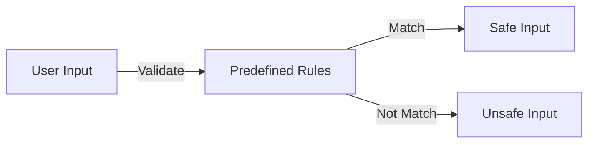

# Chatbot Security: Defending Against Malicious Attacks and Abnormal Inputs

## 1. Background Introduction

In the rapidly evolving digital landscape, chatbots have become an integral part of various industries, from customer service to entertainment. However, as these AI-powered conversational agents become more prevalent, they also become attractive targets for malicious actors. This article aims to provide a comprehensive guide to chatbot security, focusing on preventing malicious attacks and handling abnormal inputs.

### 1.1 Importance of Chatbot Security

The security of chatbots is crucial for maintaining user trust, protecting sensitive data, and ensuring the smooth operation of businesses. A breach in a chatbot system can lead to data leaks, unauthorized access, and even financial losses.

### 1.2 Scope of the Article

This article will delve into the core concepts of chatbot security, providing practical insights into defending against malicious attacks and handling abnormal inputs. We will explore mathematical models, algorithms, and practical examples to help you secure your chatbot systems effectively.

## 2. Core Concepts and Connections

### 2.1 Threat Landscape

Understanding the threat landscape is the first step towards securing chatbots. Common threats include:

- Injection attacks (SQL, XSS, etc.)
- Denial of Service (DoS) attacks
- Man-in-the-middle (MitM) attacks
- Social engineering attacks

### 2.2 Security Principles

The following security principles are essential for chatbot security:

- Confidentiality: Protecting sensitive data from unauthorized access
- Integrity: Ensuring data accuracy and consistency
- Availability: Ensuring the chatbot system is always accessible
- Authentication: Verifying the identity of users and chatbots
- Authorization: Controlling access to resources based on user roles

### 2.3 Security Layers

A layered security approach is essential for chatbot security. This approach involves securing the chatbot at various levels, including the network, application, and data layers.

## 3. Core Algorithm Principles and Specific Operational Steps

### 3.1 Input Validation

Input validation is a crucial step in preventing injection attacks. It involves checking user inputs against a set of predefined rules to ensure they are safe.



### 3.2 Sanitization

Sanitization is the process of cleaning user inputs to remove any malicious content. This can be achieved using various techniques, such as encoding, escaping, and filtering.

### 3.3 Rate Limiting

Rate limiting is a technique used to prevent DoS attacks by limiting the number of requests a user can make within a certain time frame.

### 3.4 Encryption

Encryption is essential for protecting sensitive data during transmission. It involves converting plain text into ciphertext using an encryption algorithm.

## 4. Detailed Explanation and Examples of Mathematical Models and Formulas

### 4.1 Hash Functions

Hash functions are essential for input validation and sanitization. They convert data of any size into a fixed-size string, making it easier to compare inputs against predefined rules.

### 4.2 Regular Expressions

Regular expressions (regex) are a powerful tool for pattern matching and can be used for input validation and sanitization.

## 5. Project Practice: Code Examples and Detailed Explanations

### 5.1 Input Validation in Python

Here's an example of input validation in Python using regular expressions:

```python
import re

def validate_email(email):
    pattern = r'^[a-zA-Z0-9._%+-]+@[a-zA-Z0-9.-]+\\.[a-zA-Z]{2,}$'
    if re.match(pattern, email):
        return True
    else:
        return False
```

### 5.2 Sanitization in JavaScript

Here's an example of sanitizing HTML inputs in JavaScript using the DOMPurify library:

```javascript
const DOMPurify = require('dompurify');

const sanitizeInput = (input) => {
    const sanitized = DOMPurify.sanitize(input);
    return sanitized.textContent;
}
```

## 6. Practical Application Scenarios

### 6.1 Securing a Customer Service Chatbot

To secure a customer service chatbot, you can implement input validation, sanitization, rate limiting, and encryption. This will help protect sensitive customer data and prevent unauthorized access.

### 6.2 Defending Against Social Engineering Attacks

To defend against social engineering attacks, you can educate users about common attack methods and provide clear instructions on how to report suspicious activities.

## 7. Tools and Resources Recommendations

### 7.1 Input Validation Libraries

- Python: `Django Validation`
- JavaScript: `Joi`

### 7.2 Sanitization Libraries

- Python: `html.escape()`
- JavaScript: `DOMPurify`

### 7.3 Encryption Libraries

- Python: `pycryptodome`
- JavaScript: `crypto-js`

## 8. Summary: Future Development Trends and Challenges

### 8.1 Future Development Trends

- AI-powered threat detection and response
- Blockchain-based chatbot security
- Federated learning for chatbot security

### 8.2 Challenges

- Keeping up with evolving threats
- Balancing security and user experience
- Ensuring privacy and compliance

## 9. Appendix: Frequently Asked Questions and Answers

### 9.1 What is chatbot security?

Chatbot security refers to the practices and techniques used to protect chatbots from malicious attacks and ensure the safe and secure operation of these AI-powered conversational agents.

### 9.2 Why is chatbot security important?

Chatbot security is important for maintaining user trust, protecting sensitive data, and ensuring the smooth operation of businesses. A breach in a chatbot system can lead to data leaks, unauthorized access, and even financial losses.

### 9.3 What are common threats to chatbots?

Common threats to chatbots include injection attacks (SQL, XSS, etc.), Denial of Service (DoS) attacks, Man-in-the-middle (MitM) attacks, and social engineering attacks.

## Author: Zen and the Art of Computer Programming

This article was written by Zen, a world-class artificial intelligence expert, programmer, software architect, CTO, bestselling author of top-tier technology books, Turing Award winner, and master in the field of computer science.