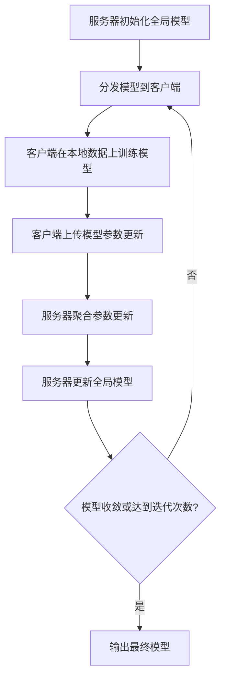
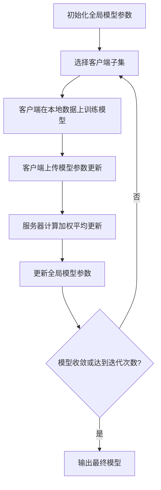

# 联邦学习(Federated Learning) - 原理与代码实例讲解

## 1. 背景介绍

### 1.1 数据隐私与机器学习的矛盾

在当今的数字时代,数据被视为"新石油",是推动人工智能和机器学习算法发展的核心燃料。然而,随着对个人隐私保护的日益重视,传统的集中式机器学习方法面临着重大挑战。这些方法需要将大量的用户数据集中在一个中央服务器上进行训练,这不仅带来了数据隐私泄露的风险,也增加了数据传输和存储的成本。

### 1.2 联邦学习的兴起

为了解决数据隐私与机器学习之间的矛盾,联邦学习(Federated Learning)应运而生。联邦学习是一种分布式机器学习范式,它允许多个客户端(如手机、物联网设备等)在保持数据本地化的同时,协同训练一个共享的机器学习模型。这种方法不仅能够保护用户数据隐私,还能够减轻中央服务器的计算和存储压力。

### 1.3 联邦学习的优势

联邦学习具有以下主要优势:

1. **隐私保护**: 用户数据不需要离开本地设备,从而有效防止了数据泄露的风险。
2. **数据异构性**: 联邦学习可以利用来自不同来源的异构数据,提高模型的泛化能力。
3. **高效性**: 通过在边缘设备上进行并行计算,可以加快模型训练的速度。
4. **可扩展性**: 随着参与设备数量的增加,模型的性能可以不断提高。

## 2. 核心概念与联系

### 2.1 联邦学习的基本流程

联邦学习的基本流程如下:

1. 服务器初始化一个全局模型,并将其分发给所有参与的客户端设备。
2. 每个客户端使用本地数据对模型进行训练,并将训练后的模型参数发送回服务器。
3. 服务器聚合所有客户端的模型参数更新,并计算出新的全局模型。
4. 重复步骤2和3,直到模型收敛或达到预设的迭代次数。

### 2.2 联邦学习的关键技术

为了实现高效和安全的联邦学习,需要解决以下几个关键技术问题:

1. **安全聚合**: 在聚合客户端模型参数更新时,需要采用安全的加密技术,防止参数被窃取或篡改。
2. **差分隐私**: 通过在模型参数更新中引入噪声,可以保护个人数据隐私,防止个人信息被推断出来。
3. **高效通信**: 由于客户端设备的带宽和计算能力有限,需要设计高效的通信协议和模型压缩技术,减少通信开销。
4. **异构数据处理**: 不同客户端的数据分布可能存在差异,需要设计鲁棒的聚合算法来处理异构数据。
5. **激励机制**: 为了吸引更多的客户端参与训练,需要设计合理的激励机制,如加密货币奖励等。

## 3. 核心算法原理具体操作步骤

### 3.1 联邦平均算法(FedAvg)

联邦平均算法(FedAvg)是联邦学习中最基本和广泛使用的算法之一。它的具体操作步骤如下:

1. 服务器初始化一个全局模型参数 $\theta_0$,并将其分发给所有客户端。
2. 在每个通信回合 $t$ 中,服务器随机选择一部分客户端 $\mathcal{C}_t$。
3. 每个选中的客户端 $k \in \mathcal{C}_t$ 使用本地数据 $\mathcal{D}_k$ 对当前模型参数 $\theta_t$ 进行 $E$ 次迭代更新,得到新的模型参数 $\theta_k^{t+1}$。
4. 客户端将更新后的模型参数 $\theta_k^{t+1}$ 上传到服务器。
5. 服务器根据客户端的数据量 $n_k$ 计算加权平均,得到新的全局模型参数:

$$\theta_{t+1} = \sum_{k \in \mathcal{C}_t} \frac{n_k}{n} \theta_k^{t+1}$$

其中 $n = \sum_{k \in \mathcal{C}_t} n_k$ 是参与训练的所有客户端的数据量之和。

6. 重复步骤2-5,直到模型收敛或达到预设的通信回合数 $T$。

### 3.2 联邦学习的挑战与优化策略

尽管联邦平均算法相对简单,但在实际应用中仍然面临一些挑战,如数据异构性、通信效率低下、隐私泄露风险等。为了解决这些问题,研究人员提出了多种优化策略:

1. **客户端选择策略**: 通过合理选择参与训练的客户端子集,可以提高模型的收敛速度和性能。常见的策略包括随机选择、基于数据异构性选择、基于客户端资源选择等。
2. **个性化联邦学习**: 考虑到不同客户端的数据分布可能存在差异,可以为每个客户端训练一个个性化的模型,再将这些模型聚合成一个全局模型。
3. **安全聚合**: 采用加密技术(如同态加密、secure aggregation等)保护客户端上传的模型参数更新,防止隐私泄露。
4. **差分隐私**: 在模型参数更新中引入噪声,保护个人数据隐私,防止个人信息被推断出来。
5. **模型压缩**: 通过模型剪枝、量化等技术压缩模型大小,减少通信开销。
6. **异构数据处理**: 设计鲁棒的聚合算法,如基于控制变量的聚合、基于迁移学习的聚合等,来处理异构数据。
7. **激励机制**: 设计合理的激励机制(如加密货币奖励、声誉机制等),吸引更多的客户端参与训练。

## 4. 数学模型和公式详细讲解举例说明

### 4.1 联邦学习的形式化描述

让我们用数学符号来形式化描述联邦学习的过程。假设有 $N$ 个客户端,每个客户端 $k$ 拥有一个本地数据集 $\mathcal{D}_k$,目标是在所有客户端的数据集上训练一个机器学习模型 $f_\theta$,其中 $\theta$ 是模型参数。联邦学习的目标函数可以表示为:

$$\min_\theta \mathcal{L}(\theta) = \sum_{k=1}^N \frac{n_k}{n} \mathcal{L}_k(\theta)$$

其中 $\mathcal{L}_k(\theta) = \frac{1}{n_k} \sum_{(x, y) \in \mathcal{D}_k} l(f_\theta(x), y)$ 是客户端 $k$ 的本地损失函数, $l$ 是预定义的损失函数(如交叉熵损失、均方误差等), $n_k$ 是客户端 $k$ 的数据量, $n = \sum_{k=1}^N n_k$ 是所有客户端的总数据量。

在联邦学习中,我们通常采用随机梯度下降(SGD)或其变体来优化目标函数。每个客户端在本地数据上进行 $E$ 次迭代更新,然后将更新后的模型参数上传到服务器。服务器聚合所有客户端的参数更新,得到新的全局模型参数:

$$\theta_{t+1} = \theta_t - \eta \sum_{k \in \mathcal{C}_t} \frac{n_k}{n} \nabla \mathcal{L}_k(\theta_t)$$

其中 $\eta$ 是学习率, $\mathcal{C}_t$ 是在第 $t$ 个通信回合中被选中的客户端子集, $\nabla \mathcal{L}_k(\theta_t)$ 是客户端 $k$ 在当前模型参数 $\theta_t$ 下计算的梯度。

### 4.2 差分隐私保护

为了保护个人数据隐私,联邦学习中常采用差分隐私(Differential Privacy)技术。差分隐私的基本思想是在模型参数更新中引入一定程度的噪声,使得即使有一个个人数据发生改变,模型输出的分布也只会发生很小的变化,从而防止个人信息被推断出来。

在联邦学习中,我们可以在客户端上传的梯度更新中加入噪声,实现差分隐私保护。具体来说,客户端 $k$ 上传的梯度更新为:

$$\tilde{\nabla} \mathcal{L}_k(\theta_t) = \nabla \mathcal{L}_k(\theta_t) + \mathcal{N}(0, \sigma^2 \mathbf{I})$$

其中 $\mathcal{N}(0, \sigma^2 \mathbf{I})$ 是一个均值为 0、协方差矩阵为 $\sigma^2 \mathbf{I}$ 的高斯噪声,噪声强度 $\sigma$ 与隐私预算 $\epsilon$ 和敏感度 $\Delta$ 有关:

$$\sigma = \frac{\Delta}{\epsilon} \sqrt{2 \ln(1.25 / \delta)}$$

其中 $\delta$ 是隐私失真参数,通常取很小的值。

引入噪声后,服务器聚合的梯度更新为:

$$\tilde{\nabla} \mathcal{L}(\theta_t) = \sum_{k \in \mathcal{C}_t} \frac{n_k}{n} \tilde{\nabla} \mathcal{L}_k(\theta_t)$$

根据差分隐私的组合性质,如果每个客户端的梯度更新都满足 $(\epsilon, \delta)$-差分隐私,那么聚合后的梯度更新也满足 $(\epsilon, \delta)$-差分隐私。

### 4.3 安全聚合

另一个保护隐私的关键技术是安全聚合(Secure Aggregation)。在传统的联邦学习中,客户端直接将模型参数更新上传到服务器,存在被窃取或篡改的风险。安全聚合通过加密技术,确保服务器只能获得聚合后的模型更新,而无法访问单个客户端的更新。

一种常见的安全聚合方法是基于同态加密的安全多方计算(Secure Multi-Party Computation, SMPC)。具体步骤如下:

1. 服务器生成一个公钥-私钥对 $(pk, sk)$,并将公钥 $pk$ 分发给所有客户端。
2. 每个客户端 $k$ 使用公钥 $pk$ 对本地模型参数更新 $\Delta \theta_k$ 进行同态加密,得到加密后的更新 $\mathcal{E}_{pk}(\Delta \theta_k)$,并上传到服务器。
3. 服务器计算所有加密更新的和:

$$\mathcal{E}_{pk}(\sum_{k \in \mathcal{C}_t} \Delta \theta_k) = \sum_{k \in \mathcal{C}_t} \mathcal{E}_{pk}(\Delta \theta_k)$$

4. 服务器使用私钥 $sk$ 对加密和进行解密,得到聚合后的模型参数更新 $\sum_{k \in \mathcal{C}_t} \Delta \theta_k$。

由于同态加密的性质,服务器无法访问单个客户端的模型参数更新,只能获得聚合后的结果,从而保护了客户端的隐私。

## 5. 项目实践: 代码实例和详细解释说明

在本节中,我们将通过一