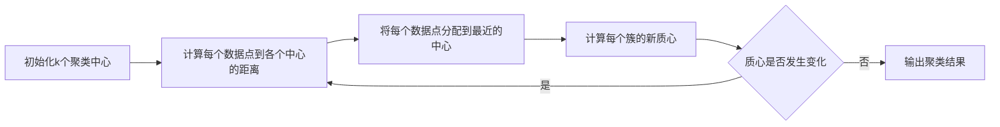
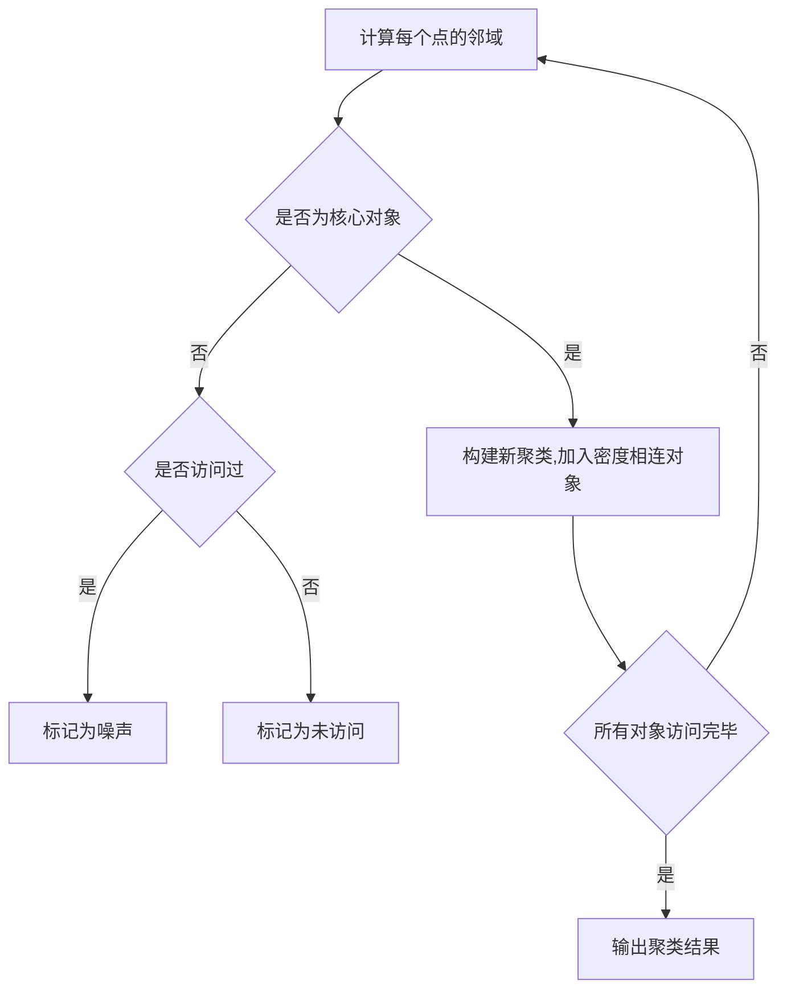
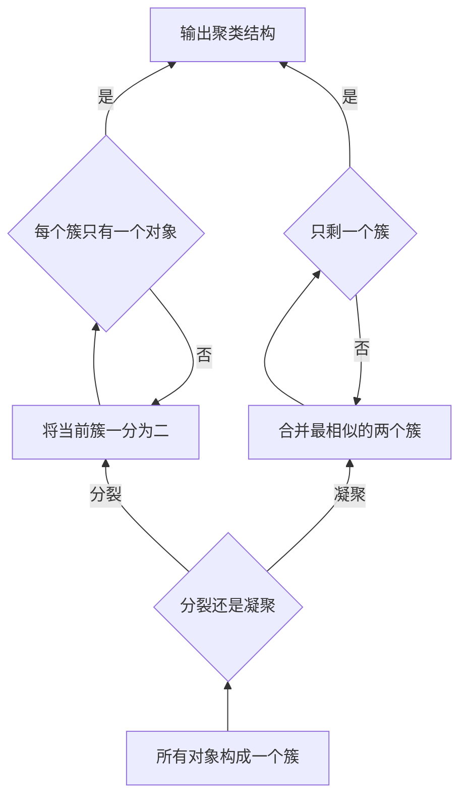

# 聚类分析原理与代码实例讲解

## 1. 背景介绍

### 1.1 什么是聚类分析

聚类分析(Cluster Analysis)是一种无监督学习技术,旨在将数据集中的对象划分为若干个通常是不相交的同质子集群(cluster)。聚类分析广泛应用于数据挖掘、模式识别、图像分析、生物信息学等领域,是发现数据内在结构和规律的重要手段。

### 1.2 聚类分析的重要性

在现实世界中,存在大量未标记的数据,如何对这些数据进行有效的分类和管理是一个巨大的挑战。聚类分析能够自动发现数据的内在结构和模式,为数据组织和理解提供了有力支持。此外,聚类分析在许多领域都有着广泛的应用,如:

- 商业智能:根据客户行为对客户进行细分,实现个性化营销
- 生物信息学:基因表达数据聚类,发现基因功能
- 计算机视觉:图像分割,模式识别
- 网络安全:入侵检测,异常行为识别

### 1.3 聚类分析的挑战

尽管聚类分析具有广泛的应用前景,但它也面临着一些挑战:

- 确定最优聚类数目
- 处理异常值和噪声数据
- 高维数据的聚类效率低下
- 不同聚类算法对不同数据分布效果差异大

## 2. 核心概念与联系

### 2.1 相似度度量

相似度度量是聚类分析的基础,它定义了对象之间的接近程度。常用的相似度度量包括:

1. 欧氏距离
2. 曼哈顿距离 
3. 余弦相似度
4. Jaccard系数

$$
d(x,y)=\sqrt{\sum_{i=1}^{n}(x_i-y_i)^2}
$$

上式是欧氏距离的计算公式,其中$x$和$y$是$n$维空间中的两个点。

### 2.2 聚类有效性评估

聚类有效性评估是评估聚类结果质量的重要手段,常用的评估指标包括:

1. 簇内平方和(Within-Cluster Sum of Squares)
2. 轮廓系数(Silhouette Coefficient)
3. Calinski-Harabasz指数
4. Davies-Bouldin指数

### 2.3 常见聚类算法

常见的聚类算法可分为以下几类:

1. **原型聚类**
    - $k$-means聚类
    - $k$-medoids聚类
2. **密度聚类**
    - DBSCAN
    - OPTICS
3. **层次聚类**
    - 凝聚层次聚类
    - 分裂层次聚类
4. **基于模型的聚类**
    - 高斯混合模型
    - 概率分布聚类
5. **基于网格的聚类**
    - STING
    - WaveCluster

## 3. 核心算法原理具体操作步骤

### 3.1 $k$-means聚类算法

$k$-means是最经典的原型聚类算法,其基本思想是通过迭代最小化聚类误差来寻找最优的$k$个聚类中心。算法步骤如下:

1. 随机选择$k$个初始聚类中心
2. 将每个数据点分配到最近的聚类中心所对应的簇
3. 重新计算每个簇的质心作为新的聚类中心
4. 重复步骤2和3,直至聚类中心不再发生变化

$k$-means算法的优点是简单高效,但也存在一些缺陷:

- 对初始聚类中心的选择敏感
- 对噪声和异常值敏感
- 无法发现非凸形状的簇



### 3.2 DBSCAN聚类算法

DBSCAN(Density-Based Spatial Clustering of Applications with Noise)是一种基于密度的聚类算法,能够有效发现任意形状的聚类,并能够自动识别噪声数据。其核心思想是:

1. 定义核心对象:在半径$\epsilon$范围内包含的数据点个数不少于$minPts$
2. 定义密度直达:对象$p$和$q$是密度直达的,如果存在一个对象$o$是核心对象,且$p$和$q$都在$o$的$\epsilon$邻域内
3. 定义密度相连:对象$p$和$q$是密度相连的,如果存在一个对象链使得$p$和$q$通过密度直达关系连接

DBSCAN算法的步骤:

1. 计算每个点的$\epsilon$邻域
2. 对每个核心对象,构建一个新的聚类,并将与其密度相连的所有对象加入该聚类
3. 将噪声点标记为噪声

DBSCAN的优点是能发现任意形状的聚类,并能有效处理噪声数据,但对参数$\epsilon$和$minPts$的选择敏感。



### 3.3 层次聚类算法

层次聚类算法根据聚类过程将数据对象分为不同层次的聚类簇,可分为凝聚层次聚类和分裂层次聚类两种。

**凝聚层次聚类**从每个数据对象作为一个簇开始,然后按照某种聚类准则,将最相似的两个簇合并为一个新的簇,重复该过程直至所有对象聚集成一个簇。常用的聚类准则包括:

- 单链接(Single Linkage)
- 全链接(Complete Linkage)
- 均链接(Average Linkage)
- 质心法(Centroid Method)

**分裂层次聚类**则从所有数据对象作为一个簇开始,然后将该簇一分为二,使得两个新簇之间的离差平方和最大,继续将新簇一分为二,直至每个簇仅包含一个数据对象。

层次聚类算法能够很好地揭示数据的层次结构,但时间复杂度较高,为$O(n^2\log n)$到$O(n^3)$。



## 4. 数学模型和公式详细讲解举例说明

### 4.1 $k$-means聚类的数学模型

$k$-means聚类的目标是最小化所有数据点到其所属簇质心的平方距离之和,即:

$$
J=\sum_{i=1}^{k}\sum_{x\in C_i}||x-\mu_i||^2
$$

其中,$k$是簇的个数,$C_i$是第$i$个簇,$\mu_i$是第$i$个簇的质心。

$k$-means算法使用期望最大化(EM)算法迭代优化上述目标函数。在E步骤,将每个数据点分配到最近的质心所对应的簇。在M步骤,重新计算每个簇的质心。

$$
\mu_i=\frac{1}{|C_i|}\sum_{x\in C_i}x
$$

重复上述两个步骤直至收敛。

### 4.2 DBSCAN的数学模型

DBSCAN算法中的核心概念是核心对象、密度直达和密度相连。

**核心对象**:对象$p$是核心对象,如果在半径$\epsilon$范围内包含的数据点个数不少于$minPts$:

$$
|N_\epsilon(p)|\geq minPts
$$

其中,$N_\epsilon(p)$表示$p$的$\epsilon$邻域。

**密度直达**:对象$p$和$q$是密度直达的,如果存在一个对象$o$是核心对象,且$p$和$q$都在$o$的$\epsilon$邻域内:

$$
p\in N_\epsilon(o)\wedge q\in N_\epsilon(o)
$$

**密度相连**:对象$p$和$q$是密度相连的,如果存在一个对象链使得$p$和$q$通过密度直达关系连接。

基于上述概念,DBSCAN算法将属于同一个密度相连簇的对象聚类在一起,将不属于任何簇的对象标记为噪声。

### 4.3 层次聚类的数学模型

对于凝聚层次聚类,常用的聚类准则包括:

**单链接**:两个簇之间的距离定义为两个簇中最近的两个对象之间的距离:

$$
d(C_i,C_j)=\min_{x\in C_i,y\in C_j}d(x,y)
$$

**全链接**:两个簇之间的距离定义为两个簇中最远的两个对象之间的距离:

$$
d(C_i,C_j)=\max_{x\in C_i,y\in C_j}d(x,y)
$$

**均链接**:两个簇之间的距离定义为两个簇中所有对象之间距离的平均值:

$$
d(C_i,C_j)=\frac{1}{|C_i||C_j|}\sum_{x\in C_i}\sum_{y\in C_j}d(x,y)
$$

**质心法**:两个簇之间的距离定义为两个簇质心之间的距离:

$$
d(C_i,C_j)=d(\mu_i,\mu_j)
$$

其中,$\mu_i$和$\mu_j$分别是$C_i$和$C_j$的质心。

## 5. 项目实践:代码实例和详细解释说明

以下是使用Python中的scikit-learn库实现$k$-means聚类和DBSCAN聚类的示例代码:

### 5.1 $k$-means聚类

```python
from sklearn.datasets import make_blobs
from sklearn.cluster import KMeans
import matplotlib.pyplot as plt

# 生成样本数据
X, y = make_blobs(n_samples=500, n_features=2, centers=4, cluster_std=1, random_state=1)

# 构建并训练k-means模型
kmeans = KMeans(n_clusters=4, random_state=1).fit(X)

# 获取聚类标签
labels = kmeans.labels_

# 可视化聚类结果
plt.scatter(X[:, 0], X[:, 1], c=labels)
plt.scatter(kmeans.cluster_centers_[:, 0], kmeans.cluster_centers_[:, 1], s=300, c='r')
plt.show()
```

上述代码首先使用`make_blobs`函数生成了一个包含4个簇的样本数据集。然后构建并训练了一个`KMeans`模型,指定聚类数为4。`kmeans.labels_`给出了每个样本点的聚类标签。最后,使用`matplotlib`库对聚类结果进行可视化,不同颜色代表不同的簇,红色十字标记代表簇的质心。

### 5.2 DBSCAN聚类

```python
from sklearn.datasets import make_moons
from sklearn.cluster import DBSCAN
import matplotlib.pyplot as plt

# 生成样本数据
X, y = make_moons(n_samples=1000, noise=0.05, random_state=1)

# 构建并训练DBSCAN模型
dbscan = DBSCAN(eps=0.05, min_samples=5).fit(X)

# 获取聚类标签
labels = dbscan.labels_

# 可视化聚类结果
plt.scatter(X[:, 0], X[:, 1], c=labels)
plt.show()
```

上述代码首先使用`make_moons`函数生成了一个月牙形状的样本数据集,并添加了5%的噪声数据。然后构建并训练了一个`DBSCAN`模型,指定`eps=0.05`和`min_samples=5`。`dbscan.labels_`给出了每个样本点的聚类标签,噪声点的标签